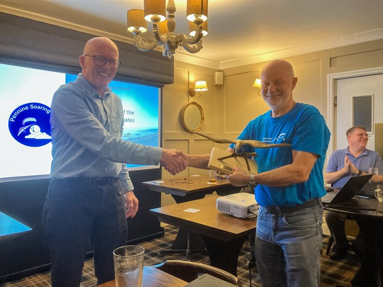

# Chairman’s Chunterings

Welcome to the PSC newsletter, grateful thanks to the efforts of our new committee member, Neil Charles for creating the first of what we hope will be many issues.

Well, the AGM came and went with a few surprises along the way. After several years doing an excellent job, Simon Scott stood down as chairman, and as I try to step into his shoes, I’d like to thank him on behalf of all the members for the great work he’s done in guiding the club and keeping us all together.

It’s not easy coordinating the activities of 200-odd (some very odd) free-spirited free-flyers and the current state of harmony and goodwill in the club is a testament to his efforts – thanks Simon, for giving me such a hard act to follow. Of course, he’s continuing to serve on the committee, taking over the role of secretary from Barry Sayer, who is moving across to be safety officer, relieving me of the onerous duty of trying out all the ways pilots can hurt themselves.

Sean Mercer is our new ~~sergeant-at-arms~~ membership secretary, inheriting this position from Jim Ashley, who will continue as chancellor of the exchequer. The inimitable Graham Jones makes a return to the committee as our new social secretary, and we welcome the very competitive Elliott Brown as competitions secretary, taking over from the equally competitive John Murphy, who has left the committee after an incredible 27 years of continuous service. John, thank you so much for the time and effort you have put into your various roles on the committee over the years – I think you must have done almost every job available within the club, and I’m sure we’ll often be back to you for the benefit of your experience. Now, all we need is a weather officer to improve the dreadful start to the year so far.

Brian

---

# Welcome Everyone

Here it is. Issue one. Simon Scott appealed for a newsletter editor at the AGM, I put my hand up and now, As the search starts for interesting things to write about, I think we can all agree that the lesson here is never to speak up at an AGM.

We should be able to rustle up enough stories for a monthly news bulletin, at least through the flying season when we're all out on the hills. We'll round up XC and safety news, check dates for your diary and say hi to any new members but your newsletter needs you. Had a great day out? Let's see some pictures. Smashed your personal best? Let's hear about it. This is the place to tell us all what you did and how much fun you had doing it, or if you've embarrassed yourself, for somebody else to send in the photos of your glider in the Parlick landing field tree.

You don't have to write loads, a couple of paragraphs and a photo or two is perfect. Send anything you'd like to see included to [editor@penninesoaringclub.org.uk](mailto:editor@penninesoaringclub.org.uk).

Neil.

---

# Notes from the AGM

Our AGM was held on 12th February with lots of members turning out to hear updates from the committee, approve some post changes including a new chairman (Congratulations to Brian!), applaud 2023's [award winners](http://www.penninesoaringclub.org.uk/articles/article-list/pennine-soaring-club-awards-2023/) and listen to a techy presentation from your new newsletter editor.

You can see all of the updated committee positions on the [PSC Website](http://www.penninesoaringclub.org.uk/about/club-committee/).

We also made our annual contributions in February of £500 each to the Air Ambulance and Mountain Rescue.

# Name Your Newsletter

We've come up with a few options for naming our newsletter but you get the deciding vote. Pick your favourite and next month we'll be back with a fancy new title.

# Safety

**ADD CONTENT HERE OR DROP THE SECTION**

Link to the latest safety notes, manufacturer warnings, incident reports + obligatory spring thermal warning.

# Competitions

### Northern Challenge Series

The Northern Challenge Series is open again for 2024 and runs until 31st October. Fourteen fixed XC tasks and six hike and fly tasks based on PSC hills and our neighbouring clubs' sites, to take on whenever you like as fun or competition.

It's easy to download the [tasks](https://www.xcmap.net/index.php?c=Northern%20Challenge%20Trophy&y=2024) to your flight deck map, including challenges on Parlick, Pendle and Longridge so why not give it a try this season?

### XC League

Did somebody say the weather's been bad? There are _no flights_ on the Pennine XC League yet for 2024 so if you log the first one, you could top the table.

Three Pennine pilots have logged flights on the national XC league already though, flying from Barkin and Lords. Scott O'Neil is the top Pennine pilot in the national league with 21.7 points and Barry Sayer and Elliot Brown have one 13km flight each.

Don't forget there are now two XC Leagues - the [original one](https://xcleague.com/xc/leagues/view-15.html) that we all know about and another, newer one that lives on [XContest](https://www.xcontest.org/united-kingdom/ranking-club:2688). The XContest one does a prize t-shirt for your first 100km flight but other than that the way the tables work is also a little bit different. XContest scores Pennine pilots flying anywhere in the UK and the original XC League scores its own Pennine league table as flights only from Pennine controlled sites. We'll keep an eye on both.

# Dates For Your Diary

### Club Night | 11th March
- Sea View Inn, Chorley
- Presentation by Mark Shaw, BHPA Technical Officer

### Pennine Fest | 24th May to 26th May
- Chipping Showground
- Camping all weekend on the show field
- Dinner at the Sun Inn on Saturday evening

### Buttermere Bash | 31st May to 1st June
- Sold out but has a [waitlist](https://www.tickettailor.com/events/airventures/1107651)

### Lakes Charity Classic | 21st June to 23rd June
- Grasmere sports showground
- A few [places](https://www.cumbriasoaringclub.co.uk/lcc/CSC_LCCMain.php) still remaining

# New Members

**ADD CONTENT HERE OR DROP THE SECTION**

Anyone new in the past couple of months? We'll aim for a photo and a quick intro so we can look out for them on the hill.

# Shout Outs

**ADD CONTENT HERE OR DROP THE SECTION**

Passed an exam, did an SIV, won a comp, made it to Fairsnape and back for the first time etc.

# The Gallery



# A Grand Day Out

**SEAN WRITING UP STRIDING EDGE TO HELLVELLYN TTB**

_Sean Mercer writes_

Somebody's had a good day somewhere. A few paragraphs with pics.

# Why Not Visit...

### Newgale

Why not visit... is a quick look at a flying site far enough away that you can't see it from Clitheroe. In the UK or abroad, tell us all about somewhere fun to go.

_Neil Charles writes_



_Where?_

Pembrokeshire, right out on the edge of West Wales.

_What's it like to fly?_

Newgale is a coastal launch, tucked into the northern end of St David's Bay. In a summer westerly it attracts a mix of a few locals and any visitors who have managed to sneak their wing into the car on a family holiday. The site itself is low airtime friendly, very pretty and has some interesting corners to explore. If you can get a few hundred above then the possibility opens up of crossing the bay at Nolton Haven to the South, joining the high cliffs at Druidstone and flying all the way down to Broad Haven. There and back will bag you a fun, technical, [10km coastal XC](https://flyxc.app/?p=euk%7BHdoe%5Ej%60I%7Bq%40g%60Ibu%40).

_Any watch-outs?_

- If the wind is off the hill, some of the undulating cliffs around takeoff can generate areas of rotor. The locations where this happens are obvious but don't get low and fly in behind a spur.

- Flying two hours either side of low tide.

- Crossing the bay at Nolton is a short glide but over deep water and can be intimidating. Don't commit if you're not sure.

_Who are the local club?_

Newgale isn't a club site but is looked after by the local school, [Pembrokeshire Paragliding](http://www.pembrokeshireparagliding.com).

# You might have missed...

**ADD CONTENT HERE OR DROP THE SECTION**

- Any important stuff nicked from Skywings
- Good videos or articles doing the rounds
- Links to club updates on the website, safety notes etc.
- Any interesting new non free flight links

# Your newsletter needs you

Appear in next month's newsletter! We need submissions for...

**A Grand Day Out**  
2-3 paragraphs describing a fun day. You're welcome to write more if you're feeling creative but a couple of paragraphs is plenty. Could be epic, could be silly, could be simply the first time you flew for six months. If you've had a good day and you took some pictures, send it in.

**Why Not Visit...**  
A quick guide to a site that you like, at home or abroad. Tell us where it is, what it's like to fly, any watch-outs and how to contact the locals. Attach a photo and email it over.

**The Gallery**  
Send in any recent(ish) shots with when and where they were taken. Spectacular, silly, from the ground or from the air, it doesn't matter. Let's see what you've been up to. Videos are very welcome too but pop them on YouTube or Vimeo and send a link for the newsletter.

**Shout Outs**  
First ever XC? Smashed a PB? Took part in a comp? Let us know and get a shout out in the newsletter. Nominate your mates if they won't do it themselves.

Send submissions on these or anything else you'd like to see featured to [editor@penninesoaringclub.org.uk](mailto:editor@penninesoaringclub.org.uk)

--- 

Fly safe, see you in April.