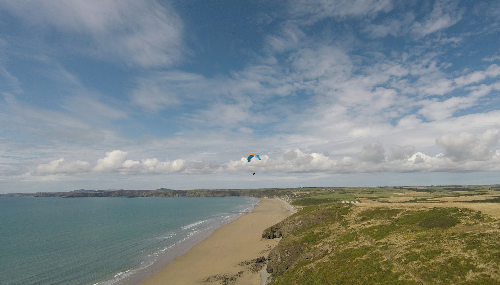

## It's spring! Quick, somebody tell the weather.

Welcome to your new look Pennine Soaring Club newsletter! Simon Scott called for a newsletter editor at the AGM, I put my hand up and so here we are. Issue one. I think we can all agree the lesson here is never to speak up at an AGM.

I'm hoping that between us we can rustle up enough stories for a monthly news bulletin, at least through the flying season when we're all out on the hills. We'll round up XC and safety news, check dates for your diary and say hi to any new members but your newsletter needs you. Had a great day out? Let's see some pictures. Smashed your personal best? Let's hear about it. This is the place to tell us all what you did and how much fun you had doing it, or if you've embarrassed yourself, for somebody else to send in the photos of your glider in the Parlick landing field tree.

You don't have to write loads, a couple of paragraphs and a photo or two is perfect.

Neil C.

---

Every issue:

## Notes from the committee

## Name your newsletter

The committee have come up with a few names we could call our newsletter but you get the deciding vote. Pick your favourite here and next month we'll be back with a fancy new title.

- The Pennine Post
- The Parlick Press
- Wing Tips

## Safety

Obligatory spring thermal warning.

## Competitions

### Northern Challenge Series

The Northern Challenge Series is open again for 2024 and runs until 31st October. Fourteen fixed XC tasks and six hike and fly tasks based on PSC hills and our neighbouring clubs' sites, to take on whenever you like as fun or competition.

It's easy to download the [tasks](https://www.xcmap.net/index.php?c=Northern%20Challenge%20Trophy&y=2024) to your flight deck map, including challenges on Parlick, Pendle and Longridge so why not give it a try this season?

### XC League

Did somebody say the weather's been bad? There are _no flights_ on the Pennine League yet for 2024 so if you log the first one, you could top the table.

## Dates for your diary

### Pennine Fest | 24th May to 26th May
- Chipping Showground
- Camping all weekend on the show field
- Dinner at the Sun Inn on Saturday evening

### Buttermere Bash | 31st May to 1st June
- Sold out but has a [waitlist](https://www.tickettailor.com/events/airventures/1107651)

### Lakes Charity Classic | 21st June to 23rd June
- Grasmere sports showground
- A few [places](https://www.cumbriasoaringclub.co.uk/lcc/CSC_LCCMain.php) still remaining

## New Members

## Congratulations!

Passed an exam, did an SIV, won a comp etc.

## Photos of the month

#### 

## You might have missed...

- Any important stuff nicked from Skywings
- Good videos or articles doing the rounds
- Links to club updates on the website, safety notes etc.
- Any interesting new non free flight links

## A grand day out

- Somebody's had a good day somewhere. A few paragraphs with pics.

## Why not visit... Newgale

Why not visit... is a quick look at a flying site that you can't see from Clitheroe. In the UK or abroad, tell us all about somewhere fun to go.

_Where?_

The Pembrokeshire coast, right out on the edge of West Wales.

_What's it like to fly?_

Newgale is a low cliff, tucked into the north corner of beautiful St David's Bay. In a summer westerly it attracts a mix of a few locals and any holidaymakers who have managed to sneak their wing into the car on a family holiday. The site itself is newbie friendly, very pretty and has interesting corners to explore. If you can get a few hundred above then the possibility opens up of crossing the bay at Nolton Haven to the South, joining the high cliffs at Druidstone and flying all the way down to Broad Haven. There and back will bag you a fun, technical, 10km coastal XC.

_Any watch-outs?_

- If the wind is off the hill, some of the undulating cliffs around takeoff can generate areas of rotor. The locations where this happens are obvious but don't get low and fly in behind a spur.

- Flying two hours either side of low tide.

- Crossing the bay at Nolton is a short glide but over deep water and can be intimidating. Don't commit if you're not sure.

_Who are the local club?_

Newgale isn't a club site but is looked after by the local school, [Pembrokeshire Paragliding](http://www.pembrokeshireparagliding.com)

## My new gear

- Quick couple of paragraphs and a photo as a new kit review

## Open call for whatever people want to share

Write up of a really good day
