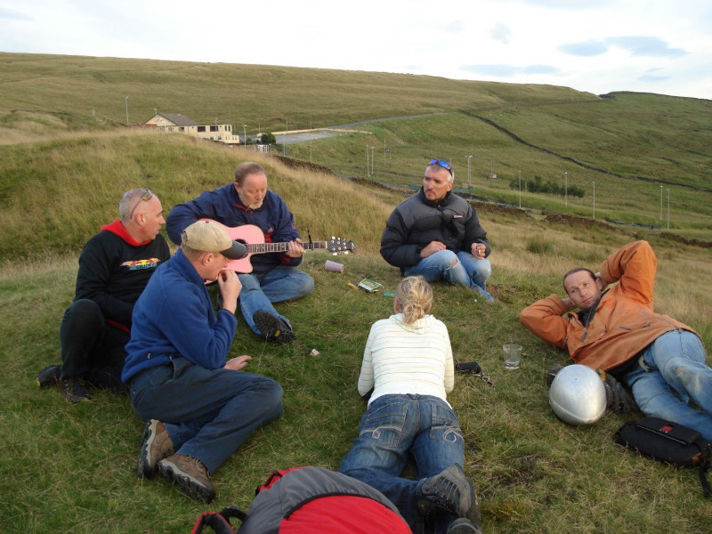

# Chairman’s Chunterings

Welcome to the PSC newsletter, grateful thanks to the efforts of our new committee member, Neil Charles for creating the first of what we hope will be many issues.

Well, the AGM came and went with a few surprises along the way. After several years doing an excellent job, Simon Scott stood down as chairman, and as I try to step into his shoes, I’d like to thank him on behalf of all the members for the great work he’s done in guiding the club and keeping us all together.

It’s not easy coordinating the activities of 200-odd (some very odd) free-spirited free-flyers and the current state of harmony and goodwill in the club is a testament to his efforts – thanks Simon, for giving me such a hard act to follow. Of course, he’s continuing to serve on the committee, taking over the role of secretary from Barry Sayer, who is moving across to be safety officer, relieving me of the onerous duty of trying out all the ways pilots can hurt themselves.

The inimitable Graham Jones makes a return to the committee as our new social secretary, and we welcome the very competitive Elliott Brown as competitions secretary, taking over from the equally competitive John Murphy, who has left the committee after an incredible 27 years of continuous service. John, thank you so much for the time and effort you have put into your various roles on the committee over the years – I think you must have done almost every job available within the club, and I’m sure we’ll often be back to you for the benefit of your experience. Now, all we need is a weather officer to improve the dreadful start to the year so far.

Brian

---

# Welcome Everyone

Here it is. Issue one. Simon Scott appealed for a newsletter editor at the AGM, I put my hand up and now, as the search starts for interesting things to write about, I think we can all agree that the lesson here is never to put your hand up at an AGM.

We should be able to rustle up enough stories for a monthly news bulletin, at least through the flying season when we're all out on the hills. We'll round up XC and safety news, check dates for your diary and say hi to any new members but your newsletter needs you. Had a great day out? Let's see some pictures. Smashed your personal best? Let's hear about it. This is the place to tell us all what you did and how much fun you had doing it, or if you've embarrassed yourself, for somebody else to send in the photos of your glider in the Parlick landing field tree.

You don't have to write loads, a couple of paragraphs and a photo or two is perfect. Send anything you'd like to see included to [editor@penninesoaringclub.org.uk](mailto:editor@penninesoaringclub.org.uk).

Neil

---

# Absent Friends

Richard Chadwick shares this lovely photo of Pete Batty from 2008. A memorial for Pete was held on 10th February following his accident in Tenerife.

Sad news too from the Lake District, posted last week by Gordie Oliver.

Condolences to their families and to the many of our members who knew and appreciated both Pete and Malc.

---

# Notes from the AGM

Our AGM was held on 12th February with lots of members turning out to hear updates from the committee, approve some post changes including a new chairman (Congratulations to Brian!), applaud 2023's [award winners](http://www.penninesoaringclub.org.uk/articles/article-list/pennine-soaring-club-awards-2023/) and listen to a techy presentation from your new newsletter editor.

You can see all of the updated committee positions on the [PSC Website](http://www.penninesoaringclub.org.uk/about/club-committee/).

We also made our annual contributions in February of £500 each to the Air Ambulance and Mountain Rescue.

---

# Membership Renewals

Membership levels seem to be steady at around 200 members. This allows us to make a significant donation to the two charities mentioned elswhere. We still have 15 people not responding so it would be nice if we could get this put to bed before the flying season - I know what I'd rather be doing! Please, if you have given the sport up, just tell us so we can stop pestering you.

£25.00 to...  
Lloyds Bank  
A/C: 02650706  
Sort Code: 30-96-85

Jim

---

# Name Your Newsletter

We've come up with a few options for naming our newsletter but you get the deciding vote. Pick your favourite and next month we'll be back with a fancy new title.

---

# Safety

Hi all, as newly appointed safety officer, I’ll try my best to keep my first post a cheerful optimistic read, unlike the weather we’ve suffered over the last few months. It’s a safe bet that things will improve, spring is only around the corner!

The winter months have been productive though. Several very interesting club nights, a reserve parachute repack day, a first aid course, pilot exam preparation. All this giving our aviation enthusiasm, many valuable skills to take to the hills.

We need to be on our ‘A game', if you haven’t had a flight for several weeks or even months, check your flying kit.
A few basics.
- inspect your wing, lines and risers, making sure it’s all in good condition.
- check maillons are tight, and karabiners look good (advice is to change karabiners every 5 years).
- check your harness thoroughly, webbing straps, zips, fabric and Velcro.
- check the reserve handle and pins.
- check Brummel hooks are connected.
- check your helmet for any visible damage.

The points above are only the basics of what should be your pre-flight checks. Paragliding & hang gliding service centres will offer a more comprehensive inspection, such as fabric porosity tests, reserve parachute service & installation into the harness, plus much more.

### Accidents
Sadly there have been two fatalities recently, and our sincere sympathy goes out to their family and friends. This highlights the caution, responsibility, and respect we need to take in such an extreme sport.

Please report any incidents via the BHPA website, online incident report form, found in the safety documents section.

### Appropriate paragliding footwear.
A minor incident earlier this month was the result of inappropriate footwear. Boots are a more appropriate footwear.

Answers on a postcard please….

### On a more personal note...

I noticed my karabiner had rotated slightly during taking off. A pre-flight check fail on my part. 

Something doesn’t look quite right!

Correct loading, as designed.

Equipment failure can be catastrophic. Rushing to get into the air, currency and overconfidence, are most likely the probable cause of the oversight. Check everything, check it again, and then check again ! It’s basic stuff, I know. Five minutes of your time going through several simple checks before your flight, is your responsibility.

Part of your flight plan should include several practice exercises. Check where your reserve handle is located. Hold both brake handles with one hand, reach and locate your reserve handle,  this should be second nature. Practice big ears and speed bar – at a safe altitude practice pulling in big ears, also big ears and speed bar (speed bar last). Familiarity and repeated practice will improve your skill set. Think back to your paragliding school training and refresh your knowledge by attending coaching days. 

If you’re not having fun, you’re doing it wrong.

Hope to see you on a hill soon.

Barry Sayer, PSC Safety Officer.

---

# Competitions

### Northern Challenge Series

The Northern Challenge Series is open again for 2024 and runs until 31st October. Fourteen fixed XC tasks and six hike and fly tasks based on PSC hills and our neighbouring clubs' sites, to take on whenever you like as fun or competition.

It's easy to download the [tasks](https://www.xcmap.net/index.php?c=Northern%20Challenge%20Trophy&y=2024) to your flight deck map, including challenges on Parlick, Pendle and Longridge so why not give it a try this season?

### XC League

Philip Wallbank leads the [Pennine XC League](https://xcleague.com/xc/leagues/view-15.html) with two 11km flights from Parlick. If you're chasing your first ever XC submission, it's worth a look at the flights on the Pennine league so far - a couple of extended legs from Parlick takeoff to the far end of Fairsnape and back can just about tip you over the magic 10km.

Three more pilots have logged flights but these distances are sure to be obliterated soon as we gear up for spring and XC season proper.

In the national league, Barry Sayer leads the way for Pennine, scoring 24.6 points so far with flights from Barkin and Whitestones.

Don't forget there are now two XC Leagues - the [original one](https://xcleague.com/xc/leagues/view-15.html) that we all know about and another, newer one that lives on [XContest](https://www.xcontest.org/united-kingdom/ranking-club:2688). The XContest one does a prize t-shirt for your first 100km flight but other than that the way the tables work is also a little bit different. XContest scores Pennine pilots flying anywhere in the UK and the original XC League scores its own Pennine league table as flights only from Pennine controlled sites. We'll keep an eye on both.

---

# Pennine Fest

### 24th - 26th May (bank holiday weekend)

This year Pennine Fest is the same weekend as the Chipping Steam Fair so it will be lively.
- Chipping Showground - PR3 2QF
- Camping all weekend on the show field. Electric hook ups. Toilets but not showers.

Dinner at the Sun Inn on Saturday evening, which will be the usual chilli meal with a veg or vegan option. Please contact either Tim or Jim via social media or email accounts@penninesoaringclub.org.uk. We need to know numbers so do get your order in early as it always sells out. The room we use can accommodate 32 total.

At the time of writing I don't have prices for camping or meal but its always been very reasonable and won't break the bank. I'll post it up on  Pennine Chat Telegram group when available.

Jim

---

# More dates For Your Diary

### Look Out for Coaching Days
- To be announced on the coaching [Telegram group](https://t.me/+rvaylQ5qz0FhODc0).

### 9th March, Cumbria Club Repack and Zip Line

### 11th March, PSC Club Night
- Sea View Inn, Chorley
- Presentation by Mark Shaw, BHPA Technical Officer

### 16th - 17th March, Peak Soaring Association Club Coach Course
- May be full but speak to Simon Baillie if interested

### 24th - 26th May, Pennine Fest
- So good we included it twice

### 31st May - 1st June, Buttermere Bash
- Sold out but has a [waitlist](https://www.tickettailor.com/events/airventures/1107651)

### 21st - 23rd June, Lakes Charity Classic
- Grasmere sports showground
- Last few [places](https://www.cumbriasoaringclub.co.uk/lcc/CSC_LCCMain.php) are going quickly

---

# The Gallery





---

# Shout Outs

Congratulations to Andy Gridley, Jamie Moffat, Matt Byrnes, Matt Baird and Pete Jones on passing their Pilot ratings!

---

# Why Not Visit...

### Newgale

Why not visit... is a quick look at a flying site far enough away that you can't see it from Clitheroe. In the UK or abroad, tell us all about somewhere fun to go.

_Neil Charles writes_



_Where?_

Newgale in Pembrokeshire, right out on the edge of West Wales.

_What's it like to fly?_

Newgale is a coastal launch, tucked into the northern end of St David's Bay. In a summer westerly it attracts a mix of a few locals and any visitors who have managed to sneak their wing into the car on a family holiday. The site itself is low airtime friendly, very pretty and has some interesting corners to explore. If you can get a few hundred above then the possibility opens up of crossing the bay at Nolton Haven to the South, joining the high cliffs at Druidstone and flying all the way down to Broad Haven. There and back will bag you a fun, technical, [10km coastal XC](https://flyxc.app/?p=euk%7BHdoe%5Ej%60I%7Bq%40g%60Ibu%40).

_Any watch-outs?_

- If the wind is off the hill, some of the undulating cliffs around takeoff can generate areas of rotor. The locations where this happens are obvious but don't get low and fly in behind a spur.

- Flying two hours either side of low tide.

- Crossing the bay at Nolton is a short glide but over deep water and can be intimidating. Don't commit if you're not sure.

_Who are the local club?_

Newgale isn't a club site but is looked after by the local school, [Pembrokeshire Paragliding](http://www.pembrokeshireparagliding.com).

---

# You Might Have Missed...

North of the border in Scotland, right to roam laws mean that you can climb hills in the countryside with your paraglider and fly off them without having to ask for permission first. In England, we have a limited right to roam that applies to only 8% of our countryside and 3% of our rivers and it specifically excludes paragliding and hang gliding. The BHPA, led by Sites Officer Martin Baxter, is lobbying alongside other groups to change that. [Sign their petition here](https://you.38degrees.org.uk/petitions/unlock-england-s-countryside-introduce-a-right-to-roam?source=rawlink&utm_medium=socialshare&utm_source=rawlink&share=96d82c36-69fe-43cb-9c3a-e37f425872dc).

---

# Your Newsletter Needs You

Appear in next month's newsletter! We need submissions for...

**A Grand Day Out**  
2-3 paragraphs describing a fun day. You're welcome to write more if you're feeling creative but a couple of paragraphs is plenty. Could be epic, could be daft, could be simply the first time you flew for six months. If you've had a good day and you took some pictures, send it in.

**Why Not Visit...**  
A quick guide to a site that you like, at home or abroad. Tell us where it is, what it's like to fly, any watch-outs and how to contact the locals. Attach a photo and email it over.

**The Gallery**  
Send in any recent(ish) shots with when and where they were taken. Spectacular, silly, from the ground or from the air, it doesn't matter. Let's see what you've been up to. Videos are very welcome too but pop them on YouTube or Vimeo and send a link for the newsletter.

**Shout Outs**  
First ever XC? Smashed a PB? Took part in a comp? Let us know and get a shout out in the newsletter. Nominate your mates if they won't do it themselves.

Send submissions on these or anything else you'd like to see featured to [editor@penninesoaringclub.org.uk](mailto:editor@penninesoaringclub.org.uk)

--- 

Fly safe, see you in April.