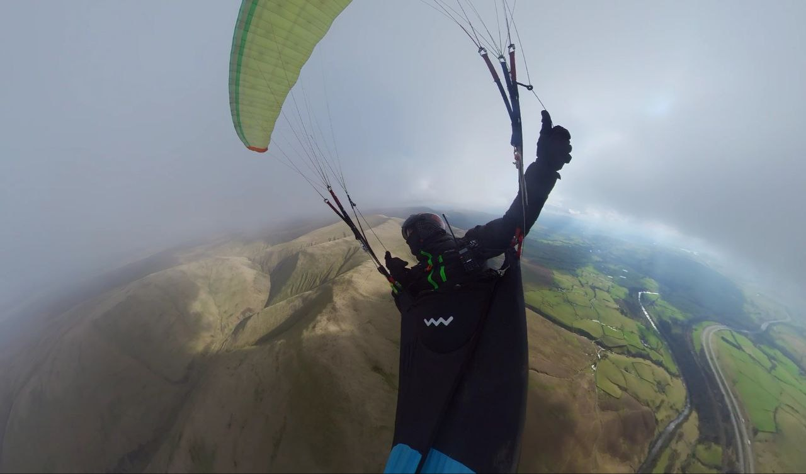
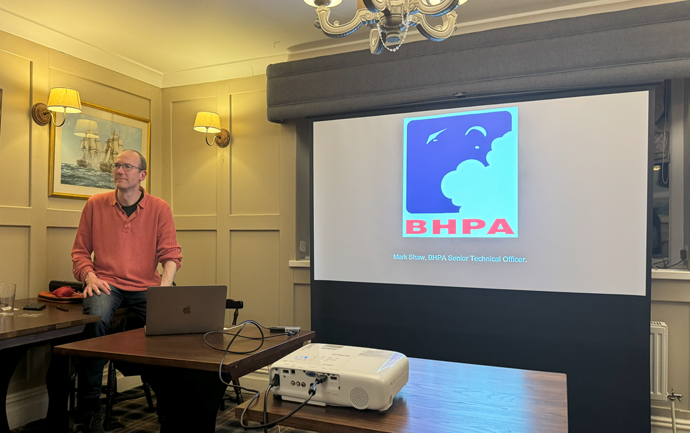
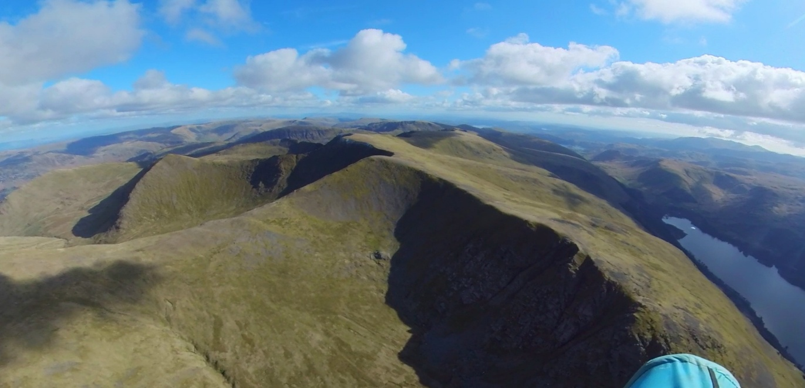
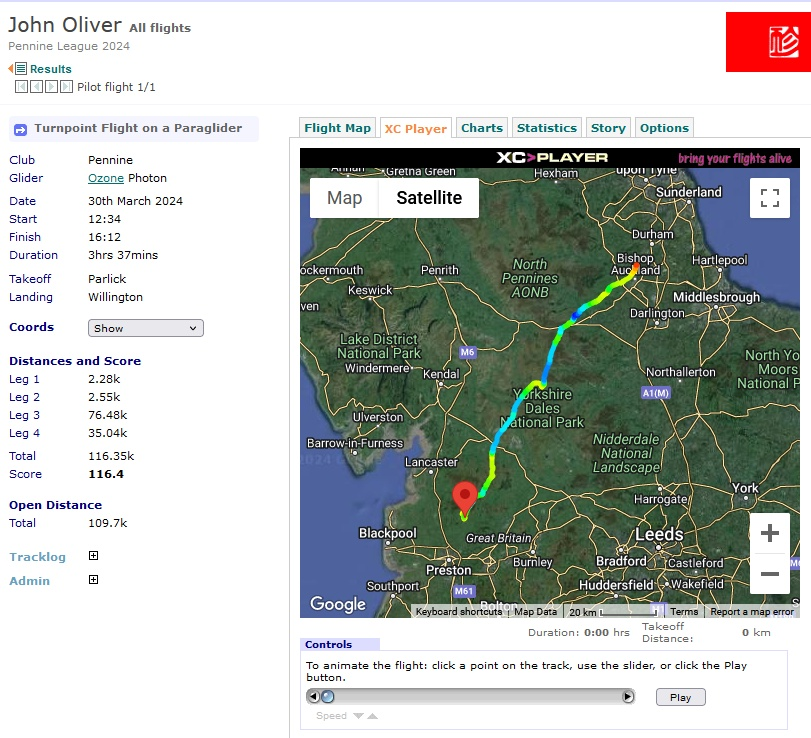
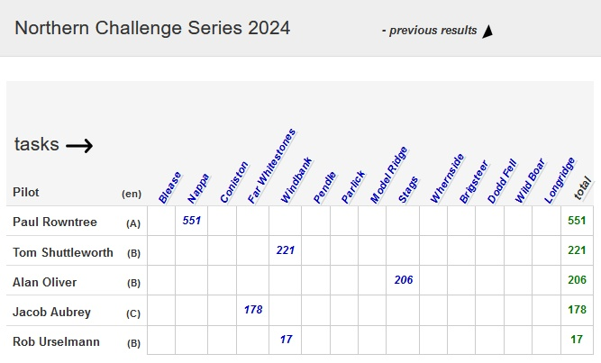
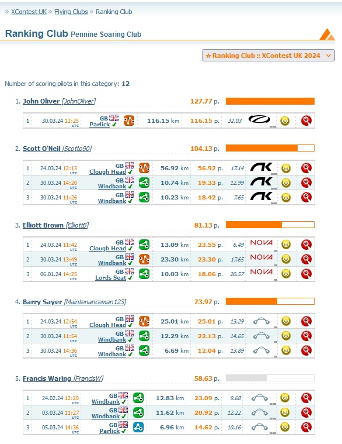
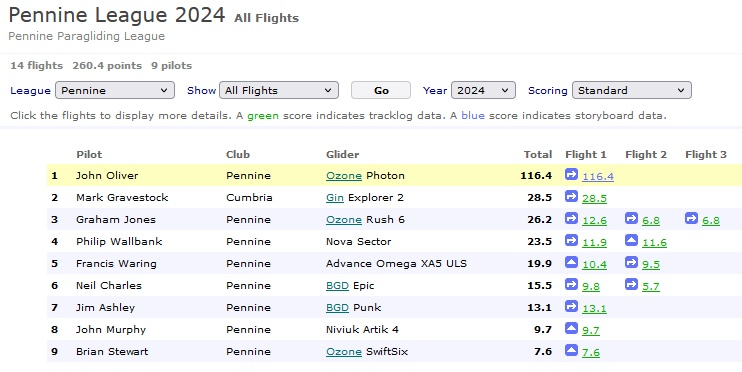
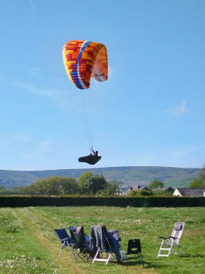
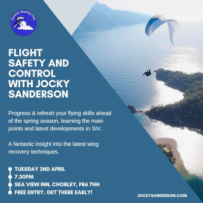
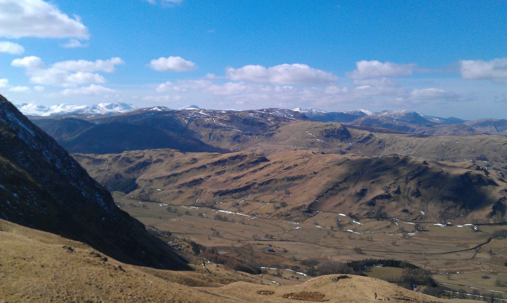

# Quick, somebody tell the weather it's spring

Welcome to issue 2!

Last month's votes have been counted and we're now officially The Pennine Post so set your bookmarks to [post.penninesoaringclub.org.uk](https://post.penninesoaringclub.org.uk/) and we'll aim to be back on the first Tuesday of each month with news, events and pictures of all of the spectacular flying we've been doing. Or pictures of parawaiting. Probably mostly parawaiting.

Thanks to everyone who's sent contributions this month. The Pennine Post is *your* newsletter so if you want a good read to take your mind off work then you need to send something in.  
Email anytime to [editor@penninesoaringclub.org.uk](mailto:editor@penninesoaringclub.org.uk) or we also have a handy [web form](https://docs.google.com/forms/d/e/1FAIpQLSd3NJQKlmLjjlh-nZGQKaeXzN6dSSL2PHzKRXFYAy_Bw7SC9w/viewform?usp=sf_link) that you can use to ping over pictures and stories. If you're on a hill, take a photo!

This month we've got wise words from our safety officer before the sun finally starts cooking up some spicy spring thermals, a new members shout out, the start of competition season, rumours of some proper flying in the Lake District and loads of photos for you to look at wistfully while the rain comes down.

Hang in there. You'll be getting yanked skywards by your risers before you know it.

*Cover photo: Barry Sayer tops out a climb in the Lakes.*

---

# Chairman’s Chunterings

*Brian Stewart, Chairman*

### Inclusivity – who needs it?

Another month, another period of rain, wind and non-flyable rubbish weather. One consequence of this is that more of us will be rustier than ever when the sun finally makes enough of an appearance, and I know our safety officer will be all over this with advice on staying the right way up. 

Because we all need some support at some time in our flying: whether that’s specific coaching on how to eke out that extra 0.1 on the final glide, overcoming the butterflies in the stomach while setting up or just coping with the FOFU* on take-off. No man or woman is designed to be island, but this sport we love leads us into doing things alone, apart from the bits happening on the ground. We see so many people come and go in paragliding and hang gliding and maybe we don’t do enough to support them, or we fail to notice the signs – hanging back on perfectly launchable days, landing early, not turning out in good conditions, remaining isolated in the take-off area. It’s hard work getting to first base in UK free flying, with our fickle weather, so it’s a shame when people drift away for no reason other than feeling that their problems are unique to them, or that there’s no-one to help them.

I know our chief coach has some great ideas on how to promote a coaching system at all levels to nurture the embryonic newcomers, as well as the grizzled veterans, but we all have a part to play: next time on the hill, look out for those who might welcome a friendly word or just being included in the parawaiting chatter and pub debrief – you might just help someone persevere in this great sport. ‘Inclusivity’ is a modern buzzword that has become tainted by over-use and abuse. I take it to mean that we do our best to support and encourage anyone trying to progress in free flight.

Brian

\* fear of f***ing up, a condition that gets worse with time and is calculated by the formula:  
FOFU index = (number of years you’ve been doing this) x (number of observers) x (number of years the observers have been doing this). [1]

A FOFU score greater than 25 can lead to palpitations on launch.   
A 4-digit score often leads to something worth recording and posting on YouTube.

[1] Journal of Advanced Parabollox, 2024

---

# Notes from the Committee

### BHPA club night

Many thanks to Mark Shaw, senior technical officer at the BHPA for an informative evening of explanations of what the BHPA are doing to keep the future of paragliding safe, insurable, cost effective and accepted by other general aviation users.

### Club history

*Jim Ashley, Treasurer*

If you've been around for a while and in particular from the start of Pennine Soaring Club in 1993 and have any info or records from the past, we'd be interested to hear from you. There are some gaps from pre 2002, which we would like to fill. Information such as committee positions, AGM reports, magazines... In addition, anything from earlier times too from the Pennine Hang Gliding Club days is welcome. It would be nice to have a more complete record of our history and could even prove useful at some point. Please get in touch in any of the usual ways.

### Thanks from Bowland Pennine Mountain Rescue Team

*BPMRT writes...*

Hi there Jim,

On behalf of the Team, may I thank the Pennine Soaring Club, once
again for the most generous donation of £500.  We are entirely funded
by voluntary donations, and sums such as this really help us to be
ready to move quickly to whatever we are called to in Lancashire.

So far, this year, we have been called across the county to fallen
walkers and mountain bikers with various injuries, people who have
been lost, and bizarrely, a gent who seems to have just disappeared
off the face of the earth. Ages have ranged from 3 to quite senior.

Thank you once again. It really does help us make a difference.

Clive Shelley
Treasurer - Bowland Pennine MRT

---

# Safety

*Barry Sayer, Safety Officer*

### Spring thermals

As spring unfolds, it's that time for a gentle reminder aimed at pilots who've been grounded during the winter, or are feeling a bit out of practice.

For many pilots, emerging from a winter hiatus means dusting off their gear and reacquainting themselves with the skies. Those who haven't kept up with their flying routine can expect to feel a bit rusty, needing more time to regain their former skills. Even those who've flown intermittently over the winter might find themselves a bit out of touch with handling thermals.

During this season, the air and ground are relatively cold and the sun is relatively powerful. The sun asserts its warming influence and this combination sets the stage for thermals to form and rise rapidly. You might hear thermals described as "punchy," which translates to your serene flight being rudely interrupted as your wing jolts backward upon entry, or sections of it turning oddly limp as you skirt past. The potency and compact size of these thermals, coupled with misjudged control inputs, can lead to collapses and general discomfort. Additionally, as thermals peak in strength, midday conditions might become gusty, making ground handling trickier.

Soaring on spring thermic days, especially on our small hills, presents its challenges, with altitude fluctuating swiftly as thermals come and go. Experienced pilots often position
themselves further ahead of the hill where thermals form, offering both prime thermal opportunities and a safety buffer.

The timeless advice remains: fly within your skill level. For those reentering after a hiatus, it's wise to ease back in gradually. Novice pilots seeking to soar on thermic days might opt for early or late flights, gradually building confidence as the season progresses.

Observing fellow pilots (disregarding those flaunting high-performance wings), assessing cloud formations, and monitoring gustiness are essential for informed decision-making. If conditions appear turbulent and pilots seem unsettled, being on the side of caution is the best approach.

Here are some insights garnered over time:

- Acknowledge the risks. Just by reading this, you're on the right track.

- Avoid flying during peak heating hours.

- Stick with familiar gear until you're comfortable.

- Keep snacks to hand and stay hydrated.

- Wear layers to combat cold temperatures.

- Prioritize keen observation of surroundings and conditions.

- Beware that ground handling on takeoff in spring can lead to being pinged into the air by a strong & turbulent thermal. 

- Stay vigilant to changing conditions and always have a backup plan.

- Mentally prepare for encountering punchy thermals; stay active and respond to collapses promptly. Be ready to deploy your emergency parachute if necessary.

- Remember, there's always another day for flying.

- Fly actively (keep the wing above your head where it belongs).

- If you get a collapse: HANDS UP!

- If it all goes horribly wrong, throw your reserve early. Rehearse throwing your emergency parachute and be prepared to use it.

- Make good decisions!

With these pointers in mind, may your spring flying endeavors be both enjoyable and safe.

---

# Sites

Keep an eye out on our Telegram groups for the start of lambing restrictions. Edenfield will be out of bounds for a month - usually from 25th April - and if you're travelling to our neighbouring clubs, do check their websites. Sites may be closed and landing fields may be different ones to usual.

---

# New Members

*Nigel Bailey writes...*

Passed my CP with Dean Crosby in November last year, went out and bought all the sparkling shiny new gear from Flybubble, and now just walk past it in the house, wondering if it will ever get used. As each day passes, and no flying or ground handing is happening, I seem to lose that little bit of hope and confidence that my feet will ever leave the floor voluntarily ever again... I have surely forgotten everything Dean taught me.  

I did venture out to Algondanales Spain in December straight after qualifying, only to be dragged around my backside each day, whilst all around me flew like birds.
Ok, apart from a very short flight - see video - (so Proud of myself 🙂)
I was advised that this was normal for a new CP. I did even consider placing all of my gear straight on to ebay as soon as I returned. Pleased now I talked myself out of it.

So, April is around the corner, WhatsApp and Telegram seem to be coming alive with regular updates, so I am now just plucking up the courage to join you on the hills (if only to be dragged around them again on my already bruised backside). 

I look forward to meeting up with you soon, and hopefully some very patient, sympathetic, tolerant and uncomplaining coach can refocus this 'wannabe' Paraglider in 2024.



---

# Competitions

*Elliott Brown, Competitions Secretary*

The 30th March seems to be the start of the 100km flights being added to [XContest](https://www.xcontest.org/world/en/flights/daily-score-pg/#filter[date]=2024-03-30@filter[country]=GB ) and XC League in numbers, with entries from Milk Hill, Eyam Edge, Windbank and our own Parlick Hill. There was also a great earlier flight from Tinto in Scotland the week before, scoring 107km.

A fantastic flight too by our PSC pilot John Oliver, who rocked up to Parlick on 30th March and clocked an amazing effort to just past Bishop Auckland at 116km! 

### Northern Challenge Series

The Northern Challenge Series has started to get flights added since it opened 1st of February, with Nappa being completed on the 30th of March.

This year Pennine Soaring Club is host to three of the challenges, set on Pendle, Parlick and Longridge. Why not get them downloaded and ready for a flight? there is no registration needed to add your flights, just upload a track to the relevant task page and your name will appear on the scoreboard.

### XContest

John’s flight off Parlick on Saturday has secured him a nice lead at the top of the league, with his epic outing to the North. The remaining pilots in the top 5 have similarly built up some good flights from the same couple of flyable days in March.

### XC League

Parlick seems to be getting the most love on XC League, with the odd flight from Blackstone Edge thrown into the mix.

---

# Pennine Fest

### 24th - 27th May (the whole bank holiday weekend)

This year Pennine Fest is the same weekend as the Chipping Steam Fair so it will be lively.
- Chipping Showground - PR3 2QF
- Camping all weekend on the show field. Electric hook ups. Toilets but not showers.

Dinner at the Sun Inn on Saturday evening, which will be the usual chilli meal with a veg or vegan option. Please contact either Tim or Jim via social media or email accounts@penninesoaringclub.org.uk. We need to know numbers so do get your order in early as it always sells out. The room we use can accommodate 32 total.

Camping is £8 per pitch (tent, caravan or motor home) + £6 for an electric hookup. The meal on Saturday night will be £10, including a pound to the air ambulance. Cash only please!

I’ll post more information on the Pennine Chat Telegram group when available.

Jim

---

# Dates For Your Diary

### Tonight!

### Look Out for Coaching Days
- To be announced on the coaching [Telegram group](https://t.me/+rvaylQ5qz0FhODc0).

### 24th - 27th May, Pennine Fest
- Get your Saturday pub dinner booked via Jim if you want one

### 31st May - 1st June, Buttermere Bash

### 21st - 23rd June, Lakes Charity Classic

---

# The Gallery







---

# Shout Outs

Congratulations to Scott O'Neil for chalking up 57km - [the longest flight of the day](https://xcleague.com/xc/flights/2024667.html?vx=0) - from Clough Head on Sunday 24th March - the same day that's given us all of our spectacular photos this month.

Scott's much too modest to have nominated himself for the shout out but he did make a cracking video of the day.



And congratulations again to John Oliver - already mentioned in Competitions - for the first 100km XC from a Pennine hill this season. Also the first 50km XC. And the first 25km XC from a Pennine site by a Pennine pilot. The rest of us have got some serious catching up to do already.

---

# Why Not Visit...

Why not visit... is a quick look at a flying site far enough away that you can't see it from Clitheroe. In the UK or abroad, tell us all about somewhere fun to go.

### Clough Head

_Where?_

Clough Head, just south of Threlkeld in the Lake District.

_What's it like to fly?_

Ask the Pennine pilots who were there on the 24th March! Clough Head is a brilliant west to north west site and well worth the extra drive if you suspect the wind might be a bit light for Parlick, or it's an XC day and you don't fancy getting decked trying to squeeze through the narrow gap between ground and airspace 15km downwind from Pendle.

The takeoff is big and grassy, although be prepared for a proper Lake District style walk up from the bottom. The site guide says you can park in a quarry halfway up and you are allowed to, but it might not be realistic to try unless you have a 4x4.

If you're chasing your first XC's, Clough is a fabulous place to go. Climb back onto the crags behind takeoff, gain some height and then head south to Helvellyn, waving at the cross country skiers on the tops if there's still snow around. Keep going south following the main ridge down from Thirlmere and past Grasmere, taking in some spectacular views along the way, to land at Ambleside for [20km](https://flyxc.app/?p=qeglIp_qQbvMunChiHwpApnH_jG). It's a west facing ridge nearly all the way down - plus a few slightly technical bits - so you'll have plenty of options for climbs on a wind and sun facing slope in the afternoon.

_Any watch-outs?_

- Read the [site guide](https://www.cumbriasoaringclub.co.uk/SiteManagement/CSC_Specific_Site.php?site=CLH) (don't miss the tabs at the top of the page for Access and Flying).

- No landing nearby except in the designated field and it's £2 per pilot to the farmer for use of that field. Check which field is in use and pay before you walk up to save forgetting afterwards.

- Park considerately. It can be difficult to find a spot nearby if you arrive late on a busy day but that's not an excuse for blocking access to farm fields.

_Who are the local club?_

Cumbria Soaring Club, so you can fly Clough on our reciprocal agreement. Read the [site guide](https://www.cumbriasoaringclub.co.uk/SiteManagement/CSC_Specific_Site.php?site=CLH)! It has a lot of important details about parking and landing fields, as well as some useful flying advice.

---

# You Might Have Missed...

via [XC Mag](https://xcmag.com/news/xc-tracer-flarm-collide-over-software-update/)...

*"A major software update to Flarm, the collision-avoidance system, has resulted in the disruption of the Open Glider Network live-tracking service and led to two XC Tracer instruments losing their Flarm functionality.*
*The two instruments that have lost their Flarm functionality are the XC Tracer Maxx II and XC Tracer Mini V. No other free-flight Flarm-enabled instruments are known to be affected."*

If you have an XC Tracer Maxx 2 or Mini 5, be sure to check the XC Tracer [website](https://www.xctracer.com/) for updated firmware. For everyone flying with Flarm, it's not a bad idea to have a look at [KTrax](https://ktrax.kisstech.ch/flarm-liverange/) now and again to ensure that you're actually broadcasting and nothing on your flight deck is interfering with the signal.

---

# Your Newsletter Needs You

Appear in next month's newsletter! We need submissions for...

**A Grand Day Out**  
2-3 paragraphs describing a fun day. You're welcome to write more if you're feeling creative but a couple of paragraphs is plenty. Could be epic, could be daft, could be simply the first time you flew for six months. If you've had a good day and you took some pictures, send it in.

**Why Not Visit...**  
A quick guide to a site that you like, at home or abroad. Tell us where it is, what it's like to fly, any watch-outs and how to contact the locals. Attach a photo and email it over.

**The Gallery**  
Send in any recent(ish) shots with when and where they were taken. Spectacular, silly, from the ground or from the air, it doesn't matter. Let's see what you've been up to. Videos are very welcome too but pop them on YouTube or Vimeo and send a link for the newsletter.

**Shout Outs**  
First ever XC? Smashed a PB? Took part in a comp? Let us know and get a shout out in the newsletter. Nominate your mates if they won't do it themselves.

Send submissions on these or anything else you'd like to see featured to [editor@penninesoaringclub.org.uk](mailto:editor@penninesoaringclub.org.uk). You can also drop them over using the [web form](https://docs.google.com/forms/d/e/1FAIpQLSd3NJQKlmLjjlh-nZGQKaeXzN6dSSL2PHzKRXFYAy_Bw7SC9w/viewform?usp=sf_link) or message [Neil](https://t.me/NeilCharles) on Telegram.

--- 

Fly safe, see you in May.