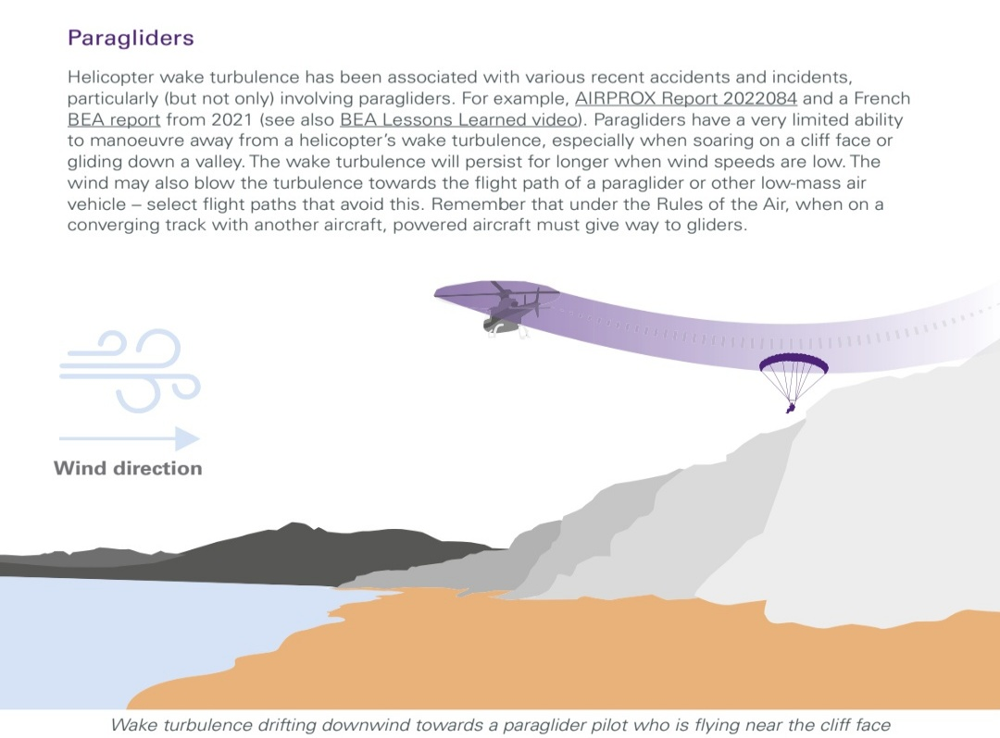
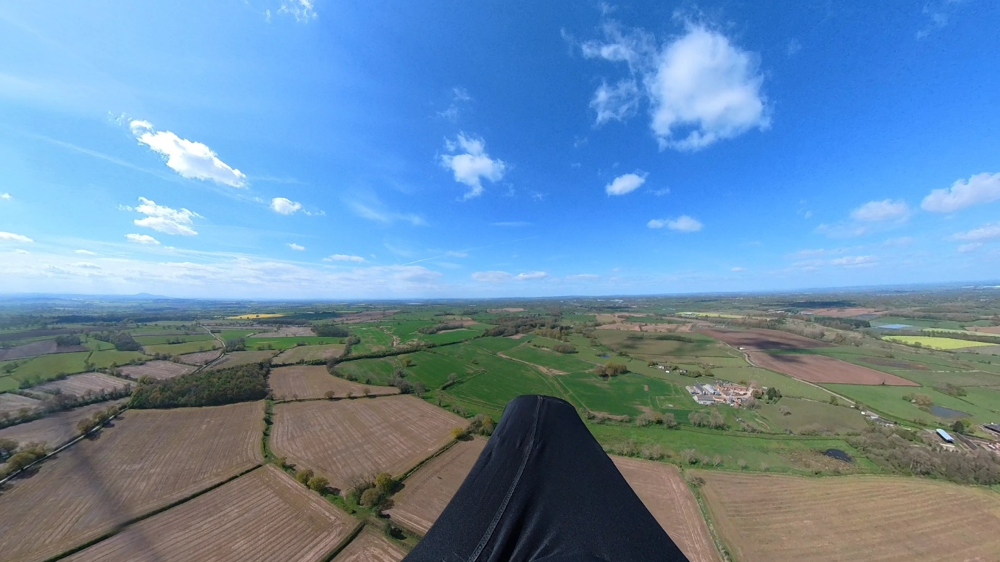
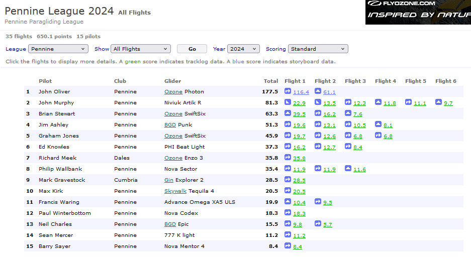
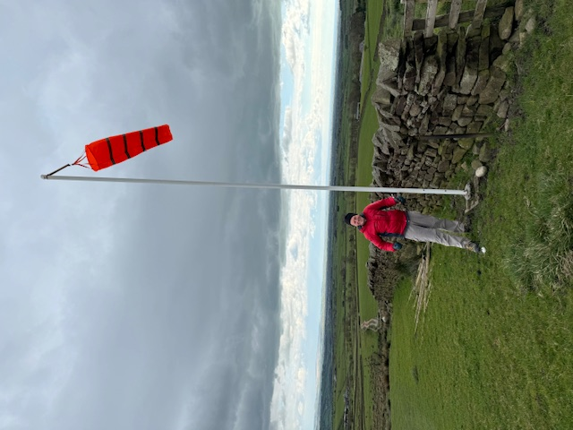

# What's that beeping sound?

After a start to April that prompted the BBC to run a front page article titled "Why is it raining so much?", we've finally started to be rewarded with some flying weather. Saturday 20th April saw pilots high over Pendle and Longridge and since then it's been, well, if not exactly epic then at least occasionally flyable.

  
*The BBC asks the question on all of our minds.*

Fingers crossed that May marks the arrival of spring proper and rest assured that the sun has been booked to shine on Pennine Fest at the end of the month.

In this issue we've got your final Pennine Fest reminder - dust your tent off! - plus the latest competition roundup, important sites info around lambing, some recent safety issues, lots of pics as usual and Richard Meek writes up an epic flight to goal from Treak Cliff in Derbyshire to the Bristol Channel.

Thank you to everyone who's contributed to this issue. Keep those photos and shout outs coming!

  
*Cover photo: Ed Knowles snaps Damian Thornton thermalling to base over Coniston*

---

# Chairman’s Chunterings

*Brian Stewart, Chairman*

Such sad news to hear that Kevin Mcloughlin, long time PSC member and a stalwart of paragliding up here in our neck of the woods, passed away recently. A familiar, friendly, helpful face on the hill, one of those quiet heroes who would help anyone and be involved in whatever was happening on the hill, he will be sorely missed by the huge number of people who knew him. The funeral will take place at Lancaster Crematorium on Tuesday 7th May at 13:30. RIP, Kevin.

Today’s theme is alliteration. The military have a saying along the lines of: “Proper Preparation Prevents Piss-Poor Performance”. Hmmm, should have taken that one on board the other week. After faffing about at Longridge (great shout out for Simon B for hanging around there for his coachees and missing some personal flying), I was persuaded to trek to Pendle. In a previous paragliding life, in an earlier millennium, I used to be the one chasing all over the country to find some ‘better’ conditions; once I was reincarnated after the noughties, I vowed that would not be me – make a decision and stick with it would be my mantra.

Pendle was no better, shedloads of pilots sat watching the scenery. Until it wasn’t. Some great flying and I set off for Longridge, beaten back by the sea breeze, went off the other way and back to the hill. Triangle assistant showed a nice change of colour as I entered the final segment, so down to land, feeling smug. Of course, I’d forgotten that getting to the last segment isn’t the end of the game, and that you have to creep into the little circle around take off. So, what would have earned me a nice brownie-point multiplier was lost.

Patience and Persistence Promotes Perfect Paragliding. I like that one better. Another day, another long period of waiting around for things to get going. An aborted flight (see safety notes from Barry) saw me back on take off, and nearly giving in to my default characteristic of impatience. Thankfully I stayed this time and was rewarded with a lovely late afternoon flight all the way out to Beacon Fell and back, and paid attention to the triangle assistant this time to close it. Sometimes you just have to wait.

---

# Notes from the Committee

### Jocky Sanderson Thanks

*Graham Jones, Social Secretary*

We were extremely privileged to have Jocky at our 2nd April Club Night. Among many other things Jocky is known as Cumbria's SIV Guru, team manager of the winning GB team in Argentina and part of a mountain rescue team in the Lake District. His SIV trips to  Ölüdeniz in Turkey are legendary.

Jocky opened the evening by expressing his sadness at the tragic loss of Malcolm Grout. Malc was well known for his tireless kindness in helping other paragliders in safety and progression. With Malc in mind Jocky was here to spread his own kindness to our club members and update us on Wing Recovery Techniques.

Apologies to Jocky Sanderson from me and others who were unable to attend this special event. I have details of the event and I can see that it was a very special with detailed diagrams of wing movements and body positions. Some I knew, some I never thought of that way and some were new to me!  A brilliant night.

Thank you Jocky Sanderson from all the members of Pennine Soaring Club.

You can watch the video of this fantastic evening [here](https://www.youtube.com/watch?v=zLCVqq16SEY&ab_channel=PennineSoaringClub).

---

# Safety

*Barry Sayer, Safety Officer*

As April passed by rapidly, fortunately there have been no serious accidents to report, however several incidents occurred. Are these avoidable? Perhaps, though human error is a part of life and the learning curve. Our focus on the strong spring conditions, mixed with the intense passion to paraglide and hang glide takes over our senses.

It’s exciting to see several Pennine pilots flying new wings this season. Good decision making on favourable weather condition days, followed by reports of successful test flights gives confidence in manufacturing advances and production quality. Safety on the B class wings is extremely impressive with no compromise on performance.

The local hills have been a busy place for low airtime and experienced pilots, all looking out for each other, coaching and sharing advice. This creates a safe friendly club environment we can be proud of. The flying season is now well underway, so staying vigilant is a priority especially with the strong spring conditions many of us have experienced. On thermic days, keeping an amount of separation from the hill gives you more time, options and a safety buffer should you get a collapse or unstable flight characteristics. Bullet thermals that form on the hillside rise very rapidly.

Reverting back to Jocky Sanderson’s club night presentation, with the emphasis on fast well timed inputs. Controlling the wing stability above, and using the brakes in a fluid smooth manner utilizes active flying to suit the conditions.

### Incident Reports

#### Checking emergency parachute pins & plastic retaining rods

On landing fellow pilots noticed the harness reserve opening compartment was fully open, with the loop retaining rods not in situ. The deployment handle was still in the correct position, attached with the Velcro/hook & loop setup that is standard on many harness brands.

#### Ooops, I did it again

After an uneventful take off on Jeffery Hill I noticed my karabiner had rotated slightly. Again! I landed immediately to check everything, again. Two overkill 'O rings' are now fitted. 

#### Clear launch and landing area

A little bit of consideration is sometimes required on placement of all your flying kit once you've landed. Whether it's a top landing or foot of the hill, moving to one side is the best action, showing good airmanship even at ground level.

Witnessing a pilot preparing to launch, only a few meters upwind of everybody's equipment in strong conditions raised concern. A discussion took place, how the pilot would hop-scotch through lines, wings, harnesses plus kicking helmets. Only for this to happen immediately.

A prompt short dragging followed. Control of the paraglider was regained, with dusting off and slight embarrassment, onlookers quickly prompted the pilot to reposition in a more suitable area.

*A busy day on a Yorkshire flying site*

#### An experienced pilot encountered issues with a pod harness

Contributory factors...  
Pilot - Poor or insufficient pre-flight check.  
Equipment - Harness failure or malfunction.

Normal launch after wing-walking to a better spot. Struggles to get legs into pod (normally very easy with my setup). Persevered and forced legs into pod, only to find the pod was too short and I couldn't get them out again. Managed to get one foot out and was able to climb sufficiently to make a very inelegant top landing on one foot in deep mud and was able to control the glider despite falling over. One of the pod tensioning lines had snagged on something internally, so the foot plate was too close. Not easy to spot on the pre-flight check as it only showed up when I tried to get my legs in. Correct action would have been to land immediately without putting my legs in the pod when I realised something was wrong.

An incident report has been submitted by the pilot, alongside a wise statement...

"Lesson learned: if something feels wrong, STOP! Don't blindly carry on."

### UK Civil Aviation Authority – April 2024 publication

An [interesting article](https://www.caa.co.uk/publication/download/21803) from the CAA highlights the dangers of helicopter wake turbulence. As we share the airspace with a variety of aircraft, keeping distance and communicating with other pilots should you spot approaching air traffic is best.

Fly safe, fly far!

---

# Sites

Edenfield is closed for lambing until 25th May and if you're travelling to our neighbouring clubs, please check their sites guides. DSC have the usual [restrictions](https://derbyshiresoaringclub.org.uk/news/lambing-restrictions-2023/) on the sites around Mam Tor, CSC have an array of [warnings and closures](https://www.cumbriasoaringclub.co.uk/CSC_Home.php) in place for lambing, peregrine falcons and ground nesting birds and DHPC also have some [sensitive sites](https://www.dhpc.org.uk/sites) with landing field changes in place for spring.

---

# Coaching Corner

*Simon Baillie, Chief Coach*

To say it’s been a slow start to the flying season would be a massive understatement! I think it’s the worst winter/spring that I’ve known since I learned to fly. There has still been some activity on the coaching front, though.

As the Post reported last month, quite a few of our members have been supported to take their Pilot exams, this spring.

Despite the recent poor weather, we still managed to have a successful coaching day at Winter Hill, on Sunday 21st April. One of our members achieved his first flights outside of the school environment, and managed some decent soaring and top landing. Others also managed some very good top landings on what can seem like an intimidating site. I’d like to thank the other coaches, who gave up their time to help, too.

At the end of April, I spent 3 days down at BHPA Head Office on the Senior Coach/Instructor Course, run by Mark Shaw and Ian Currer. It was a fairly intense course but it was really interesting, especially gaining more in-depth knowledge of the instructor side of things.

I’m working on some ideas for improving the support available for new CPs, and anyone struggling, nervous, or lacking in confidence. If you’ve any additional ideas, from your own experience as a new CP or LAT pilot, I’d love to hear from you. Either email me at [chiefcoach@penninesoaringclub.org.uk](mailto:chiefcoach@penninesoaringclub.org.uk) or direct message me through Telegram.

As a starting point, I’m going to thin down the Telegram coaching group. There are a lot of non-PSC members on there, as well as much more experienced pilots who don’t need coaching and it's ended up not being very different to the other groups that we have. I’m hoping that, through a much smaller group, we can encourage more discussions about theory and techniques and enable people to develop their own network of pilots at a similar level to them.

---

# A Grand Day Out

*Richard Meek narrates Treak Cliff to Gloucestershire - a 187km flight to goal*

Sunday 21st April 2024.

Back to the Peak district on a similar forecast to Saturday, although the wind is due to have a little more east in it (NNE-NE), which should make it easier to negotiate the airspace.

Launch from Treak Cliff, cross Winnats Pass and start the task from Long Cliff.

  
*187km task to Lydney.*

Launch at 11:40, soar around for 15 mins until a lovely 2m/s climb out.  A good gaggle formed including Jacob Butterworth, Richard Butterworth, Alex Colbeck and Richard Carter (1) and we worked well, spreading out to increase our search pattern.

  
*11:54 on the climb out. Looking north east from Long Cliff.*

For 65km to Stafford we mainly bounced along under the 4,500' airspace, rarely dropping below 3,000' AMSL. However the ground is often around 1,000' here so we're not talking huge clearance.

  
*12:22 3,800’ south east of Buxton looking south west under some top cover*

Whilst we kept high we weren't really fast, around 25kph, the top cover slowing things down.  

  
*Looking west towards Stoke on Trent. Alex to the left, Butty ahead to the right*

Between Stafford and Telford we got low, taking turns to get really low and either dig ourselves out or, in the case of Jacob and RC1, their feet met ground. My own low save came in the form of a bubble from 500' AGL.

  
*14:30 500’ AGL. Brown fields + woods = source & trigger.*

Scrabbling around low slowed us down, allowing a following gaggle including Jacob Aubrey, RC2 and CJ, to merge at 14:50.

I wasn't confident that goal was achievable with 115km to go but south of Telford things started to improve with a climb to 4,900', the next 5,200' and so on.  

  
*The view to the south from 4,900’*  

Having safely negotiated the airspace we started to put a bit of east into our glide to maintain our line to goal, passing west of the Malverns just after 5pm.  

  
*16:57 Malverns to the left of my pod.*

We've still got 48km to go and the cumulus are beginning to be less numerous and less well defined.  Undeterred we crack on and since Telford we've been above 2,700' all the time, finding climbs just when we need them. The gaggle was down to four by this stage; Alex, Richard, Jacob and myself. Good comms between 3 of us, dodgy radio for #4, we were sharing our ideas for each move and then committing as a team.

  
*17:54 looking south to the Bristol Channel*

At 17:40 with 30km to go we climb to 5,100' and get our first view of the Bristol Channel and our goal on the north shore. There are some clouds ahead along our course line, this may actually be possible. I check my notes to confirm last train leaves at 19:14. OK, that gives us some time to work with, let's go for it.

A good line for the next 7km sees us back to 5,100' with 23km to go - ahead is Cinderford with a growing cloud to the south. We glide on and connect with that climb, which is our last, giving us glide to goal.

  
*18:05 Cinderford ahead with cloud marking our final climb*

It occurred to me that this climb just may be a sea breeze convergence, a moment of roughness and decreasing wind speed raised that suspicion and fearing our tailwind would turn into a headwind we each took the final climb higher than we needed. Alex and I sailed in with >3,000' to spare. 

  
*18:32 A well researched LZ is a low stress LZ*

On final glide I'd reminded the gang that time was of the essence; a quick pack and jog to the station to ensure we made the last train. They heeded my advice and t'was I the laggard of the bunch being assisted to pack my glider away, how embarrassing!

As we made our way to the station I received a call from a local pilot, Simon Ford, who somehow knew where we were - the miracles of live tracking eh?  Simon offered a lift, what a generous fellow! I thanked him but confirmed we were on schedule for the train which we made with a few minutes to spare.

On the safety of the train we could catch up with all the messages (congratulations and wind ups) from friends. Change at Cheltenham, grab a cheeky chicken and chips from the fast food place whilst waiting for the next train to Birmingham. Minor issue in Brum - Jacob and I sat gabbling and forgot to get off and change to the Manchester bound train. Doh!

We figured that out as our train set off, with the announcement advising it wouldn't be stopping where we expected. Ooops. An alternative plan was hatched to take this through to Sheffield and then an Uber. A few quid lighter but similar time to the train; we were at the cars by 23:00 and then home by 00:40.

A full day. Almost pleased Monday isn't flyable so I can sleep in and catch up on the to-do list.

  
*Planned and actual route.*

https://www.xcleague.com/xc/flights/20241121.html

---

# Competitions

*Elliott Brown, Competitions Secretary*

Written for April, as flights keep coming in!

Well, it would seem that there has been a bout of good weather days for flying distance in the last month, about 5 days of fantastic distance flights being recorded up and down the country. Mainly a lot of Southern sites, but with some great flights in Scotland, like Tinto and Aonach Mor getting a look in.
The 20th of April had the lion's share of big distance attempts, with a little site called Leckhampton Hill (I’ve not been to myself). While having a look into the site, I stumbled across a [news article](https://www.gloucestershirelive.co.uk/news/cheltenham-news/paragliders-launch-beauty-spot-never-9238367) from the day, it looked very busy above take off! 

Below is my favourite for this month, just because of the mountains that they are flying through and the multiple crossings of various Lochs through the flight. One for the wish list for me.

 

### Northern Challenge Series
http://www.xcmap.net/ 

The leaderboard is getting a fair few new entries from pilots all over, with the top scorer completing another task on their EN-A. Four of the tasks have been completed now, with a CSC pilot completing the local Longridge. New tasks on Parlick and Pendle haven’t been attempted and submitted yet, maybe your name will be here next? We need more Pennine Pilots to have a go, it’s a great tool to learn how to use your phone/device tasking and pushing yourself a bit further away from the hill.

Even if you’re not really flying the task, you might clock up some points bobbing around trying to get away (see my Windbank flight).

 

### XContest

Richard’s sequential epic flights from Derbyshire have well and truly put him in pole position, and Brian has entered a number of FAI triangle flights, which always score nicely.

### XC League

John’s still holding the pole position strongly with his great XC from last month, now supplemented by an FAI triangle on Pendle, which is a top scorer with a 2.3x multiplier (note the multiplier on XContest is only 2.1, so slightly different scores for the same flight). More people are getting in the air this month, adding their flights in, so there has been a fair bit of movement up and down the board. Reminds me that I need to get some flights in the Pennines to get myself on there as well!

---

# Pennine Fest

### 24th - 27th May (the whole bank holiday weekend)

This year Pennine Fest is the same weekend as the Chipping Steam Fair so it will be lively.

- Chipping Showground - PR3 2QF
- Camping all weekend on the show field. Electric hook ups. Toilets but not showers.
- Dinner at the Sun Inn on Saturday evening, which will be the usual chilli meal with a veg or vegan option. Please contact either Tim or Jim via social media or email accounts@penninesoaringclub.org.uk. There's still a few places left so please get in touch.

Camping is £8 per pitch (tent, caravan or motor home) + £6 for an electric hookup. The meal on Saturday night will be £10, including a pound to the air ambulance. Cash only please!

---

# Dates For Your Diary

### Look Out for Coaching Days
- To be announced on the coaching [Telegram group](https://t.me/+rvaylQ5qz0FhODc0).

### 24th - 27th May, Pennine Fest
- Get your Saturday pub dinner booked via Jim if you want one

### 31st May - 1st June, Buttermere Bash

### 21st - 23rd June, Lakes Charity Classic

---

# The Gallery



---

# Shout Outs

Many thanks to Paul Winterbottom for erecting a brand new windsock for us all in Parlick landing field.

And congratulations to our Chairman Brian on a fantastic 20km FAI [triangle](https://xcleague.com/xc/flights/20241208.html?vx=15) out to Beacon Fell and back from Longridge.

*Brian chasing Jim and Pete*

---

# You Might Have Missed...

With the slow demise of Facebook groups, [Telegram](https://telegram.org/) seems to be the new home of UK paragliding chat. If you're not a member of these PSC groups, get yourself signed up.

- [Pennine Chat](https://t.me/+WE7P1V5MfyQ5DmxX)
- [Pennine Site Conditions](https://t.me/+Up-PPy1d58Oh6TFu)
- For the Pennine Club Coaching group, please ping [Simon Baillie](https://t.me/bailatbase)

There are also some UK wide chat groups that you might want to sign up for.
- [BHPA Information](https://t.me/BHPA_Information) (broadcast only, not chat)
- [XC Retrieve](https://telegram.me/joinchat/AY58wwCvsxw4XNLM0ycY8A) (vetting group to prevent spam, more details [here](https://flyaszent.com/xc-retrieve/))
- [Site Alerts](https://alerts.hilltop-analytics.com/) (Telegram alerts when pilots are flying on your local sites)
- [XCTrack](https://t.me/xctrack) users
- [XCTracer](https://t.me/XCTracerUK) owners

And some that unfortunately don't have public invite links to limit spam, which is a down-side of Telegram. Ask on Pennine Chat and somebody will be able to add you.
- Paragliding Gear For Sale or Wanted in Britain (you must set Telegram to use your real name in this one to prevent scamming)
- Paragliding Gear Chat Group (UK)
- UK Free Flying Safety Group
- X-Alps / X-Pyr Saddos (for following those two competitions when they're running)

There are certainly more! If you're in any brilliant ones that PSC members might benefit from, why not share them on Pennine Chat?

---

# Your Newsletter Needs You

Appear in next month's newsletter! We need submissions for...

**A Grand Day Out**  
2-3 paragraphs describing a fun day. You're welcome to write more if you're feeling creative but a couple of paragraphs is plenty. Could be epic, could be daft, could be simply the first time you flew for six months. If you've had a good day and you took some pictures, send it in.

**Why Not Visit...**  
A quick guide to a site that you like, at home or abroad. Tell us where it is, what it's like to fly, any watch-outs and how to contact the locals. Attach a photo and email it over.

**The Gallery**  
Send in any recent(ish) shots with when and where they were taken. Spectacular, silly, from the ground or from the air, it doesn't matter. Let's see what you've been up to. Videos are very welcome too but pop them on YouTube or Vimeo and send a link for the newsletter.

**Shout Outs**  
First ever XC? Smashed a PB? Took part in a comp? Let us know and get a shout out in the newsletter. Nominate your mates if they won't do it themselves.

Send submissions on these or anything else you'd like to see featured to [editor@penninesoaringclub.org.uk](mailto:editor@penninesoaringclub.org.uk). You can also drop them over using the [web form](https://docs.google.com/forms/d/e/1FAIpQLSd3NJQKlmLjjlh-nZGQKaeXzN6dSSL2PHzKRXFYAy_Bw7SC9w/viewform?usp=sf_link) or message [Neil](https://t.me/NeilCharles) on Telegram.

--- 

Fly safe, see you in June.