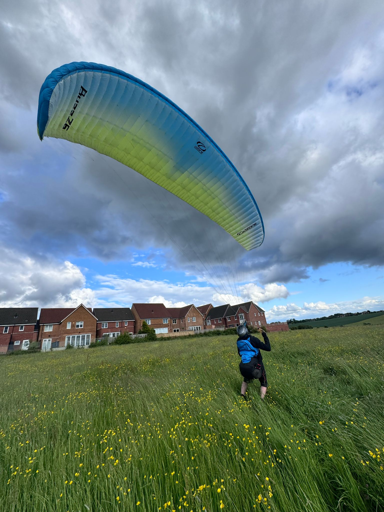
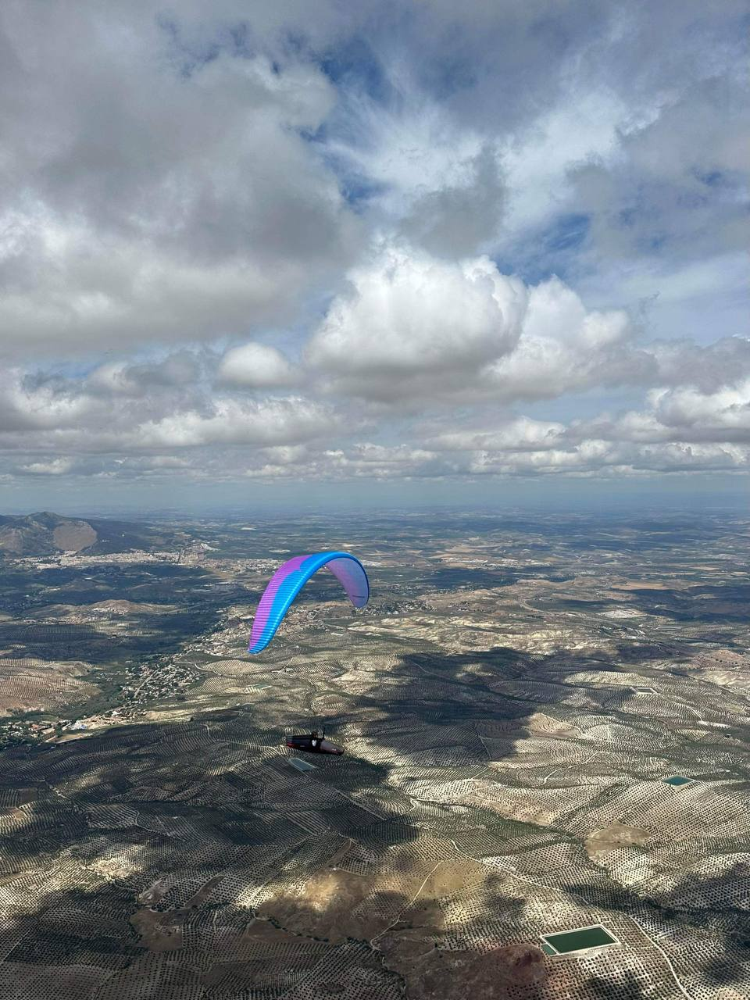

# Champagne Corks and Festivals

May came and went with the weather providing more short flying windows, including gracing Pennine Fest with a morning's flying on Parlick. Everyone's grabbing bits and pieces of flying where they can so fingers crossed for better as we move into summer.

This one was looking like a short issue and then you lot suddenly came through with some fantastic contributions. A cynic might suspect the weather's got you all bored and desperately looking for something to do! We have huge news (and exclusive pics) from the European Paragliding Championships, loads from Pennine Fest including a brilliant write-up by Fiona Dalzell, tales of the BP Cup in Sopot from John Murphy, competitions, coaching, a reminder about important site rules (and a reminder to remind *others* about those rules too) and a new Top Tips section.

Keep your videos, pics, tips, stories and shout outs coming to [editor@penninesoaringclub.org.uk](mailto:editor@penninesoaringclub.org.uk) and we'll see you again in July, hopefully for some summer XC stories.

*Cover photo: Ground handling at Pennine Fest (Chris Timson)*

---

# Shout Outs

Top billing in this month's Pennine Post goes to our own Richard Meek and Jacob Butterworth who triumphed last week at the European Paragliding Championships in Pegalajar, Spain, winning the team event as part of Team GB. Shout outs don't get much better than that!

*The Brits top the podium*

*Richard and Jacob celebrating their win*

You can catch up with all the news on the British Team Paragliding [Facebook](https://www.facebook.com/groups/britishteampara/) page, the Championships' [Instagram](https://www.instagram.com/p/C7D7StRsuAt/) page, the FIA's [results](https://civlcomps.org/event/pg-euro-2024/results) page and XC Mag's YouTube [live streams](https://www.youtube.com/@xcmag/streams).

Huge congratulations to Jacob, Richard and the rest of Team GB.

*Jacob on launch*

*Jacob airborne*

And congratulations are also due to Carl Scragg for a strong [8th place](https://www.facebook.com/photo?fbid=450053670973128&set=pcb.450054840973011) in the X-Scotia hike and fly event. While carrying a 20kg pack!

Team Pennine might not get flyable weather at home but can certainly put on a show when given the chance.

---

# Chairman’s Chunterings

*Brian Stewart, Chairman*

A massive thank you to everyone involved in Pennine Fest, whether in planning, organising or just attending to make it another success despite the weather.

Going back to the beginning of the month, there was a Sunday that dragged the great and the good of paragliding to Parlick in search of fabulous distances, RASPed by the 5* forecast. At least 40 pilots flopped around on Fairsnape and Parlick and many bombed out all over the place. This caused great hindrance to the sailplane pilots at BFGC as paragliders were searching low down, crossing the airfield and interfering with their circuit pattern.

Of course, we Pennini know the rules and wouldn’t do anything like that, so it’s important that we communicate this to any visiting pilots. To that end I am writing to the chairs of neighbouring clubs urging them to reach out to their members and remind them of the importance of reading site guides and directing them to watch the video we made with BFGC. Individually, can we all make the effort, when encountering visitors, to ask have they REALLY read the site guide: perhaps asking them if they know the high key areas for a sailplane doing a right-hand circuit landing approach, and how close that is to our landing field.

---

# Safety

# Please read. This is important.

*Barry Sayer, Safety Officer*

Does "Sharing the sky" sound familiar? If not, it should. Go to the [site guide](http://www.penninesoaringclub.org.uk/sites/parlick/) and familiarise yourself with the Parlick Hill information, paying attention to all the guidance on flying with the sailplanes from the Bowland Forest Gliding Club (BFGC).

An incident report has been submitted by the BFGC, highlighting paragliders flying in the vicinity of the landing approach circuit area and immediately above the glider winch. This is potentially dangerous for both paragliders and sailplanes. When the glider club is in operation, a clear approach to join the landing circuit is essential for sailplanes.
 
Basic observation from paraglider pilots is imperative. Indicators of sailplane activity, such as sailplanes flying or maneuvering on the ground preparing to launch and wind direction shown by the windsock, are clear visual cues of their intentions. Checking the glider field is an important part of your pre-flight/launch check.
 
We have good relations with the gliding club and demonstrating good airmanship will make our flying activities safe and enjoyable.

Carefully look at the right and left hand circuit pattern a sailplane will take, and note the close proximity to the paraglider landing field.

The Google maps image on the Parlick site guide clearly shows key areas.

This video (also in the site guide) is a very useful overview of how we can all fly safely and courteously together.



See you on a hill soon !

---

# Sites

Edenfield is open again following May's lambing closure.

---

# Coaching Corner

*Simon Baillie, Chief Coach*

It’s continued to be a really poor year for flying, at least in the Pennines, anyway. I wanted to try to do something for the Pennine Fest weekend though, so with a bit of an iffy forecast for the Saturday, I  planned for some coaching hoping that we would get a few hours in the morning and maybe some ground handing in the afternoon. Everybody met, nice and early, on the top of Parlick East and the conditions turned out much better than expected.

We had 7 CPs come along for coaching and I think almost everybody got to fly, after a group site briefing. Four or five coaches were on hand too, and there was a great opportunity for people to practice their top landings and ground handling. In the end, Parlick was flyable for quite a few hours and it didn’t start to get too windy until about 2 o’clock.

Thanks to everybody who came along for coaching, it makes a massive difference when we have so many keen, newer pilots getting involved. Thanks also to the coaches who gave up their time to help.

I’ll keep my eye on the weather for another coaching day (it’s got to get better at some point, hasn’t it?), and post on the Telegram group the next time there looks to be a good weekend. 

---

# A Grand ~~Day~~ Week Out

*John Murphy on the BP Cup in Sopot, Bulgaria*

I was lucky enough to be able to go out to Sopot in Bulgaria this year for the British Paragliding Cup. Even though I have been flying a long time this was my first foreign competition and what a great experience. The organisation was superb, being able to just think about the flying and not worry about the logistics of which site would be the best, how to get to launch and getting back after flying meant you could concentrate on the flying and the tasks.

We had 3 really good tasks, cloud base up to 9500 feet plus strong reliable thermals gave us some great, if sometimes challenging, flying. A chairlift to the main take off was a bonus, but even when we drove to another site further south it was a nice easy stroll to the take off and having trackers provided gave a nice feeling people were looking out for you. Transport was even provided to places of interest that we were able to visit on 2 of the days that the weather didn’t cooperate and an interesting, informative presentation by Gareth on competition flying
one evening.

*Looking back towards Sopot*

The camaraderie between everyone was a joy to experience, the bars and restaurants in Sopot definitely benefited from our presence. I learnt a great deal in the week, especially when it came to programming tasks into my instruments and was impressed by the way everyone was so ready to help each other. If you are looking at getting into competitions or improving your flying the BP Cup is a great way to experience proper task setting but in a friendly but still competitive arena.

For me a big thanks are due to the eagle that joined me on task 2, yet again proving how lucky we are to participate in such an exciting and rewarding sport, how many people have ever had the opportunity to glide wingtip to wingtip with these magnificent animals. Also thanks to Sky Nomads the local paragliding school for their support throughout the week, helping with transfers and accommodation in addition to the detailed briefings and excellent retrieves, the sponsors that provide the support and prizes, but most of all a massive thanks to Viv and Gareth for the huge amount of effort they put into organising and running the series.

*The view from 9,000'*

---

# Competitions

*Elliott Brown, Competitions Secretary*

### BP Cup - UK Round – Yorkshire Dales
A fair few Pennie pilots entered the competition this year, including myself and we ended up having two taskable days, over the four days for the competition.
- First day was a tricky over the back towards Leyburn from Wether Fell (23km) and with low cloud base, only one pilot got near the goal.
- Second day we went to Windbank for a triangle task (24km), which took us down to Litton for the first turn point, which grounded a lot of people (myself included), then over the back to Cragdale Moor and back down the valley towards take off. 
- Third day was going to be Whernside but due to the conditions, competition was called. Some went free flying, including a pilot who ended up in Scotland and setting a new record for the site! Even had a car following him from the ground to pick him up, what a great day flying.

The [BP Cup](https://www.bpcup.co.uk/) is a great introduction into competition flying and I know when I first did a round, I was peppering Gareth Aston with questions about how the competitions are run and the different types of tasks etc. There are two parts at the moment, a UK round and European round, somewhere a bit warmer. Drama in Greece is the destination for this year and there seem to be a few places still going… 

Pennine pilots; 
Yannick Le Gall, David McLean, John Murphy, Kieran Myles, Paul Winterbottom

### Northern Challenge Series 2024
A couple of new flights have been entered into the league but no major movements at the top. I’m really hoping to get to Longridge to fly someday and maybe try the task out.

### XContest - Pennine Soaring Club
Richard put in another big distance flight to keep himself firmly in pole position, with John adding another FAI triangle to boost his position as well. A number of new entries from pilots this year, bolstering the club scoreboard and a sprinkling of new flights into the league as well. 

### XC League

### A few Words About Comps

Coming back from the Buttermere Bash, which hosts the LCO competition each year, I had an interesting time, with some challenging (to me) conditions. I always try to think about what I might need to change or what I can do to improve, so thought I’d share a couple of things.

#### Have a backup logger
My XC Tracer Maxx decided to delete 1 year's worth of logs as I went to download my tracks, including the one I needed for that day. As well as my phone being a bit old and out of date, it decided to reboot halfway through the task so I ended up having to get the IGC logs stitched together, which wouldn’t fly in a serious competition.

#### Spend time understanding how the tasks work
I had a catch up with a competitor, who was a bit frustrated with the competition as it wasn’t flying they normally did and didn’t really like the comp's side of flying. They just needed a bit of help with the task and what some things meant and how it worked but weren't getting help, which was a shame. I didn’t notice myself but was probably busy inputting the task onto XCTrack, then prep’ing my gear. I spent the next 10/15 minutes trying to answer questions and impart what knowledge I had gained on competitions, as we drove back. 

I was lucky that I had done a couple of tasks previously on competitions, or being given a walking task to complete (thanks Brian), which helped me get used to my instrument and how competition tasks are set. I’ve also pestered a number of pilots on the hill and in the pub about this stuff, to help me understand.

If you have any questions about competitions, please feel free to reach out to me. I am nowhere near an expert and still have a lot to learn but if I can help or point you in the right direction, I will endeavour to do so.

---

# A Grand ~~Day~~ Weekend Out

*Fiona Dalzell on Pennine Fest*

It’s spring bank holiday weekend and the Pennine Flying Festival is beckoning. I am excited. I have had one UK flight since March, notable not only for the thrill of early spring thermals, but the bog masquerading as our landing field, and the admittedly esoteric Derbyshire appreciation of being able to land amidst four distinct types of poo in one place.

My expectations for the weekend are low given my relationship with rain, but my hopes remain irrationally high. At home as I tidy my van for Chipping, right on cue, black saggy heavy bottomed clouds roll in. Cold, voluminous raindrops explode on my windscreen as I strap my glider in the passenger seat. What is it with me and bad weather? I feel like I have some sort of reverse magnetic homing device in my brain, like a deviant pigeon. Storm clouds inevitably follow me around the country from job to job, pursuing me flying in the weekends, from the north of Scotland all the way to the southern coast of England. On Friday afternoon I headed off into orange storm warnings along single lane sclerotic motorways strewn with dozens of random diversions like stents in a smoker.

My glider and I finally left the tarmac hell and converged upon Chipping with an aircraft approach from the north, gliding through steep banked forests, past the camp site to stall in behind a ferocious red and green dragon ambling through the country lanes at an imperial 5 miles an hour. I have just encountered a mythical British creature from ancient times, a Burrell tractor from the 1800s, snorting angry jets of steam out a metallic nostril. The dragon will not be rushed, so I parked up and admire the magnificent, fabled beast majestically filling up the tree lined road and making a regal entrance to adoring followers at the Festival Of Steam. It’s like being entrapped by a pagan cult. Dragon entrapment turned out to be a very positive experience, as I realised that my satnav was not upside down after all and that I was driving in the completely wrong direction. Clearly magical forces are afoot as my navigation skills are normally such that I would have arrived in London before realising such an egregious error.

Two and a half hours after leaving home I finally arrived at Chipping Show ground and drove into a field of buttercups, tiny suns in the evening dampness. There was a dozen or so cars, vans, and RVs ahead of me. Some majestic vehicles like castles were parked in the centre of the surrounding small suns, and some like mine parked under trees across the moat of a track. I could see Jackie and John’s glorious palace, and my heart sang with joy at memories of wine drunk and stories told in their glorious mobile Ritz. Geoff was there, parked in the outer galaxy, in the orbit of tents with his brand-new residence. As one would expect of an engineer, it was immaculately erected, the skin taught and flawless, the guys perfectly tensioned, the atrium immaculately ordered.

When I opened my own back door, unlike Geoff’s impeccable forecourt, chaos reigned. Packing in a thunderstorm involved hurling everything in the back of the van as fast as possible, and apparently also involved leaving my tent behind, snug and dry in the living room. Nearly a hundred miles of haphazard stopping and starting just added to the general state of van entropy. But nothing a glass or three of scrumpy jack could not fix. Within minutes, the sleeping bag was out and plumped up, my mattress unrolled, the kitchen and living room set up and the bar made orderly and formally declared open.

Naturally once that was all done, I had to admire, examine and analyse all the exquisite features of my neighbour’s new tent. It was a beautiful tent, perfectly proportioned. Being a tent aficionado, and the devoted owner of a 41-year-old Macpac Minaret (a tunnel tent of legendary quality, which can double up as a spinnaker when kayaking) I felt a bit jealous of Geoff’s soon night-to-be under a canopy of stars, having just discovered but not quite recovered from the knowledge that my tent was lounging on the couch, at home, alone.

Soon the conversation drifted onto Northern Ireland politics and the drinking started in earnest as darkness fell. Just before bed there was the customary paragliding discussion about the weather forecast, which in the UK generally involves some degree of fervent prayer and appeals to weather gods. Having attended a convent girl’s school, these rituals of the Church of
Paragliding are just modern more beautiful versions of evensong whatever your denomination. I had mixed feelings about these weather conversations with Geoff. I was reluctant to mention to him my now evidence-based theory that everywhere in the UK I went, low pressure, instability and floods followed, as I feared I would become a paragliding pariah, banned because of my ability to end the worst of droughts by my very presence. But the outlook for Saturday was cautiously optimistic, so I said nothing about my rain theory. I slept in my bothy of a van, the door open so I could hear the soporific sounds of sheep bleating and later listened to rain, yet again, drumming damp fingers on my metal roof.

Morning came, a hazy mist enveloped the curved inviting shoulders of Parlick but as the sun rose higher and the buttercups suns shone stronger, two gliders could be seen in the weak morning light ridge soaring. Game on! No rain! Perhaps my theory about my inner pigeon brain needed more work after all. The gliders were staying up, and the rush to get away started to gain momentum. But there was another small problem for me, a very embarrassing personal problem. I cornered the ever-helpful Geoff and furtively whispered that I needed some directions as I could not remember how to get to Parlick from the show ground.

I did not mention that I had driven past the show ground and carried on in the direction of home, only finally stopped on the way to London by a dragon. Geoff rattled off some directions which involved left and right several times. The look of desperation on my face must have conveyed the gravity of the situation as far as my navigation skills are concerned, and he then offered to let me follow him. Not have me in his car of course, that would mean my strange electromagnetic brain field could mess up his car’s satellite navigation. For his own safety I had to keep my distance. So, my diesel van and I galloped along country lanes behind Geoff’s racehorse of a paragliding chariot. We kept up, just, to the car park, then he was off, sprinting up Parlick like an Irish hare. As my glider and I plodded up much more sedately, I watched the sky above me slowly fill with wings. That overwhelming surge of anticipatory flying hormones started off under my solar plexus and flooded my mind with an incredible electric buzz that even pigeon brains like me get high on when flying is imminent. By the time I got to take off I was having to take deep
breathes to calm myself down.

When I saw how many people there were on launch, and my inner critic launched into a full-on frontal assault. It helpfully reminded me, yet again, of that high wind launch I did years ago where I got dragged through tourists, a barbed wire fence, shredded my favourite trousers, and worst of all frightened people’s pets. Then the creature within reminded me of how little UK flying I had done in the last year, even though I had just come back from two weeks flying in South Africa. In its usual constructive manner, the critic had me recall conversations overheard from pilots who had had their days flying ruined by air ambulance call outs. My confidence entered a parachutal stall, something I had certainly never been able to achieve on any SIV course! So, I dithered around, watched a few others launch, saw some dodgy, slightly indecorous departures, and assumed I would naturally do even worse. Then I just could not stop imagining myself being the one to ruin for everyone the first decent day flying for what seemed like a millennium. The Epsilon lay quietly, still folded within his sleeping bag, oblivious to my inner turmoil.
Jackie was setting up. Her wing periodically writhing as swirls of thermic tentacles broke off on the hill clutching at laid out wings. I stalled again. Mr Epsilon stayed in his bag. I got a hill briefing from a charming man in a skull and cross bones face mask. My inner critic was momentarily silent while my navigationally challenged brain tried to figure out north from south, huge logistical challenge for someone from Down Under (or Up Over as we kiwis prefer to see things) and how to disarm disgruntled presumably gunned-up game keepers, should the need arise.

The wind had picked up, so I was back to ground zero in confidence, but Jackie, another light weight like me, managed a very elegant launch with a chap called Phil acting as a metaphorical arrestor wire. Tall and thin he looked like the perfect arrestor wire. Definitely strong enough to stop a high-speed jet-propelled aircraft like me. I put Phil in my cross hairs and aimed him up. Being clearly of a chivalrous nature, he refused to leave his post as supporter of all pilots and talked me past the doubt in my head. Knowing I now had an aircraft carrier behind me to catch me filled me with good cheer. My first launch was drag free, and mercifully there was no involvement with barbed wire at all. Hovering it aloft, feeling for lift, I saw everyone coming my way as take-off started working again. In a nanosecond it seemed I was a reluctant participant in a galactic civil war complete with a swarm of incoming human podracers. I dropped my wing smartly thinking discretion being the better part of valour in the crowded sky, but then Phil pointed out Jackie skying out in solitary splendour over in the bowl. Not content to be an arrestor wire, Phil then multitasked as a wing butler, expertly rearranging my wingtips as deftly as a mixologist at the Ritz can fold a cocktail napkin. Now neatly dressed I seized my launch window, weaving between podracers before safely making it to the next universe. The relief of finding myself unscathed in the pod free bowl was swiftly followed by the incomparable joy of finding my own private thermal. No greater love for a club coach can there be than that felt by a pilot thrown off the hill at exactly the right time, directly into the arms of a big cuddly welcoming thermal.

From extreme doubt to ecstasy in just three turns. If only all of life was so easily transformed by the right amount of weight shift. Entering that hyperspace where time ceases to exist, where all the problems of earth-bound life dissolve and the earth drifts away below your feet, I just allowed the magic to wash over me and imagined I had been reincarnated as a kea, New Zealand’s beloved alpine parrot, the guardian of our mountains. I also made a mental note to ask Phil at my debrief if I really look just like a baby rhino having a dump while I lumbered around launch trying to run off the hill.

Much as I love rhinos, I now legitimately harbour these baby rhino fears after my GoPro fell off my flight deck on a nil wind day. I was forced to alpine launch after some failed running reverse launches in 30 degrees heat. The GoPro continued to record all subsequent efforts and finally the flight. The soundtrack accompanying the hour-long video of my upper inner thigh sounds just like a David Attenborough commentary on rhino family life as I grunted, swore and thundered my way across a savannah sounding like an armoured tank on military exercises.

Rhinos aside, back on Parlick, after the initial rush of transitioning to a flying being, when my mind was once again capable of vaguely rational thought, I boated around euphorically, but eventually started to notice the SAS elite podracers, those with their rank and serial number emblazoned upon their aircraft, were slowly getting slower and slower when pushing forward, and eventually when they were down to walking pace above me I decided to go into land. Then just one more thermal and I decided to try not to land.

Not once, but twice. I know, Reader, I know.

It was wrong but you and I both fully understand the irresistible allure of a sweetly singing vario. But I did heed my pirate wearing the skull and cross bones. I made it round the corner and back up above launch once, but not quite the second time. Sensible in retrospect is better than never sensible at all. I elected to land on the shoulder before I got behind the trees and risked an illicit encounter with rotor and killed myself. Or worse, risking landing short of the official landing field and suffering an explicit encounter with the possibly weaponised gamekeeper which might jeopardise our flying rights and damage good relations with the landowners around Parlick.

The shoulder it was. Touchdown, deflation, mushrooming and I had to just lie down. I unbuckled, took off my helmet and lay in the grass, letting all those insane surreal feelings of excitement and pleasure dissipate before I could think straight, return to the world of humans, and even ruffle the feathers of my precious wing. Gentle sheep ambled over to inspect my glider and snuffle around my pockets looking for sandwiches. Sheep are so polite in the Pennines. Back home they would have mugged me. By the time I had packed up and walked back up, “just in case” (you know how it is when others are still flying, even if it is glaringly obvious you yourself should not be!) it was way too strong for me to launch. But the next best thing of course if you cannot do it, is talking about it. So walked down with some new pilot friends, talking about our great day flying.

Later, over beer, at my debrief, Phil said, with total sincerity I do truly believe, that I did not look at all like a baby rhino having a dump when I launched. So even though the rest of the weekend was washed out, that one day, that one perfect launch, was completely worth it.

Thanks to everyone who made for such a great day!

---

# The Gallery





---

# Top Tips

This children's [parachute toy](https://www.ebay.co.uk/itm/266090725944?mkcid=16&mkevt=1&mkrid=711-127632-2357-0&ssspo=ZCOBoa2sR_K&sssrc=4429486&ssuid=pJwNnRrSR4a&var=&widget_ver=artemis&media=MORE) makes a cracking paraglider stuff sack for only £12.95!

Thanks for the tip go to Jim Ashley, via Brian, via Brian's wife Marie's original idea. (These things are complicated).

---

# Dates For Your Diary

### 21st - 23rd June, Lakes Charity Classic

---

# Your Newsletter Needs You

Appear in next month's newsletter! We need submissions for...

**A Grand Day Out**  
2-3 paragraphs describing a fun day. You're welcome to write more if you're feeling creative but a couple of paragraphs is plenty. Could be epic, could be daft, could be simply the first time you flew for six months. If you've had a good day and you took some pictures, send it in.

**Why Not Visit...**  
A quick guide to a site that you like, at home or abroad. Tell us where it is, what it's like to fly, any watch-outs and how to contact the locals. Attach a photo and email it over.

**The Gallery**  
Send in any recent(ish) shots with when and where they were taken. Spectacular, silly, from the ground or from the air, it doesn't matter. Let's see what you've been up to. Videos are very welcome too but pop them on YouTube or Vimeo and send a link for the newsletter.

**Shout Outs**  
First ever XC? Smashed a PB? Took part in a comp? Let us know and get a shout out in the newsletter. Nominate your mates if they won't do it themselves.

**Top Tips**  
Spotted a bargain? Got a great travel tip? Know how to make Bluetooth connections work on an iPhone? Share your best ideas.

Send submissions on these or anything else you'd like to see featured to [editor@penninesoaringclub.org.uk](mailto:editor@penninesoaringclub.org.uk). You can also drop them over using the [web form](https://docs.google.com/forms/d/e/1FAIpQLSd3NJQKlmLjjlh-nZGQKaeXzN6dSSL2PHzKRXFYAy_Bw7SC9w/viewform?usp=sf_link) or message [Neil](https://t.me/NeilCharles) on Telegram.

--- 

Fly safe, see you in July.