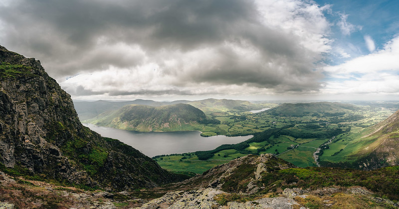
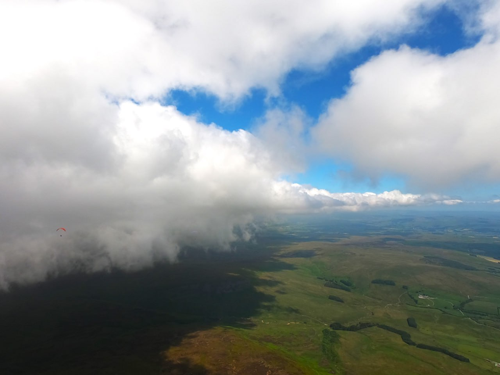

# Come back summer, we weren't finished yet

It's been a poor summer so far for flying, with too much wind and rain for us to get much play time. Pilots have been rewarded for late trips to Parlick when the wind dies down though, including last Friday and Sunday, which as long as you were OK with a slightly breezy launch from below the wall were really beautiful evenings.

We've got some cracking photos of the LCC from John Oliver this month, spectacular XC pics from Brian, an important note about Winter Hill and tips on thermalling etiquette from our safety officer. The conditions have been putting a dampener on weekend XC possibilities for a lot of us and I seem to write 'fingers crossed for better weather' in every issue, so, erm, fingers crossed for better weather. Yep, that'll sort it.

If you manage to get out on a hill, and especially if you arrive and it's actually flyable(!) then make sure you send your videos, pics, tips, stories and shout outs to [editor@penninesoaringclub.org.uk](mailto:editor@penninesoaringclub.org.uk).

*Cover photo: Graham Jones last Sunday evening at Parlick (Neil Charles)*

---

# Chairman’s Chunterings

*Brian Stewart, Chairman*

"I'm not feeling it today"; "I'm not fancying it"; "I'm going to wait a bit".

We've all been there, landing early, or not launching, or ignoring the goal you set. Some days are like that, a little voice in our heads sowing seeds of doubt about the weather, the wind, the clouds, the other pilots... the list is endless. Sometimes the cause is internal, stress from that project deadline coming up, the DIY not done, the anniversary present you can't find. I'm not talking about the IMSAFE list (Illness, Medication, Stress, Alcohol, Fatigue, Eating or Emotion), all or any of these should make you stop and change your plans about flying.

At the LCC I wasn't competing, just along for the ride with the A comp. I didn't get far, opting out of going over the back after tagging the Helvellyn turnpoint and landing at Thirlspot. Thinking about it afterwards I concluded that I had run out of bandwidth to process all the data flooding into my brain: Being in the lakes, with a marginal wind forecast, cloudbase 'lower than we'd like'. Warnings about where not to fly, the turbulence hotspots, where not to land. The wind picking up on take off, the prospect of 80 odd pilots in the air, then the air itself, spicy! I kept away from the summits, and found that there was a lifty line down the middle of the valley, very lifty - clouds getting in the way.

Ultimately, too much to process, and not enough headspace be able to think objectively. I had no intention of heading to goal at Appleby, but I think the added pressure of a goal wouldn't have helped.

We all have our own bandwidth limit, it probably varies from day to day, but it's worth being aware of the insidious effects of becoming overloaded. Better to listen to your inner voice.

Brian's also in [July's Skywings](https://skywings.bhpa.co.uk/2407_Jul_2024_Skywings/index.html#page=1) Airmail page talking about the problems we had recently with pilots flying too close to Bowland Gliding Club.

---

# Sites

*Andy Archer, Sites Officer*

Winter Hill Transmitter Mast is now a construction site and under the control of a contractor, this is due to replacement of the stay lines that are supporting the structure. The contractor will be managing the site from now until the 3rd of October 2024 and there will be some periods of significantly reduced access when the new stays are being lifted over and alongside the site access road, the work will also include weekend work.

During working hours the gates on site will be locked and set to a code held by the contractor, out of hours (from 6pm – 8am) the code for the gates will be set to the same code as the Winter Hill barrier at the bottom of the hill.

The site manager's contact details will be displayed on the gate however he is very unlikely to give access during normal working hours without a permit to work or legitimate cause to drive further up the hill to reach the other masts. 

**As such can I ask for this period, that members avoid using the access track to Winter Hill? Instead please park in the [car park](https://maps.app.goo.gl/FDkwkiKyyyWwwcXPA) on Rivington Road and walk up the front face of the hill to take off.**

Arqiva the mast operators apologise for the inconvenience caused.

---

# Photo Diary

*John Oliver at the Lakes Charity Classic*

LCC early Friday morning, I arrived early as I fancied a bit of street style photography of the X-Lakes guys before they set off. I wanted to be around the nervous excitement that’s quite unique to Hike and fly. But  just ending up chatting to people. Bud was taking tactics and weather at double speed, others unsure about routes.

The XC comp brief was “Its windy today, but fancy a walking task?” That had a good up take.

After being reminded of my X-Lakes comp from a few year ago, i was in the mood for a mini epic of my own. So i scrambled up Grassmoor.

Saturday came good. The Thirlmere valley was full of gliders by the time I was in the air. Exactly why I love comps, people marking the good and not so good spots all along it.

The B-Comp had a task up and down. The A-Comp was up then to the west, plus a mix of X-Lakers setting up on Helvellyn, therefore people you were with not necessarily on the same mission as you. No gaggles formed but seeing the lakes full of gliders was fantastic.

---

# Safety

*Barry Sayer, Safety Officer*

Chasing flyable weather needs to become a UK recognised sport, and I’m positive the PSC pilots would be champs! 

Busy hills on a good flying day require good airmanship. Keeping a good look out whilst airborne, avoiding potential collisions and communicating with your fellow pilots is essential. Use your walkie-talkie, it really is bulletproof for letting your mates know, "I'm joining you in that thermal"... "I'm just  behind you" etc.

Watching the LCC (Lakes Charity Classic) coaching group flying Latrigg in Cumbria demonstrated excellent radio communication, with ground reports of increasing wind speed and such. This made a very successful coaching day for the low air time pilots. An unfortunate tree landing by one pilot on the landing approach was quickly reported back over the radio that they were ok and not injured.

Two of our PSC members encountered a 'paragliding incident/accident' on the Cumbria coast. Thankfully only minor injuries and we wish them a speedy recovery. The weather briefing that morning organised by the CSC halted the competition tasks due to considerably strong wind inland, so pilots headed for the coast. All forecasting that day had 'don't fly' screaming out at me, so I opted to go for a hike instead.

### Thermalling Direction.

Borrowed from [Flybubble](https://flybubble.com/).

Join the thermal in the same direction as other pilots who may already be established in a decent climb, slow down or speed up so that you enter the thermal following one of the pilots. This will help you to synchronise, and also gives you the best visual clues on the position of the best lift.

Keep your first turn wide, so you’re outside of or following the traffic. As you get established in the pattern, you can narrow your turn and tighten on the core, but only if the pilots at the same level have the same idea.

If the traffic at your level is getting too much, don’t leave the thermal, just widen your turn. This will put you in the weaker lift (or possibly, sink) and allow the gaggle to pass you. As soon as they are past, tighten your turn again and keep thermalling.

#### Traffic Rules: Thermalers vs Soarers

##### Who Has Right Of Way?
When soaring a hang-glider or paraglider, there is a simple rule that dictates the traffic flow – follow the ridge with the slope close on your right, return with the slope farther away to your left. This adheres to the international standard: when approaching an aircraft, avoid a collision by turning to pass on the right.

  
*Diagram 1: Normal soaring pattern.*

When someone begins thermalling right, close to the ridge, there are two rules that point against them: the pilot to the right has right of way, and the one with the ridge to his right has right of way.

  
*Diagram 2: Sudden thermal turn causes chaos.*

Swinging onto the ridge and scattering the flock (as the red pilot does) is very dangerous. Yet it happens because some pilots believe they have a right to thermal.

Where does this belief come from?

It comes from a conflicting rule: pilots joining a thermal must do so in the same direction as the established thermalling traffic. So a thermalling pilot does not expect anyone to fly into the space downwind of him.

A conflict in the rules is a precursor to an accident, so take note: this is a potentially dangerous situation! Let’s think this through.

What is an established thermal? I’d suggest it requires more than one full 360 degree turn. This gives other pilots enough time to perceive the pattern. If you cannot complete a full 360 degree turn in clear air, then do not begin to thermal. If you are at the same height as the ridge soaring traffic, you’ll do just as well in a steady soaring beat.

The last thing an inexperienced soaring pilot needs is a pilot swinging in at high speed from the side (surprise!) forcing an awful choice of banking right and spanking into the ridge or flying left into the middle of turning traffic. In crowded marginal conditions, it’s best to avoid thermalling near the ridge and let the simpler pattern of ridge soaring traffic establish itself.

But let’s assume the situation is happening already. What should you do? Adopt a defensive flying strategy:

  
*Diagram 3: thermalling pilots drift onto ridge.*

#### Soaring Pilot

If you’re approaching circling pilots, you should alter your soaring path to feed into the direction of flow, which might mean veering off the ridge (left in Diagram 3). This assumes an established thermal that has drifted onto the ridge, so you’ve had some time to notice the circling pilots. The established pattern means it’s unlikely there is any return traffic blocking this move out. If you choose to bypass this thermal, the left side is the best side to bypass it on. By looking ahead, you have put yourself in the best position, where you have the most options. Don’t fly straight along the ridge, downwind of the circling gliders, in the narrowing gap between ridge and thermal.

In Diagram 2 (solid green), a hard 90 degree left turn will still get you out of trouble, so it’s a skill you should practice, but you shouldn’t be forced to do this. That’s reactive flying, and isn’t nearly as smart.

If you’re thinking far ahead and can identify the thermalers early enough, you can turn around to avoid it altogether – simple!

#### Thermalling Pilot

It takes time and experience to be able to thermal, particularly close to the ridge, so you’re more likely to be the senior pilot, and should fly in a way that harmonises with the juniors nearby. At the outlined red position in Diagram 2, check your blind spot for traffic that would be compromised by your turn. At the solid red position, abandon your dangerous right turn, and instead veer left and slot into a ridge soaring lane.

In the established thermal of Diagram 3, as the thermalling pilot you must be very cautious as the thermal drifts into the soaring lanes. Remember, there is no clear right of way, there is a conflict of rules and you’re drifting into it.

If in doubt, return to the thermal at a better moment, search further along the ridge or push further upwind before attempting to thermal. Regardless of how you interpret the rules, it’s the duty of every pilot to fly in a manner that avoids a collision.

See you on a hill soon,

Barry

---

# The Gallery



---

# A Grand Day Out

*Brian Stewart - Playing with the Big Boys*

Monday 24th June, light southerly forecast, where else but Fairsnape? Usual suspects already there, and a posse of top guns on Parlick South. As usual the first bits of lift dribbled up the face, meanwhile the sky gods weren't doing any better. I remember similar conditions many times, when it suddenly switches on, then it's all over minutes later. The first strong climb didn't feel right so I went back, wondering if that was it for the day. Next thermal was better, and I climbed to nearly 2500', still not convinced, then realised that there was a squadron of Zenos homing in on me. Gulp!

  
*On our way, Stocks reservoir in the distance*

All 4 started circling under me, so that made my decision for me. With Richard Meek and Chris Fountain for company (not sure who the others were, or how they got on) cloudbase was the next stage. Lots of cloud downwind, and I'd assumed Hawes would be a good target, following the rasp wind prediction, but that way was blocked by the cloud, with some ominous big blocks of cloud hanging down from the main base, presumably a sea breeze/convergence effect. I opted to skirt along the edge of the cloud sheet, and so did Richard and Chris. Great fun nibbling in and out of the lift under the clouds, spectacular scenery with big steps and roofs in the edges, climbing up the sides to the edges, playing in the wispies.

  
*Chasing Richard*

  
*Threading the needle with Richard and Chris*

Stocks reservoir came and went, Settle appeared and I was still with the Zenos. Here the sky became much better, cloudbase went up to well over 4000' and those ugly convergence bulges disappeared.

  
*Approaching Settle, in the lead!*

I took an extra turn in a climb past Malham Tarn, and was surprised how far behind Richard that put me, as he headed for Windbank and found a climb. He was faster and by the time I got there the thermal wasn't. I pushed over to Buckden Pike, but my concentration wasn't up to linking together the weak bubbles of lift, and I was soon down in a field by the road for a 50 km flight

  
*Last sight of Richard - I shouldn't have taken that extra turn...*

A big van stopped by the gate, and I heard a woman's voice shouting at me. Ears not clear, I thought I was getting a bollocking for landing in her field, but she was only concerned about my safety, and asked if I wanted a lift. So while I packed up she effectively caused a traffic jam on the little road, ignoring all the gestures and hoots from the cars.

She took me all the way to Skipton bus station, where the Clitheroe bus was just pulling in. Bus pass accepted, sat with noisy schoolkids, 55 minutes to Clitheroe, where Geoff Dawson was waiting in his car. A pint at Eddisford Bridge finished off a perfect day, and home in time to share dinner with Marie. I know Richard and Chris went much further, but that's the game they're in. I'm happy playing my own games, especially when the big boys come along to show how it's done.

---

# Shout Outs

Congratulations to Sean Mercer and Matt Haywood on passing their Pilot exams!

---

# Competitions

*Elliott Brown, Competitions Secretary*

Only a short catch up from me, busy flying in Slovenia and not given myself enough time to see what’s been going on in the UK!

### Northern Challenge Series 2024
Another completed challenge, the Windbank cat cradle, with a smattering with more being attempted. 

### XContest - Pennine Soaring Club
A bit of movement in the top five, looks like the LCC got some great flights in from Heron Pike. Same take off as last year, but the pilots managed to get much further away from Grasmere than last year. Great stuff! Keep the awesome flights coming.

### XC League
Loads of new pilots appearing on the Pennine League this month, looks like the sites are getting a decent look in. Top 10 are nicely filing in their top 6 flights, I really need to get some more flying done on Pennine sites.

---

# Coaching Corner

*Simon Baillie, Chief Coach*

Well, the weather still hasn’t got much better. Apart from a couple of reasonable days for the Lakes Charity Classic, it’s been pretty pants, so there hasn’t been much on the hill coaching happening.

I’m still watching the weather for another coaching day, so keep checking the coaching Telegram group for updates. The next time there looks to be a good weekend I’ll try to do something.

---

# You Might Have Missed

French paraglider pilot Basile has built a [wonderful 'Comparaglider' tool](https://comparaglider.com/) for comparing paraglider performance stats.

The tool extracts long glides from thousands of public tracklogs and averages them to get performance stats: speed, sink rate and glide ratio. Care is needed not to read too much into individual glider performance stats and there are obviously caveats around the data, but if you want an indication of how much better newer wings perform than older ones, or high B's vs. A's (and of course to look up your own glider and forget all the caveats) then it's fabulous.

---

# Your Newsletter Needs You

Appear in next month's newsletter! We need submissions for...

**A Grand Day Out**  
2-3 paragraphs describing a fun day. You're welcome to write more if you're feeling creative but a couple of paragraphs is plenty. Could be epic, could be daft, could be simply the first time you flew for six months. If you've had a good day and you took some pictures, send it in.

**Why Not Visit...**  
A quick guide to a site that you like, at home or abroad. Tell us where it is, what it's like to fly, any watch-outs and how to contact the locals. Attach a photo and email it over.

**The Gallery**  
Send in any recent(ish) shots with when and where they were taken. Spectacular, silly, from the ground or from the air, it doesn't matter. Let's see what you've been up to. Videos are very welcome too but pop them on YouTube or Vimeo and send a link for the newsletter.

**Shout Outs**  
First ever XC? Smashed a PB? Took part in a comp? Let us know and get a shout out in the newsletter. Nominate your mates if they won't do it themselves.

**Top Tips**  
Spotted a bargain? Got a great travel tip? Know how to make Bluetooth connections work on an iPhone? Share your best ideas.

Send submissions on these or anything else you'd like to see featured to [editor@penninesoaringclub.org.uk](mailto:editor@penninesoaringclub.org.uk). You can also drop them over using the [web form](https://docs.google.com/forms/d/e/1FAIpQLSd3NJQKlmLjjlh-nZGQKaeXzN6dSSL2PHzKRXFYAy_Bw7SC9w/viewform?usp=sf_link) or message [Neil](https://t.me/NeilCharles) on Telegram.

--- 

Fly safe, see you in August.