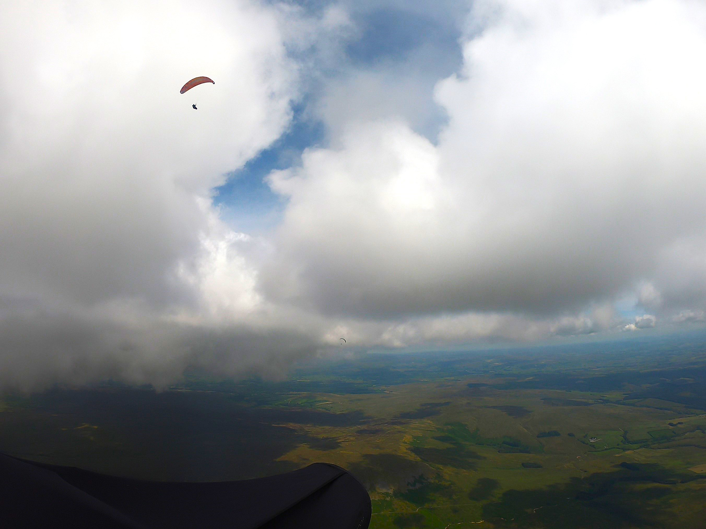

# Cloudbase is just a thermal away

You wait around for ages and then all the flying comes at once. Except for your newsletter editor who went to the windy Westcountry for a fortnight's family holiday. Never mind.

We've got a photo bonanza this month. More XC tales from Brian, a fabulous photo diary of comp flying in Slovenia from Elliott and the gallery is stuffed with goodies too, including epic views of the Alps from Chris and Sean and even one or two snaps from Parlick.

There are some great tips on getting away on XC from Simon and John in Coaching Corner and make sure you read the Sites section for a couple of important notes too.

Keep up the flying, keep taking photos and keep sending them to [editor@penninesoaringclub.org.uk](mailto:editor@penninesoaringclub.org.uk) when you do!

  
*Cover photo: Ed Knowles on a chase cam flying Parlick at sunset*

---

# Sites

*Andy Archer, Sites Officer*

### Pendle

We have been informed about an accident that occurred on Pendle Hill on Sunday 11th August 2024.  There are limited details regarding the circumstances of the incident or the condition of the injured pilot, but wish him a speedy recovery. 

We are unsure whether the injured pilot was a PSC member or a visiting pilot.  If anyone does have further information please let our Safety Officer Barry know by email safety@penninesoaringclub.org.uk.  There may be safety learning points that other members or visitors could benefit from.

As Sites Officer can I remind members that we have been asked not to fly the east side of Pendle Hill, this is at the request of the landowner.  Use of the east face could jeopardise our continued use of the NW face of the hill.

Can all members and visiting pilots please familiarise themselves with the [sites guide](http://www.penninesoaringclub.org.uk/sites/pendle/) for Pendle and any other of the PSC sites? 

### Winter Hill

Winter Hill Transmitter Mast is now a construction site and under the control of a contractor, this is due to replacement of the stay lines that are supporting the structure. The contractor will be managing the site from now until the 3rd of October 2024 and there will be some periods of significantly reduced access when the new stays are being lifted over and alongside the site access road, the work will also include weekend work.

During working hours the gates on site will be locked and set to a code held by the contractor, out of hours (from 6pm – 8am) the code for the gates will be set to the same code as the Winter Hill barrier at the bottom of the hill.

The site manager's contact details will be displayed on the gate however he is very unlikely to give access during normal working hours without a permit to work or legitimate cause to drive further up the hill to reach the other masts. 

**As such can I ask for this period, that members avoid using the access track to Winter Hill? Instead please park in the [car park](https://maps.app.goo.gl/FDkwkiKyyyWwwcXPA) on Rivington Road and walk up the front face of the hill to take off.**

Arqiva the mast operators apologise for the inconvenience caused.

---

# Photo Diary

*Elliott Brown at the British Sport Trophy in Slovenia*

[Slovenia - British Sport Trophy](https://airtribune.com/bst2024/results)

Scott O’Neil and I went competing in Slovenia. Weather wasn’t playing ball the first couple of days, but then it came good.

First day after I arrived, before the comp. Scott and I tried to get to Italy, but the border was closed to us (low clouds on the ridge), but we had a great flight.

### Day 4 - Task 1:

[Task Play Back](https://ogoy.app/player?scene=public-wfbdr87u4163h2bobkla)

Headed to Lijak, as that would give us the best options for flying, while we had weather at Tolmin.

Steep take off and tree covered ridge to start gaining height. Big gaggles drifting not very high over trees, not the most comfortable flying for me. Decided to just try and get high and race through.

Cloud in my way over TP2, not used to being this high.

Got low taking the direct route to TP3 and passing through thermals. This church (I was praying to it!) saved me, not many options below.

Angry sky and rain in the next valley (foreshadowing…)

Should have called level 3 over the radio, but the task was stopped as I was heading back to goal and I got wet.

Task was stopped and not cancelled, so we scored points. From when it was stopped, all pilots were given a 4:1 glide. So, if you were high when it was stopped, you get more points. Cancelled = no points.

### Day 5 - Task 2:

[Task Play Back](https://ogoy.app/player?scene=public-yn4eydkvm96uad0m8u9c)

Flying in Tolmin, weather vastly improved.

Gaggle flying is fun.

Start times are really important, I should have realised that I was jumping the gun.

Epic views.

Heading back from TP1 I made a friend.

It looks miles away, but I was thermalling with my buddy. Just an amazing bit of the flight. (Last time I tried to film with an eagle, I fell out of the thermal and shortly landed on the last day of comp).

Struggle my way back towards TP2, without getting a climb, risked the Kozlov Rob to get a thermal, but got rained on for a bit instead.

Took a risk and got to the other side of the valley to scratch up the face, but left early to get the TP (mistake). Nothing to be had on the way back, landed at goal, a couple of turnpoints early.

### Day 6 - Task 3 

[Task Play Back](https://ogoy.app/player?scene=public-wtu76ac8zuaxdeq06yq5)

Epic day to be had:

More gaggle flying.

Wanted to start in the lead, so got too keen and didn’t have the right height, but was at the front.

To the mountains!

This had to be some of the coolest flying terrain I’ve ever been in.

More big mountains.

Having a play near the hut (someone please look up, I need attention).

Bovec in the next valley.

Turn point 5 and looking into Bovec, had a lot of Photons coming at me when heading towards this TP!

Got really high and decided to nip over the back and into the valley that would be a horrendous to land in or get a retrieve from

I spent most of this flight giggling at the pilot in front of me, who had the name Suboptimus Prime, everytime I looked at XCTrack.

This is the only thing that I wanted to get out of the trip.

Got to goal!

What a welcome.

---

# Coaching Corner

*Simon Baillie, Chief Coach*

Well, the weather’s got a little better, but it still seems to just be the odd window here and there. I’ve been conscious that we haven’t managed many formal coaching days this year, so I’ve been constantly watching the weather for any decent looking weekends.

Sunday 28th July started to look promising on the forecasts, with light winds predicted. RASP was giving 4/5 stars so it looked likely to be very thermic, and possibly a cross country day. A few pilots have been asking me about thermal and XC coaching, so I thought that this might be a good opportunity to help some of these more experienced CPs.

We met on the top of Parlick and I had considered the possibility of walking over to Fairsnape, as a lot of others had. In the end, with the conditions and group we had, we decided to stay on Parlick. 

Just a note on my own thoughts on walking over to Fairsnape: I am always very cautious if there is wind (i.e. enough to ground handle or soar) and it’s not SW or WSW. It can be very rough if the wind is off to the south or SSE.

It turned out to be much lighter winds than forecast, with very few thermals coming through, either. We had a weather briefing and discussed thermalling and XC theory, and then everybody got some ground handling in while waiting for the elusive thermals. In the end, it was a very tricky day, with few useable thermals coming through on Parlick, but everybody managed to do some ground handling and at least one short flight. Although the conditions were very frustrating, I think it was a positive day and I’d like to thank everybody who came along.

As ever, I’ll keep watching the weather for another coaching day, so keep checking the coaching Telegram group for updates.

I’m also hoping to get permission for somewhere we can use for a ground handling specific coaching session. If I can organise it soon enough, I might try to do it one evening, with a debrief in the pub. Again, I’ll post any updates on this in the Telegram group.

  
*Photos: Pete Phillips*

*John Murphy writes...*

After the last coaching day on Parlick there was a request for feedback on the conditions that we experienced that day. In summary, it was tricky.

As there wasn't enough wind to soar the only way to get up and stay up was to find a thermal. That can be tricky as you may have worked out that thermals are invisible. We therefore need clues to help us find them. 

Some of the clues that can help us are:
- Other gliders, especially other paragliders
- Birds, seagulls circling tend to be the best but kestrels hovering and swifts chasing insects can also help
- Grasses waving
- A laid out glider rolling towards you, this can show that a thermal out front is pulling air towards it.
- The clouds, on a good day you can see them building as they move towards you.
- The wind on the hill as the thermal pulls through. Note that to get the best of the thermal you normally have to launch at the start of the breeze, once it is strong it is usually too late as the thermal by now is behind the hill. It is worth taking note of the interval between the thermal gusts as it gives an indication as to how regular they are and when to expect the next one.

Parlick south can be very tricky on these low wind days as the thermals tend to break away part way up the slope at the shelf so often you don't even feel the gusts which is one of the reasons that many of us will walk over to Fairsnape on light wind days. The bowl in the corner also tends to collect the thermals better, especially if the wind is south west to west. One word of warning though – it can get very windy quickly, especially in the bowl, and thermals can be strong. On this day my initial climb out was peaking at over 4m/s.

To benefit from any, or all of the clues to where the thermal may be there is one other thing, you have to be prepared to go down. Often it is possible to slope land if you have caught a bit of lift then lost it, this can be a fast landing as it is sometimes difficult to know which way is into wind so be careful.

The other thing you need is to be able to thermal and this needs practise. On these nice gentle evening flights it is good to try and practise using any thermals that you find to try and improve this skill. Care is needed though, make sure you look before you start to turn to avoid conflict with people ridge soaring and if you are going to join someone circling, feed in from outside their circle. Also be aware that if you are turning in a thermal it does not give you right of way over other people so if someone is flying towards you be ready to leave the thermal if needed to avoid a collision!

For the few of us that did manage to get away that day gave some interesting conditions. When I got up to cloudbase there was a very marked convergence line following the Lune valley all the way down towards Settle. Five of us ended up flying along the clouds that were on the south side of the line, ending up landing at or near Austwick. We then managed a good retrieve by sharing the cost of a taxi back to Chipping, a great day for us and hopefully everyone else enjoyed the day.

---

# The Gallery



---

# A Grand Day Out

*Brian Stewart - Same street, different day...*

Another light wind day on Fairsnape, another (im)patient wait for something to kick off. Murf & John O were first into it, JM taking a speculative punt towards Paddy’s Pole and finding some screeching gulls to mark the climb.

John O pushed forward finding good lift out towards Beacon Fell. Murf had been gone a while before the next (and final?) cycle came through and a few of us made hard work of the initial climb before Jim, Scott, Nobby and Graham joined me over the back.

Jim was off like a greyhound, and chasing him I could see that the convergence line was identical to the one I wrote about last month. It was good to use this to mark the lift, and great to do this in company, sharing info on the radio (last week Richard M and Chris F were on a different frequency) – gaggle flying is so much more efficient.

We each took turns at skying out and gully grovelling. Inevitably the A65 proved to be an effective barrier, which was so frustrating as the sky looked great again in the Dales. I felt like we knew everyone in the village as we bumped into first Kerim, of Nova fame, then Steve Newiss as we left the field. Best bit was finding a 7-seater taxi just over the road, which made for a nice easy retrieve. Another grand day out for the Pennini.

---

# Competitions

*Elliott Brown, Competitions Secretary*

### Northern Challenge Series 2024

Things are certainly hotting up for the NCS, with Jacob having another crack at Far Whitestones and Brigsteer (I’ve heard it’s a lovely thermic site), smashing his previous highest scores on both sites. Paul added Blease to his score, but not enough to keep the top score (although there is a EN B wing and below trophy to be had).

### XContest - Pennine Soaring Club

XC from Parlick had a good ol’ gaggle going (power in the gaggle), I was on Windbank (don’t leave the thermal for another one that might be there!)

### XC League

John stormed into 1st place from 5th, with a good number of turn point flights and a big FAI triangle.

---

# You Might Have Missed

This newly released video of in-development paragliding simulator 'Glide' looks pretty spectacular! You can back the project on [Patreon](https://www.patreon.com/user?u=134014134).



---

# Your Newsletter Needs You

Appear in next month's newsletter! We need submissions for...

**A Grand Day Out**  
2-3 paragraphs describing a fun day. You're welcome to write more if you're feeling creative but a couple of paragraphs is plenty. Could be epic, could be daft, could be simply the first time you flew for six months. If you've had a good day and you took some pictures, send it in.

**Why Not Visit...**  
A quick guide to a site that you like, at home or abroad. Tell us where it is, what it's like to fly, any watch-outs and how to contact the locals. Attach a photo and email it over.

**The Gallery**  
Send in any recent(ish) shots with when and where they were taken. Spectacular, silly, from the ground or from the air, it doesn't matter. Let's see what you've been up to. Videos are very welcome too but pop them on YouTube or Vimeo and send a link for the newsletter.

**Shout Outs**  
First ever XC? Smashed a PB? Took part in a comp? Let us know and get a shout out in the newsletter. Nominate your mates if they won't do it themselves.

**Top Tips**  
Spotted a bargain? Got a great travel tip? Know how to make Bluetooth connections work on an iPhone? Share your best ideas.

Send submissions on these or anything else you'd like to see featured to [editor@penninesoaringclub.org.uk](mailto:editor@penninesoaringclub.org.uk). You can also drop them over using the [web form](https://docs.google.com/forms/d/e/1FAIpQLSd3NJQKlmLjjlh-nZGQKaeXzN6dSSL2PHzKRXFYAy_Bw7SC9w/viewform?usp=sf_link) or message [Neil](https://t.me/NeilCharles) on Telegram.

--- 

Fly safe, see you in September.