# Last of the summer flying

Suddenly it feels like Autumn. There are still a few XC's being flown but the leaves are starting to turn and this will be the last regular monthly newsletter until next season. We'll drop to just a couple of issues through the winter and hope to pack them full of frosty flying pics before it's spring thermal warnings time all over again.

Thanks as always for your contributions. We've got tales of flying in France from Chris and Doug, advice from Brian on how to cope with flyable days when you can't get out to fly, plus a top notch gallery. Cover picture was a tough choice this month!

Grab the best of the late season thermals and then tell us all about it by mailing [editor@penninesoaringclub.org.uk](mailto:editor@penninesoaringclub.org.uk).

[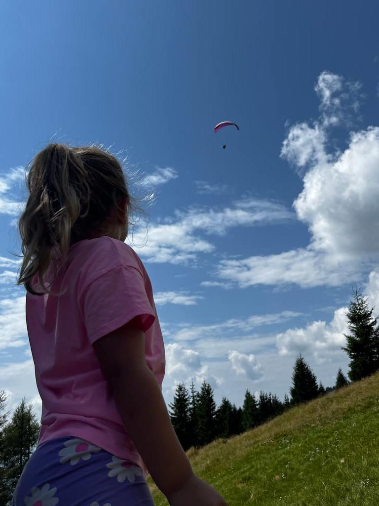](cover.jpg)  
*Cover photo: Tony Gill's daughter watching her dad in Greim, Austria*

---

# Chairman's Chunterings

*Brian Stewart, Chairman*

Making the most of it.

We’ve all been here... a sudden 5-star forecast, light winds, the forums going into overdrive about the record-breaking potential. But... your mother-in-law is visiting, the cat needs worming, it’s your wedding day, etc. How to cope with that FOMO without going crazy.

We are planning a weather-forecasting presentation for the winter socials, and in our discussions I picked up on something Elliott said about following up forecasts with a look at what actually happened on the day. So I thought that sounded like a great way to get something out of what might otherwise be a lost opportunity (unless it was your wedding day...). I imagine most of us are constantly looking at the weather forecasts trying to spot the conditions for days in advance, and when it’s a day when you can’t fly, at least there’s a chance to turn it into a learning experience.

Organise your chosen forecasts: I have a browser window open with all the forecasts I use on different tabs (more on these forecasts in the social night) and refresh them as the day approaches to see how they evolve. Make a plan as if you could go flying that day; decide where you would go; set a task that would stretch you a bit; judge when you think would be a good time to launch and plan for conditions along your route. Then, on the day, go and enjoy getting married, or worming the cat, whatever, and forget about it.

Later, go and look at the XC League and XContest, see what others did – not gnashing your teeth with rage at what you missed but looking to learn from how right you were about the day. This works especially well at weekends or bank holidays when there will be plenty of data points for your research. Did people get away? When did they leave the hill? (not launch time, they may have scratched for ages before going). Did they follow your route? How successfully (don’t compare yourself with the skygods, unless you are one)? Read any stories about their flights, and if you know some of the pilots ask them how it went, how the actual conditions compared to predictions etc.

As well as learning from the exercise of reading and interpreting forecasts, which is a major art in itself, you may find it calms down that inner voice that was nagging at you to call off the wedding...

---

# Sites

*Andy Archer, Sites Officer*

### Lake District Military Exercises - Cumbria Soaring Club

The days are drawing in and yet again it’s time for the RAF and special invited guests to descend upon the mostly tranquil valleys and lakes of Cumbria…
Ex. Cobra Warrior 24(2) runs from  next Monday - 16/9/24 until 4/10/24

Cobra Warrior is a Large Force Exercise involving up to 90 military aircraft in mixed formations including Fast Jets, Intelligence, Surveillance and Reconnaissance Aircraft, Air to Air Refuelling and Mobility Assets (Fixed Wing and Rotary).

Aircraft involved will include amongst others - 
UK - F35B
UK - Typhoon
Poland - F16
Canada - F18
Canada - C130
Norway - F35A
USA - F35A
USA - F16
USA - F15

The first two weeks 16th-20th and 23rd-27th will see an increase in low level traffic in LFA17 (the Lake District) during daylight hours. 
The third week 30th-3rd the Exercise is scheduled for night flying which should not affect us free flyers. Fri 4th Oct is departure day and in previous years LFA17 usually sees heavier traffic on this day. 

Please remember to get your CANPs in, the day BEFORE you plan to fly if possible, but late is better than not at all! 

[Civil Aircraft Notification Procedure (CANP plus NOTAMs) for paragliders & hang gliders](https://canp.logans.me.uk/)

### Winter Hill

Winter Hill Transmitter Mast is now a construction site and under the control of a contractor, this is due to replacement of the stay lines that are supporting the structure. The contractor will be managing the site from now until the 3rd of October 2024 and there will be some periods of significantly reduced access when the new stays are being lifted over and alongside the site access road, the work will also include weekend work.

During working hours the gates on site will be locked and set to a code held by the contractor, out of hours (from 6pm – 8am) the code for the gates will be set to the same code as the Winter Hill barrier at the bottom of the hill.

The site manager's contact details will be displayed on the gate however he is very unlikely to give access during normal working hours without a permit to work or legitimate cause to drive further up the hill to reach the other masts. 

**As such can I ask for this period, that members avoid using the access track to Winter Hill? Instead please park in the [car park](https://maps.app.goo.gl/FDkwkiKyyyWwwcXPA) on Rivington Road and walk up the front face of the hill to take off.**

Arqiva the mast operators apologise for the inconvenience caused.

---

# The Gallery



---

# A Grand Day Out

*Chris Timson - Notes from Annecy*

Just got back from an amazing couple of weeks in Annecy. It was our family holiday but couldn't resist taking the glider even if it meant leaving one of the kids behind!

Now I'm a low hours CP so planned on seeking out a bit of advice before launching, fortunately there are now people there in blue jackets to assist with conditions info and advice. It is though very busy especially being July/August so you do have to give the tandem flyers priority.

My first flight at Col de la Forclaz was very different to what I'm used to. There was hardly any wind at the launch site but the wind sock was blowing fully over the edge so lots going on! After launch you have the choice of turning left and a long glide to Doussard, an enormous landing field at the south end of the lake, or turn right and have a play. Of course I went right and was immediately up in the mountains. I was blown away by the spectacular view! This place is incredible and it really did take my breath away. I played around on the ridge for about an hour, then thought I'd better check out the landing field as I'd got a couple of weeks here to fly anyway! The landing field was pretty busy but so big that there's plenty of room for everyone as long as you follow the landing pattern.

The following day I went to try Planfait. This is a much smaller site and a bit friendlier but not quite as high. You can even get the free bus up to launch. The shuttle bus at Doussard to Forclaz is 7 Euros but does take you right to the top. So much to explore and great for practising thermalling techniques which has been so difficult recently in the UK due to the weather. I had a couple of days where the conditions weren't quite as good and resulted in short flights but this was probably down to my lack of experience. On good days I could easily find lift anywhere. This is an amazing place to fly even for low airtime pilots as long as you use a bit of common sense and talk to people, check the weather thoroughly, and if no one is flying there's a reason. Can't wait to go back next year!

[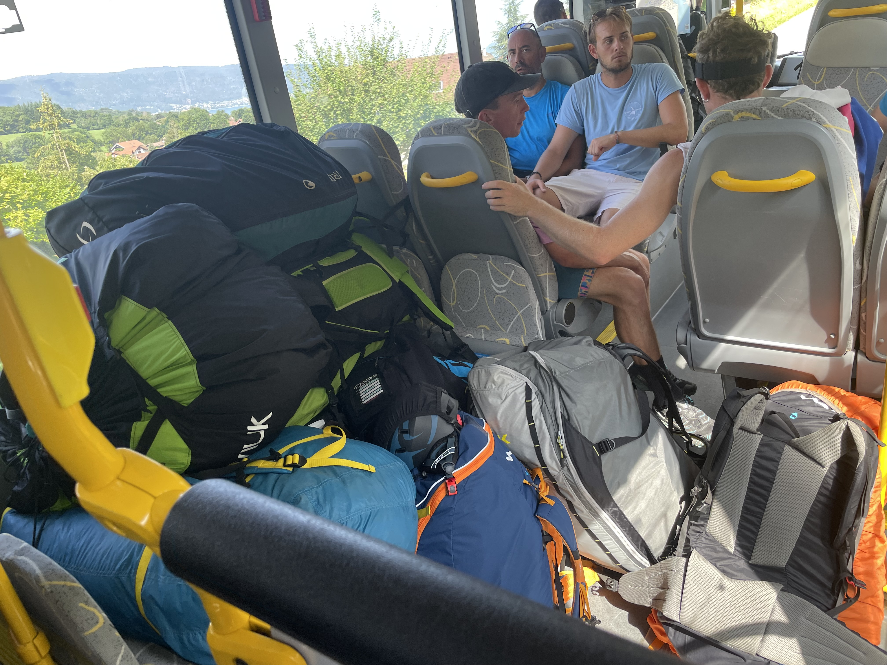](chris1.jpg)
[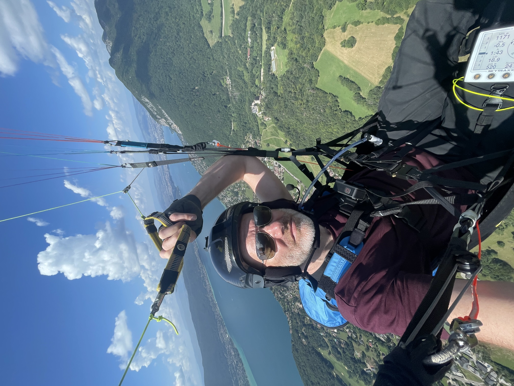](chris2.jpg)
[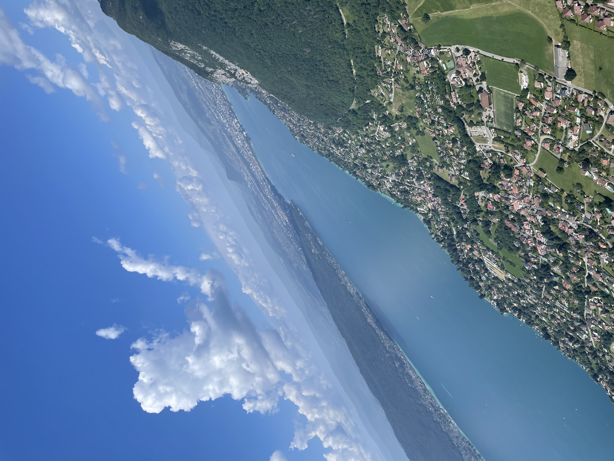](chris3.jpg)
[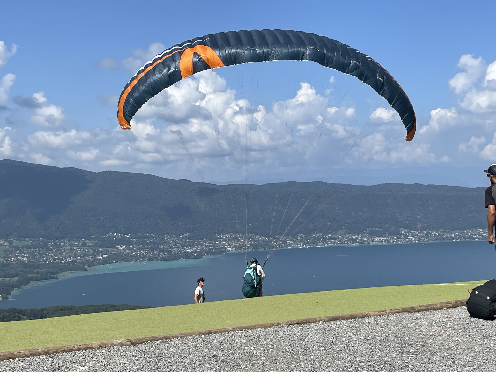](chris4.jpg)

---

# Photo Diary

*Doug Neil at the 2024 British HG Nationals in Laragne*

Baking heat welcomed us to the campsite at Laragne for the 2024 British Nationals.  Day 1 found us at the south facing launch at Chabre; a strong wind failed to persuade many pilots to rig and eventually the day was canned. Day 2 and 3 however provided better conditions at the same launch and tasks were set on both days.

This was my first national competition and I was keen to exceed my very modest achievements at BOS competitions over the last few years. An impressive 55 pilots had entered – 38 in Class 1, 7 in Class 5 and 10 in Sport class including myself.

Sport class were tasked on day 1 with a 38km route, flying along the Chabre south face then returning across the valley past Barret-sur-Meouge then on to goal at the Laragne-Monteglin campsite. My own flight started shakily with a stressful rigging area, overheating instruments and worst of all, suntan lotion smeared all over my camera lens! I failed to gain enough height at takeoff and struggled along the ridge to Col Saint Jean where I had to scratch for quite a while before climbing out and making my way back to launch. Once there however the thermals were much better and I climbed to 10,500ft twice on the way to goal. My flight took well over twice the time of the task winner but I was elated about reaching goal for the first time. Several pilots were caught out by an airspace infringement which meant I finished in 4th place behind Gary Wirdnam, Tim Swait and Daniel Tovissi.

Manuel Revilli (ITA) won the class 1 task (66km), with best placed Brits Malcolm Brown (3rd), Grant Crossingham (5th) and Jeremy Soper (8th). Brits dominated the class 5 task with Mike Armstrong, Paul Harvey and Nigel Bray on the podium.

Day 2 was also tasked from the south Chabre takeoff with a longer (43km) and more difficult route planned for Sport class. We were again to fly along the Chabre south face, but this time directed over the back towards Malaup, then onto the ridge south of Savournon before heading to the campsite again for goal. I was more successful at getting sufficient height before task start to make the ridge run a lot easier than the previous day, though I was late to launch so had to take the second start gate. Heading over the back of Chabre takeoff, I was fortunate to pick up a powerful thermal halfway across the valley which took me all the way through turnpoint 2 and 3 (others not so fortunate to pick up a thermal had to land out in the valley on the way to turnpoint 2). I found myself stuck on the ridge at turnpoint 3 for quite a while until a stonking thermal boosted me to over 10,000ft again with an easy glide over the last 9km into goal.  Another excellent day for me, and second place in the task. Shout out to Tim Swait who attempted to glide to goal from somewhere around halfway through the task but missed out on goal (and a probable massive score) by just a few fields. Gary won the task again, with Daniel in third.

Jochen Zeischka (AUT) won the class 1 task (77km) with best placed Brits Grant Crossingham (5th), Gordon Rigg (8th) and Richard Lovelace(9th). Tim King won the Class 5 task, followed by Phil Southward (NZL) and Jum Tomihara (JPN) on the podium.

The following 3 days were canned and although reality didnt always follow the weather forecasts it was clear that tasks would have been difficult to plan so the correct decision was made each day. We travelled to Apres in a optimistic attempt to fly a task on the final day, but rain pushed in and the day was canned before anyone could take off.

Final results were based on those two flying days earlier in the week.

Class 1 Open : 1st – Juri Bressanello (ITA), 2nd – Petr Polach(CZE), 3rd – Manual Revilli(ITA)
Class 1 British : 1st – Grant Crossingham, 2nd – Malcolm Brown, 3rd – Gordon Rigg
Class 5 Open and British Winners : 1st - Paul Harvey, 2nd – Mike Armstrong, 3rd – Nigel Bray
Class 1 Sport : 1st – Gary Wirdnam, 2nd – Tim Swait, 3rd – Daniel Tovissi(HUN)

As always, the success of these events is a result of great planning and organisation.  Meet head Jenny Buck was excellent and supported by a great team of people involved in scoring, task setting, safety team, launch marshalling, etc. Thanks also to Olly Moffatt for planning and organising the event over several months.

[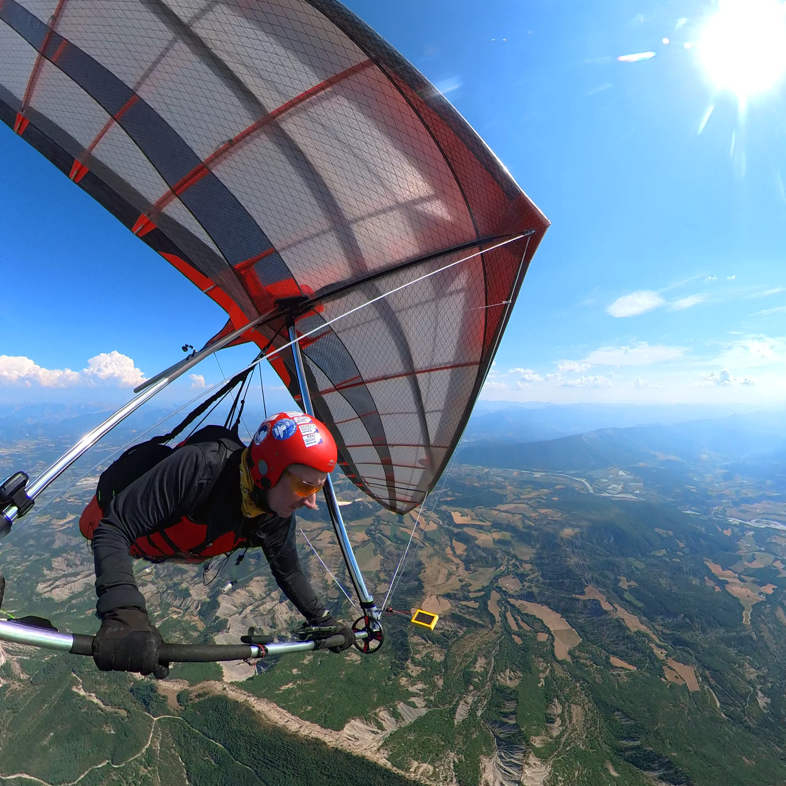](Doug1.jpg)
[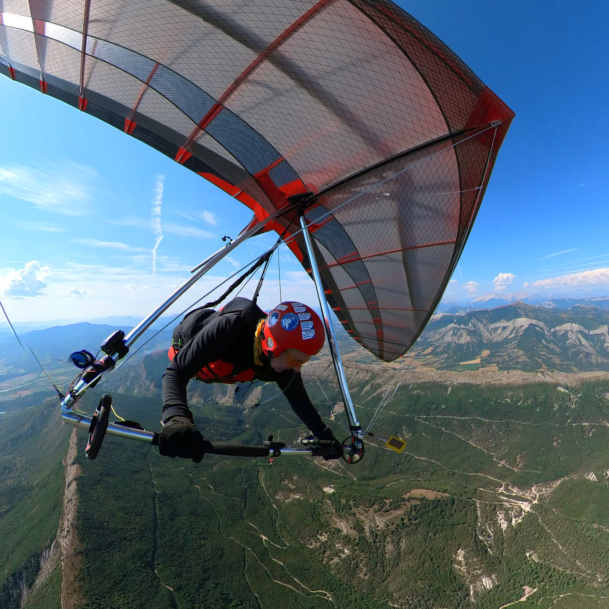](Doug2.jpg)
[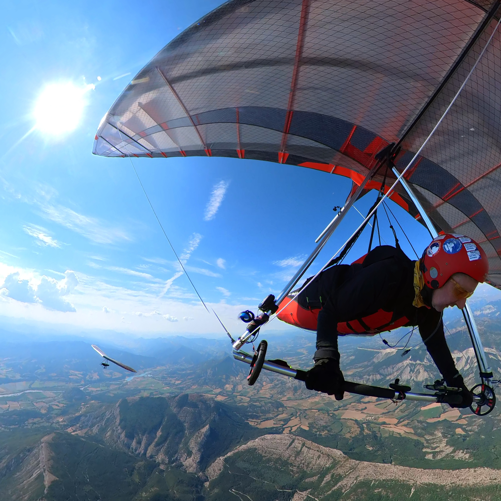](Doug3.jpg)
[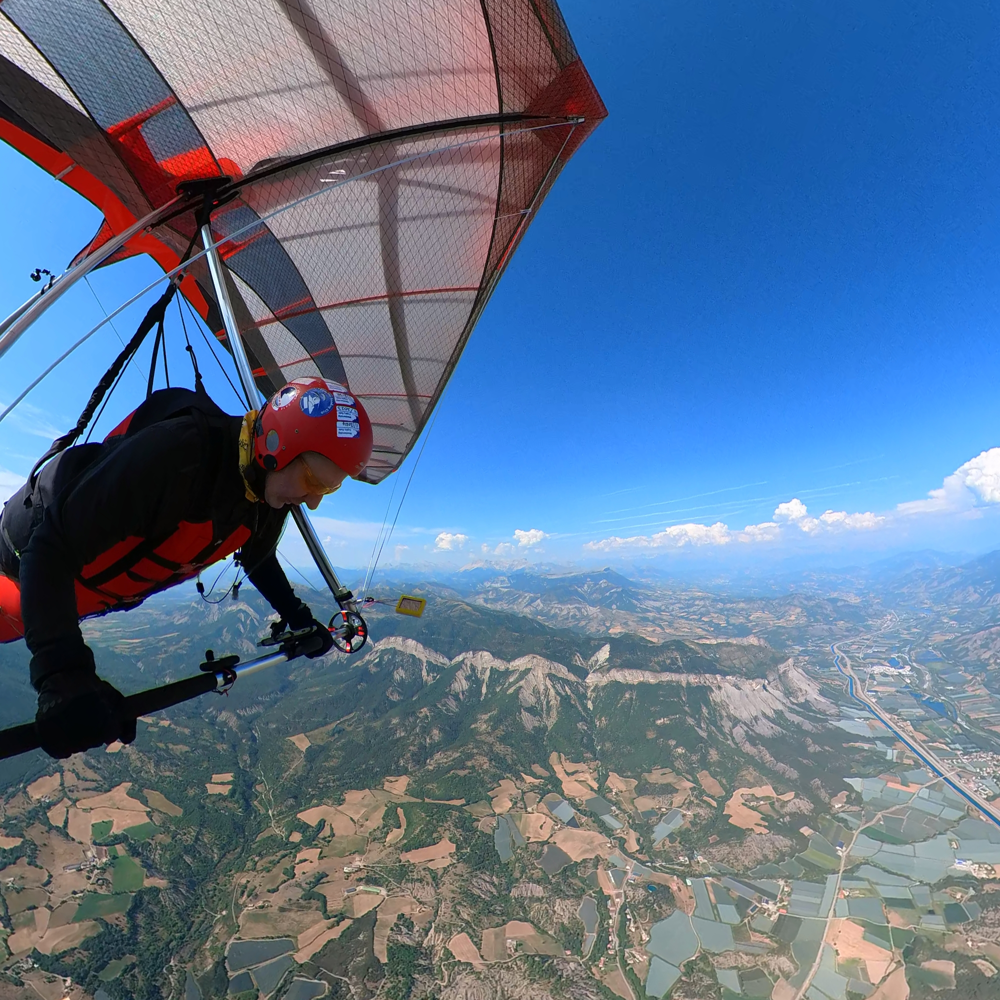](Doug4.jpg)
[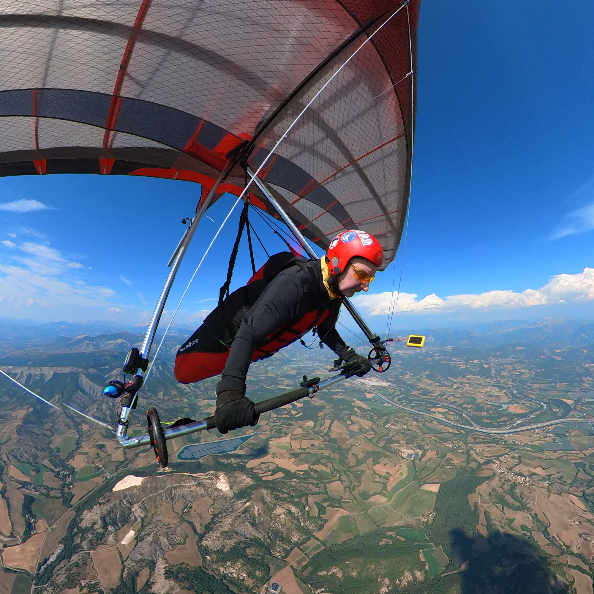](Doug5.jpg)

---

# Shout Outs

Congratulations to Jacob Butterworth and the British team, who took bronze at the 1st [FAI Junior World Paragliding Championships](https://www.fai.org/CIVL-Tolmin-2024) in Tolmin.

And bravo to Baz Roberts and Cumbria Soaring Club, who have managed to restore permission to fly at Carrock and Caldbeck Common.

[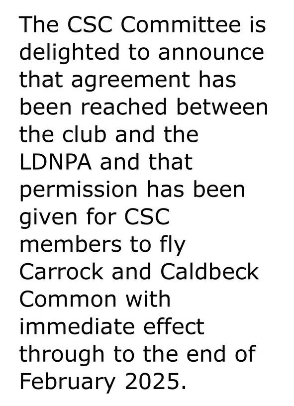](carrock.jpg)

---

# Competitions

*Elliott Brown, Competitions Secretary*

### Northern Challenge Series 2024

[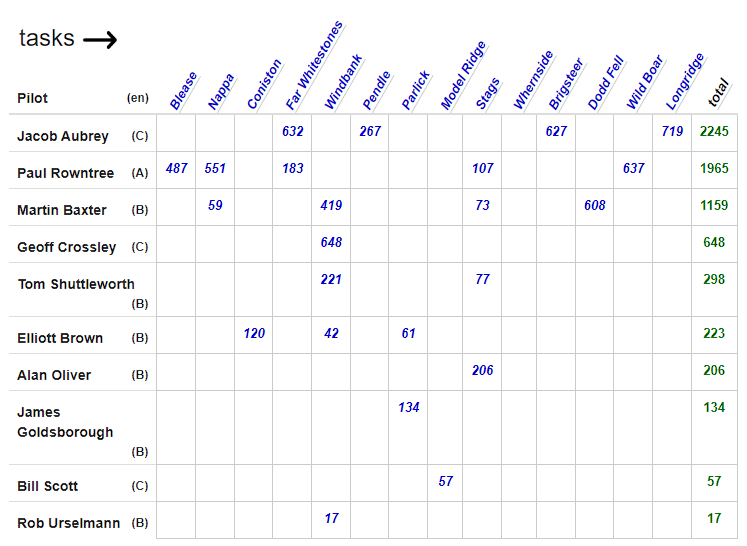](http://www.xcmap.net/ )

### XContest - Pennine Soaring Club

[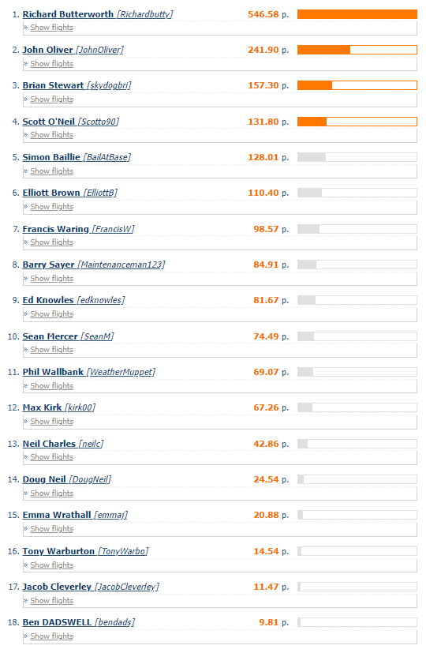](https://www.xcontest.org/united-kingdom/ranking-club:2688)

### XC League

[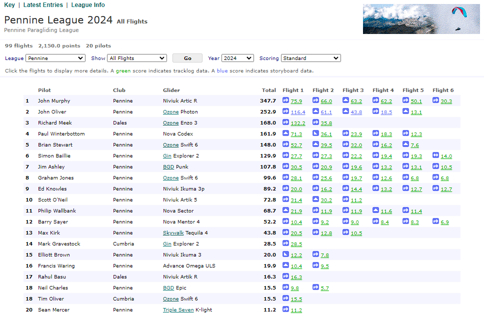](https://xcleague.com/xc/leagues/view-15.html)

---

# Dates For Your Diary

### Winter Club Nights

*Graham Jones, Social Secretary*

Club nights will return as usual on the second Monday of each month throughout the winter, with the first one booked for 14th October at the [Sea View Inn, Chorley](https://theseaviewchorley.co.uk/). Keep an eye on Telegram for confirmation of further dates and topics.

---

# You Might Have Missed

Following a short break for new features and bug fixes, your newsletter editor's other paragliding project is back up and running. [PG and HG Tracking Alerts](https://alerts.hilltop-analytics.com/) is a service that sends you text messages when gliders are detected on your local hills and it now uses [SafeSky](https://www.safesky.app/) to access tracking data, which means that alongside FLARM, it can see gliders using the XCTrack and SafeSky mobile apps, plus several others. If you're running live tracking on your phone, you'll set off alerts to help other people know where it's flyable and if you're on a big XC next season, subscribers will be pinged so they can tune in and watch the rest of your flight.

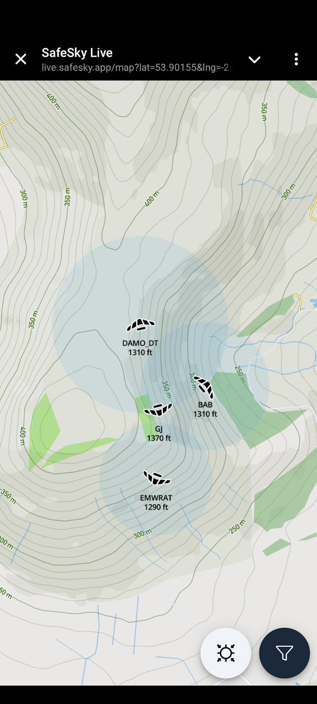

---

# Your Newsletter Needs You

Appear in the next newsletter! We need submissions for...

**A Grand Day Out**  
2-3 paragraphs describing a fun day. You're welcome to write more if you're feeling creative but a couple of paragraphs is plenty. Could be epic, could be daft, could be simply the first time you flew for six months. If you've had a good day and you took some pictures, send it in.

**Why Not Visit...**  
A quick guide to a site that you like, at home or abroad. Tell us where it is, what it's like to fly, any watch-outs and how to contact the locals. Attach a photo and email it over.

**The Gallery**  
Send in any recent(ish) shots with when and where they were taken. Spectacular, silly, from the ground or from the air, it doesn't matter. Let's see what you've been up to. Videos are very welcome too but pop them on YouTube or Vimeo and send a link for the newsletter.

**Shout Outs**  
First ever XC? Smashed a PB? Took part in a comp? Let us know and get a shout out in the newsletter. Nominate your mates if they won't do it themselves.

**Top Tips**  
Spotted a bargain? Got a great travel tip? Know how to make Bluetooth connections work on an iPhone? Share your best ideas.

Send submissions on these or anything else you'd like to see featured to [editor@penninesoaringclub.org.uk](mailto:editor@penninesoaringclub.org.uk). You can also drop them over using the [web form](https://docs.google.com/forms/d/e/1FAIpQLSd3NJQKlmLjjlh-nZGQKaeXzN6dSSL2PHzKRXFYAy_Bw7SC9w/viewform?usp=sf_link) or message [Neil](https://t.me/NeilCharles) on Telegram.

--- 

Fly safe, see you in November.