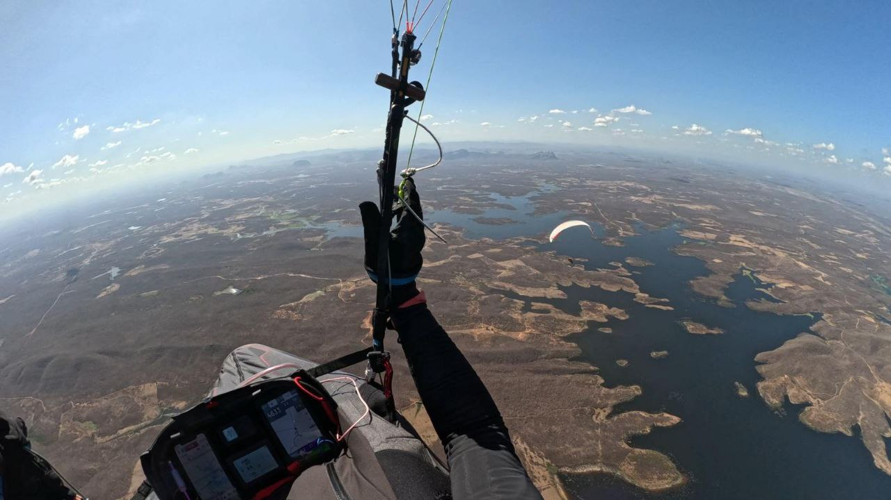
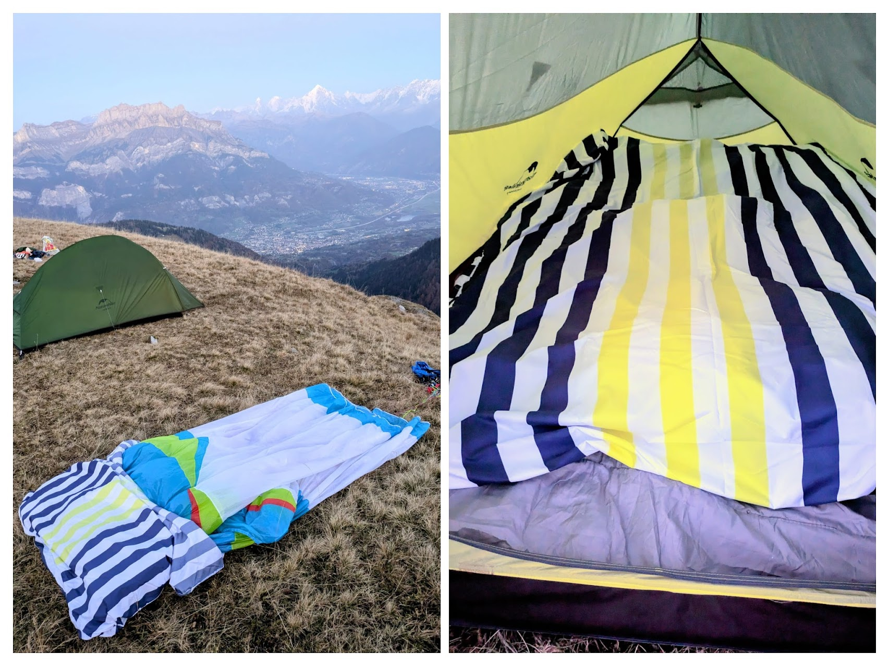

# Get the beers in, it's club night

Winter's here and that means club nights. Pub grub, a beer and talking flying for a couple of hours, what could be better than that? Well flying could, obviously, and a few of us have managed some bumpy days and smoother evenings to scratch that itch.

Keep an eye out for flyable windows and interesting club night talks and we'll be back with another issue in January.

Heated gloves for Christmas please Santa.

[editor@penninesoaringclub.org.uk](mailto:editor@penninesoaringclub.org.uk).

  
*Cover photo: Damian Thornton*

---

# Chairman's Chunterings

*Brian Stewart, Chairman*

### Do You Know What To Do, Right Now?

This article appeared in the DHPC newsletter recently and I'm grateful to the author, Rob Uselmann, for letting me use it adapted slightly for our club.

Note from Rob: I first drafted this article a few days before the terrible news of Kev's passing on the hill and, being new in this role of co-opted first aid officer, considered pulling this version in lieu for a 'softer' approach. I was however encouraged by the committee to keep it as is.

Imagine this:  
You are out flying with your mate and are having a grand time under beautiful skies. Suddenly, you realise you can't see their wing in the air and after some looking around you see them on the deck ...wing out... not moving... no response on radio. SHIT SHIT SHIT. You are the only other person around.

Close your eyes, imagine this scenario: What do YOU do right now?! Be honest.

1. I have no clue and 'freeze': I convince myself they'll be alright, probably just radio not functioning and taking a breather, and I continue flying (whilst secretly shitting myself).

2. I have no clue and panic: I fly over and drop down to land quickly. After I miraculously manage to land unharmed myself, I drop my gear, run over and rip their helmet and gear off to see how they're injured. Need to call 999. Shit my phone is still on my gear deck which has now blown into a tree. Once I recover it, shit no signal.

3. I recall a bit from reading, youtube, or a first aid course many years ago: I fly over and descend with my heart in my throat, landing a bit rough but ok. I quickly bundle my wing and throw my harness on it to secure it, grab my phone and run over. Something "ABC" but what exactly. My mate is breathing so I don't touch them. I secure his wing and run up hill to find a signal.

4. I've got this: I take a deep breath and slow my heart rate. I fly over and descend within my capabilities (aided by the SIV course I did not long ago) and land a bit away from the emergency site. I quickly secure my own gear, pull out my phone, DHPC Emergency Card, compact First Aid kit and my tracker, and start applying "DRC ABC". There's no phone signal so I activate my emergency satellite beacon.

Are you #4? Please become my flying buddy!

For everybody else, how do you feel right now? Do you wish you knew better what to do?

Maybe you think this is not going to happen to you?

BHPA statistics 2020-23 show that every year there are 150-180 accidents outside a school setting, 100-120 resulting in injury, half of those serious. With 7000 members, that means roughly each year 1:100 sustain serious injury. DHPC (and PSC) has over 200 members.

As you might have seen or heard, the club is once again considering organising a (possibly subsidised) outdoor First Aid course. With existing committee members already loaded, they saw fit to introduce the new role of First Aid officer. I have a bit of background in emergency care and was already well aware how out of date I myself am getting, so this is a topic near my heart.

Considerations to the club are:
- Current level of FA experience in the flying membership.
- Level and duration of course required/desired: one v two days
- Cost of course
- Level of club sponsorship (if any)
- Timing: 
- Location

Course:
A comprehensive, remote-setting, substantially hands-on course is two days but provides a solid basis for all types of emergencies in a remote incident environment. The alternative would be a one-day course adapted from the standard ones to cover the sorts of situations we are likely to face. Based on their survey responses, DHPC have opted for a one-day course, tailored to free flight incidents.

There is a link below to a survey for PSC members to find out what YOU are looking for. Please take the trouble to follow the link and to answer the questions, even if you have no wish to do a course. That in itself is important feedback.

First Aid kits:
If you run into even a relatively minor accident and you don't carry even a very basic FA kit, you quickly have to tear up your clothes (or worse, wing) to make a bandage to stop bleeding or support a fracture. On the other end, all-encompassing first aid kit bags are wonderful, but also virtually useless during an accident if it sits in somebody's car at the bottom of the hill or even further away when on XC.

### [Please do this first aid survey now](https://docs.google.com/forms/d/e/1FAIpQLScv-Ok0q89ndlIrHPqcklY_6vdIOtsXdhSnQredJfgQEZbbXA/viewform)

---

# Notes from the Committee

Our first club night of the year was dedicated to weather forecasting. Brian kicked us off with a deep dive into Rasp, followed by Andy, Simon and Neil on Met Office forecasts, aviation forecasts, XC Weather and wind at altitude.

Our webmaster Carl has helpfully listed links to all of the different web resources we talked about, together with the video on the [PSC site](http://www.penninesoaringclub.org.uk/articles/article-list/social-night-october-2024-weather-forecasting-to-fly/).

Even if you've been flying for years there might well be some new bits in here that you haven't heard before.



---

# Sites

*Andy Archer, Sites Officer*

### Winter Hill

Winter Hill Transmitter Mast is now a construction site and under the control of a contractor, this is due to replacement of the stay lines that are supporting the structure. The contractor will be managing the site from now until the 3rd of October 2024 and there will be some periods of significantly reduced access when the new stays are being lifted over and alongside the site access road, the work will also include weekend work.

During working hours the gates on site will be locked and set to a code held by the contractor, out of hours (from 6pm – 8am) the code for the gates will be set to the same code as the Winter Hill barrier at the bottom of the hill.

The site manager's contact details will be displayed on the gate however he is very unlikely to give access during normal working hours without a permit to work or legitimate cause to drive further up the hill to reach the other masts. 

**As such can I ask for this period, that members avoid using the access track to Winter Hill? Instead please park in the [car park](https://maps.app.goo.gl/FDkwkiKyyyWwwcXPA) on Rivington Road and walk up the front face of the hill to take off.**

Arqiva the mast operators apologise for the inconvenience caused.

---

# The Gallery





---

# A Grand Day Out

*Pete Jones writes...*

We had a great day playing in high winds on Longridge Tuesday 29th, flying a 15m Flare Line, here's a couple of videos. Nobody else flying, it was strong, bumpy and well off to the West. There was a guy there flying model planes and we had a good laugh with him as well, sharing the hill and keeping good relations.





---

# Shout Outs

For anyone who didn't see the news on Pennine Chat, Richard Butterworth made a 10 hour, 422km [epic flight](https://www.xcontest.org/world/en/flights/detail:Richardbutty/14.10.2024/10:19) from Assu in Brazil on 14th October. Congratulations Richard!

---

# Competitions

*Elliott Brown, Competitions Secretary*

### Northern Challenge Series 2024

That’s a wrap for this year (1st Feb - 31st Oct). Jacob Aubrey and Paul Rowntree dominated the series, and will take the Main Series and Sports Trophy respectively. 

For those interested in what the series is, Ed Cleasby's site has the [full details](https://www.xcflight.com/northern-challenge-series-2024/).

### XContest - Pennine Soaring Club

Another wrap for the year (1st October). The leaderboard hasn’t changed a lot over the last couple of months, I was hoping for a last great flight before the darkness crept in.

Don’t forget to sign up for next year's season, I know a couple of flights have been going up already from club members.

[XContest Pennine League Table](https://www.xcontest.org/united-kingdom/ranking-club:2688)

### XC League

### A Favour!

Are there any challenges that you set yourself when flying a pennine site or you have a dream flight in your head?

I would like to put together a set of PSC challenges (alongside the grid challenge - http://www.xcmap.net/x.php?t=544&c=Pennine) that we can all have a go at.
Might be things like the Totridge run. Maybe Pendle to Longridge and back or a fun triangle out from Edenfield. If you have any ideas or challenges you set yourself, please can you share them with me and I will see about getting them added to xcmap as challenges/tasks we can all enjoy.
I would like to include as many sites as possible, but realise a few might not have a lot of takers. 

Telegram me direct or email competition@penninesoaringclub.org.uk.

---

# Dates For Your Diary

### Winter Club Nights

*Graham Jones, Social Secretary*

**Monday 11th November** - Amazing flights with Richard Meek

**Monday 9th December** - TBC

Keep an eye open for more dates, including a repack in February organised by Barry.

---

# Top Tips

A top tip for hike and fly from Chamonix-based pilot Wicus. A duvet cover with your wing in it makes for a cosy night!

---

# You Might Have Missed

Ero Zsolt has written a fascinating blog post on [The Future of Paragliding Harness Back Protectors](https://hyperpilot.substack.com/p/the-future-of-paragliding-harness?triedRedirect=true), trying to estimate the safety implications of the new generation of much thinner back protectors vs. older, thicker, foam ones.

There's also a lively debate on the topic on [ParaglidingForum](https://www.paraglidingforum.com/viewtopic.php?t=108185&postdays=0&postorder=asc&start=0).

---

# Your Newsletter Needs You

Appear in the next newsletter! We need submissions for...

**A Grand Day Out**  
2-3 paragraphs describing a fun day. You're welcome to write more if you're feeling creative but a couple of paragraphs is plenty. Could be epic, could be daft, could be simply the first time you flew for six months. If you've had a good day and you took some pictures, send it in.

**Why Not Visit...**  
A quick guide to a site that you like, at home or abroad. Tell us where it is, what it's like to fly, any watch-outs and how to contact the locals. Attach a photo and email it over.

**The Gallery**  
Send in any recent(ish) shots with when and where they were taken. Spectacular, silly, from the ground or from the air, it doesn't matter. Let's see what you've been up to. Videos are very welcome too but pop them on YouTube or Vimeo and send a link for the newsletter.

**Shout Outs**  
First ever XC? Smashed a PB? Took part in a comp? Let us know and get a shout out in the newsletter. Nominate your mates if they won't do it themselves.

**Top Tips**  
Spotted a bargain? Got a great travel tip? Know how to make Bluetooth connections work on an iPhone? Share your best ideas.

Send submissions on these or anything else you'd like to see featured to [editor@penninesoaringclub.org.uk](mailto:editor@penninesoaringclub.org.uk). You can also drop them over using the [web form](https://docs.google.com/forms/d/e/1FAIpQLSd3NJQKlmLjjlh-nZGQKaeXzN6dSSL2PHzKRXFYAy_Bw7SC9w/viewform?usp=sf_link) or message [Neil](https://t.me/NeilCharles) on Telegram.

--- 

Fly safe, see you in November.