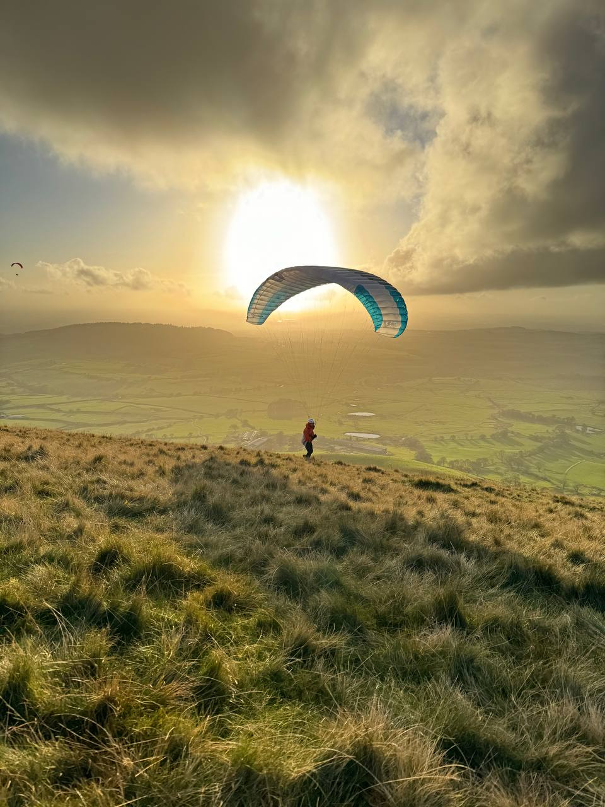
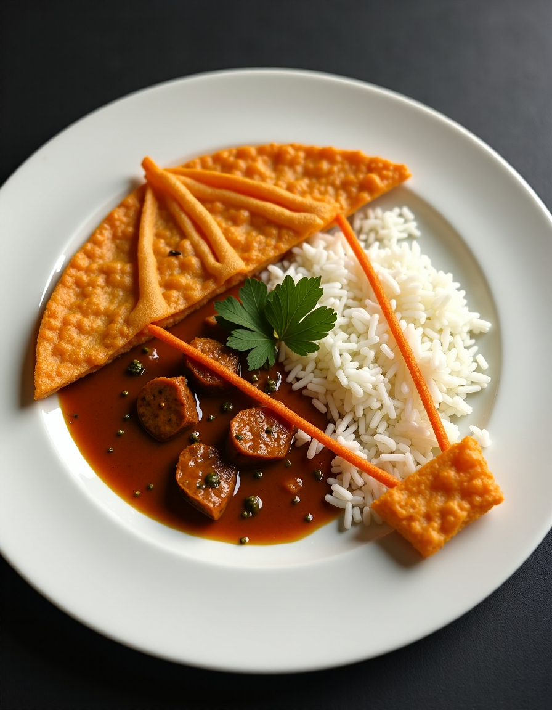
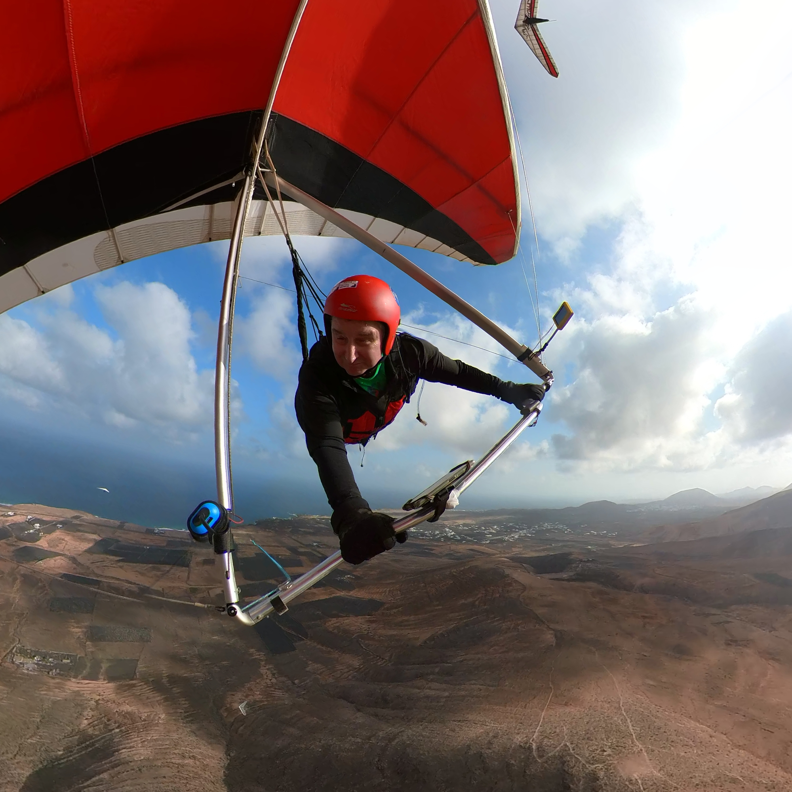

# Snow and fog, it must be January

How's your 2025 planning coming along? With a bit of luck you've managed to get out on the snowy hills but even if not, we've got a packed issue of 2025 diary dates to help you plan your next adventure. Book a trip, try a competition or spend an evening setting up your instruments and tracking, it won't be long until the thermals are launching us skywards.

Some lucky Pennine pilots have had good days out over the winter at home and abroad so we've got the usual gallery full of pictures to whet your appetite.

[editor@penninesoaringclub.org.uk](mailto:editor@penninesoaringclub.org.uk).

  
*Cover photo: Mark Schaefer*

---

# Chairman's Chunterings

*Brian Stewart, Chairman*

2025 and all that . . . 

Another trip round the solar system, passing an arbitrary position in our orbit and over a third of a billion miles travelled around the milky way, so it’s time to wish our reader a happy new year as we look forward to blue skies, fluffy cumulus and thermals just the right side of character building. I suppose it’s been an OK year in terms of flying, oop north we seem to have had the worst of the windy days, but whether it’s GJ clocking up the hours in every available weather window, JO and RM clocking 100km+ flights from our hills or JM topping our league there has been some good flying.

Next month is the AGM, which is an important part of running a club like ours, where members get to see and scrutinise how the club’s officers have been running things on your behalf. As always, every member is entitled to volunteer for a post on the committee – in the unlikely event that the current post holder wants to contest it, this would be put to a vote at the AGM. Is there something you want to see develop within the club? Have you got suggestions for future social nights or club events? Ideally put these forward in advance of the AGM to give a chance to discuss them. It’s also the chance to celebrate the successes of the members receiving an award for their flying or contributions to the club. Be there!

One issue that needs addressing is communication: Facebook, in my opinion, has progressively become more useless as a communication tool over the years and is no longer fit for this purpose, morphing into a click and rage-bait filled advertising medium. WhatsApp and Telegram have their uses but not everyone is willing to subscribe to them and they can become contentious if unchecked. Email should be much better than it is, but members change addresses, bulk emails disappear into junk folders – employers’ mail systems routinely filter these out. The club website should be the main repository of club communications and we will be working towards this, but there are potential problems contained in the digital legislation coming down the line – the threat of admins being held accountable for the contributions of individuals is making small organisations consider ending all forums.

It is vital that the club can communicate effectively with all members and we welcome any suggestions for improvement, in particular how to best use the club website and direct members to look there for information. The various social media channels that carry the Pennine Club name need to be monitored and moderated. Another area that needs help is considering the effects of future airspace changes, in particular drone operations. This doesn’t need you to have special legal expertise, but attention to detail and willingness to read through CAA communications would be useful. If you feel you have any skills or experience that could help the club in these areas, then please step forward, we need you!

Tight lines,

Brian Stewart

---

# Memberships

*Matt Mottaghian, Membership Secretary*

Membership renewals are due by 1st February. If you haven't already set up a transfer, please pay £25 using [Stripe](https://buy.stripe.com/5kA037gsM8jD1AQ145) and don't forget to include your BHPA number.

For any queries, please contact [membership@penninesoaringclub.org.uk](mailto:membership@penninesoaringclub.org.uk)

---

# Mid-winter Curry Night

All PSC members & friends welcome! 

7pm on Thursday 30th January at [Sagar Premier](https://maps.app.goo.gl/3zmKZZuFgB7bYgnj9?g_st=ifm) in Preston. Set meal for only £22 with lots of choices and plenty to eat, including for vegans and veggies! Buy your own drinks at the bar.

Message [Jacqui](https://t.me/Black_Puddin_Bertha) on Telegram to book your place.

---

# Notes from the Committee

### Winter club nights

*Graham Jones, Social Secretary*

We've had some brilliant club nights over the winter including talks on weather forecasting, flying in India, epic XC tales and most recently microlight flying and BASE.

Many thanks to everyone who gave up their time to speak. You can catch up with videos and photos of all of the events on the [PSC Website](http://www.penninesoaringclub.org.uk/articles/).

### SIV

*Jim Ashley, Treasurer*

Don't forget, the club offers a £50 contribution towards your first SIV (subject to documentation and committee approval). Please contact Jim for details [accounts@penninesoaringclub.org.uk](mailto:accounts@penninesoaringclub.org.uk).

---

# Sites

*Andy Archer, Sites Officer*

The gate code for Winter Hill has been changed as of Friday 10th January.

Please contact a member of the committee for the new gate code (WhatsApp/text/Telegram/email/FB messenger)

Please follow the rules:

- Generally only the lower gate will be locked.
- If both gates are locked they will have the same code.
- The lock codes will be changed every 3 months or sooner if required.
- Do not allow anyone to tailgate you through the gate.
- Make sure the gate is locked shut behind you.  Do not leave unlocked, even if you know another member will be on their way in a few minutes.
- On securing the lock ensure you scramble the code, DO NOT leave it on the unlock code.
- PSC members must obtain the code from a member of the committee, DO NOT distribute it further.
- Report any suspicious behaviour to a member of the committee.

---

# Coaching Corner

*Simon Baillie, Chief Coach*

For everyone who has already been in touch with me about getting their Pilot rating, the Sea View Inn, Chorley, is booked for the revision and exam nights.

- Wednesday 29th January: Flight theory
- Wednesday 5th February: Air Law and navigation
- Wednesday 12th February: Weather
- Wednesday 19th February: Exam Night

We'll be aiming to start at 19:30 each night, and I'll take your details for ordering the exam paper on the first night.

If you would like to get your Pilot rating and you haven't already been in touch with me, please let me know as soon as possible.

Contact me through [Telegram](https://t.me/BailAtBase) or [chiefcoach@penninesoaringclub.org.uk](mailto:chiefcoach@penninesoaringclub.org.uk)

---

# Safety

*Barry Sayer, Safety Officer*

### Reserve repack day

A reserve repack day (your emergency parachute system) will take place on 9th March 2025 at Chipping Village Hall.
It's essential that your reserve works correctly should you need it. Learning how to inspect your parachute, fold it as-per manufacturers spec and then install it in your harness is relatively straightforward and very satisfying.

Previous repack days have always been successful with a nice relaxed atmosphere at Chipping village hall and excellent attendance from many of the PSC members. 

---

# A Grand Day Out

*Doug Neil at the Canaries Open Hang Gliding Competion in Lanzarotte*

The bad weather in autumn 2024 convinced me into travelling to Lanzarote to fly in the Sport Class section of their annual Open competition at the beginning of December.  24 degrees for much of the week did a lot to banish the winter blues.  The comp was well run and very friendly - I was allocated a space in the French and Swiss retrieve bus who made me very welcome.

Weather conditions weren't fantastic - cloudbase on most days was around 2000-2250ft and wind mainly from the east so it was clear at the start that tasks on the famous Famara cliffs were out of the question.  In the end we managed 5 tasks out of 7 days though, so it was a very worthwhile trip.

The low cloudbase meant that over-the-back type tasks were not possible.  Instead each day we were given cats-cradle type tasks with many turnpoints (I think one day there was 14 turnpoints on the course).  There were about 50 pilots altogether in 3 different competitions (class 1 flex gliders, class 5 rigid gliders, and sports class kingposted gliders) which made the sky very busy at times.

I'm still pretty new to competitions and its clear from my results that I'm far from consistent.  On my best day I managed 3rd place, only a few hundred metres behind second.  However, on a couple of days I made some mistakes that cost me a lot of points.  In the end I managed 6th place, so just below mid-table in the sports class.  A lot of good lessons learned throughout the week, new friends made and great fun.

---

# Photo Diary

*John Murphy enjoys some winter sun in Tenerife*

---

# 2025 Competitions

*Elliott Brown, Competitions Secretary*

Thought I’d put some info together for 2025, what’s coming up and where you can find info. (I’m biased towards paragliding and XC so I will miss things that are focused on Hike and Fly and accuracy, as well as hang gliding and others.)

One thing that will probably impact UK competition this year will be the guidance issued from the BHPA in regards to cross-country flying. A lot of the competitions, bar things like coaching alongside them, are probably going to end up being pilot rated or above.

XContest - 1st Oct 2024 - 30th Sep 2025 
https://www.xcontest.org/united-kingdom/ 

XCleague
Loop local flights will be calculated from these results.
https://xcleague.com/xc/ 

NCS - Northern Challenge Series 2025 - 1st Feb - 31st Oct
Info: https://www.xcflight.com/northern-challenge-series-2025/
https://www.xcmap.net/ 

Future - Pennine task
I would love to see some suggestions for tasks on Pennine sites, Parlick/Pendle/Longridge are well covered, have you got an idea for a different PSC site? Let me know (competition@penninesoaringclub.org.uk)[mailto:competition@penninesoaringclub.org.uk] - or direct via Telegram

Competition dates:
A couple of events that are popular and up and coming

BP Cup
Dales round: 24th - 27th April
https://airtribune.com/bpcup-2025-dales-round/info 

European round - Sopot Bulgaria 14th - 19th Sept
https://airtribune.com/bpcup-2025-sopot-round/info 

LCC / X-Lakes - 18th - 22nd June
https://www.cumbriasoaringclub.co.uk/lcc/CSC_LCCMain.php 

LCO (likely) - Buttermere Bash - 30th - 31st May
Assuming that there will be another Lakeland Charity Open competition held at the event.
https://www.tickettailor.com/events/airventures/1482454 

X-Dales - Sept 
To be confirmed

Dragon Hike and Fly - 10th - 11th May (fall back 17th - 18th May)
https://crickhowellparagliding.com/dragon-hike-and-fly-race-2025/ 

---

# The Gallery



---

# Dates For Your Diary

**18th - 25th January** - [British Winter Open](https://pgcomps.org.uk/timeline/) - Roldanillo, Colombia

**29th January** - Flight Theory Pilot Rating Coaching - 7.30pm, Sea View Inn, Chorley

**30th January** - PSC mid-winter curry night - Sagar Premier, Preston

**5th February** - Air Law and Navigation Pilot Rating Coaching - 7.30pm, Sea View Inn, Chorley

**10th February** - Pennine Soaring Club AGM - 7.30pm, Sea View Inn, Chorley

**12th February** - Weather Pilot Rating Coaching - 7.30pm, Sea View Inn, Chorley

**19th February** - Pilot Rating Exam Night - 7.30pm, Sea View Inn, Chorley

**9th March** - Repack day - Chipping Village Hall

**24th - 27th April** - [BP Cup](https://www.bpcup.co.uk/node/12) - Yorkshire Dales

**10th - 11th May** - [Dragon Hike and Fly](https://airtribune.com/dragon-hike-and-fly/info) - Crickhowell, Wales

**30th - 31st May** - [Buttermere Bash](https://www.facebook.com/events/603425262077557/) - Buttermere, Lake District

**8th - 14th June** - [British Sports Trophy](https://pgcomps.org.uk/timeline/) - Gemona, Italy

**15th - 26th June** - [Red Bull X-Alps](https://www.redbullxalps.com/int-en)

**18th - 22nd June** - [Lakes Charity Classic / X-Lakes](https://www.cumbriasoaringclub.co.uk/lcc/CSC_LCCMain.php)

**12th - 19th July** - [British Championships](https://pgcomps.org.uk/timeline/) - Krushevo, North Macedonia

**14th - 19th September** - [BP Cup](https://www.bpcup.co.uk/node/12) - Sopot, Bulgaria

**20th - 23rd November** - [Kendal Mountain Festival](https://www.kendalmountainfestival.com/) - Kendal, Lake District

---

# You Might Have Missed

If you missed Jocky's PureTrack presentation, you can catch up with all of the details [here](https://contechconsulting-my.sharepoint.com/personal/tim_oliver_contechconsulting_co_uk/_layouts/15/stream.aspx?id=%2Fpersonal%2Ftim%5Foliver%5Fcontechconsulting%5Fco%5Fuk%2FDocuments%2FOneNote%20Uploads%2FRecordings%2FCsc%20tracker%20Teams%20call%2D20250112%5F211603%2DMeeting%20Recording%2Emp4&nav=eyJyZWZlcnJhbEluZm8iOnsicmVmZXJyYWxBcHAiOiJTdHJlYW1XZWJBcHAiLCJyZWZlcnJhbFZpZXciOiJTaGFyZURpYWxvZy1MaW5rIiwicmVmZXJyYWxBcHBQbGF0Zm9ybSI6IldlYiIsInJlZmVycmFsTW9kZSI6InZpZXcifX0&ga=1&referrer=StreamWebApp%2EWeb&referrerScenario=AddressBarCopied%2Eview%2E2d90ff66%2Db26a%2D4c1d%2Dbf6e%2Ded367b3f860d).

[PureTrack](https://puretrack.io/) is a brilliant system that brings together all of the many and varied different tracking systems onto one map.

Register for an account login, tell it what tracking systems you use - from mobile phones to FLARM - and it will keep an eye on you. If the worst should happen and you get into trouble somewhere remote, PureTrack will have recorded all of the pings from any devices you're carrying and be able to let search teams know the very last location where you were known to have been.

---

# Your Newsletter Needs You

Appear in the next newsletter! We need submissions for...

**A Grand Day Out**  
2-3 paragraphs describing a fun day. You're welcome to write more if you're feeling creative but a couple of paragraphs is plenty. Could be epic, could be daft, could be simply the first time you flew for six months. If you've had a good day and you took some pictures, send it in.

**Why Not Visit...**  
A quick guide to a site that you like, at home or abroad. Tell us where it is, what it's like to fly, any watch-outs and how to contact the locals. Attach a photo and email it over.

**The Gallery**  
Send in any recent(ish) shots with when and where they were taken. Spectacular, silly, from the ground or from the air, it doesn't matter. Let's see what you've been up to. Videos are very welcome too but pop them on YouTube or Vimeo and send a link for the newsletter.

**Shout Outs**  
First ever XC? Smashed a PB? Took part in a comp? Let us know and get a shout out in the newsletter. Nominate your mates if they won't do it themselves.

**Top Tips**  
Spotted a bargain? Got a great travel tip? Know how to make Bluetooth connections work on an iPhone? Share your best ideas.

Send submissions on these or anything else you'd like to see featured to [editor@penninesoaringclub.org.uk](mailto:editor@penninesoaringclub.org.uk). You can also drop them over using the [web form](https://docs.google.com/forms/d/e/1FAIpQLSd3NJQKlmLjjlh-nZGQKaeXzN6dSSL2PHzKRXFYAy_Bw7SC9w/viewform?usp=sf_link) or message [Neil](https://t.me/NeilCharles) on Telegram.

--- 

Fly safe, see you in March.