# As if by magic, spring appeared

Daffodils are blooming, risers are twitching and varios are beeping. It's spring!

As the weather finally turns flyable, we've got a packed issue ahead of the new season, with important sites updates, a coaching reminder about needing a pilot qualification for cross country flights from Simon, early XC tales from Elliott and some PSC members' aspirations for 2025. Plus the usual gallery full of photos and videos.

Check your kit, repack your reserve, put a camera on your flight deck and get planning on [flyxc.app](https://flyxc.app/). It's going to be epic.

[editor@penninesoaringclub.org.uk](mailto:editor@penninesoaringclub.org.uk).

[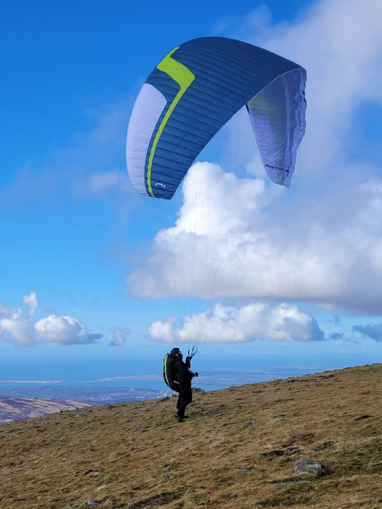](cover.jpg)  
*Cover photo: Lee Barnes snaps Scott O'Neil on top of Elidir Fawr, Snowdonia 28/02/2025*

---

# Chairman's Chunterings

*Brian Stewart, Chairman*

Good day everyone, looks like the season has properly kicked off with 30 odd pilots enjoying the convergence at Parlick on the 1st day of spring, with a flurry of triangles around the west bowl. Unfortunately the day was blighted when the gliding club had to halt winching while a paraglider crossed their field on the way back from a tour of Beacon Fell. Some frantic behind-the-scenes diplomacy went on over the rest of the weekend. Here is his explanation (anonymous, no point adding to his embarrassment).

> I apologise profusely for the grief my actions may have caused. I am not proud of these, and thought for a brief second about not saying anything, but that is not me and having just stepped down from [my club] committee after 8 years I know only too well the hard won nature of some of the agreements we have and what is required to keep them operational.
> 
> I think by "owning up" I hope that you realise the message did get out, that I was not a rogue pilot, and I do understand the safety and relationship implications of the event.
> 
> My "excuse", for want of a better word, is pretty poor, but interestingly thinking about it now it reflects something I heard someone else in our club say last year after a crash. Part of being current is about the quality of decision making, it is not all about wing control.
> 
> Anyway, this was my first flight in 4 months, I had pushed out from the hill about 5km under the convergence clouds and then came back under them past and south of Beacon Hill.  At this point I thought it was just a case of climbing out again and scooting back, neglecting the fact that everything towards the hill had shaded out. I duly climbed out and set off towards the west of the tow field and then instead of staying up under the clouds as anticipated I got drilled and found myself somewhere I did not want to be and should not have been. Once into my predicament, I did not stop, turn or anything else to prolong my incursion into the airfield, however I was acutely aware of the situation and if the plane on the runway had budged an inch I would have turned south again.
> 
> This explanation is not meant to excuse my actions, but rather to serve as a reminder that even people who know the rules can get caught out in the moment, perhaps especially when not current, and end up doing a daft thing.
> 
> Anyway, that is probably enough of my flimsy explanation. I do once again offer my apologies to you guys and the gliding club and promise it won't be me next time. I find it even more galling that only last year I saw others cross on the one day I flew at Parlick and I said to myself, naughty naughty, you won't catch me doing that!

All’s well that ends well, as the launch marshal on the gliding field was aware of the danger and halted their launch – it could have been so much worse. I especially like his comment that being current isn’t just about glider control, but about the whole business of aviation.

On another note, your committee members have also been busy firefighting on the Edenfield landing field issue. At first it looked like permission to use the field was lost, but thanks to the prompt reporting of the issue and careful diplomacy by our Sites Officer that threat has been averted. See elsewhere in this issue for updates to the site rules.

Finally, well done Elliott on your impressive flight in Derbyshire.

Tight lines,

Brian Stewart

---

# Safety

*Paul Redman, Safety Officer*

There are still spaces available at the repack on Sunday 9th March (this Sunday) at Chipping Village Hall.

[Email to book your place](mailto:safety@penninesoaringclub.org.uk)

---

# Notes from the Committee

### AGM and Awards

Our AGM was held on 10th February, with updates from each of the committee's officers on their work for the past 12 months.

Barry Sayer, Graham Jones and Jacob Cleverley stepped down from their committee posts with our grateful thanks and we welcome Paul Redman as our new Safety Officer, Jacqui Kavanagh as our new Social Secretary and Neil Charles will look after social media alongside the newsletter.

AGM night is also awards night! Congratulations to all of 2024's winners.

**Best XC flight from a Pennine site**
John Oliver

**PG Pilot Improvement Award**
Emma Wrathall

**PG Pilot Improvement Award**
Chris Dobson

**Newcomer Award**
James Davidson

**HG Pilot Progress Award**
Doug Neil

**Representing the Club**
Paul Winterbottom

**Representing the Club - International**
Jacob Butterworth

**Representing the Club - International**
Doug Neil

**Best Local Flight**
Paul Winterbottom

**PG League Overall**
John Murphy

**PG League Sport Class**
John Murphy

**PG League Fun Class**
Brian Stewart

**Club Award**
Neil Charles - Newsletter

**Club Award**
Andy Archer - Site owner relationships

**Bent Upright**
Sam Ashley

**William Marshall Trophy for Services to the Club**
Paul Winterbottom - Hosting the Parlick webcam and looking after the windsock

**Loop League**
John Murphy

*Sam Ashley proudly receives the coveted Bent Upright trophy from Brian.*

---

# Social

*Jacqui Kavanagh, Social Secretary*

Don't forget the last club night of the year, this coming Monday 10th March.

[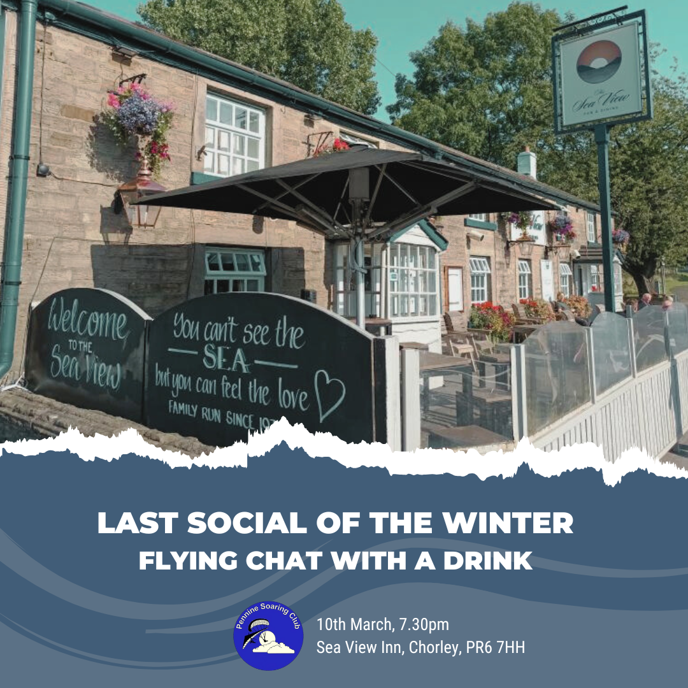](clubnight.png)

---

# Sites

*Andy Archer, Sites Officer*

**Edenfield**

The Edenfield lambing period has been extended and now runs 1st April - 25th May.

In a welcome change to previous years, you may still fly Edenfield during these dates but *you must land on the fell side and not land in the official landing field*. If you are not completely confident of being able to land on the fell side then please avoid flying Edenfield until after 25th May.

**Parlick**

From May to October, please do not land in the grass field next to Fell Foot cottage, east of the official landing field on the other side of the road. Fencing has been removed so it looks like a convenient option but during the summer the grass is being grown as a crop.

On Saturday 1st March, Bowland Forest Gliding Club again had to stop winching due to a paraglider overflying the airfield.

Please remind yourself of the [Parlick site rules](http://www.penninesoaringclub.org.uk/sites/parlick/), the location of BFGC and of the approach patterns of returning sailplanes, which cannot change their flight path once they have committed to landing.



---

# We're on Instagram!

Pennine Soaring Club has a shiny new Instagram profile to go with our Facebook page. We're still working out the details of who'll be able to post but you can follow us [here](https://www.instagram.com/pennine_soaring_club/).

---

# Coaching Corner

*Simon Baillie, Chief Coach*

It seems like there’s only been a few flyable days this winter, but we’ve still managed the odd bit of coaching. The main thing, though, that has happened on the coaching front is our Pilot revision nights and the chance for folk to sit the Pilot exam. Thank you very much to Brian Stewart, Richard Butterworth and Phil Wallbank for their excellent talks on Flight Theory, Air Law/Navigation, and Meteorology, respectively.

[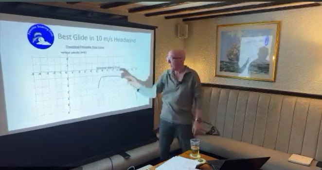](coaching1.jpg)

[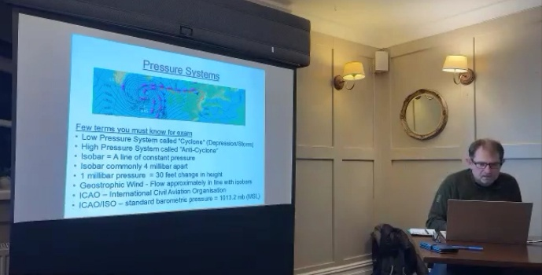](coaching2.jpg)

[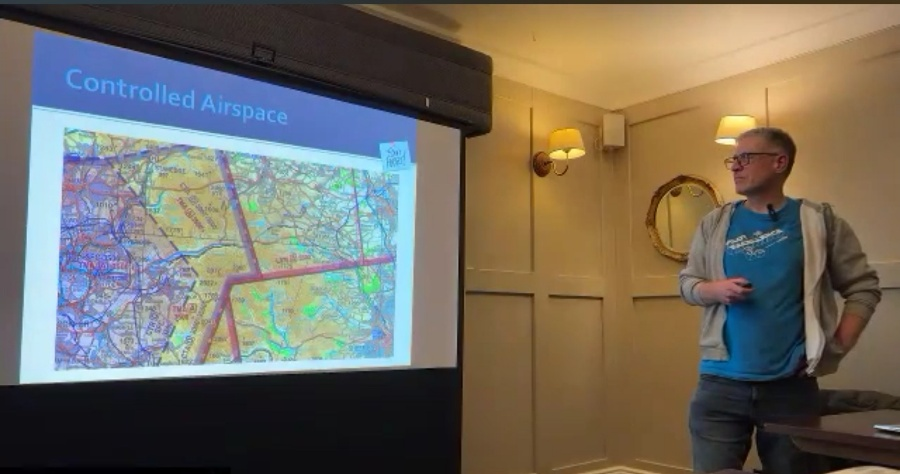](coaching3.jpg)

Big congratulations to all those who passed their Pilot exams!

You have probably seen my messages on Telegram, and by email, encouraging Club Pilots to get their Pilot rating. I really think that this is an important part of your progress and development in this sport, and it’s worth remembering that the BHPA considers CP to be a novice rating and Pilot to be fully qualified.

The Pilot rating is about much more than just flying Cross Country (hopefully you are aware of the changed guidance around the BHPA insurance and XC flying), it is about gaining the knowledge and skills that will help you to continue to progress safely in this great sport of ours.

An important part of the process of achieving your Pilot rating is completing all of the Pilot tasks and getting them signed off by a coach. By far the easiest way to do this is by getting a Pilot task book from the BHPA office and taking it out with you when you go flying, as any Club Coach can sign off tasks that they witness. It is also really important to keep a logbook and both of these will help when it comes to signing you off, once you have passed your exam. Please contact me if you decide that this is something that you want to do and I will do my best to help you through the process.

At the recent AGM I spoke about the insurance issues, and encouraging more people to get their Pilot rating. someone asked what is the current ratio, in our club, of CP to Pilot and above. I didn’t know off the top of my head, but felt it was a very good question and said that I would find out. We have just got the recent data off the BHPA, and 43% of members are CP rated, 51% Pilot and 6% Advanced Pilot. Although these numbers aren’t terrible, and are slightly better than I would have guessed, I would really like to get us to a place where only our newer members were still CP rated. If you are CP rated, please give this serious thought and let me know if it’s something you want to do.

Once the flying season gets going properly, I hope to start organising coaching days again. I will post information on Telegram, and by email if possible. Given the above, I’m also hoping to run some XC coaching days for our newly qualified Pilot rated members, if there is enough interest. Please let me know if this is something that you would like to take part in.

---

# A Grand Day Out

*Elliott Brown fires the starting gun on 2025 with 41km from Stanage*

**Flight, thoughts and pics..**  
A quick write up (using my inner James Joyce), with pics of my first great XC of the year.

**Start well**  
Arrive at Stanage, lots of pilots there, a couple in the air, a couple setting up. Go through my gear, make sure everything is turned on and the conditions look good. Okay, let's give a Cobra launch a go, it’s been a while, but has been a bit strong on take off.



Nailed it! (wonder if anyone saw…)

**Having a float about**  
Starting with my main goal of the day, ridge run up and down Stanage to get a 15km flight. That’s all I had in mind, get in the air, get comfortable and current, and get a flight uploaded. Funnily enough, it was starting to look a lot like it did in October, cloud street forming towards Mam Tor and lift to be had over that way.

[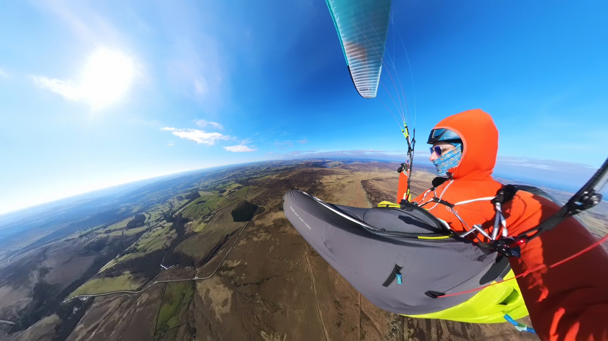](elliot1.jpg)

I start to push forward with a couple of pilots before dropping out of the lift and running back to the hill and into some pretty strong thermals.

**Getting high, do I go over the back?**  
Hmm, >1000m, maybe I should think about going XC, not seen anyone commit to going, but radios start being tested. Drop out and carry on pushing forward, see an RC1 flying, lets see what he does. Get up high again, another Ikuma and a couple of Photons over the back. Pilots talk about going for it and commit, I’m going to join as well!

[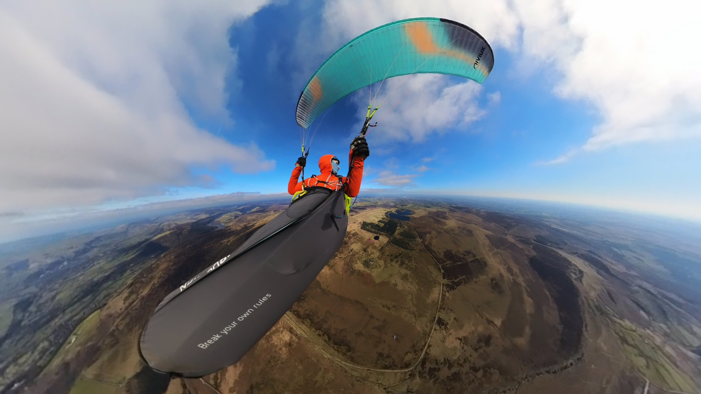](elliot2.jpg)

Decided early on to not to try and catch up, played that game in the Yorkshire Dales and missed the thermal. I’m going to stick with what I’ve got and see where I can get myself.

[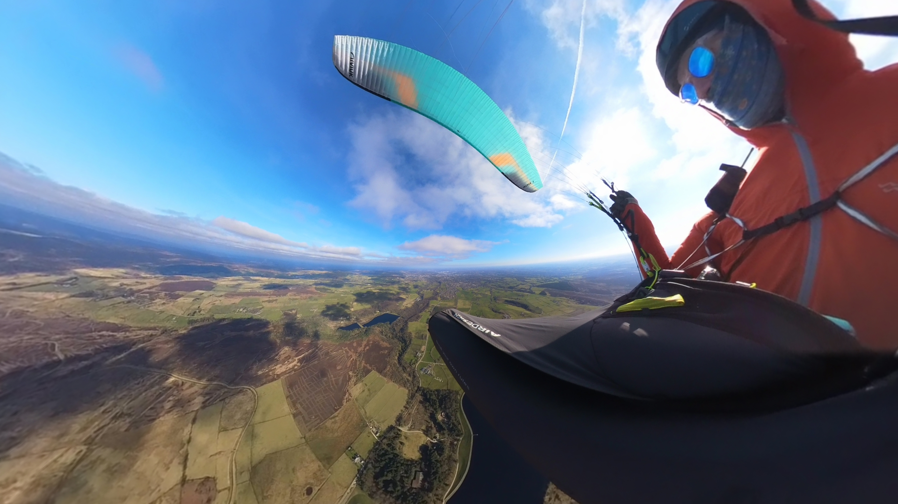](elliot3.jpg)

Not going to catch up, get lift, milk the thermals (probably better nearby) and just go down wind.

**Ok, now what about Sheffield.**  
I have very rarely flown over towns, let alone cities that don’t have a lot of clear fields and outs around. I was very conscious of the terrain between my safety fields and the next one a fair distance away. 

[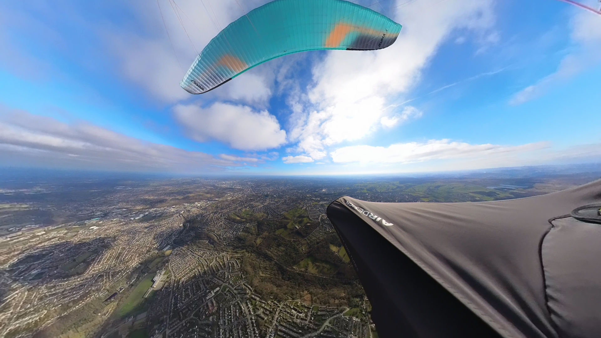](elliot4.jpg)

North looks a bit better and I can see a brown hill that looks inviting.

**Joined by a friend.**  
[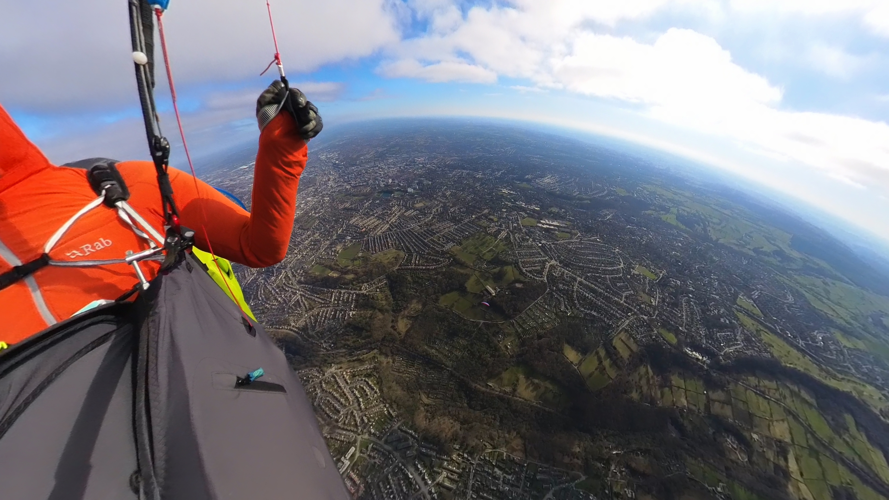](elliot5.jpg)
Neil comes to play, I didn’t have comms with him, but just having another pilot around helped my confidence to push on. At this point, I sped up my flying. Pushing on when the lift dropped off or it was a little weak.

**Escape cloud.**  
Even though the cloud layer seemed thin, I didn’t want to get caught out or start bad habits. Wasn’t super strong, so bar got me out and onto the edge nicely enough. Neil used that to get topped up and on level with me.

Oh airspace!!! I didn’t have an alarm, but just clocked it as I was going by, really should have noticed earlier!

[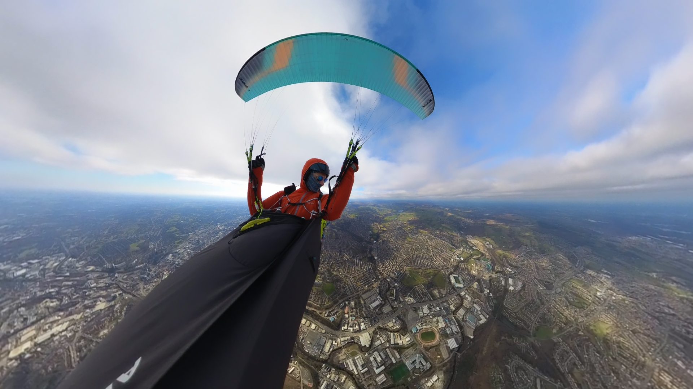](elliot7.jpg)

Oh, ground to 300m, fine.

[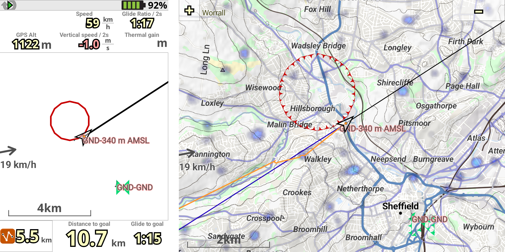](elliot8.png)

**Hmm, I need a pee.**  
Mistake not setting myself up for the best outcome of the day. Once it was on my mind, it was always going to be there reminding me… Oh, well push on. Lovely Rotherham, get on bar.

[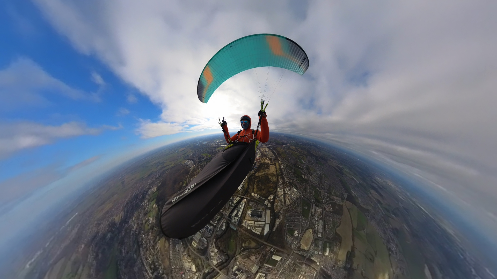](elliot9.jpg)

**Keep going, next station.**  
One handy thing I’ve added to my airspace is a little ribbon for every train station. So I’ve got an idea of what my transport options look like for getting back. But, it can be a ground suck!

[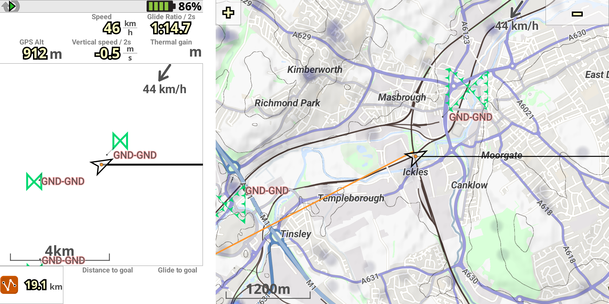](elliot10.png)

**Castles from the sky.**  
And passed another lovely train station… Remember you need to pee.

[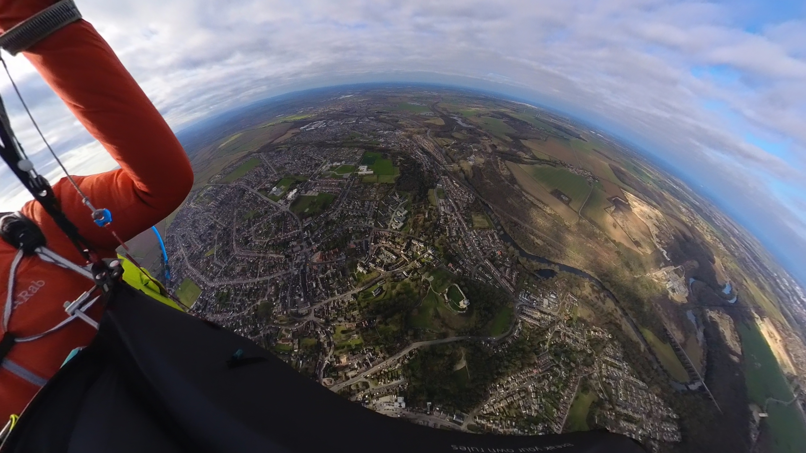](elliot11.jpg)

**Yeah, this will be fine.**  
After the castle, I wasn’t really committing to finding the next climb, Neil had moved off South and I was eyeing up landing options, ruling out heading back towards the castle.

Ok, definitely landing this time, nice big field, no trees up wind (tip of pod). Not actively trying to keep up, just want to get down safely and not in the boonies.

[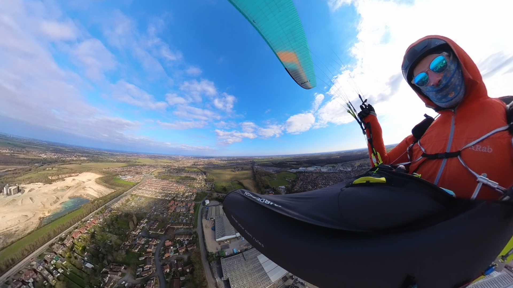](elliot12.jpg)

Landed nicely had a quick chat with some randoms in a car or 2 explaining where I’d come from and pointing to Neil on his climbout that got him another 20km on!

Get onto UK XC Retrieve telegram channel.
Send pin location.
Message plans and #map

[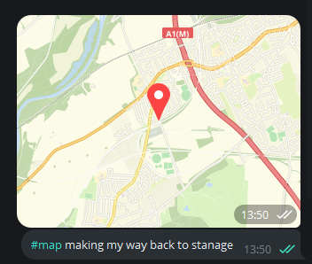](elliot13.png)

Start to pack, just in case some lovely paraglider pilot wants to pick me up, or is nearby with a taxi. I’m down safe and people know where I am.

**Getting back.**  
Next part of the adventure, where am I and how do I get to my car. I’m not next to the railway lines so, bus it is!

bustimes.org - bookmark this site, map with all bus stops, which bus, estimated and actual times. Ran to get the right bus, as it was delayed, saving me about 1 hour on the round the houses bus.
They’ve got tables on the bus!

[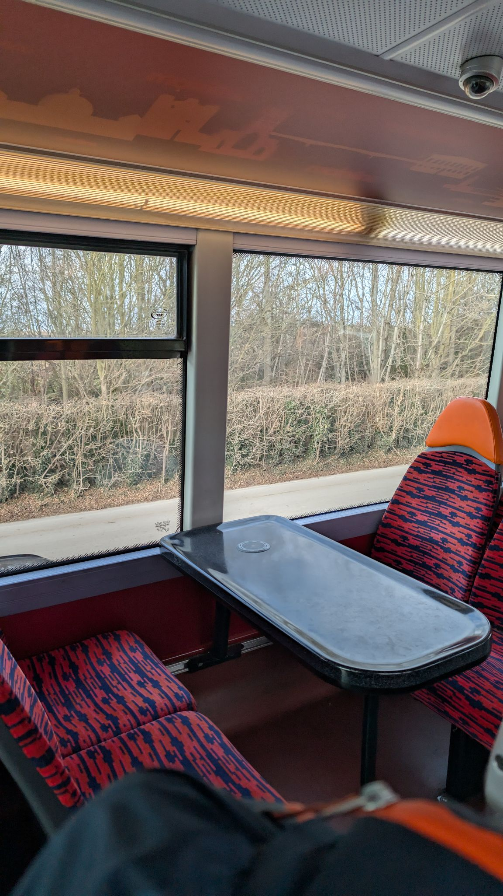](elliot14.jpg)

**Arrive early.**  
Had a potter around Sheffield, updated Telegram to advise when I was getting into Hathersage (I was thinking about walking up to TO from there).

Met Richard Carter and Richard Carter on the train, had a chat about the flight, and the interesting landing option they went for XD.

Talked about what I was expecting (or not) from the forecast, 1 star RASP.  RC1 pointed out that it was cold and there was going to be sunshine, so stuff was bound to happen. Pointed out an option for surface sunshine normalisation that I’ve not seen.

Lift back up to TO sorted, quick update to Telegram and stopping the xcrt track.

Arrived, RC1 went to get his car, another pilot picked him up and took him to his house.

Got back to car 1710hrs.

**What would I do differently and what I’ve learnt**  
XC pee - If there is even a slim chance of going XC, I don’t have to care about hydration. One less thing on my mind.

If it’s been cold and there is sun on the ground, stuff is going to happen. 

Actually do radio checks before being in the air. Mine were fine, but didn’t do any before take off, so not sure I was heard (not that I called out much).

Warmer gloves, or just something for my pointer and little finger, they always get frozen.

https://www.xcontest.org/united-kingdom/flights/detail:ElliottB/2.3.2025/11:29 

**Equipment**  
Wing: Niviuk Ikuma 3  
Harness: AirDesign TheSock  
Insta360 X3 camera  

---

# Preparing for the Season

*Scott Thornhill (Scott wrote this for the DSC, reproduced here with kind permission)*

So this weather has got to break soon right, right 😳😳

When it does we are all gonna be ready to get the season underway so here is a list of ten of my top tips for a safe, stress less and fun 2025 season in a reasonably chronological order.

1. Check all your kit properly, I know we are supposed to carry out a full DI (daily inspection) every time we get it out the bag but in reality it's a quick glance. Give it a good going over NOW and save yourself myther when everyone else is enjoying the first flights of the season.

2. Go and ground handle before it's flyable, somewhere where it isn't flyable with no intentions of flying. Half an hour will be better than nothing, recap on your setup routine make note of things you have forgotten: snood, sunglasses boots that allow to move or whatever, make it so when you do go to fly you are not faffing and stressing with these things that although might only be niggles they are just one more thing on your mind.

3. Have half an hour refreshing yourself on ridge rules and the ANO, think about giving folk extra room and even if you have or think you have right of way be prepared to yield.

4. Lookout for the forecasts and pick your day, it's hard getting the stars to align to allow you to get to the hill on the perfect day with no time constraints and the weather playing ball so always be of the mindset that it's not going to be on. It may be on for others but that doesn't mean it's on for YOU its proper pants when you have put the time and effort in to getting there and it's just not on for you, every part of you wants to "give it it a go" but all that will happen is that you will scare yourself or worse, always a good walk or pint close by and the views are still great, it's never a wasted trip.

5. Get on the hill early sort your kit then get chatting or flying, folk can and do turn up and literally two minutes later are in the air usually towards the middle of the season when they are on it. Get your kit ready to go, we all love a good rattle and a catch up but nothing worse than chatting for half hour whilst folk sky out then by the time you are ready and clipped in it's switched off.

6. Take your time clipping in and checking your kit, if someone starts distracting you they will fully understand if you tell them to give you 5 until you are sorted and ready go.

7. Speak up, don't struggle and overwhelm yourself if you need a hand or want someone to spot your launch, tweak your wing clear a knot ask! Folk are more than happy to help.

8. This is a  Biggie, seen this happen loads in the early part of the season, clear your launch! Have a real good look around and don't pull up unless you are CERTAIN you are clear and safe to do so, first flyable days of the season especially if it's a weekend are usually very busy with rusty pilots scratching about.

9. Stick to ridge rules, thermalling etiquette and set up for landing early until you get your eye in, no point soaring your way down the ridge then having that feeling of am I going to make it.

10. HAVE FUN!  No point scaring yourself doing something because others are, 

Hope that helps somebody in their preparations, looking forward to seeing you all on the hill, in the air, on the train and in the pub this year

---

# Our 2025 Flying Goals

From modest to epic, a few PSC members shared their flying goals for 2025. What's yours?

---

> "100 hours/1st 100k/5 hour flight"
>
> Elliott Brown

---

> "50km and a comp"
>
> Anon

---

> "To actually get some points on the board in the XC league"
>
> Andrew Gridley

---

> "Backfly"
>
> Pete Jones

---

> "250km UK XC Flight"
>
> Richard Meek

---

> "To go XC again. It's been ages."
>
> Neil Charles

---

> "To go flying with my mates"
>
> Mr Bob Dobalina 

---

> "To Fly"
>
> Anon

---

> "Hours in the air. Aiming for 80"
>
> Colin

---

> "Get my Pilot rating and fly my first xc"
>
> Thomas Calway

---

> "Get to the HG sport class worlds in June in Italy as a UK pilot, be selected as an official UK team pilot for that event, win medals at that event (team and individual), complete my microlight biennial instructor flight review before I leave Texas (likely to be August or September) to move to Lancashire.
>
> Then, after I move to Lancashire:
>
> Ground handle my PG at PSC training site(s), Fly my PG at a PSC site, Ditto but on my HG"
>
> Richard Milla

---

# The Gallery





---

# Competitions

*Elliott Brown, Competitions Secretary*

Updated 2-4th March 2025

Flying was done by me and others, hurrah!

### Northern Challenge Series 2025
http://www.xcmap.net/ 

We have some new flights being added and some new pilots appearing this year! A very good start, Ed nearly getting the last TP on Pendle before landing. Whernside getting plenty of action, perfect for a non-xc day.

Parlick had a couple of attempts, with Joseph committing to getting that TP5 and landing on the top. I didn’t fancy it myself 😀 The challenge on Parlick isn’t the grid challenge for the NCS, but you can still give it a whirl and add your flight to the results page.

[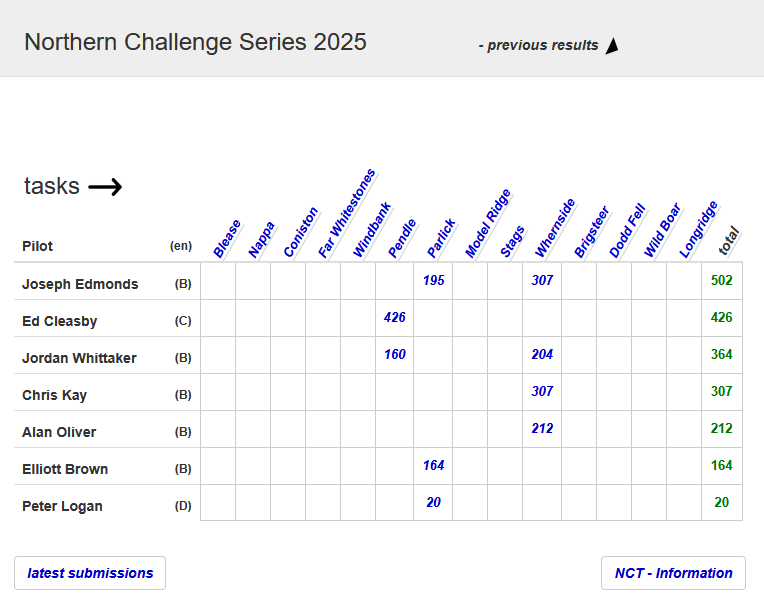](https://www.xcmap.net/results.php?t=544)

### XContest - Pennine Soaring Club

Flying weather has got our Pennine members out and about, fingers crossed this is the start of a great flying season. Don’t forget to get yourself registered to get access and maybe win some prizes.

[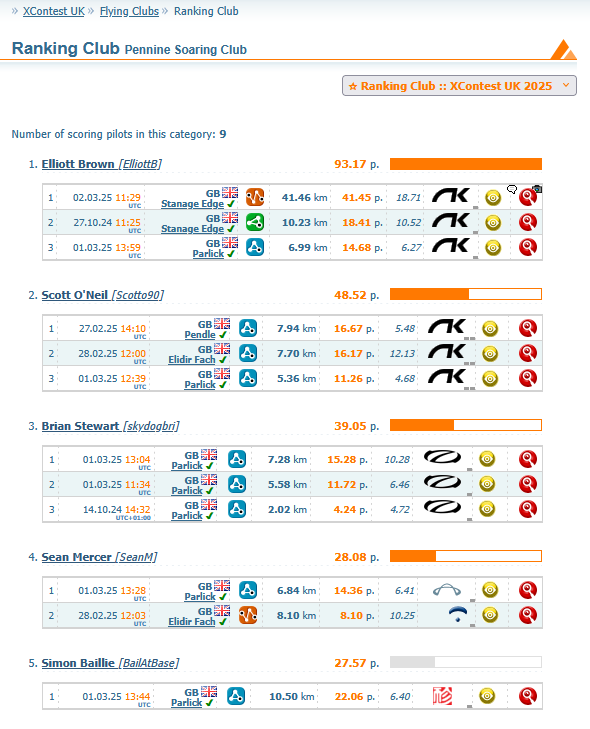](https://www.xcontest.org/united-kingdom/ranking-club:2688)

### XC League
We're waiting on the league to be activated (apologies, flights are there, just needs verifying) 

---

# Dates For Your Diary

**9th March** - Repack day - Chipping Village Hall

**10th March** - Social Night - Sea View Inn, Chorley

**24th - 27th April** - [BP Cup](https://www.bpcup.co.uk/node/12) - Yorkshire Dales

**10th - 11th May** - [Dragon Hike and Fly](https://airtribune.com/dragon-hike-and-fly/info) - Crickhowell, Wales

**TBC** - Pennine Fest

**30th - 31st May** - [Buttermere Bash](https://www.facebook.com/events/603425262077557/) - Buttermere, Lake District

**8th - 14th June** - [British Sports Trophy](https://pgcomps.org.uk/timeline/) - Gemona, Italy

**15th - 26th June** - [Red Bull X-Alps](https://www.redbullxalps.com/int-en)

**18th - 22nd June** - [Lakes Charity Classic / X-Lakes](https://www.cumbriasoaringclub.co.uk/lcc/CSC_LCCMain.php)

**12th - 19th July** - [British Championships](https://pgcomps.org.uk/timeline/) - Krushevo, North Macedonia

**14th - 19th September** - [BP Cup](https://www.bpcup.co.uk/node/12) - Sopot, Bulgaria

**20th - 23rd November** - [Kendal Mountain Festival](https://www.kendalmountainfestival.com/) - Kendal, Lake District

---

# You Might Have Missed

If you have an XCTracer and haven't updated its FLARM software recently, there's a good chance your FLARM expired on 1st March. [Update now](https://www.xctracer.com/en/downloads)!

Once you're all up to date, you can enjoy this inspirational new video from Will Gadd.



---

# Your Newsletter Needs You

Appear in the next newsletter! We need submissions for...

**A Grand Day Out**  
2-3 paragraphs describing a fun day. You're welcome to write more if you're feeling creative but a couple of paragraphs is plenty. Could be epic, could be daft, could be simply the first time you flew for six months. If you've had a good day and you took some pictures, send it in.

**Why Not Visit...**  
A quick guide to a site that you like, at home or abroad. Tell us where it is, what it's like to fly, any watch-outs and how to contact the locals. Attach a photo and email it over.

**The Gallery**  
Send in any recent(ish) shots with when and where they were taken. Spectacular, silly, from the ground or from the air, it doesn't matter. Let's see what you've been up to. Videos are very welcome too but pop them on YouTube or Vimeo and send a link for the newsletter.

**Shout Outs**  
First ever XC? Smashed a PB? Took part in a comp? Let us know and get a shout out in the newsletter. Nominate your mates if they won't do it themselves.

**Top Tips**  
Spotted a bargain? Got a great travel tip? Know how to make Bluetooth connections work on an iPhone? Share your best ideas.

Send submissions on these or anything else you'd like to see featured to [editor@penninesoaringclub.org.uk](mailto:editor@penninesoaringclub.org.uk). You can also drop them over using the [web form](https://docs.google.com/forms/d/e/1FAIpQLSd3NJQKlmLjjlh-nZGQKaeXzN6dSSL2PHzKRXFYAy_Bw7SC9w/viewform?usp=sf_link) or message [Neil](https://t.me/NeilCharles) on Telegram.

--- 

Fly safe, see you in April.