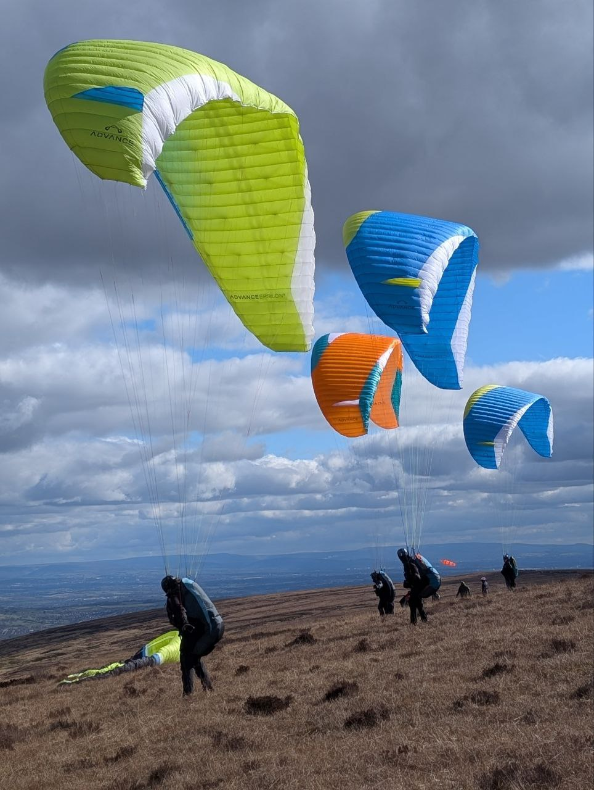
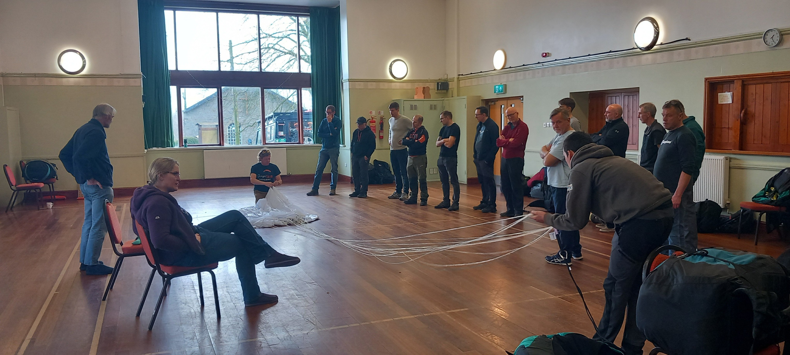
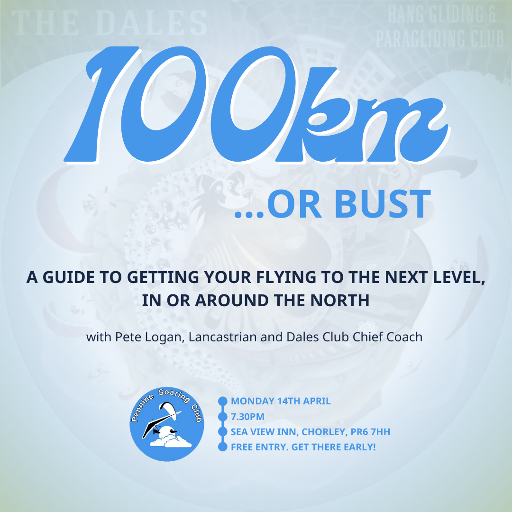
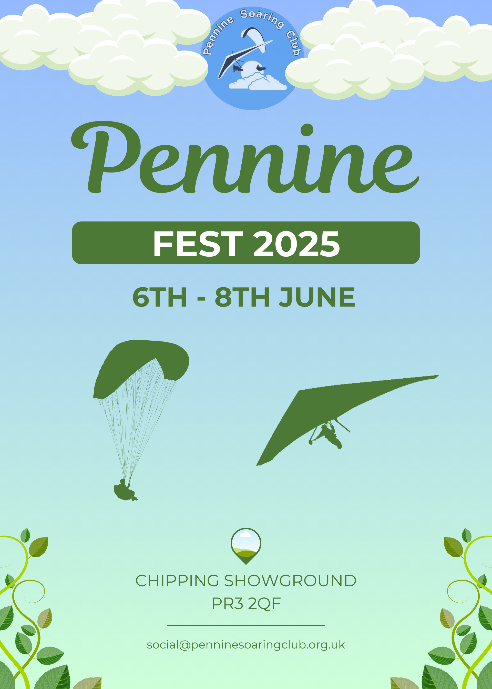
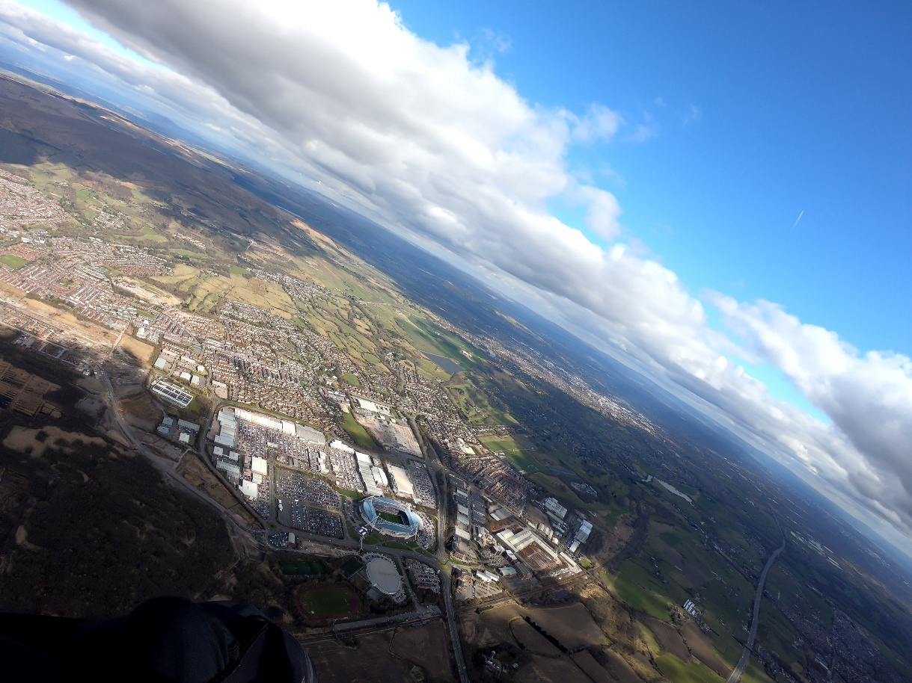
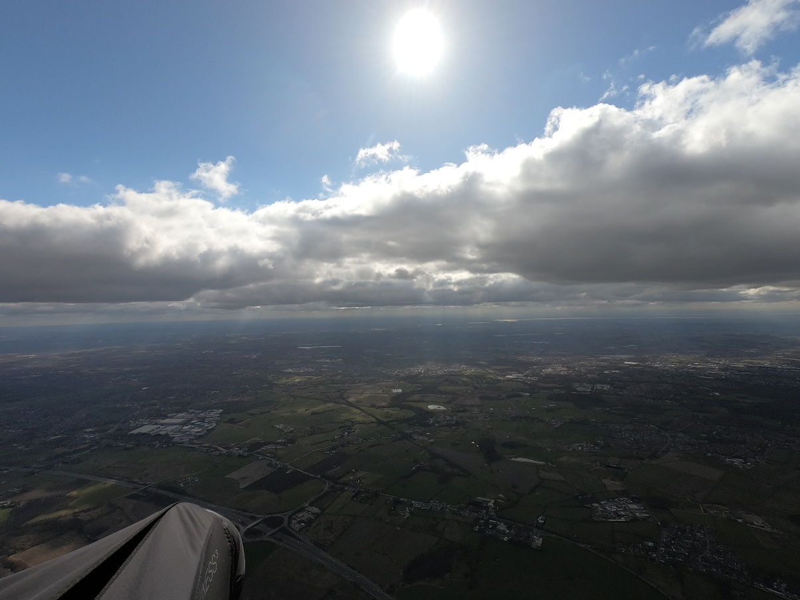
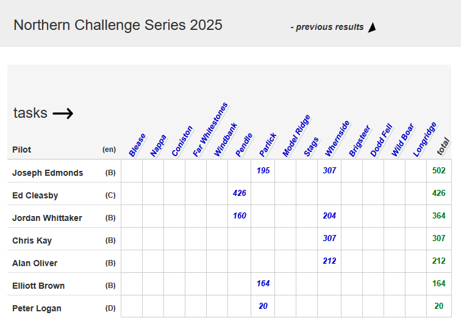
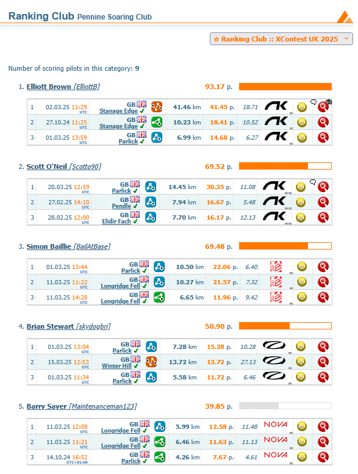
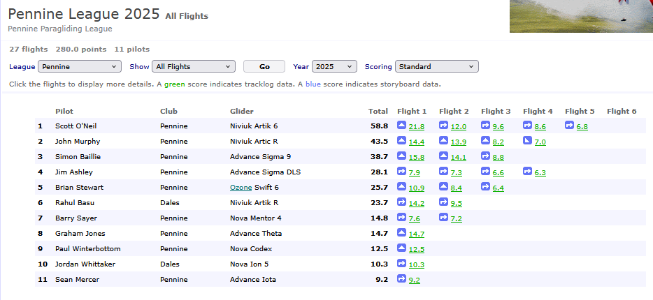

# Beep, beep, beep, beep, beep

Spring proper has arrived, bringing a few XC's and triangles from Pennine Sites and the first 100s of the season starting to appear down south.

To take you into the season, we've got photos from some lovely March flying days, tales of an eventful flight home from Brian, tips for practicing your XC's at home and great news on Pennine Fest from Jacqui. Here comes 2025.

[editor@penninesoaringclub.org.uk](mailto:editor@penninesoaringclub.org.uk).

  
*Cover photo: Max Kidd*

---

# Notes from the Committee

Thank you to everyone involved in the PSC repack on 9th March. Guy Richardson and his team did a fantastic job!

---

# Social

*Jacqui Kavanagh, Social Secretary*

### 100km or Bust

As a special treat, we've got one more club night before we take a break until next winter. Pete Logan, Dales Club Chief Coach has kindly agreed to come and talk to us about getting to the next level and flying that dream 100km.

Monday 14th April, 7.30pm at the Sea View in Chorley.

### Pennine Fest

Chipping Showground has been booked for 6th-8th June for Pennine Fest. More details in the near future but get it in your diary!

---

# Sites

*Andy Archer, Sites Officer*

### Edenfield

The Edenfield lambing period has been extended and now runs 1st April - 25th May.

In a welcome change to previous years, you may still fly Edenfield during these dates but *you must land on the fell side and not land in the official landing field*. If you are not completely confident of being able to land on the fell side then please avoid flying Edenfield until after 25th May.

Signs have been placed at the entrance gate to the access track as a reminder.

### Neighbouring Clubs

Our neighbours will also have restrictions due to lambing, which can change from year to year. Please check their websites before you travel and there's a great article by Christina Richards in this month's Skywords (the Dales Club magazine) about [sheep farming and free flight](https://www.dhpc.org.uk/skywords/#url=https://docs.google.com/document/d/e/2PACX-1vQa9MiDCHH-H486ViInKKp9S2WMD92qpJzsPChte2zL0oMw-hWnenays-Ru8MFP_gTwKpZ7ykVn7c3d/pub), which is well worth your time (HT Emma Wrathall).

### Parlick

From May to October, please do not land in the grass field next to Fell Foot cottage, east of the official landing field on the other side of the road. Fencing has been removed so it looks like a convenient option but during the summer the grass is being grown as a crop.

---

# A Grand Day Out

*Brian Stewart learns some lessons while taking the scenic route home from Winter Hill*

### A Comedy of Errors
(in the Shakespearean sense of a comedy that isn’t really that funny . . .)  

Arriving at take-off on Winter Hill looked like error #1 – Barry’s windsock hanging forlornly, sagging in the wrong direction and John B telling me it had been good a few minutes ago. Undaunted, I kept repeating the mantra: ‘the air’s cold, the sun’s on the ground, something’s got to happen’ while I ran through my pre-launch checklist: Reserve OK, Radio on connected and checked, XCTracer mounted, phone connected, XCTrack working OK, Goal declaration programmed in, risers and lines clear, everything stowed away neatly, gloves switched on, all good (those of you still awake may have noticed error #2 – a sin of omission, but more on that later.)

Remember the Guinness surfer advert? ‘He watches; he waits; tick followed tock followed tick . . .’ No? well, it was a waiting game that day. Error #3 was not reacting to the sudden change of wind direction, then by the time I was ready to go, it was pretty strong. Error #4 was forgetting that I’m nowhere near as nimble as I was, and my ability to run at the wing in tussocky grass has been steadily downgraded, so the inevitable dragging happened next. Error #5 found me with one riser twisted – had I stepped over it or was it incorrectly connected to start with?

Disconnect, sort it all out and rush to get ready to go again, set up for cobra launch this time. Error #6, not enough wind now. Faff around, watch Layne skying out so rush to launch. Error #7 find I’m improperly dressed and my pod is flapping; not dangerous, just draughty.

Now we can re-visit Error #2. No reassuring beeps from the vario! I hadn’t switched on my XCTracer, so the XCTrack was only getting data from the phone GPS, and there was no audio. Much fumbling around trying to press the tiny little button in my thick winter gloves, keeping an eye out on the traffic (not much thankfully) and trying not to lose any precious height. Finally I got it turned on, so could concentrate on staying in the air; fortunately the Winter Hill antennae provide a great visual reference, so by the time the vario GPS got a fix, I was 300’ above take-off, feeling happy about doing it by feel. The air was super buoyant, Layne was up near base and heading towards Belmont. It’s always in my mind to fly home from Winter Hill and that was my goal today. Climbing up past the top of the mast, I knew I only had 3500’ before banging my head on the airspace ceiling. XCTrack is good at warnings – ‘MANCHESTER IS VERY CLOSE’ soon popped up, and this was where Error #2 reared its very ugly head. XCTracer outputs GPS and Barometer altitude data. I like to display both: GPS altitude in metres, Baro altitude in feet. XCTrack’s altitude warnings are based on barometer altitude…

The cloud I was climbing under was extensive, so I knew I had to push on to reach the edge of the lift before it was too late. I think I’m pretty good at judging when to run for the edge of the cloud, but that’s usually into wind or at 90 degrees to the wind (also I had no visual reference to aim for, as the cloud was several hundred feet higher than the airspace limit). Here, I was chasing the edge of a cloud that was running downwind away from me. Big ears; Bigger ears; speed bar; more speed bar... the alti figure kept climbing. Just when I thought I had to start spiralling, the vario finally stopped beeping at around 3460’. Phew! I flew out into the blue hole over Middlebrook and the Wanderers’ stadium, still not really descending but not climbing either. Some half-hearted spiralling got me some good views of the Bolton v Stockport crowd.

Pushing on towards home, there was another big cloud there, and sure enough the vario was beeping long before the M61. I kept turning back towards the blue hole, and knowing I had to get below 2500’ very soon, I had to wait until the wind blew the patch of sink far enough for me to continue.

Once there, and the computer calculated a glide angle less that 5 to my home field, I just pointed my feet along the line on the screen, arriving over goal with over 1000’ to spare, telephoning a surprised Marie from the air to say I was 1000’ above. She arrived in the field just in time to see me land. A cuppa and a lift back to get the car was assured

### ToughSheet
Smug mode lasted until I sat down at home to review the flight. GPS Dump confirmed that it was a flight to goal, and would score as such, but I hadn’t paid any attention to the displayed height in metres, during the flight and I could see that the numbers were a bit big. Nearly 100m too big! How could they be so different? It all comes down to Error #2. XCTracer calibrates its barometer to your altitude at take-off. Works fine if it gets its GPS fix while you’re on the ground. Doesn’t work if you’re 300’ above, meaning every data point is 300’ low.

So, lots of lessons there, but mainly:  
- Interrupted checklists are useless – start over every time.
- Be realistic about abilities – strong wind launches need ability AND agility

---

# Practicing at Home

*Texas-based (soon to be Pennine-based) Richard Milla has an invite for us to learn about Glidersim and practicing in VR*

Howdy y’all!

Do you want to improve your safety by being better prepared before you fly at a new site?

Do you want to experience what it would be like to fly ANYWHERE, including sites like:
- Ager, ESP
- Devil’s Dyke, GBR
- Laveno-Mombello, ITA
- Torrey Pines, USA

I’ve recently discovered you can do all that with a Meta Quest VR headset and/or a high end
windows PC, and software like GliderSim-by-5D-Realities or FreeFlightExperience, potentially
for as little as the cost of two or three tandem aerotows!!

This is NOT an advertisement or an endorsement. I just want to share what I’ve found because I think it could be helpful to other folks.

Be safe, have fun!

Richard Milla  
Fort Worth, Texas, USA

*Richard has written an [overview guide](0010_HG_safety_GliderSim_OVERVIEW_v002.pdf) and for more information, please send an e-mail to: [flysafe.flyhigh.flyfar@gmail.com](mailto:flysafe.flyhigh.flyfar@gmail.com) for an invitation to a dedicated Telegram chat group with more info about it all.*

---

# The Gallery



---

# Competitions

*Elliott Brown, Competitions Secretary*

Updated 1st April 2025

### Northern Challenge Series 2025

No new pilot entries so far but there has been a reshuffle in the top 5, with more local flights getting added and building those points up. Don’t forget that this is Pennine Soaring Club pilots flying in the UK, so get your flights uploaded when you’ve headed further afield, outside of PSC sites.

### XContest - Pennine Soaring Club

Flying weather has got our Pennine members out and about, fingers crossed this is the start of a great flying season. Don’t forget to get yourself registered to get access and maybe win some prizes.

### XC League
And we’re live! The Pennine League for 2025 is up and working. Now we just need more of that good weather I’ve heard so much about.

---

# You Might Have Missed

Our new [Instagram account](https://www.instagram.com/pennine_soaring_club/) has picked up its first 100 followers. If you'd like your pics to appear on the club page, just tag @pennine_soaring_club when you post and we'll try to re-share posts and stories that show everyone how much fun we've been having. If you've got a private Instagram profile then we can't re-share unfortunately but tag @pennine_soaring_club anyway and Neil might steal them for the newsletter gallery.

---

# Dates For Your Diary

**14th April** - Club Night: 100km or Bust - Sea View Inn, Chorley

**24th - 27th April** - [BP Cup](https://www.bpcup.co.uk/node/12) - Yorkshire Dales

**10th - 11th May** - [Dragon Hike and Fly](https://airtribune.com/dragon-hike-and-fly/info) - Crickhowell, Wales

**30th - 31st May** - [Buttermere Bash](https://www.facebook.com/events/603425262077557/) - Buttermere, Lake District

**6th - 8th June** - Pennine Fest - Chipping Showground

**8th - 14th June** - [British Sports Trophy](https://pgcomps.org.uk/timeline/) - Gemona, Italy

**15th - 26th June** - [Red Bull X-Alps](https://www.redbullxalps.com/int-en)

**18th - 22nd June** - [Lakes Charity Classic / X-Lakes](https://www.cumbriasoaringclub.co.uk/lcc/CSC_LCCMain.php)

**12th - 19th July** - [British Championships](https://pgcomps.org.uk/timeline/) - Krushevo, North Macedonia

**14th - 19th September** - [BP Cup](https://www.bpcup.co.uk/node/12) - Sopot, Bulgaria

**20th - 23rd November** - [Kendal Mountain Festival](https://www.kendalmountainfestival.com/) - Kendal, Lake District

---

# Your Newsletter Needs You

Appear in the next newsletter! We need submissions for...

**A Grand Day Out**  
2-3 paragraphs describing a fun day. You're welcome to write more if you're feeling creative but a couple of paragraphs is plenty. Could be epic, could be daft, could be simply the first time you flew for six months. If you've had a good day and you took some pictures, send it in.

**Why Not Visit...**  
A quick guide to a site that you like, at home or abroad. Tell us where it is, what it's like to fly, any watch-outs and how to contact the locals. Attach a photo and email it over.

**The Gallery**  
Send in any recent(ish) shots with when and where they were taken. Spectacular, silly, from the ground or from the air, it doesn't matter. Let's see what you've been up to. Videos are very welcome too but pop them on YouTube or Vimeo and send a link for the newsletter.

**Shout Outs**  
First ever XC? Smashed a PB? Took part in a comp? Let us know and get a shout out in the newsletter. Nominate your mates if they won't do it themselves.

**Top Tips**  
Spotted a bargain? Got a great travel tip? Know how to make Bluetooth connections work on an iPhone? Share your best ideas.

Send submissions on these or anything else you'd like to see featured to [editor@penninesoaringclub.org.uk](mailto:editor@penninesoaringclub.org.uk). You can also drop them over using the [web form](https://docs.google.com/forms/d/e/1FAIpQLSd3NJQKlmLjjlh-nZGQKaeXzN6dSSL2PHzKRXFYAy_Bw7SC9w/viewform?usp=sf_link) or message [Neil](https://t.me/NeilCharles) on Telegram.

--- 

Fly safe, see you in May.