# Lovely weather, shame about the day job

Did you catch Big Tuesday? For those not in the office and with the skills to take advantage, Tuesday 29th April saw booming conditions, with flights from the Pennines all the way to Newcastle and Durham. Eight XContest pilots broke the 100km barrier from Parlick and those of us in the office at least got to watch along on [puretrack.io](https://puretrack.io/).

We've got some lovely contibutions this month from Scott, Doug and Elliott, plus important news about lambing on Edenfield and an update on Pennine Fest. Dust your tent off, it's going to be brilliant.

[editor@penninesoaringclub.org.uk](mailto:editor@penninesoaringclub.org.uk).

[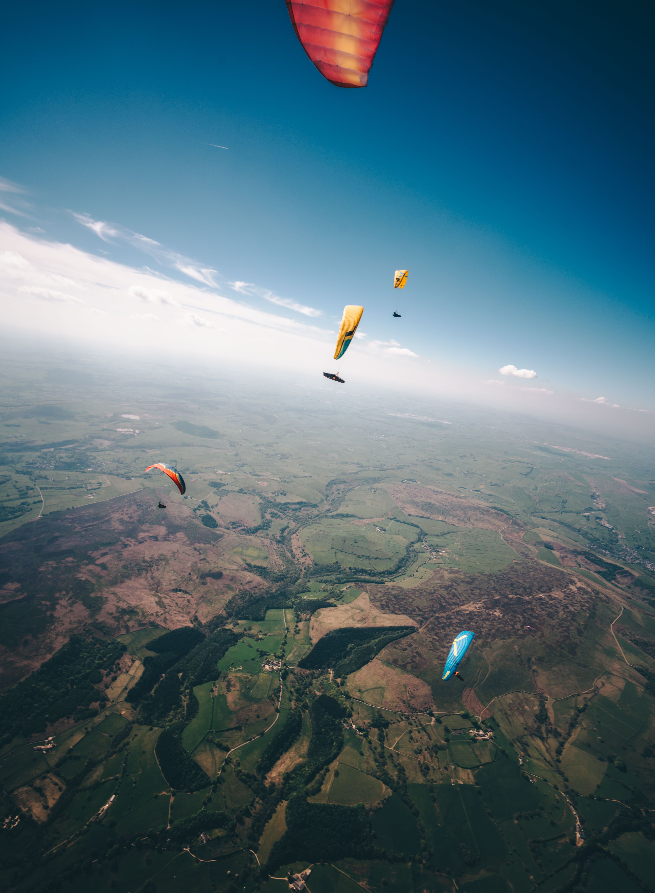](cover.jpg)  
*Cover photo: John Oliver*

---

# Sites

*Andy Archer, Sites Officer*

### Edenfield

Last month, I reported that after discussions with the farmer grazing sheep and lambs on the landing field, we had managed to keep the site open with an extended restriction period. Unfortunately, that is no longer the case.

Earlier this month, following southerly winds, several members were approached by a different farmer while flying on the fell. Further discussions have since taken place with both farmers, and a new agreement has been reached.

Revised Arrangements:

**Edenfield landing field will be closed for lambing from 1st April to 25th May.**

**The Edenfield site will return to the usual closure period of 25th April to 25th May.**

Please respect these closure dates.

Thank you for your understanding and cooperation.

Andy

### Parlick

From May to October, please do not land in the grass field next to Fell Foot cottage, east of the official landing field on the other side of the road. Fencing has been removed so it looks like a convenient option but during the summer the grass is being grown as a crop.

---

# Money Box

*Jim Ashley, Treasurer*

### SIV

If you've done your first SIV course you could claim a £50 subsidy from PSC. This will usually be your second year of PSC membership for obvious reasons and subject to committee aproval.

Send whatever proof you have to me at [accounts@penninesoaringclub.org.uk](mailto:accounts@penninesoaringclub.org.uk)

### Thanks from North West Air Ambulance 

[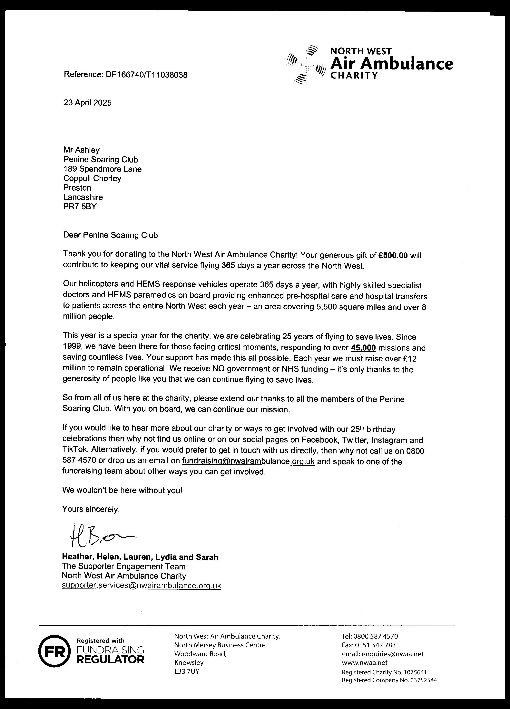](air_ambulance.jpg)

---

# Notes from the Committee

Many thanks to Pete Logan for his brilliant '100km or Bust' club night that rounded off our winter programme in April. If you missed it, you can still watch the recording on YouTube.



---

# Social

*Jacqui Kavanagh, Social Secretary*

### Pennine Fest

Chipping Showground has been booked for 6th-8th June for Pennine Fest.

The cost of a camping pitch is £15 per night with electric hook up extra at £8 per night, payable in cash at the venue.

There will be a group meal on Saturday the 7th at the Sun Inn but places will be limited - watch this space.

---

# A Grand Day Out

*Scott O'Neil*

"A link to my bucket list flight" says Scott and watching this footage of Snowdonia, he's not exaggerating. Beautiful.



---

# Coaching Corner

*Simon Baillie, Chief Coach*

We have a new Telegram XC development group. It is intended for BHPA members who hold a Pilot rating, and are therefore insured to fly XC.

The idea is to encourage, and help motivate, PSC members who want to improve their XC skills. It's primarily a discussion group for new and aspiring XC pilots to ask questions, bounce ideas around, gaggle up, and get get advice from the more experienced pilots. There are some good XC pilots on it, so please feel free to ask questions or advice. There are no stupid questions!
https://t.me/+a3hagh3YKXgwMGE0

---

# A Grand ~~Day~~ Week Out

*Doug Neil*

The weather finally came good at the end of April, start of May and I managed to fly on 4 days out of 6. This helped me power through the 200th flying hour in my logbook, got me a smashed nose and beat my previous best distance in the UK.  Here's how my week went.

**Monday - Stanage, Peak District**

A good forecast and while I was rigging a couple of HGs took off and immediately caught thermals along the ridge and reached well over 3000 ASL. The wind then dropped and when I took off, it was a scratchy ridge run where I didn't get much over the top of the crags then ended up at the bottom. Great to see a decent size group of HGs in one place which is a rarity these days.

Video: https://youtu.be/zZdev13J5M8

**Tuesday - Tailbridge, Yorkshire Dales**

It was a perfect Tailbridge HG forecast and when I arrived it was 18mph and a great wind direction. Managed about an hour in air that began smooth but turned quite rough. Very choppy on landing and the glider spun on the ground with me ending up faceplanting in the dry grass and heather. My wife suspected a broken nose, but after the bruising faded a few days later it turned out to be just soft tissue getting mashed.  Try not to say "Oooo, nasty" at 2.42 in the video!

[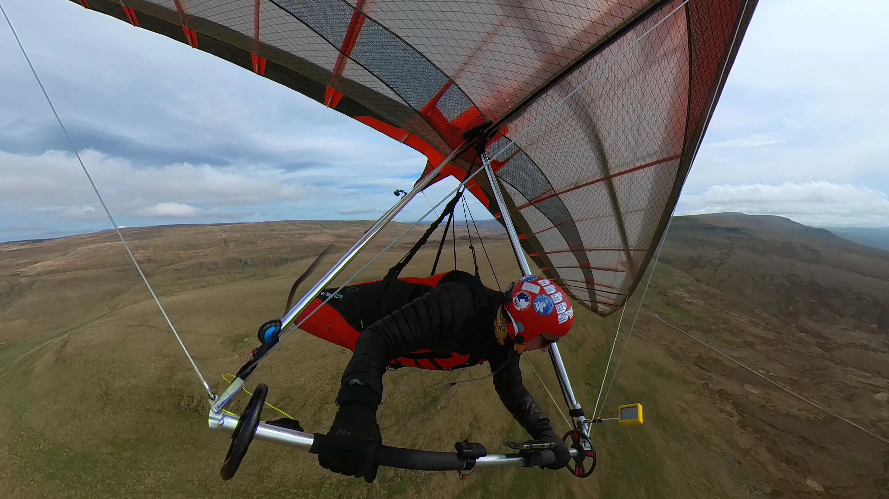](dn_tailbridge_soaring.jpg)

Video: https://youtu.be/o79s6RaR_ew

**Thursday - Bradwell, Peak District**

A few months ago I was selected as second reserve for the British team at the HG Class 1 Sports World Championships - a great opportunity to fly in a CAT 1 comp without any pressure to perform well; I could go along and just do my own thing! Recently, the first reserve pulled out and this week the comp organisers changed the rules so a team is 4 pilots instead of 3 and I became an official team member. After a couple of days of me flapping my hands and running around in circles screaming, I decided to up my game and joined another team member at Bradwell on an epic day that saw plenty PGs and my colleague flying all the way to the coast. Not so far for me but I landed after about 19km on the outskirts of Sheffield; my longest flight in the UK.

It wasn't so easy getting away from Bradwell with the sky teeming with PGs and a few HGs, all desperate for that first thermal. Eventually I picked one up however and stuck with it to 3000ft ASL and drifted about 3km. A short while after I caught another which took me to 5600ft ASL and another 4km. From this point I glided all the way to the outskirts of Sheffield at about 2300ft - not enough to get all the way across the city, I circled in zeros for a while then set off around the edge of the built-up area. It turns out that the sky over Sheffield was booming, so if I had ventured even a short way into the city I would have skyed out again and got much further, while still being able to turn around and escape to good landing fields if nothing turned up. A big mistake that I learned from that day. My path outside the border of Sheffield was non-stop sink and shortly afterwards I landed in a very large ideal field, sloping upwards into wind. A local resident turned up with ice lollies and a request for me to take off and land again because she didn't get her camera out in time!

[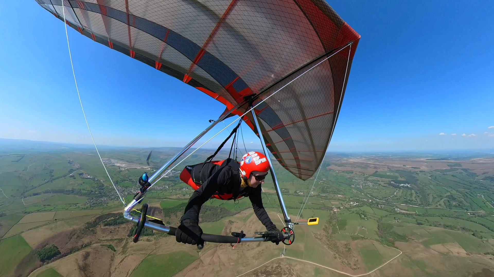](dn_leaving_bradwell.jpg)

[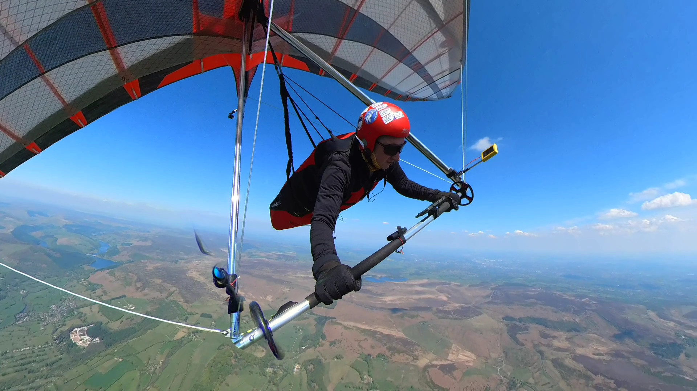](dn_hathersage_5500.jpg)

[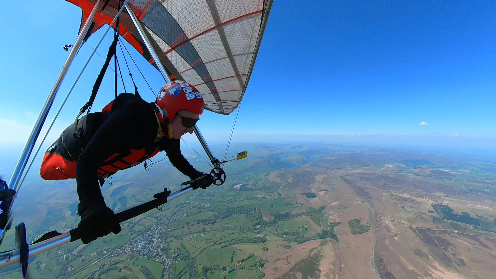](dn_gliding_stanage.jpg)

[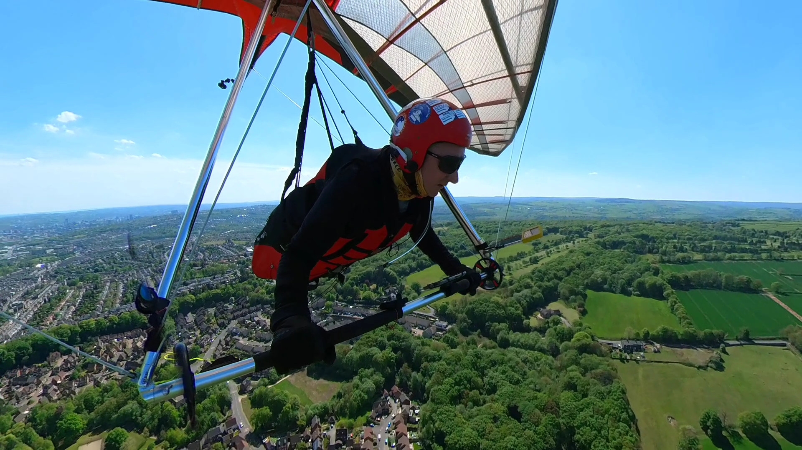](dn_landing_field_choice.jpg)
	  
Video: https://youtu.be/-9BOLibm-bY

**Saturday - Longridge**

RASP indicated a blob of red (5-star) joining Longridge to my home in Blackrod at around 2-3pm, so I headed out with a plan to fly about 30km. Wind was 15-20mph when I arrived, but by the time I had rigged it had dropped significantly so I was concerned about not staying up at all. I took off and carefully scratched along the ridge until I was about 100ft above the trig point - safe enough to zip up my harness. A few minutes later I picked up an excellent, smooth thermal that took me to cloudbase at 3600ft ASL. Listening on the radio to the PGs who were flying down on the ridge, it seemed that things were turning off so I turned downwind to follow my plan. This was a mistake, downwind was all in shade but out front of Longridge was sunny. I should have cancelled my plan and made the most of exploring the valley. Instead my flight downwind was a sled ride to the ground a few kilometres past Ribchester. I found another great landing field, though messed up my landing slightly with a late flare.  While derigging just after 2pm the sky opened up above me and looked far better - heyho, another lesson learned.

[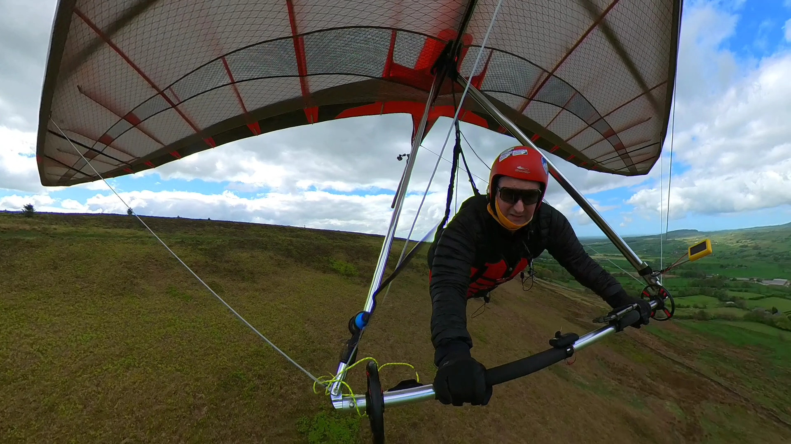](dn_longridge_scratching.jpg)

[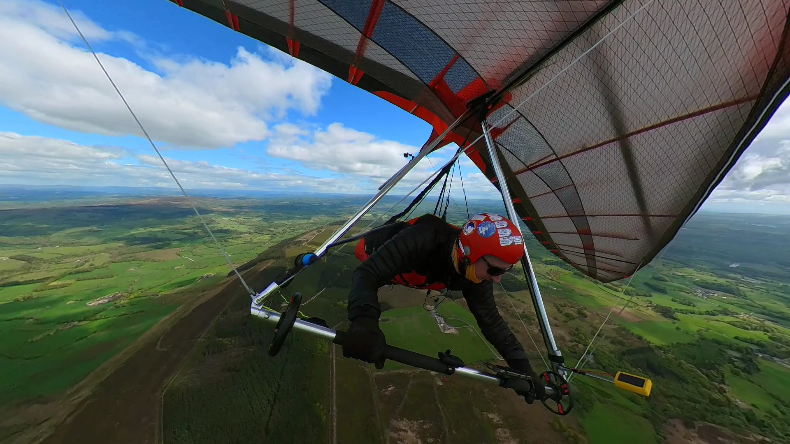](dn_longridge_climbout.jpg)

[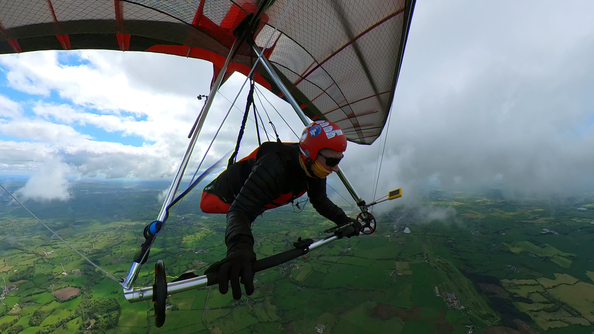](dn_longridge_cloudbase.jpg)

Video: https://youtu.be/RDqLhh5MPGI

---

# Super Tuesday

*John Murphy shares some thoughts on Tuesday 29th April*

A 5 star day on Parlick is very unusual but that was Tuesday the 29 th April and to prove how good the forecast was, some of the top XC pilots from Scotland, Dales and the Lakes were there.

For me the start was really good, when the thermals started and pilots launched it was busy, but everyone had the same aim, find lift and turn in it. The trickiest times were when adjacent cores started to merge and pilots had to judge when to open out to form one thermal gaggle. It was still a relief when I found a good core that lasted and took me to over 4000 feet. This made the crossing over to the Trough of Bowland easier, there was a big dark cloud to aim for and it provided strong lift. Another glider joined me but we both were in danger of being pulled into the cloud, he headed east and I decided to head west to ensure no danger of us ending up close in cloud.

This did mean I was getting closer to where the sea air was starting to push in, evidenced by cloudless blue skies. I then started pushing more to the north east chasing the clouds, to my north was blue, again probably the sea air that pushes down the Settle valley.

A long glide to Ingleton and then onto the foothills of Ingleborough left me struggling, Simon Baillie went over me onto Ingleborough and was scratching his way up the slopes. I found lift coming off the limestone crags and I was able to milk it back up to 3000 feet. I then decided to glide over the Ribblehead viaduct to a cloud that looked promising, dark bottom and solid shadow on rising ground.

It didn't deliver and that was game over, made worse by Simon and several others gliding over me at cloudbase. That, however, is part of the attraction of XC, it's not easy and you just never know how far you will get, where you will land and how you get back – it's an adventure!

There's loads more on the new XC Coaching Telegram group, including a brilliant, detailed write-up by Phil Wallbank. Make sure you join! See Coaching Corner for the link.

---

# Photo Diary

*Elliott Brown at the Dales BP Cup Round*

[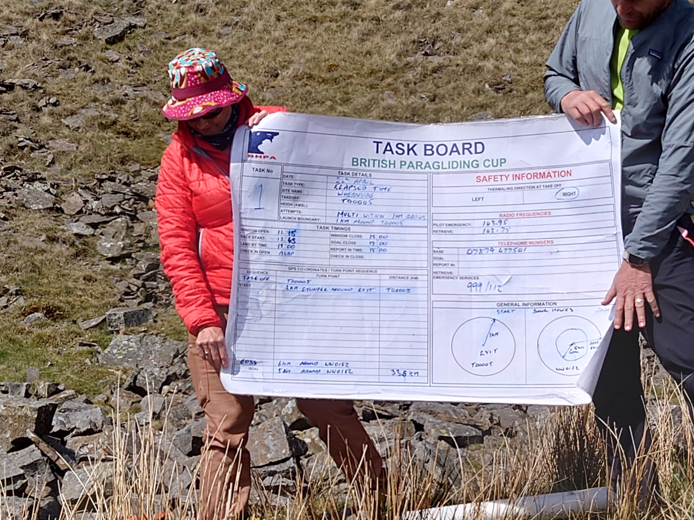](e_bpc3.jpg)

[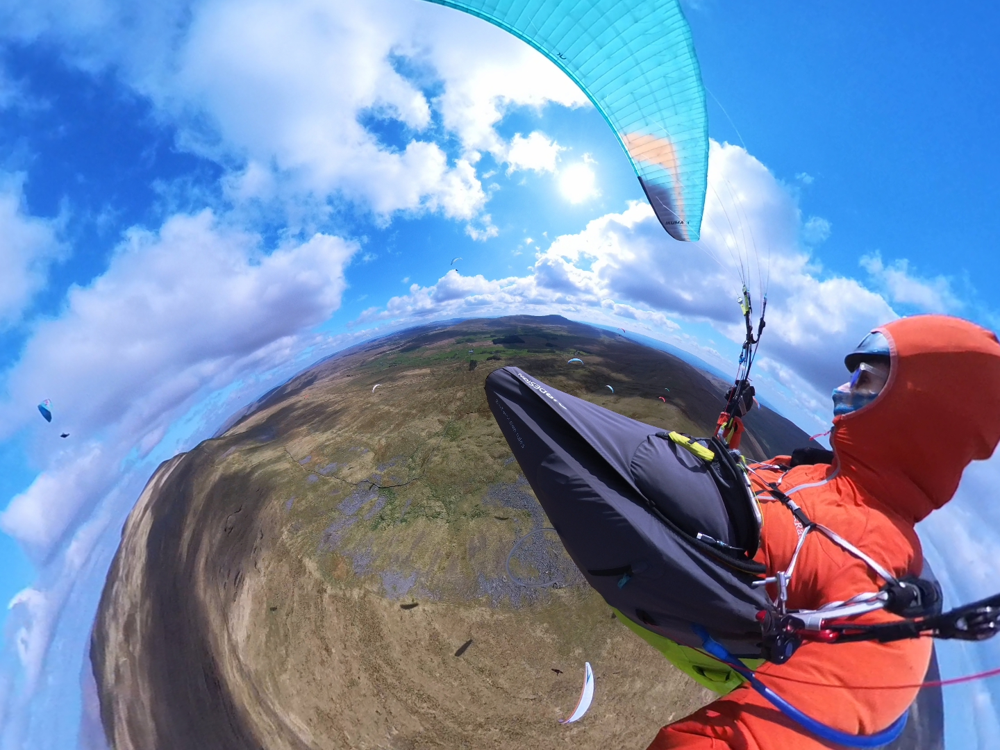](e_bpc5.jpg)

[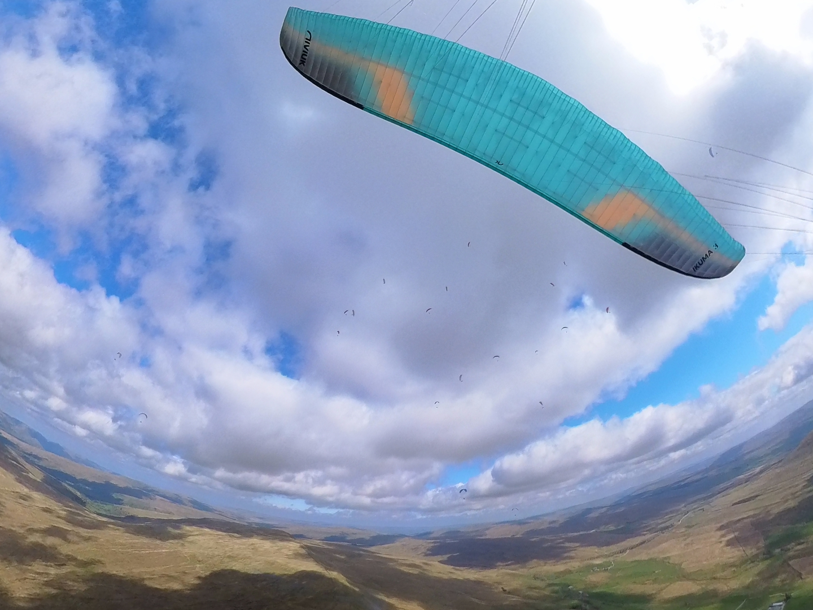](e_bpc6.jpg)

---

# Competitions

*Elliott Brown, Competitions Secretary*

Updated 1st April 2025

### Northern Challenge Series 2025

Lots of new pilots and flights were added in April. Whernside has had a good couple of days of flying, with lots of people attempting the task, with Mr Kay completing it. I tried my hand at Nappa (great site!), while I was in the Dales for the BP Cup and the weather wasn’t looking great for a task. Perfect day for the NCS tasks though!

[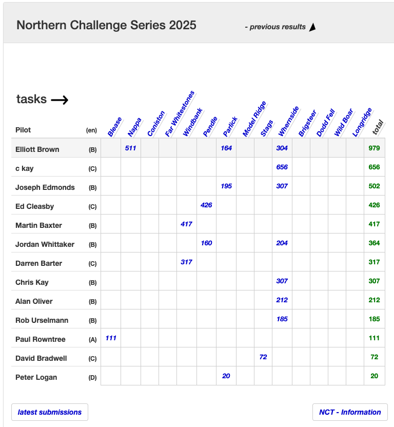](https://www.xcmap.net/results.php?t=544)

### XContest - Pennine Soaring Club

A note about XContest, Tim is going through and making sure that any airspace breaching flights are disallowed. Details below:

[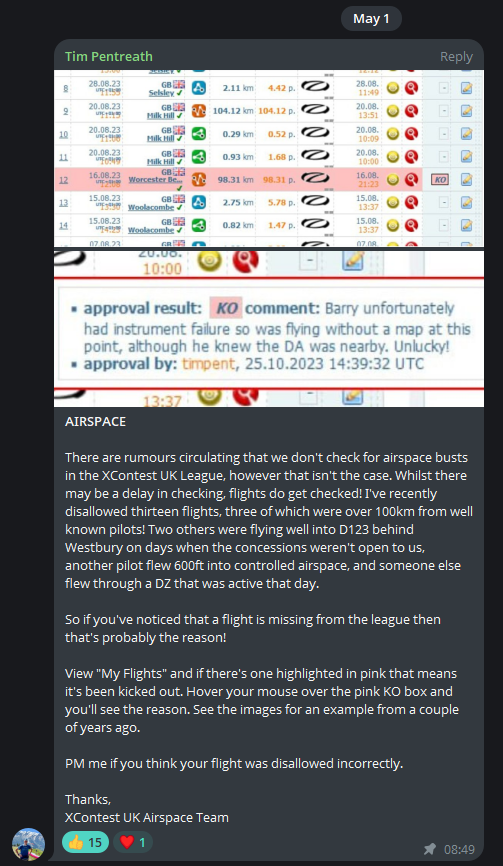](xcontest-airspace.png)

Lots of activity on the XContest ranking this month, with a couple more pilots joining in the fun. Cracking flights for Scott in Scotland, has secured the top spot with a healthy lead. Parlick has had a number of good XC days in April, bumping those XC km’s for our pilots.

[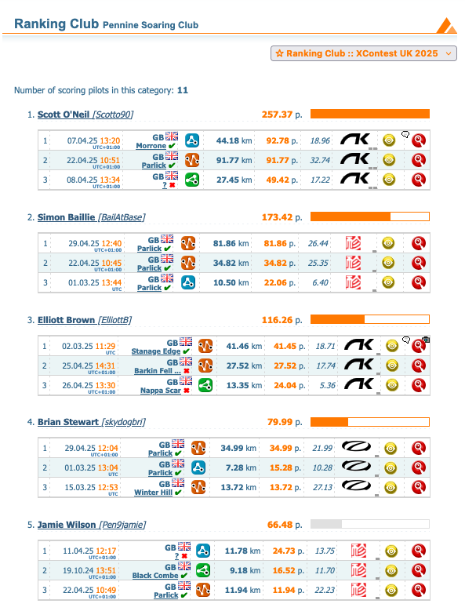](https://www.xcontest.org/united-kingdom/ranking-club:2688)

### XC League

[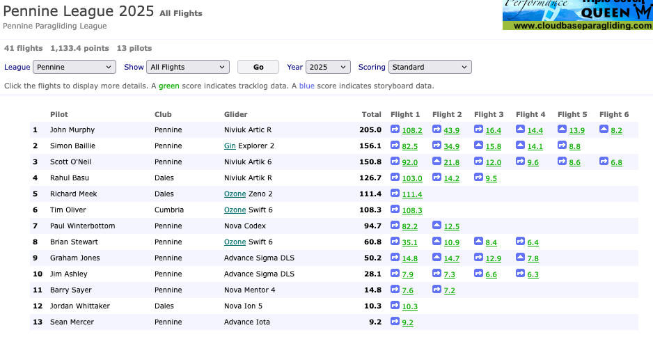](https://xcleague.com/xc/leagues/view-15.html)

### BP Cup Dales Round 24-27th of April

The Dales hosted 40 pilots from all over the UK to take part in the BP Cup UK round. We managed to get 2 good tasks completed.

Task 1 - TO Whernside - Goal - near Windermere 33.5km

Good conditions that changed into lots of top cover.

Task 2 - TO Barkin - Goal - Shap - 31.9km

Day 3 was written off, as there were lots of low clouds and an awkward wind direction. So free fly, bike or potter about day. Prize giving was done that afternoon and 2 of our club members placed in the top 6!

2nd - Paul ‘I’m not competitive’ Winterbottom
5th - Scott O’Neil

John Murphy and myself also joined in the good fun.

---

# Shout Outs

A couple of pilots who have already appeared in this issue are due a round of congratulations.

Doug Neil for making the British Class 1 Hang Gliding Team, with a competition debut in 4 weeks.

And Scott O'Neil who's leading the charge for Pennine in the XC league and was placed as high as 2nd on 26th April.

[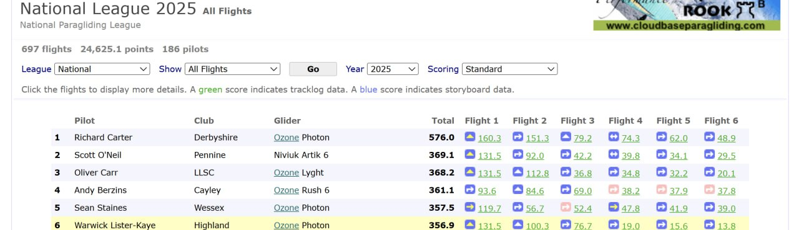](scott_xcl.jpg)

Amazing work both!

---

# The Gallery





---

# Dates For Your Diary

**10th - 11th May** - [Dragon Hike and Fly](https://airtribune.com/dragon-hike-and-fly/info) - Crickhowell, Wales

**30th - 31st May** - [Buttermere Bash](https://www.facebook.com/events/603425262077557/) - Buttermere, Lake District

**6th - 8th June** - Pennine Fest - Chipping Showground

**8th - 14th June** - [British Sports Trophy](https://pgcomps.org.uk/timeline/) - Gemona, Italy

**15th - 26th June** - [Red Bull X-Alps](https://www.redbullxalps.com/int-en)

**18th - 22nd June** - [Lakes Charity Classic / X-Lakes](https://www.cumbriasoaringclub.co.uk/lcc/CSC_LCCMain.php)

**12th - 19th July** - [British Championships](https://pgcomps.org.uk/timeline/) - Krushevo, North Macedonia

**14th - 19th September** - [BP Cup](https://www.bpcup.co.uk/node/12) - Sopot, Bulgaria

**20th - 23rd November** - [Kendal Mountain Festival](https://www.kendalmountainfestival.com/) - Kendal, Lake District

---

# Your Newsletter Needs You

Appear in the next newsletter! We need submissions for...

**A Grand Day Out**  
2-3 paragraphs describing a fun day. You're welcome to write more if you're feeling creative but a couple of paragraphs is plenty. Could be epic, could be daft, could be simply the first time you flew for six months. If you've had a good day and you took some pictures, send it in.

**Why Not Visit...**  
A quick guide to a site that you like, at home or abroad. Tell us where it is, what it's like to fly, any watch-outs and how to contact the locals. Attach a photo and email it over.

**The Gallery**  
Send in any recent(ish) shots with when and where they were taken. Spectacular, silly, from the ground or from the air, it doesn't matter. Let's see what you've been up to. Videos are very welcome too but pop them on YouTube or Vimeo and send a link for the newsletter.

**Shout Outs**  
First ever XC? Smashed a PB? Took part in a comp? Let us know and get a shout out in the newsletter. Nominate your mates if they won't do it themselves.

**Top Tips**  
Spotted a bargain? Got a travel tip? Know how to make Bluetooth connections work on an iPhone? Share your best ideas.

Send submissions on these or anything else you'd like to see featured to [editor@penninesoaringclub.org.uk](mailto:editor@penninesoaringclub.org.uk). You can also drop them over using the [web form](https://docs.google.com/forms/d/e/1FAIpQLSd3NJQKlmLjjlh-nZGQKaeXzN6dSSL2PHzKRXFYAy_Bw7SC9w/viewform?usp=sf_link) or message [Neil](https://t.me/NeilCharles) on Telegram.

--- 

Fly safe, see you in June.