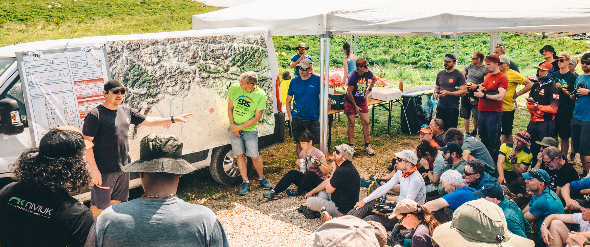
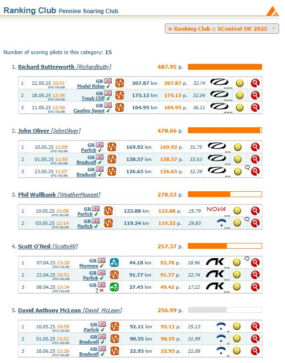

# Look mum, I'm ~Chrigel~ Aaron Durogati

Hopefully everyone was too distracted by the X-Alps to notice that June's newsletter went astray in the post. After some booming spring conditions, flying weather was a bit harder to come by and so were any photos or stories of you lot enjoying yourselves.

Unfortunately, Pennine Fest went the same way too and had to be cancelled with absolutely no chance of any flying across the whole weekend.

But we're back! Paragliding and hang gliding have happened in the Pennines and we've got photos and stories to brighten your day. Thoughts from Brian on the X-Alps, comps news from Elliot and our own Doug Neil on his escapades in the British Hang Gliding Team at Laveno-Mombello. Plus loads of photos, including some gorgeous ones from John of the British and Irish Sports Championships in Gemona, Italy.

Keep taking your camera flying and it's sunny buoyant evenings all the way to autumn now.

[editor@penninesoaringclub.org.uk](mailto:editor@penninesoaringclub.org.uk).

  
*Cover photo: Neil Charles*

---

# Chairman's Chunterings

*Brian Stewart, Chairman*

Risk & Reward

X-Alps! What an amazing spectacle as the leaders homed in on Zell Am Zee; Aaron Durogati taking a risky direct route through the complexities of Innsbruck airspace after hiking through the night to grab 1st place by minutes. A great achievement after trying so hard in the previous events and great to see a new face, Lars Meerstetter who was Chrigel’s supporter and protégé, squeaking in ahead of Simon Oberrauner. So close after nearly 8 days of hard racing where the lead was constantly changing.

So fortunate that there were no major injuries despite the horror story videos of some of the take offs in the violent winds – the glider control skills on display were amazing, but not for the faint hearted, and when you see top pilots like Maxime Pinot withdrawing it does make you wonder when the risks get too much. I suppose it’s not unlike the Isle of Man TT which has a much higher injury record, and a heavy toll of fatalities too. No-one is compelled to enter either event, but there are of course pressures from sponsors, media and the desire for success. Chapeau to all those brave souls who take part, and those with the courage to say “enough”, recognising when things have moved beyond their comfort zones.

We’ve had our own epic days here this season – who can forget the pack flying from Parlick for over 7 hours to reach Dunbar, on a goal flight! I was happy to watch them go, having made the decision that the day would be too much for me, and I suspect there were some who flew that were less than happy about their choice. Our sport is one of the most thrilling things you can do with your clothes on, but as I draw towards the twilight of my flying career I feel so grateful for all the experiences I’ve shared with friends here and abroad without lighting up the scoreboards, just keeping in sight the reason we fly, which is for pleasure. The best pilots are those having the most fun.

Tight lines,

Brian

# Sites

*Andy Archer, Sites Officer*

### Edenfield

Edenfield is fully open again, following lambing.

### Parlick

From May to October, please do not land in the grass field next to Fell Foot cottage, east of the official landing field on the other side of the road. Fencing has been removed so it looks like a convenient option but during the summer the grass is being grown as a crop.

---

# Money Box

*Jim Ashley, Treasurer*

### SIV

If you've done your first SIV course you could claim a £50 subsidy from PSC. This will usually be your second year of PSC membership for obvious reasons and subject to committee aproval.

Send whatever proof you have to me at [accounts@penninesoaringclub.org.uk](mailto:accounts@penninesoaringclub.org.uk)

### Thank you from Bowland Forest Mountain Rescue

Hi, Jim.

I was away 'till late last week, so sorry if this is coming late to you...

Can I thank Pennine Soaring Club for your most generous donation. It is heartening to see that North west Air Ambulance is also supported so well by the club as many of our rescues (particularly those around Parlick) also involve them in getting a casualty to hospital quickly.

We have recently had to restock the splints that we carry for 'front line' response, so the donation has come in very handy and is much appreciated. Our Parlick activity often has us having to delve into the splint packs!

We have responded to over 30 call-outs already this year, so 2025 looks to being as busy for our volunteers as any year.

Thank you so much, again, and the whole team joins with me in hoping you all stay safe up there and have only happy landings.

Clive

---

# Notes from the Committee

### Pennine Fest

Unfortunately, the weather forcast for Pennine Fest promised absolutely no flying at all and so with very few people committing to come along, the committee took the decision to cancel.

There have been some early discussions of trying for a more flexible club event to try to work around the fickle weather - watch this space.

---

# Coaching Corner

*Simon Baillie, Chief Coach*

---

# Competition Diary

*Doug Neil flies with the England Hang Gliding Team in Laveno-Mombello*

Back in 2024, a 2-man UK contingent headed to the pre-worlds Class 1 Sport (i.e. kingposted gliders) competition in Italy and came away with some great results. As a member of the UK Hang Gliding Competitions Panel, I became aware of the world championships to be held this year at the same location, Laveno-Mombello. At the time rumour had it that national teams would consist of 3 pilots and potential competitors would need 20 Class 1 Sport world ranking points to enter. The comps panel realised that there were only 3 UK pilots with more than 20 points, and one of those had sold his kingposted glider and was no longer interested in Class 1 Sport competitions.

After my unexpectedly good results at the British Nationals comp in 2024, I was 4th UK pilot in the ranking list with 16.5 points and it seemed that I could attempt to secure more points to ensure that the UK team had a full contingent of 3 pilots. With this in mind I entered a CAT 2 comp in Lanzarote at the end of 2024 and came away with another 16 points, which meant I jumped to over 32 world ranking points and became 45th in the world ranking table. However, shortly after this it became clear that world ranking points were not part of the entry criteria for the world championships, though they would affect launch order at the first task.

Now entries for the world championships were open to a wider group of pilots and I put my application for selection in to the comps panel. Six pilots applied and I was selected in 5th position - 2nd reserve to the team of 3 pilots. With only a month to go, the rules were changed so that national teams now consisted of 4 pilots and shortly after that the 4th selected pilot dropped out for personal reasons and this meant I was now in the UK team at the comp. Panic stations at house of Neil for a couple of days!

I headed down to Italy a few days before the competition and had a couple of decent practice days along with the UK team; the weather conditions were pretty reasonable and as long as you picked the right time to fly, it was possible to explore the local terrain (steep mountains, lots of trees and limited landing spots). It was clear that my landing style, which works well when top landing in strong winds in the UK, was completely inappropriate for the nil-wind/super- fast-approach method that works best at Laveno. A couple of very dodgy landings and a broken upright made me very focussed every time I came into land during the competition.

Bad weather lost us 4 competition days and when taskable weather returned we squeezed in 6 flying days. While days were taskable, the conditions were pretty stable, and it seemed like the best window was often less than an hour long. With almost 50 pilots in the takeoff queue, it meant that some pilots would miss the best conditions and struggle.

Thermals were very crowded and often scary - each day the meet head would have to urge people to fly safely and at least one pilot was given a formal warning for bad thermalling etiquette. Fortunately, there were no actual collisions, but I'm sure the washing machines of Italy saw many soiled underpants each evening.

I started task 1 well (28th in the launch queue) and climbed high from the takeoff, but made a mistake when heading for the start line for the first start gate which eventually saw me on the ground soon after the start, collecting minimum distance points along with 9 other pilots. This pushed me near to the back of the launch queue on the next day and I struggled with the next 3 tasks where I also scored minimum distance. A measure of the difficult conditions is that 22 pilots scored minimum distance on task 2 and 28 pilots (more than half the field and including the eventual world champion!) scored likewise on task 4.   

It took until task 5 and 6 for me to get past minimum distance, and brought me up from tied last place in the table to 40th position in the competition. I had been hoping for better individual results, but it wasn't to be.

The rest of the team had been doing well, the team leader scoring good points every day and the 2nd and 3rd team pilots alternately scoring decent results throughout the competition. At the start of task 6, Italy were in a fairly narrow lead, with France second but less than 100 points ahead of the UK team in third - it was all to play for. I was gobsmacked listening to the UK team plan for the day - man mark the top 2 pilots in the French team, watch them land and try to steal 50 points off each one to take second place, all the while keeping an eye on the Italians just in case they have a really bad day. This was a whole level of flying above my own ability but would be good to watch. And it really was a privilege to see the plan in action - fantastic radio communication, solid team work, magnificent flying. I was able to provide some small support in this (guiding the guys to good thermals before the start and radioing conditions as the leading gaggle returned from the furthest turnpoint), but it was a superb lesson for me to see the quality of top class pilots fighting for podium positions.

In the end task 6 was a low scoring day and although the man-marking plan actually worked well, the points available on the day were not enough to change the final positions. The UK team finished in 3rd place and somehow I came away with a bronze medal from a World Championship.

A CAT 1 competition is very much more formal than CAT 2 comps that I've attended, but the level of organisation was excellent. Rumour has it that a pre-worlds will be organised in Mexico for 2026 with another world championship following in 2027. While it's true that I have stepped up my comp flying this year, I will need to step up again to improve and look at entering and doing well in the future.

---

# Photo Diary

*John Oliver at the British & Irish Sports Trophy in Gemona, Italy*

---

# Competitions

*Elliott Brown, Competitions Secretary*

Updated...

### Northern Challenge Series 2025

### XContest - Pennine Soaring Club

### XC League

---

# Shout Outs

Last issue it was congratulations to Doug Neil on making it to his first event with the England Hang Gliding Team. This issue it's congratulations on a World Championship bronze medal! Amazing work Doug.

---

# The Gallery



---

# Dates For Your Diary

**12th - 19th July** - [British Championships](https://pgcomps.org.uk/timeline/) - Krushevo, North Macedonia

**14th - 19th September** - [BP Cup](https://www.bpcup.co.uk/node/12) - Sopot, Bulgaria

**20th - 23rd November** - [Kendal Mountain Festival](https://www.kendalmountainfestival.com/) - Kendal, Lake District

---

# Your Newsletter Needs You

Appear in the next newsletter! We need submissions for...

**A Grand Day Out**  
2-3 paragraphs describing a fun day. You're welcome to write more if you're feeling creative but a couple of paragraphs is plenty. Could be epic, could be daft, could be simply the first time you flew for six months. If you've had a good day and you took some pictures, send it in.

**Why Not Visit...**  
A quick guide to a site that you like, at home or abroad. Tell us where it is, what it's like to fly, any watch-outs and how to contact the locals. Attach a photo and email it over.

**The Gallery**  
Send in any recent(ish) shots with when and where they were taken. Spectacular, silly, from the ground or from the air, it doesn't matter. Let's see what you've been up to. Videos are very welcome too but pop them on YouTube or Vimeo and send a link for the newsletter.

**Shout Outs**  
First ever XC? Smashed a PB? Took part in a comp? Let us know and get a shout out in the newsletter. Nominate your mates if they won't do it themselves.

**Top Tips**  
Spotted a bargain? Got a great travel tip? Know how to make Bluetooth connections work on an iPhone? Share your best ideas.

Send submissions on these or anything else you'd like to see featured to [editor@penninesoaringclub.org.uk](mailto:editor@penninesoaringclub.org.uk). You can also drop them over using the [web form](https://docs.google.com/forms/d/e/1FAIpQLSd3NJQKlmLjjlh-nZGQKaeXzN6dSSL2PHzKRXFYAy_Bw7SC9w/viewform?usp=sf_link) or message [Neil](https://t.me/NeilCharles) on Telegram.

--- 

Fly safe, see you in June.