# See you at the Sea View

It's too dark for after work soaring so club nights are back to brighten up your Monday evenings. Mark your diaries, we've got some crackers coming up over the winter.

This issue we've got more details on club nights from Jacqui, thoughts from Brian on recent issues at Nont Sarah's, a comps round up and last prod to get your flight logs in from Elliott and a coaching update from Simon, plus pictures from some lovely flyable days recently.

And cover picture of the year from Ed. Wow.

[editor@penninesoaringclub.org.uk](mailto:editor@penninesoaringclub.org.uk).

[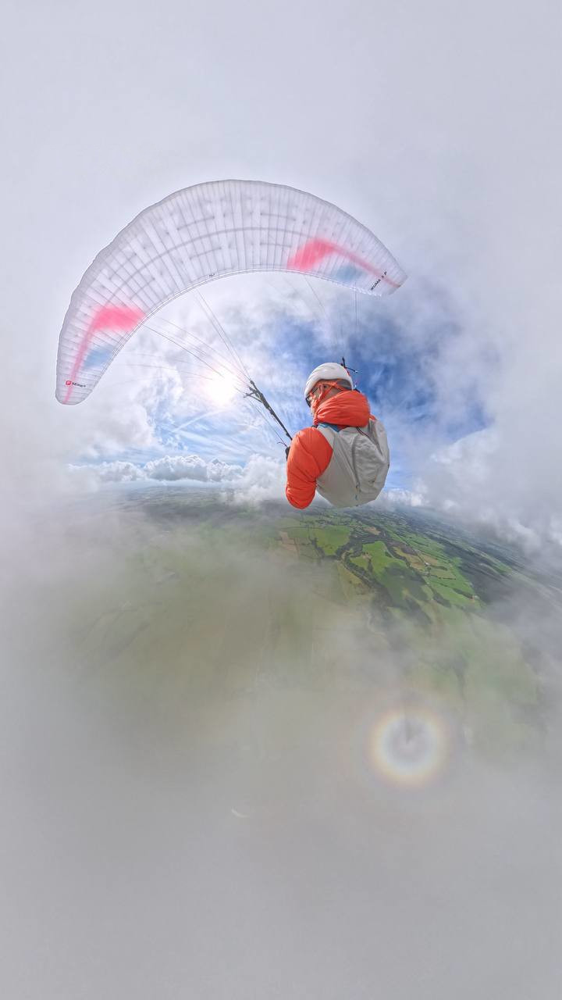](cover.jpg)  
*Cover photo: Ed Knowles*

---

# Chairman's Chunterings

*Brian Stewart, Chairman*

Sharing the Sky (re-visited)

Of course we share the sky, everywhere we go we must be on our toes looking out for other aircraft. And hoping that the pilot of the other craft is also paying attention. The drone menace is already looming up on us - you've all completed the CAA consultation on Electronic Conspicuity, haven't you? Drones are unmanned so don't have any eyeballs looking out, and rely on electronics to see and avoid, but they're not the only hazards.

Models rely on their operators on the ground maintaining line of sight with them and being able to judge their proximity to each other, and more importantly to us. 99% of the time we co-exist perfectly amicably - modellers I have spoken to recently have expressed their understanding of the vast difference in risk between us. A few weekends ago, there were upwards of a dozen models at Longridge and many more paragliders but I haven't heard of any issues. When I spoke to them, they were perfectly happy to keep to the west of the take-off area.

We are a hazard to each other: contact between us will not end well, taking avoiding action could cause problems. If we pass between the model operator and their aircraft they can lose sight of it and lose control. We must find ways of sharing these sites safely. Hard and fast rules can collapse on first contact with the flying conditions. But how do we deconflict this? Neither group operates on any formal basis on the hill - we don't have launch marshals or CFIs telling us what to do - this is part of the joy of free flight.

However, the situation at Nont Sarah's has become more volatile recently. There was an actual collision back in February, and more recently there have been angry exchanges between PG pilots accusing the modellers of flying dangerously close to them and acting aggressively.

We are in the process of resolving this but have little concrete information other than hearsay. I have written to both Marsden Moor Soaring Association and the British Model Flying Association, as well as contacting BHPA for guidance. If you do have any knowledge of other incidents, please get in touch with either me or our sites officer.

In the meantime if you are flying at Nonts, please try to agree your flight zones with any modellers who may be there or who turn up later. If you do come into conflict with anyone, try to remain calm and polite so as not to inflame the situation further. Make a note of any details you can and pass them on to me, and if there's a serious incident then do follow the incident reporting procedure.

Tight Lines

Brian

---

# Winter Socials

*Jacqui Kavanagh, Social Secretary*

Our first club night of the year and it's a cracker. Be there on Monday!

The format has changed a little this year and we'll have a presentation for about an hour followed by time to catch up over a pint and some nibbles.

[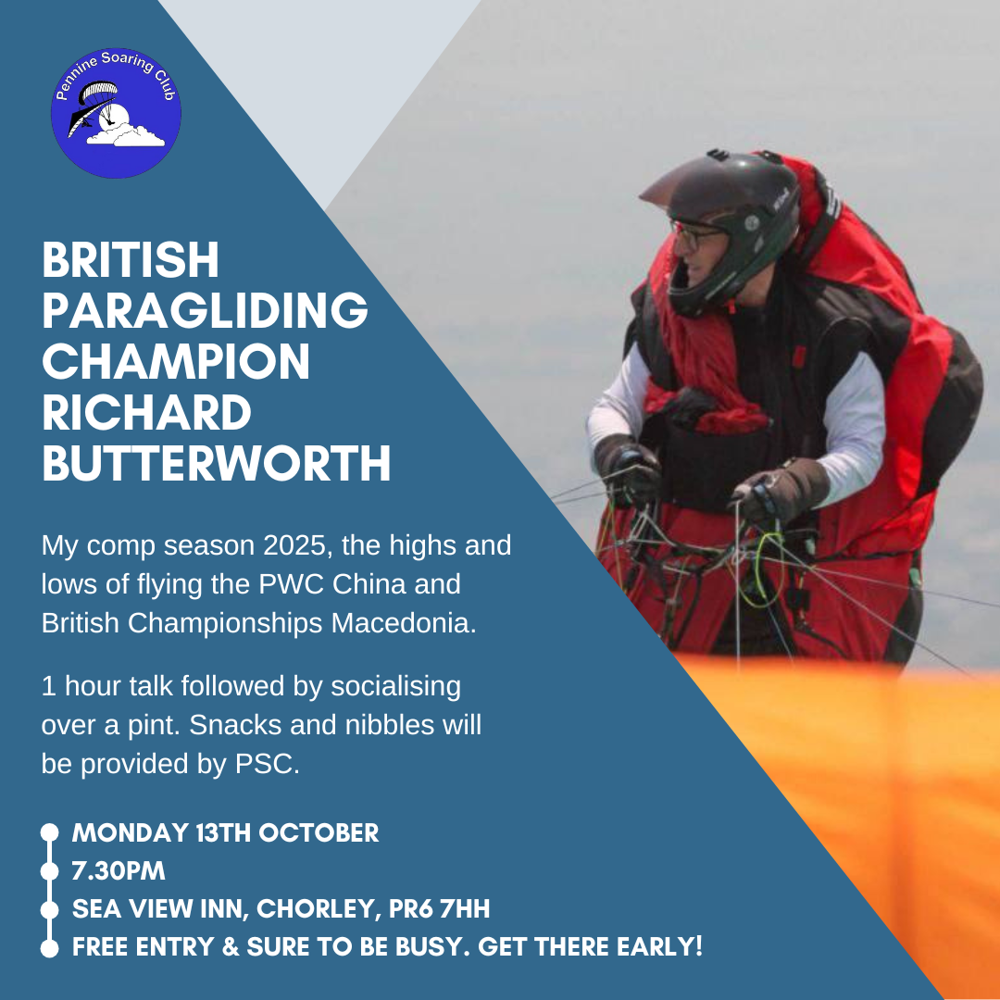](rb.png)

---

# Coaching Corner

*Simon Baillie, Chief Coach*

Firstly, congratulations to Lee Barnes for passing his Pilot exam!

It's been a record breaking XC year in the UK, with some absolutely epic flying. Some of it even happened in the Pennines during spring but most of the summer seems to have been windy round our area. I've been constantly watching for suitable weekends to run coaching days but there just haven't seemed to be that many opportunities. That said, we have managed to pull two successful coaching days out of the bag.

[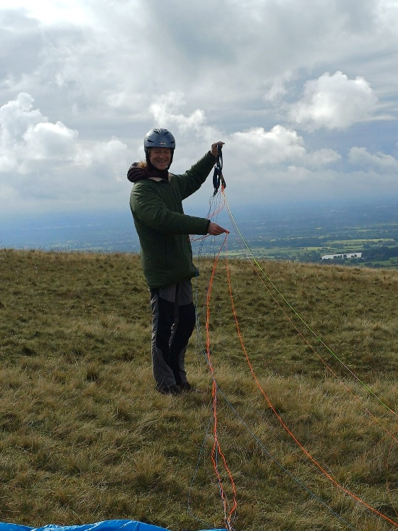](coaching1.jpg)

[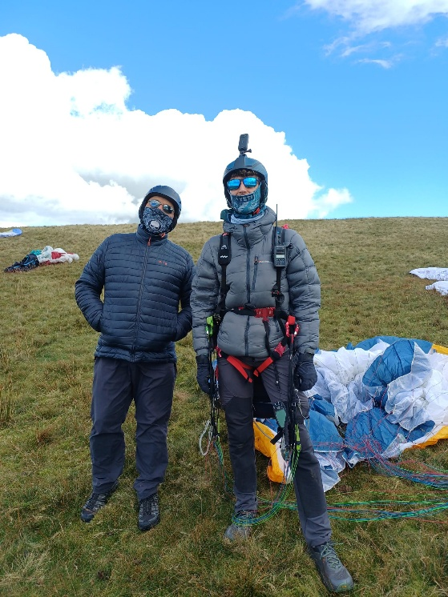](coaching2.jpg)

What seems to have been more successful, has been ad-hoc coaching that has happened as result of the pilots involved approaching local coaches for assistance. While I have every intention of continuing to try organising formal coaching days, I wanted to try to encourage our lower airtime pilots to become more proactive and take control of their own development. If you think that you need some guidance, or perhaps want a site briefing before flying a new site, please don't just wait to be told that there is a coaching day happening. We have 23 highly experienced coaches who are all more than willing to give you a hand or show you around a site. Have a look at the below list for your local coaches and give one of them (or me) a shout next time you are thinking of going out. All you have to do is find them in the Telegram coaching group and send them a direct message, I'm sure that they will be more than happy to help you.

[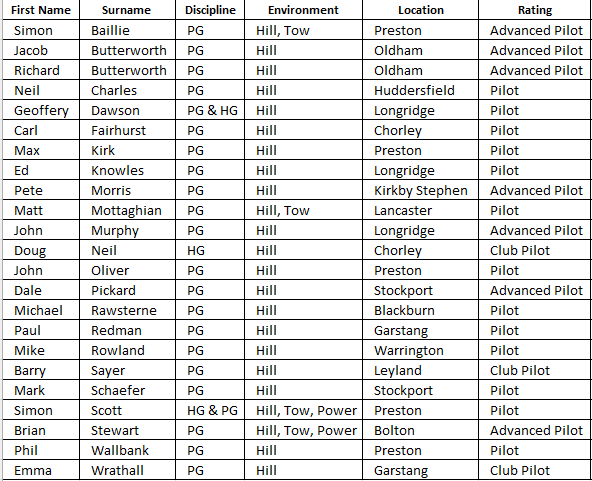](coaching.png)

It's been my observation over the years that many of the most successful new pilots have been the ones that have sought out a coach to provide them guidance and mentor them. Read the text books, talk to experienced pilots and ask lots of questions. This is your sport now and your own personal development in it is down to you, please take control of that and become proactive, don't just wait for the next time that I say there might be a coaching day to get out flying.

I'm hoping to be able to run Pilot exam revision nights again this winter, provided there is enough interest. The plan would be to run 3 revision nights, followed by an exam night, all at the Sea View Inn, Chorley. If you are interested please let me know as soon as possible, either through Telegram or by email chiefcoach@penninesoaringclub.org.uk.

If you are working towards your Pilot rating, please try to get you BHPA Pilot Task book completed as much as possible and also keep a detailed logbook of all your flights, as verifying and signing off your tasks can be very difficult without them.

---

# A Grand Day Out

*Neil Charles steals a day off from work and heads to Mappleton*

After an extended run of work and family clashing with almost every flyable window, I'd booked Thursday 25th September off, anticipating a day on Parlick. Inevitably the weather changed its mind at the last minute and decided to be too windy for the east face. What to do? It must be flyable *somewhere*.

The Lakes looked good but their SE sites - Souther and Barkin - are both restricted to 10 gliders maximum and I didn't fancy driving for 2.5 hours to gamble on the number of people who'd be there. Caley Club on the east coast? Strength looks good but direction is off. Hang on, what's that on Paragliding Earth down below Bridlington?

[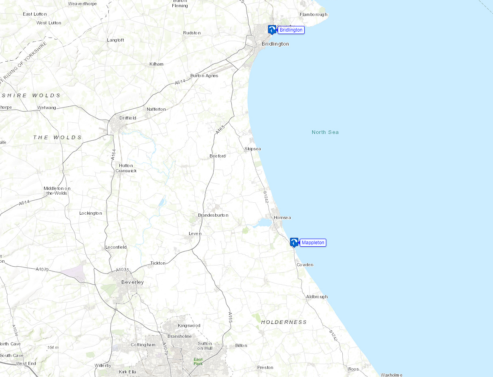](mappleton1.png)

Mappleton? Never heard of Mappleton but the direction looks good and it has an unofficial [site guide](https://cayleyparagliding.co.uk/site/mappleton/).

Edward Cunliffe confirmed on Pennine Chat that the wind looked potentially on. Thanks! And the tide's out at lunchtime. Right, we're going.

On arrival in the cliff top car park it felt too windy but the muddy clay cliffs are only 60' high. It felt much better on the beach and with those low cliffs if it's not blowing strongly across the top, you're not going to stay up. A few locals arrived and gave a bit of advice on the conditions, the tide, the potential cliff run and what to look out for in case the MOD were planning on blowing stuff up to our south. Did I mention there might be unexploded ordnance on the beach? There might be unexploded ordnance on the beach. Anyway, we all decided it felt good, time to fly.

[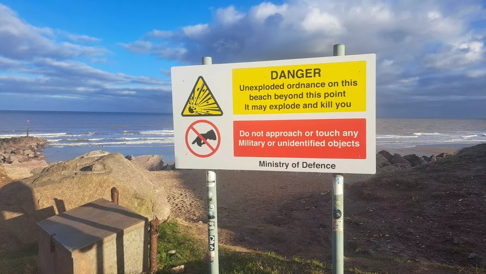](mappleton2.webp)

Now, don't mess your launch up in front of the nice people who just gave you a site briefing. Third time lucky and off we go.

[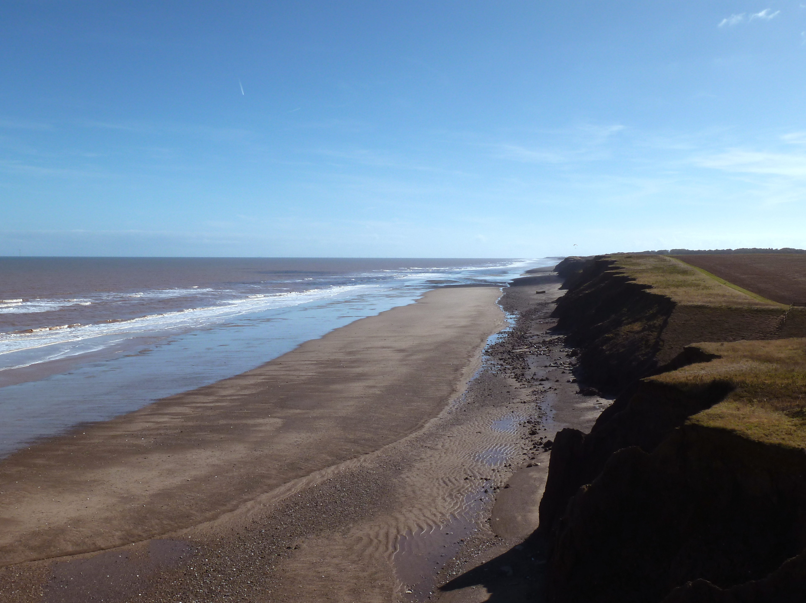](mappleton3.jpg)

What a fun site! The tide was low and still dropping so we had hours before we needed to worry about it and the wind was a steady 20kph in the air, enough to easily maintain 100-200' and cruise to your heart's content.

It's quite something to log a nearly 30km XC flight without ever going over 200' and you can get plenty more than that but I chickened out at the very low cliffs at Withernsea. Those really do have you dragging your toes on the beach, trying not to set off any land mines.

[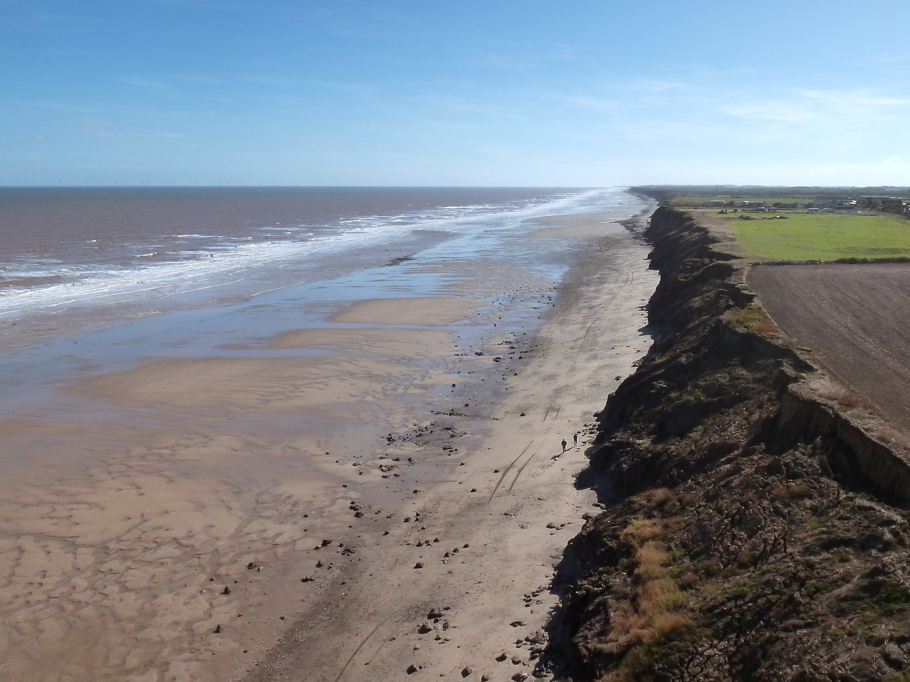](mappleton4.jpg)

If it's blowing ENE and too strong inland, Mappleton is well worth a look, at least for those of us on the Yorkshire side of the Pennines!

---

# Competitions

*Elliott Brown, Competitions Secretary*

### Northern Challenge Series 2025

We're in the last month of NCS for 2025. Looks like a fair few new flights being added, bumping peoples' best up and a couple of places moving around on the scoreboard. Get those flights in, you've got until the 31st!

[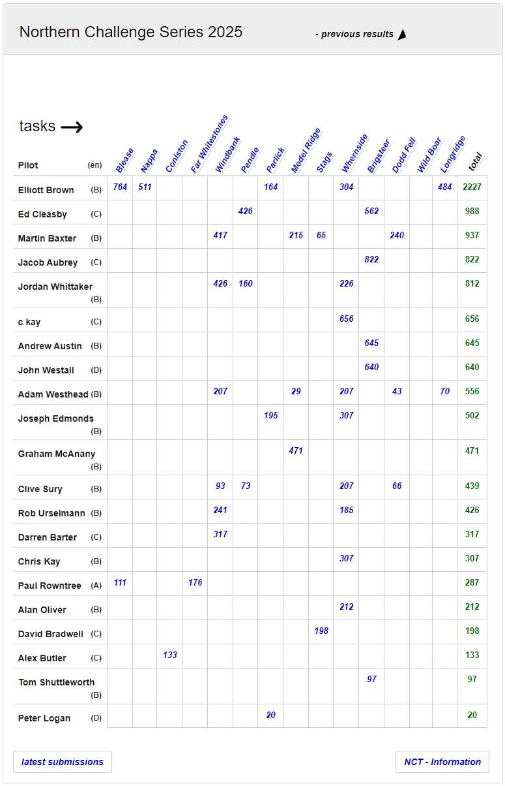](https://www.xcmap.net/index.php?c=Northern%20Challenge%20Trophy&y=2025)

### XContest - Pennine Soaring Club

We're now into 2026's league, Pennine ended up 12th overall with Malvern winning first place. Scores are on pilots in the club not the club location so if you get out and about, get involved. Sixteen pilots took part this year, can we add more next year and move up the table?

2026 is open for registration for World and UK. It's free, just log in and register for both.

[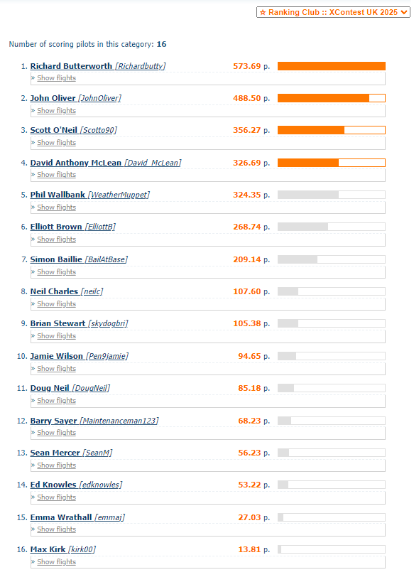](https://www.xcontest.org/united-kingdom/ranking-club:2688)

### XC League

[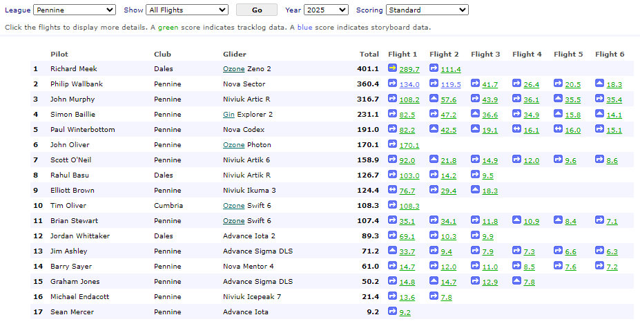](https://xcleague.com/xc/leagues/view-15.html)

---

# The Gallery



---

# Dates For Your Diary

**13th October** - Club Night - Richard Butterworth: China and winning the British Open in Krushevo

**3rd November (FIRST MONDAY OF NOVEMBER)** - Club Night - Elliott Brown: Starting Out in Comps

**20th - 23rd November** - [Kendal Mountain Festival](https://www.kendalmountainfestival.com/) - Kendal, Lake District

**8th December** - Club Night - Richard Meek: TBC

**12th January** - Club Night

**9th February** - Club Night

**9th March** - Club Night

---

# Your Newsletter Needs You

Appear in the next newsletter! We need submissions for...

**A Grand Day Out**  
2-3 paragraphs describing a fun day. You're welcome to write more if you're feeling creative but a couple of paragraphs is plenty. Could be epic, could be daft, could be simply the first time you flew for six months. If you've had a good day and you took some pictures, send it in.

**Why Not Visit...**  
A quick guide to a site that you like, at home or abroad. Tell us where it is, what it's like to fly, any watch-outs and how to contact the locals. Attach a photo and email it over.

**The Gallery**  
Send in any recent(ish) shots with when and where they were taken. Spectacular, silly, from the ground or from the air, it doesn't matter. Let's see what you've been up to. Videos are very welcome too but pop them on YouTube or Vimeo and send a link for the newsletter.

**Shout Outs**  
First ever XC? Smashed a PB? Took part in a comp? Let us know and get a shout out in the newsletter. Nominate your mates if they won't do it themselves.

**Top Tips**  
Spotted a bargain? Got a great travel tip? Know how to make Bluetooth connections work on an iPhone? Share your best ideas.

Send submissions on these or anything else you'd like to see featured to [editor@penninesoaringclub.org.uk](mailto:editor@penninesoaringclub.org.uk). You can also drop them over using the [web form](https://docs.google.com/forms/d/e/1FAIpQLSd3NJQKlmLjjlh-nZGQKaeXzN6dSSL2PHzKRXFYAy_Bw7SC9w/viewform?usp=sf_link) or message [Neil](https://t.me/NeilCharles) on Telegram.

--- 

Fly safe  
[editor@penninesoaringclub.org.uk](mailto:editor@penninesoaringclub.org.uk).