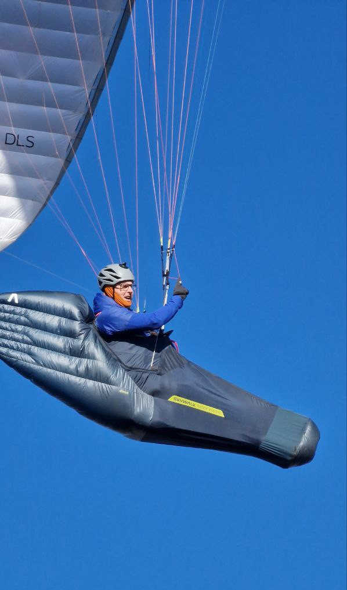
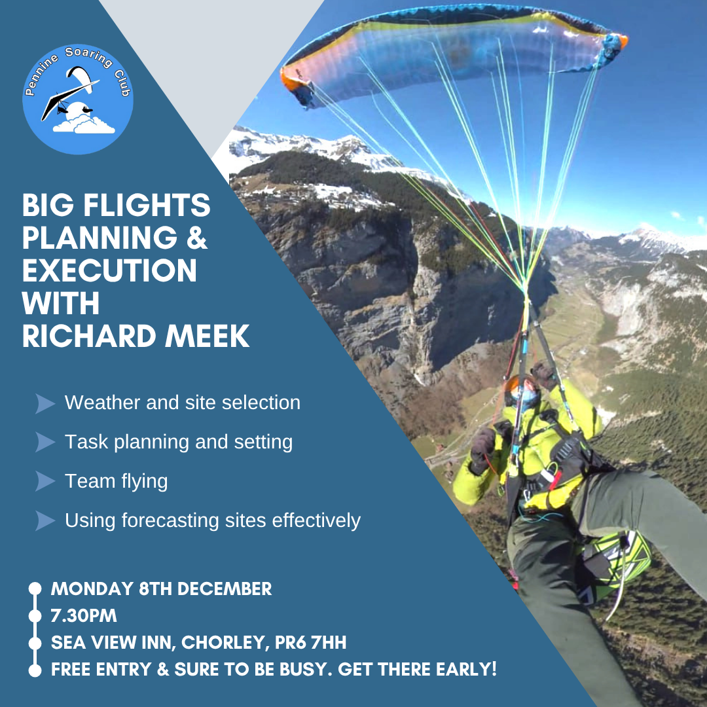
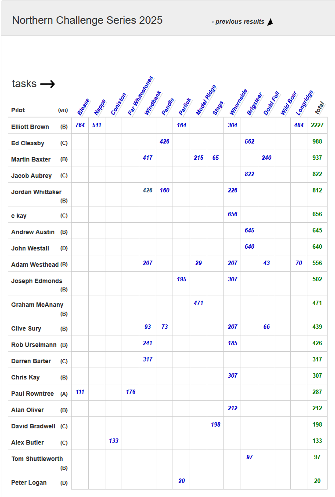
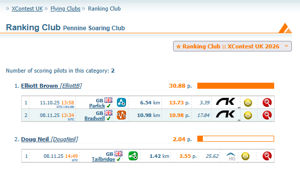
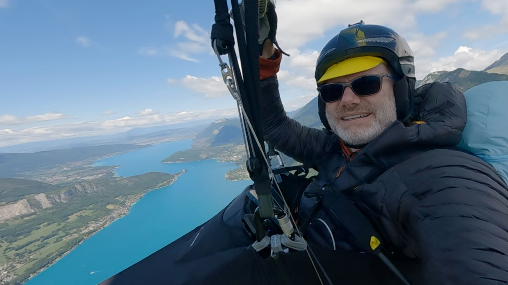

# And the nominees are...

We need your help. Winter means club nights and club nights means our AGM and awards. Who deserves one of the PSC's coveted trophies this year? There are more details in this issue on how to nominate a deserving pilot, plus a recap of our first winter club night and a curry invite from Jacqui, coaching revision nights from Simon, comps news from Elliott and pictures from everybody.

If you read nothing else today, **please make sure you see Brian's update about Nont Sarah's**. The site guide has been updated recently following some conflicts between paraglider pilots and modellers.

See you at a club night!

[editor@penninesoaringclub.org.uk](mailto:editor@penninesoaringclub.org.uk).

  
*Cover photo: Mark Schaefer*

---

# Nont Sarah's Update

*Brian Stewart, Chairman*

Many of you will be aware of the occasional rumblings of discontent between PG/HG pilots and model flyers at Nonts. While this occasionally happens elsewhere, the main issues seem to be happening at this site and there have been some unpleasant confrontations this year, including a mid-air collision in January. Most of the time relations between the different users of this airspace have been positive but these incidents show that there is a need for improvement in the management of the site and the conduct of those using it.

Following a meeting between representatives of PSC and the modellers, represented by the Marsden Moor Soaring Association (MMSA) and the British Model Flying Association (BMFA) we have agreed to update the guidelines/rules for safe conduct at Nont Sarah's (links below). Please make sure to read these carefully and follow the guidelines whenever flying there, or indeed at any other site with shared airspace. It's basically simple: communicate, navigate, aviate is like 'mirror, signal, manoeuvre' in driving - something that should be automatic whenever you arrive at a site and prepare to fly. Please:

- Communicate. Talk to those who are there, a friendly word does wonders for harmony between users, clarifies what the rules are and if there's any need to modify the standard operating procedure if, for example, the wind direction is less than optimal. If you must cross the model launch area to land safely, let them know in good time with a shouted warning. Also applies if spectators are nearby.

- Navigate. Plan your launch, flight and landing with consideration for the other users of the site, including drivers, pedestrians and visitors. This includes reading the site guide and studying the maps.

- Aviate. Fly your aircraft in accordance with all the relevant rules of the air and with due regard to safety. Be aware that model flyers have a completely different field of view.

Should there be an incident, or someone feels another has flown too close or in a dangerous manner, try to remain calm and discuss the event rationally with a view to identifying ways to avoid this situation in the future. There is now an informal reporting form on both the PSC site guide for Nonts and the MMSA website (link below). This does not replace the BHPA reporting procedure, which should also be followed whenever necessary but may serve to flag up issues which can be addressed by the clubs.

We will be looking at producing some guidance to explain to model flyers the characteristics of paraglider flight, in particular how an impact with even a lightweight model could cause an unrecoverable auto rotation close to the ground.

[PSC site guide for Nont Sarah's](http://www.penninesoaringclub.org.uk/sites/nont-sarahs/)  
[MMSA page for Nont Sarah's](https://www.marsden-moor-soaring-association.co.uk/index.php/2-uncategorised/4-nont-sarah-s-rules)  
[BHPA/BMFA operating code for shared airspace](https://www.marsden-moor-soaring-association.co.uk/index.php/2-uncategorised/3-bhpa-bmfa-operating-code)  
[Informal report form](https://reporting.bmfa.uk/nont-sarahs)

---

# Winter Socials

*Jacqui Kavanagh, Social Secretary*

### Club Nights

Richard Butterworth kicked off our social club season last month with a very interesting presentation describing his experiences of flying in the PWC in China earlier this year. Some of you will remember that this event was controversial as Pal Takats Left the competition a couple of days before the start, due to his concerns About safety and the presenting weather conditions and many of us will remember seeing pretty hair raising videos on YouTube of some very difficult launches.

After arriving in China, Richard enjoyed taking the super fast bullet train to get to the province of Linzhou, which he described in more detail outlining the takeoff issues, the terrain, competition tasks and the vibrant cultural aspects on offer. 

By the start of the competition, Richard says the launch conditions had settled somewhat although takeoffs were still challenging for some, especially in crosswind conditions and one task had to be abandoned due to half of the competitors being unable to launch during the pre-start takeoff window.

Richard maintained a good position on the leader board throughout the competition, finishing overall in 16th place. 

Richard then went on to outline his outstanding performance and subsequent win in the British open Championship In Krushevo, Macedonia In July.

We heard more about the unique terrain and the various tasks. Richard described how gaggles can form and then collectively head for less than optimal routes sometimes and how it's worth trying something else, which can really work out. This strategy worked well on one occasion and enabled Richard to maintain an optimal position on the leaderboard.

As he went into the final task, Richard was uncertain of the points situation between himself and Ceri Brown - his nearest rival - but knew he needed to make one good final push in the last task to grab first place, which resulted in a closely fought race between the two pilots. Ceri entered the end of speed section a couple of seconds ahead of Richard and we were treated to an in depth playback of this final climactic task accompanied by Richard's thoughts and decision-making at each point, which was fascinating to watch and listen to, especially since he had no idea until he landed that he had in fact won the competition.

Needless to say, a number of audience questions followed this much appreciated presentation.

Unfortunately, it wasn't possible to record the presentation. However, you may be able to catch a rerun at the Dales or Cumbria club socials later this winter. 

Our next club night will be on the 8th December when Richard Meek will share his tips on planning and executing Big Flights.

### Curry Night

We're planning another winter curry night at [Sagar Premier](https://www.google.com/maps/place/Sagar+Premier/@53.7173558,-2.6379187,821m/data=!3m2!1e3!4b1!4m6!3m5!1s0x487b73318dbc8f0d:0x7c46d4000db849ca!8m2!3d53.7173558!4d-2.6379187!16s%2Fg%2F1tg39ncj?entry=ttu&g_ep=EgoyMDI1MTExNy4wIKXMDSoASAFQAw%3D%3D) in Preston.

One price for a set meal with lots of choice and plenty of food. Veggies will be catered for too and you buy your own drinks at the bar.

More details and a date to follow.

---

# 2025 Pennine Soaring Club Award Nominations

*Elliott Brown, Competitions Secretary*

We need you!

Do you have a nomination for one of the Prestigious Pennine Soaring Club Awards? Let us know!

**Best XC flight from a Pennine Site**: As it says on the tin.

**Best local Flight**: A standout flight that stayed local, not disappearing into the distance across country to never return (or maybe dropped off a bit later to get their car).

**Retrieve Award**: Reward those brave souls who took to the road to pick up their well travelled pilot friends.

**Bent Upright**: Someone who's done something a bit silly without getting too badly hurt.

**Pilot Improvement Award**: For those pilots who have progressed in the past year, call out their development.

**Newcomer Award**: A new pilot to the club who's impressed you with their enthusiasm or progress they've made in their first year or so.

competition@penninesoaringclub.org.uk

---

# Coaching Corner

*Simon Baillie, Chief Coach*

It seems like winter is definitely here! If you are a Club Pilot, why not take the opportunity of the poor weather and lack of flying to set yourself a new challenge and focus on getting your Pilot rating?

I really think that this is an important part of your progress and development and it's worth remembering that the BHPA considers CP to be a novice and only the Pilot rating to be fully qualified. Although the Pilot rating is necessary if you want to be insured to fly Cross Country, it is about much more than that. It is about gaining the knowledge and skills that will help you to continue to progress safely in this great sport.

I'm planning on running pilot revision sessions through the winter again, probably in January and February. They will be split into three sessions with Brian Stewart covering Flight Theory, Richard Butterworth Air Law & Navigation, and Phil Wallbank Meteorology. These will be held at the Sea View Inn, Chorley, and will be followed by the opportunity to sit the exam.

There are no definite dates set yet, as I wanted to make sure that we have enough interest to make it worthwhile. If this is something that you are interested in, or you would just like to know a bit more about it, please contact me through Telegram or by email at chiefcoach@penninesoaringclub.org.uk 

---

# Competitions

*Elliott Brown, Competitions Secretary*

### Northern Challenge Series 2025

That's a wrap for the year, no new flights entered since last month but its been a well populated competition this year. I'm looking forward to next year.

Ed Cleasby was nice enough to come along to my winter talk and present the Main and Sport class trophy.

*Photo plucked from the DHPC Skywords November 2025 edition*

### XContest - Pennine Soaring Club

The 2026 season is up and running, with myself and Doug Neil representing the PSC so far. Don't forget to join, it's free and there are T-shirts to be won! I've got my eye on the first 100km one for next year.

### XC League

Definitely the end of the season now, but not too late to get a last flight.

---

# Pictures of the Year

It's wet, it's windy and it's cold so why not settle down with a cup of tea and enjoy a few of our favourite images from this year? Thanks to everyone who shared a picture and to all of you for all of your gallery contributions this year. If there's not a camera on your flight deck yet, you've got three months until March to work out how to attach one!

### *John Oliver*

### *Doug Neil*

### *Mark Schaefer*

### *Chris Timson*

### *Neil Charles*

---

# You Might Have Missed...

Investigations into the founding date of the Pennine Hang Gliding Club - the predecessor of the PSC - led us to this lovely 18th January 1975 article in the Huddersfield Examiner. We believe the club was probably founded not many years before that date but if anyone can help with more information about our founding or early days, please let the committee know.

---

# The Gallery



---

# Dates For Your Diary

**20th - 23rd November** - [Kendal Mountain Festival](https://www.kendalmountainfestival.com/) - Kendal, Lake District

**8th December** - Club Night - Richard Meek: Big Flights, Planning and Execution

**12th January** - Club Night

**9th February** - Club Night

**9th March** - Club Night

---

# Your Newsletter Needs You

Appear in the next newsletter! We need submissions for...

**A Grand Day Out**  
2-3 paragraphs describing a fun day. You're welcome to write more if you're feeling creative but a couple of paragraphs is plenty. Could be epic, could be daft, could be simply the first time you flew for six months. If you've had a good day and you took some pictures, send it in.

**Why Not Visit...**  
A quick guide to a site that you like, at home or abroad. Tell us where it is, what it's like to fly, any watch-outs and how to contact the locals. Attach a photo and email it over.

**The Gallery**  
Send in any recent(ish) shots with when and where they were taken. Spectacular, silly, from the ground or from the air, it doesn't matter. Let's see what you've been up to. Videos are very welcome too but pop them on YouTube or Vimeo and send a link for the newsletter.

**Shout Outs**  
First ever XC? Smashed a PB? Took part in a comp? Let us know and get a shout out in the newsletter. Nominate your mates if they won't do it themselves.

**Top Tips**  
Spotted a bargain? Got a great travel tip? Know how to make Bluetooth connections work on an iPhone? Share your best ideas.

Send submissions on these or anything else you'd like to see featured to [editor@penninesoaringclub.org.uk](mailto:editor@penninesoaringclub.org.uk). You can also drop them over using the [web form](https://docs.google.com/forms/d/e/1FAIpQLSd3NJQKlmLjjlh-nZGQKaeXzN6dSSL2PHzKRXFYAy_Bw7SC9w/viewform?usp=sf_link) or message [Neil](https://t.me/NeilCharles) on Telegram.

--- 

Fly safe  
[editor@penninesoaringclub.org.uk](mailto:editor@penninesoaringclub.org.uk).