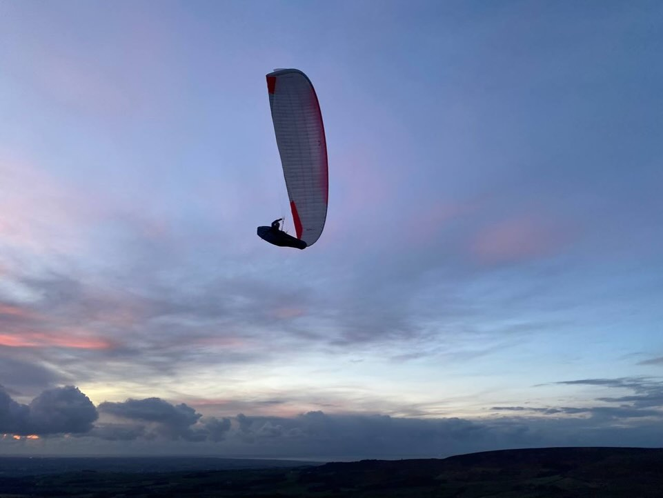
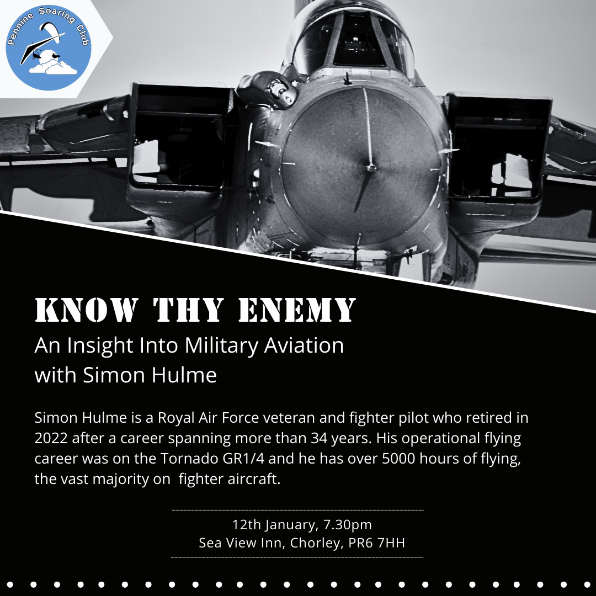
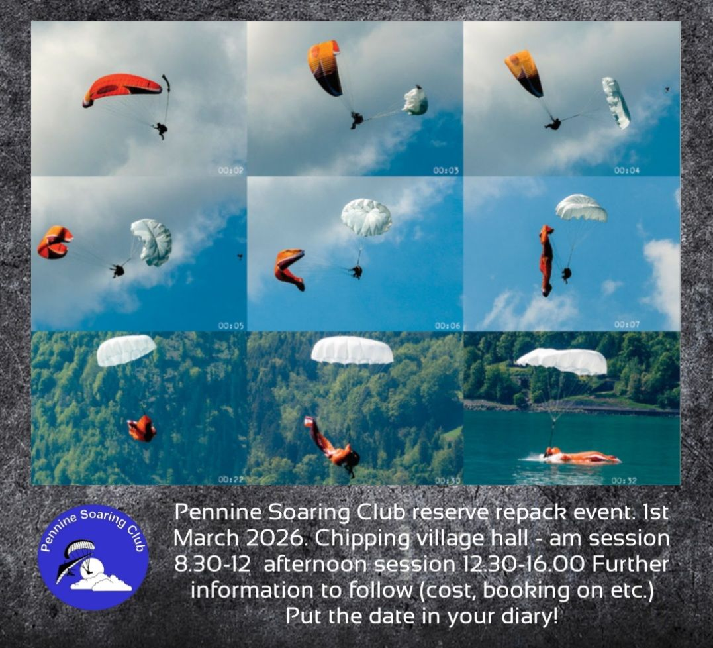
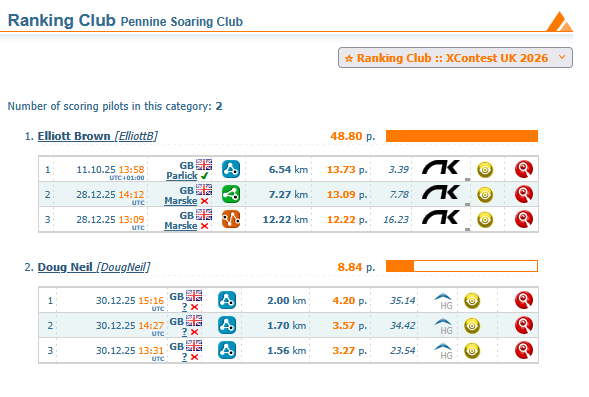

# How many mince pies over the weight range can you fly an EN-B?

What did Santa bring you for Christmas? A few lucky pilots found a flying day on Winter Hill in their stockings and the rest of us will be hoping for more of the same soon.

Until then, we've got upcoming club nights and an AGM to look forward to, loads of dates for your 2026 diaries including a curry night and a repack, a prod to get competing in 2026 and...

... a plea for your award nominations.

The Bent Upright award is looking for a new home and tales of unfortunate mishaps have been tough to track down this year. We find it hard to believe that *nobody* has done anything silly for a whole twelve months so send your anonymous tip-offs of embarrassing (but not serious injury inducing) mistakes to [Elliott Brown](https://t.me/onfirealot).

[editor@penninesoaringclub.org.uk](mailto:editor@penninesoaringclub.org.uk).

  
*Cover photo: Emma Wrathall snaps Sean Mercer at sunset on Parlick*

---

# AGM 2026 Notice

Pennine Soaring Club's AGM is scheduled for Monday 9th February at 19:30 in the Sea View, Chorley.

The running order will be:
- Officers’ Reports
- Election of Officers

As always, all committee posts will be available for re-election of the sitting members or to new applicants for the position.
- Club Proposals: If you have any motion you wish the club to consider, please submit in writing to the chairman by 9th January 2026.
- Presentation of Awards
- Any Other Business

# Winter Socials

*Jacqui Kavanagh, Social Secretary*

### Club Nights

### Curry Night

The winter curry night is planned for 7pm on Thursday 29th January at [Sagar Premier Clayton Brook Rd, Clayton Brook, Clayton-le-Woods, Preston PR5 8HZ](https://maps.google.com/maps/place//data=!4m2!3m1!1s0x487b73318dbc8f0d:0x7c46d4000db849ca?entry=s&sa=X&ved=2ahUKEwiHkrmlyO-RAxVMUEEAHWeLLpUQ4kB6BAgaEAA&hl=en)

last year was a great success with a set price meal including numerous courses, plenty of food served, and lots of choices.

Buy your own drinks at the table or bar with card service. 
 
To reserve a spot please [message Jacqui](https://t.me/Black_Puddin_Bertha).

### Winter Sports Massage Clinic

Any PSC pilots interested in joining a winter sports massage clinic, please [message Jacqui](https://t.me/Black_Puddin_Bertha) for more info and to be added to the group chat for notices and to book in. There’s no charge apart from a small donation to the running costs.

Usually held in Chipping village hall. Various days/times TBA depending on level of interest in attending.

---

# 2025 Pennine Soaring Club Award Nominations

*Elliott Brown, Competitions Secretary*

We need you!

Do you have a nomination for one of the Prestigious Pennine Soaring Club Awards? Let us know!

**Best XC flight from a Pennine Site**: As it says on the tin.

**Best local Flight**: A standout flight that stayed local, not disappearing into the distance across country to never return (or maybe dropped off a bit later to get their car).

**Retrieve Award**: Reward those brave souls who took to the road to pick up their well travelled pilot friends.

**Bent Upright**: Someone who's done something a bit silly without getting too badly hurt.

**Pilot Improvement Award**: For those pilots who have progressed in the past year, call out their development.

**Newcomer Award**: A new pilot to the club who's impressed you with their enthusiasm or progress they've made in their first year or so.

competition@penninesoaringclub.org.uk / [@onfirealot](https://t.me/onfirealot)

---

# Repack

A repack will be held at Chipping Village Hall on 1st March with morning and afternoon sessions available.

More details to follow from Barry but get it booked in your diary!

---

# Coaching Corner

*Simon Baillie, Chief Coach*

Pilot revision nights have been booked with the experts and the pub! Sea View Inn Chorley, Wednesdays at 19:30.
- Flight Theory with Brian Stuart on 21st January
- Air Law and Navigation with Richard Butterworth on 28th January
- Meteorology with Phil Wallbank on 4th February
- Exam on 11th February

Only come along to these if you've already been in touch with me about studying for the Pilot exam. Please bring your BHPA card and task book along on the first night, so I can check where you are at with completing your tasks.

# Competitions

*Elliott Brown, Competitions Secretary*

### XContest

1st Oct 2025 - 30th Sep 2026   
https://www.xcontest.org/united-kingdom/ 

Come and keep me and Doug company:

### XC League
Loop local flights will be calculated from these results.  
https://xcleague.com/xc/ 

### NCS - Northern Challenge Series 2026

1st Feb - 31st Oct (assuming it’s up and running again this year).

Even if it’s not running, these are great tasks to give your flight a bit of purpose or help push you that bit further than you would normally fly, just to get that next turn point.
[Info here](https://www.xcmap.net/index.php?c=Northern%20Challenge%20Trophy). 

### Local competition dates for the UK

Buttermere Bash (LCO likely)  
29-30 May 2026  
Assuming that there will be another Lakeland Charity Open competition held at the event.  
https://www.tickettailor.com/events/airventures/1970235?brid=EIHZAoEZ8dz1jlj8AP564Q 

BPCup 2026 Dales Round  
04-07 Jun, 2026  
https://airtribune.com/bpcup-2026-dales-round/ 

LCC & X-Lakes  
18-21 June, 2026  
On airtribune soon…

More found here; https://www.bhpa.co.uk/events/ 

---

# The Gallery



---

# Dates For Your Diary

(No, we haven't forgotten Pennine Fest! Jacqui is working on it.)

9th - 16th January - Sports Class Racing Series Gin Edition - Roldanillo, Colombia

### **12th January - Club Night: Know Thy Enemy - 7.30pm, Sea View Inn, Chorley**

### **CANCELLED - Dales Club Repack - Ilkley**

### **21st January - Pilot Exam Revision: Flight Theory - 7.30pm, Sea View Inn, Chorley**

### **28th January - Pilot Exam Revision: Air Law & Navigation - 7.30pm, Sea View Inn, Chorley**

### **29th January - PSC Curry Night - 7pm, Sagar Premier, Preston**

### **4th February - Pilot Exam Revision: Meteorology - 7.30pm, Sea View Inn, Chorley**

8th February - [Big Fat Repack](http://www.tvhgc.co.uk/events) - Aldershot, Hants

### **9th February - Club Night: AGM - 7.30pm, Sea View Inn, Chorley**

### **28th January - Pilot Exam - 7.30pm, Sea View Inn, Chorley**

11th - 17th February - [British Winter Open](https://airtribune.com/bwo2026/info) - Roldanillo, Colombia

14th - 21st February - [PWC Panchgani](https://pwca.events) - Panchgani, India

20th - 22nd February - [British Accuracy Cup Round 1](https://civlcomps.org/event/BAC-2026-Round-1) - Woldingham, Surrey

28th February** - BHPA AGM - Head Office, Leicester

### **1st March - PSC Reserve Repack - AM & PM sessions, Chipping Village Hall**

### **9th March - Club Night: TBC - 7.30pm, Sea View Inn, Chorley**

19th - 26th April - [PWC Governador Valadares](https://pwca.events) - Governador Valadares, Brazil

20th - 26th April - [British Accuracy Cup Round 2](https://civlcomps.org/event/BAC-2026-Round-2) - Woldingham, Surrey

2nd - 5th May - [X-Scotia](https://x-scotia.co.uk/) - Kintail, Scotland

5th - 16th May - [PWC Superfinal](https://pwca.events) - Pegalajar, Spain

16th - 17 May - [Dragon Hike & Fly](https://crickhowellparagliding.com) - Crickhowell, Powys

23rd - 30 May - [Sports Class Racing Series Skywalk Edition](https://sportsracingseries.org) - Bassano, Italy

28th - 31st May - [Red Bull X-Alps Challenger](https://www.redbullxalps.com/int-en/red-bull-x-alps-challenger-2026-mayrhofen-new-chapter-begins) - Mayrhofen, Austria

### **29th - 30th May - [Buttermere Bash](https://www.tickettailor.com/events/airventures/1970235?brid=EIHZAoEZ8dz1jlj8AP564Q) - Buttermere, Lake District**

31st May - 13th June - [FAI Hang Gliding European Champs/Class 5 Worlds](https://hgcomps.uk) - Gemona, Italy

4th - 7th June - [British Paragliding Cup UK Round](http://www.bpcup.co.uk) - Yorkshire Dales

6th - 7th June - [Dragon Hike & Fly (backup date)](https://crickhowellparagliding.com) - Crickhowell, Powys

6th - 13th June - [Sports Class Racing Series Naviter Edition](https://sportsracingseries.org) - Tolmin, Slovenia

16th - 21st June - [British Open Paramotor Cup](https://ppgcomps.co.uk) - Deenethorpe, Northants

### **18th - 21st June - Lakes Charity Classic - Grasmere, Cumbria**

18th - 21st June - [X-Lakes Hike & Fly Competition](https://x-lakes.uk) - Grasmere, Cumbria

27th - 3rd July - [Sports Class Racing Series French Edition](https://sportsracingseries.org) - Annecy, France

17th - 19th July - [British Accuracy Cup Round 3](https://civlcomps.org/event/BAC-2026-Round-3) - Woldingham, Surrey

August TBC - [British Paragliding Cup European Round](http://www.bpcup.co.uk)

22nd - 29th August - [Sports Class Racing Series Spanish Edition](https://sportsracingseries.org) - Piedrahita, Spain

5th - 12th September - [Paragliding World Cup Siatista](https://pwca.events) - Siatista, Greece

18th - 20th September - [BAC Round 4/Super Final](https://civlcomps.org/event/BAC-2026-Round-4) - Woldingham, Surrey

7th - 14th November - [Sports Class Racing Series Mexican Edition](https://sportsracingseries.org) - Tapalpa, Mexico

---

# Your Newsletter Needs You

Appear in the next newsletter! We need submissions for...

**A Grand Day Out**  
2-3 paragraphs describing a fun day. You're welcome to write more if you're feeling creative but a couple of paragraphs is plenty. Could be epic, could be daft, could be simply the first time you flew for six months. If you've had a good day and you took some pictures, send it in.

**Why Not Visit...**  
A quick guide to a site that you like, at home or abroad. Tell us where it is, what it's like to fly, any watch-outs and how to contact the locals. Attach a photo and email it over.

**The Gallery**  
Send in any recent(ish) shots with when and where they were taken. Spectacular, silly, from the ground or from the air, it doesn't matter. Let's see what you've been up to. Videos are very welcome too but pop them on YouTube or Vimeo and send a link for the newsletter.

**Shout Outs**  
First ever XC? Smashed a PB? Took part in a comp? Let us know and get a shout out in the newsletter. Nominate your mates if they won't do it themselves.

**Top Tips**  
Spotted a bargain? Got a great travel tip? Know how to make Bluetooth connections work on an iPhone? Share your best ideas.

Send submissions on these or anything else you'd like to see featured to [editor@penninesoaringclub.org.uk](mailto:editor@penninesoaringclub.org.uk). You can also drop them over using the [web form](https://docs.google.com/forms/d/e/1FAIpQLSd3NJQKlmLjjlh-nZGQKaeXzN6dSSL2PHzKRXFYAy_Bw7SC9w/viewform?usp=sf_link) or message [Neil](https://t.me/NeilCharles) on Telegram.

--- 

Fly safe  
[editor@penninesoaringclub.org.uk](mailto:editor@penninesoaringclub.org.uk).