# Daffodils are a thermal indicator

It's a bumper issue! There's been flying, an AGM, awards, a repack and even a curry night.

We've got competition news, tips, photos and more.

Who's ready for the new season?

[editor@penninesoaringclub.org.uk](mailto:editor@penninesoaringclub.org.uk).

[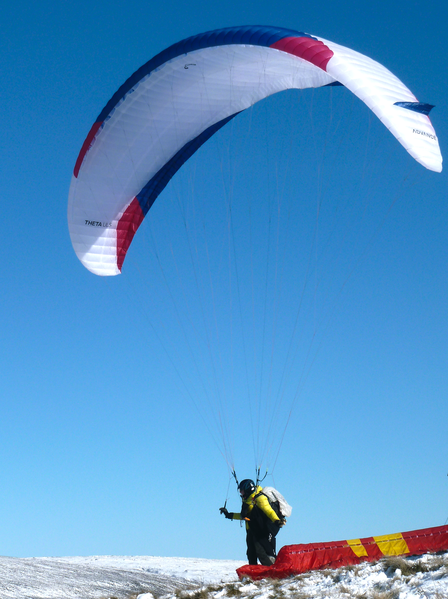](cover.jpg)
*Cover photo: Neil Charles snaps Graham Jones on Parlick*

---

# Chairman's Chunterings

*Neil Charles, Chairman*

Firstly, huge thanks to Brian, who's stepping down from his role as chairman, but not from the committee, as he moves back into his old safety officer role. He's leaving me with some big boots to fill.

When Brian asked whether I'd be willing to volunteer in his place as chairman, I was flattered, only a little reluctant and it also got me thinking. What does it mean to be part of the Pennine Soaring Club?

Our committee is a group of people who have all been willing to give up their time to make our club what it is. From Brian stepping down as chairman but being willing to stay and take on the safety officer brief, to Simon running revision nights and coaching days, Jacqui organising entertaining talks to keep us in touch through the winter nights and Andy smoothing the way with our local landowners for the past decade and more, making sure that we all have somewhere to fly. A group of people pitch in to make sure that we can all just roll up to Parlick on a sunny day and have a great time.

The chairs have shuffled a bit on the committee and we welcome Matt, Barry & Sam but we're largely the same faces. There's an update on who's pitching in to help with which roles in the AGM section and thank you again to everyone who does. Could you help next time?

Two seasons ago, Simon Scott said at the AGM that it would be nice to have a newsletter again, I put my hand up and here we are. Over those two years, I've learned that it's not a huge commitment of time to be on the committee but it is a commitment and it's important. This small group makes sure that we have a club. If you're thinking maybe you could help, or you find yourself at 2027's AGM wondering whether maybe to raise your hand and volunteer, please do! We'll all be tremendously grateful.

If not volunteering for the committee, what else can you do?

If you've travelled around the country and flown a lot of sites, I think two things stand out about flying the Pennine Club's hills.

The first is how friendly our club is. A new pilot on the hill will almost always get a hello and a quick chat and then a site briefing if they want one, which might seem an obvious thing but it isn't the case everywhere. The second thing - without wishing to tempt fate - is the safe and sensible attitude of our pilots. Of course we have our share of incidents because they come with the sport, but regular draggings, near misses, flying around yelling at people and wondering who you're going to have to dodge next tend not to be a feature of our hills even on busy days and again, if you've travelled a bit, you'll know that's more special than maybe it ought to be.

We can all keep that going. Say hello to the unfamiliar faces, say hello to the modellers and the farmers, say hello to anybody young who's looking wistfully at your glider because a quick look around takeoff will make it clear that we definitely need some new blood, and let's keep our club going just as well as it has been.

If you're reading this and thinking you don't know many people yet, our last club night of the winter is on Monday and it looks like a cracker. Come and have a drink and let's make some flying plans for 2026.

Neil

---

# Social

*Jacqui Kavanagh, Social Secretary*

### Club Nights

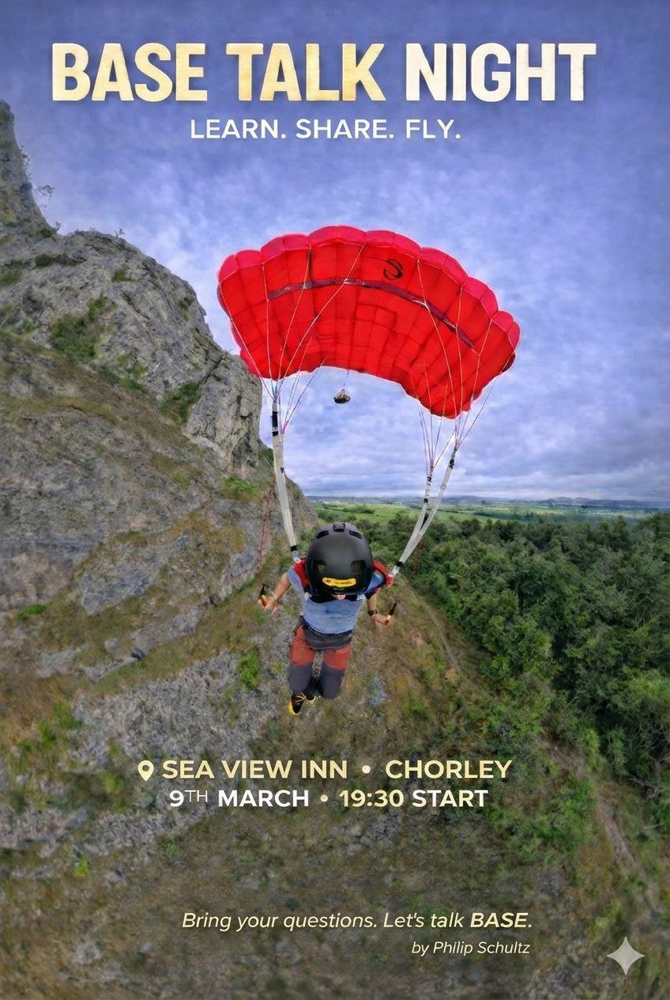

### Curry Night

Remember January? Back when it wasn't going to be flyable ever again? A few of our PSC pilots had a lovely social night curry.

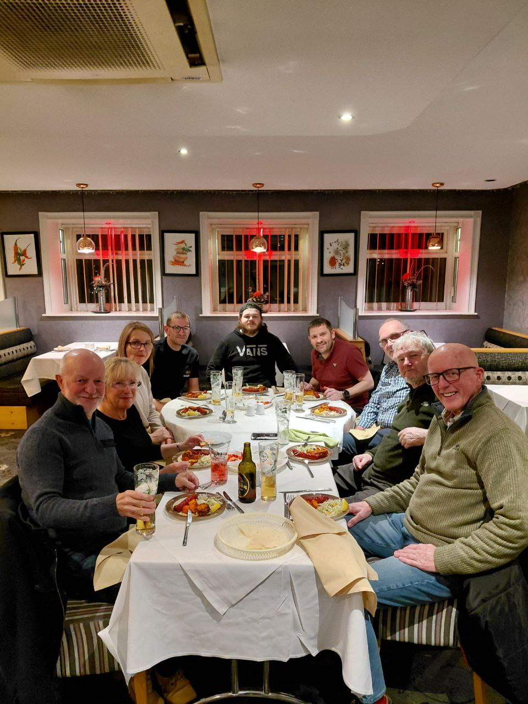

---

# Sites Updates

*Andy Archer, Sites Officer*

### Edenfield

There are revised arrangements for Edenfield around lambing. Due to 2 separate farmers (fell side and field) lambing at different times, the site is closed from **1st April to 25th May**.

### Nont Sarahs

There have been issues this year between paragliders and members of the Marsden Moor Soaring Association (MMSA). No injury but it did cause some heated debate between the modeller and pilots.

There was a successful meeting held at the Nont Sarah's site between MMSA, the British Model Flying Association (BMFA) and Brian Stewart and Neil Charles representing our own club. As a result of this, our [site guide](http://www.penninesoaringclub.org.uk/sites/nont-sarahs/) has been updated to clarify how we should deconflict between paragliders and models

When flying Nonts please take the time to speak to the modellers, a friendly, conciliatory approach goes a long way. If there are any further problems, please make sure that the committee is made aware via [Andy](mailto:sites@penninesoaringclub.org.uk).

### Winter Hill

Access restrictions are still in place while Arquiva change the mast cables - there are still 2 cables to be replaced.

Access may be available to us by the end of April but the road is in poor condition. For now, access is still by parking on Rivington Road and walking up the face of the hill.

---

# 2026 AGM

Our AGM was held on 9th February at the Sea View Inn.

### Committee Members

We've had some shuffling of chairs and we welcome a few new faces to the committee.

**Chairman** Neil Charles (thanks to Brian Stewart, who steps down)  
**Social Secretary** Jacqui Kavanagh  
**Membership** Matt Mottaghian  
**Treasurer** Matt Byrnes (thanks to Jim Ashley, who steps down)  
**Secretary** Jim Ashley (thanks to Simon Scott, who steps down)  
**Safety** Brian Stewart (thanks to Paul Redman, who steps down)  
**Sites** Andy Archer  
**Chief Coach** Simon Baillie  
**Competition** Elliott Brown  
**Webmaster** Sam Ashley (thanks to Carl Fairhurst, who steps down)  
**Power** Simon Scott  
**Newsletter Editor** Neil Charles  
**Social Media** Barry Sayer (thanks to Neil Charles, who steps down)  
**A/V Equipment** Carl Fairhurst  

---

# 2026 Awards

### Newcomer Award

Winner: James Woodward

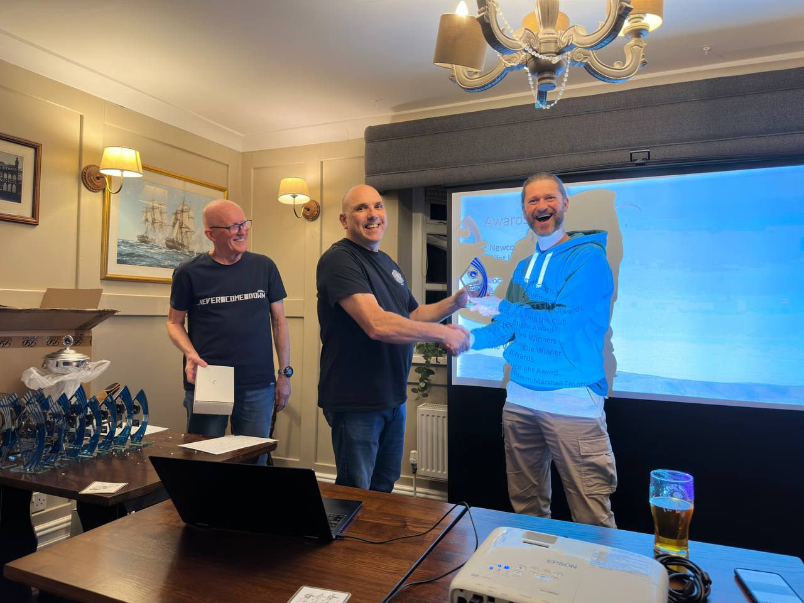

### PG Pilot Progress

Winner: Scott O’Neil

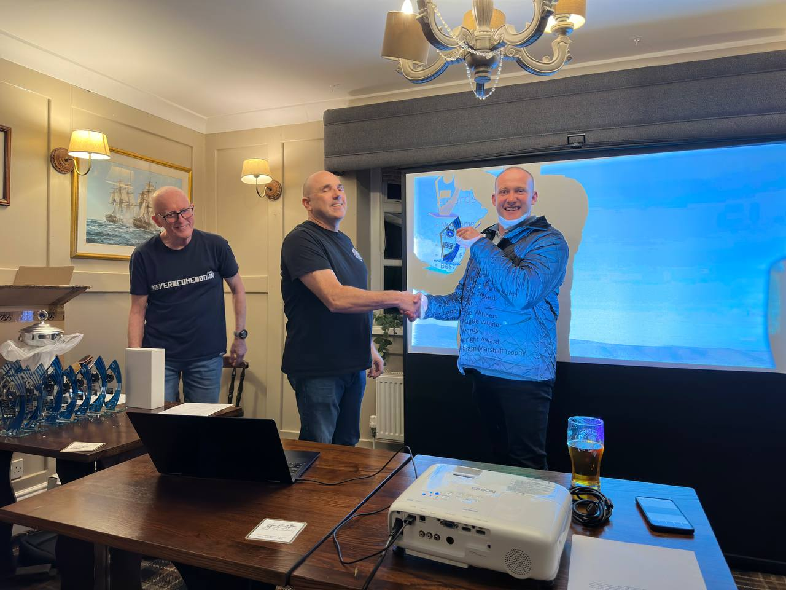

### HG Representing the Club International 

Winner: Doug Neil

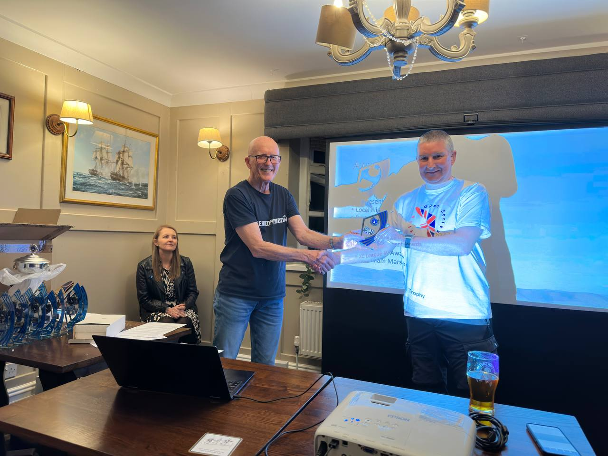

### Representing the Club

"This award had a couple of very good nominations for representing the PSC around the country. This winner has been getting some great XC flights in and also came home from the LCC in 2nd place in the A comp on a tricky day."

Winner: David McClean

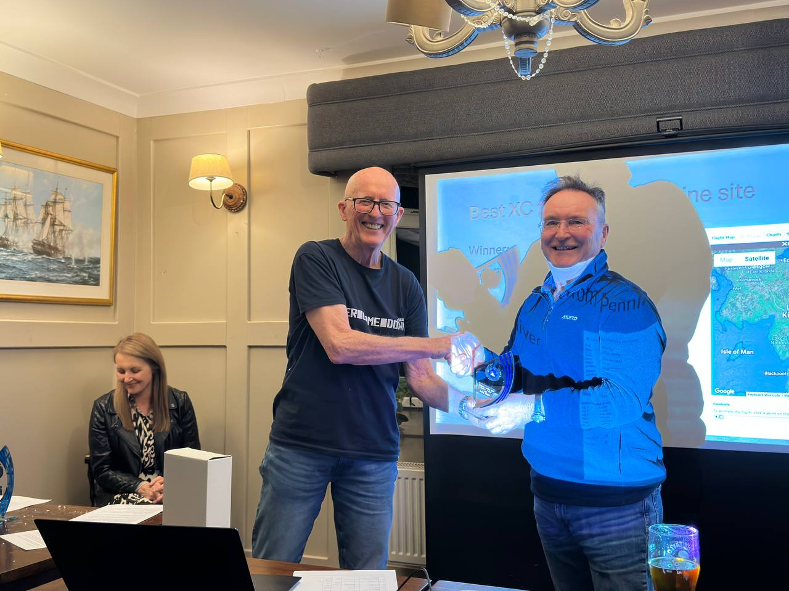

### Representing the Club International

"As a top UK pilot and relentless competitor, our winner has had an exceptionally busy season on the global stage. His year began with a trip to China for the Paragliding World Cup (PWC), followed by a double-header in North Macedonia. After competing in the Flymaster Open, he stayed on for the British & Dutch Championships, where he delivered a standout performance—finishing 5th overall and taking the title of 1st Brit."

Winner Richard Butterworth

### Best Local Flight 

"That glorious day in May when some of the top XC pilots made a trip to Parlick, our winner decided to ‘stay local’ and do a there and back to Stocks Reservoir. Finally landing in Chipping show ground, which they had yet to do."

Winner: Elliott Brown

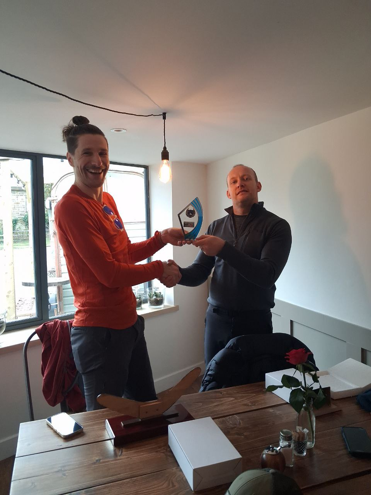

### Best XC flight from Pennine site

"The aforementioned glorious day in May, our winners joined the big gaggle heading north and smashed his personal best for a flight anywhere. 167km open distance, over 5 hours, and crossing into Scotland."

Winner: John Oliver

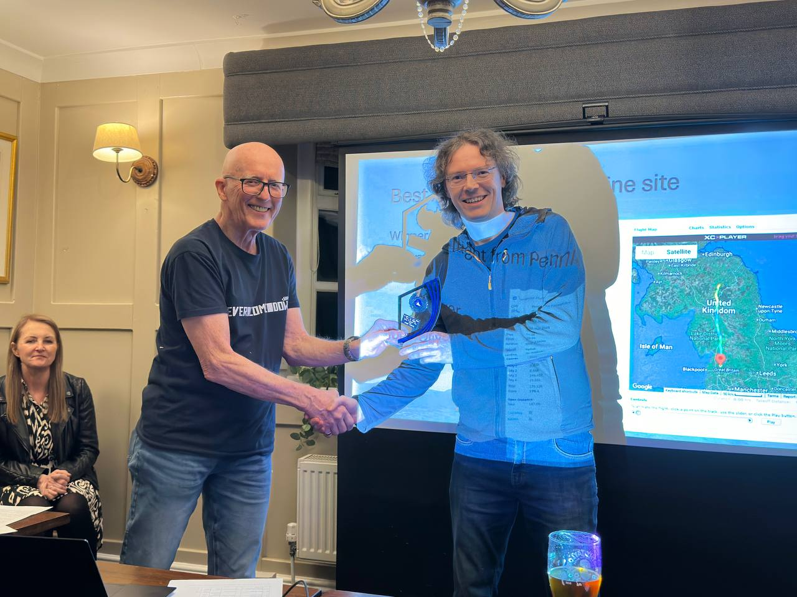

### PG League Fun Class - EN B and below
"Some great XC flights up north from Parlick, one towards Barnard Castle early in the year and another trip up to Kendal solidified the winners place."

Winner: Simon Baillie

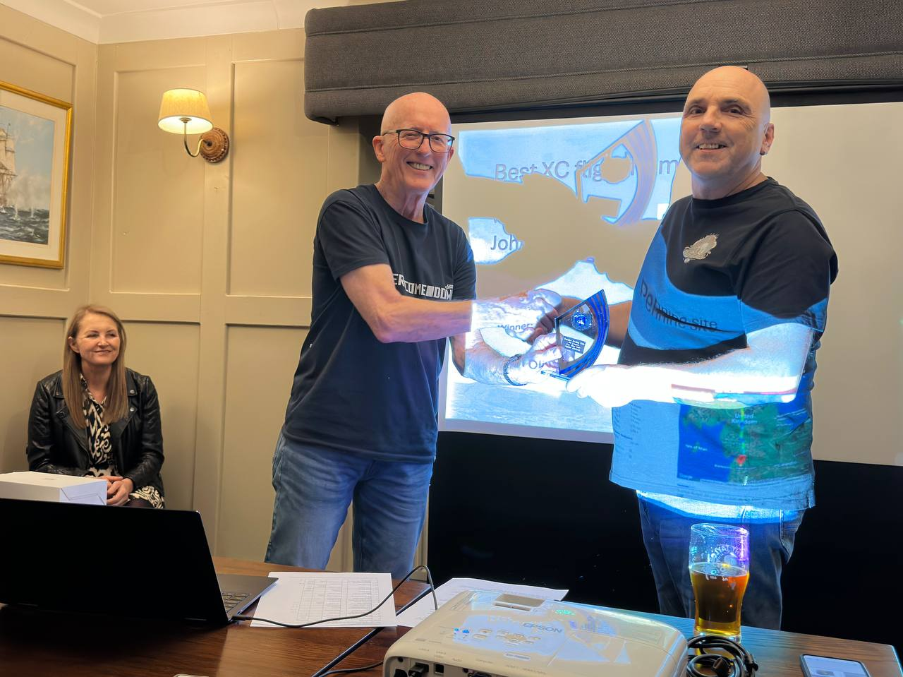

### PG League Sport Class – EN C (and below)

"2 excellent 100km+ flights from Parlick heading north. One almost to the Scottish border on one of the big days of the year. With another heading towards Sunderland.

Winner: Phil Wallbank

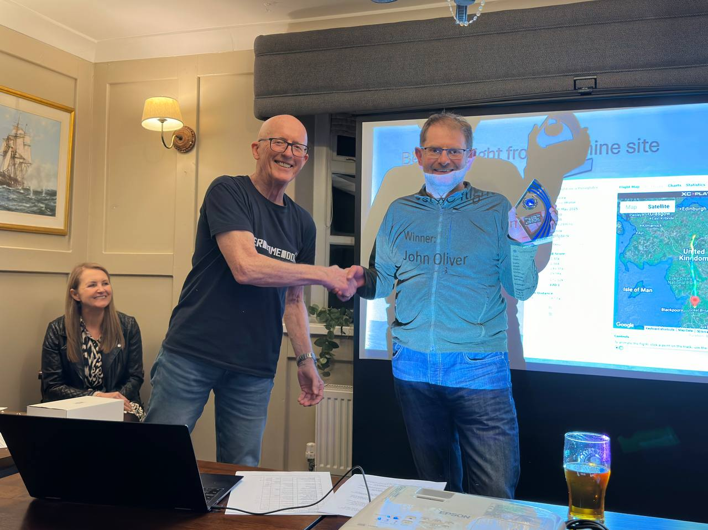

### PG League Overall – Open

"With 2 stonking flights from Parlick, breaking the site record on one of them, our pilot cemented his place as the overall league winner this year."

Winner: Richard Meek

### PSC Loop League

"Super close competition with the top 3 pilots, so close that there is only 1.9 points between 1st and 3rd place! In 3rd place, Mr Murphy with 93.1 pts. In 2nd place, Paul Winterbottom with 93.7 pts. And in 1st place, with 95 points, Elliott Brown“

Winner: Elliott Brown

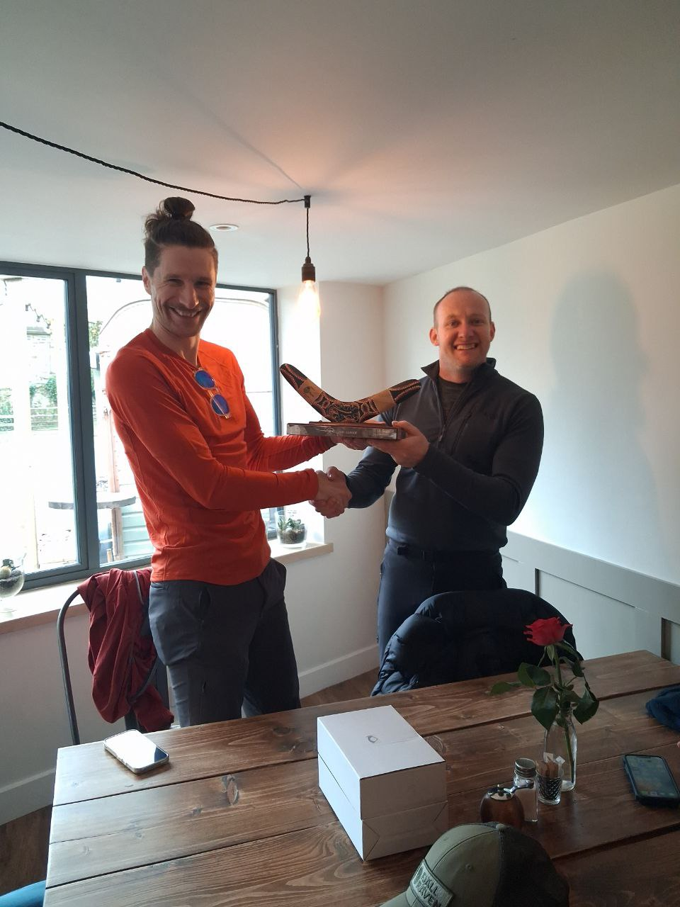

### Club Awards

Jacqui Kavanagh (social nights and pilot sports massage)

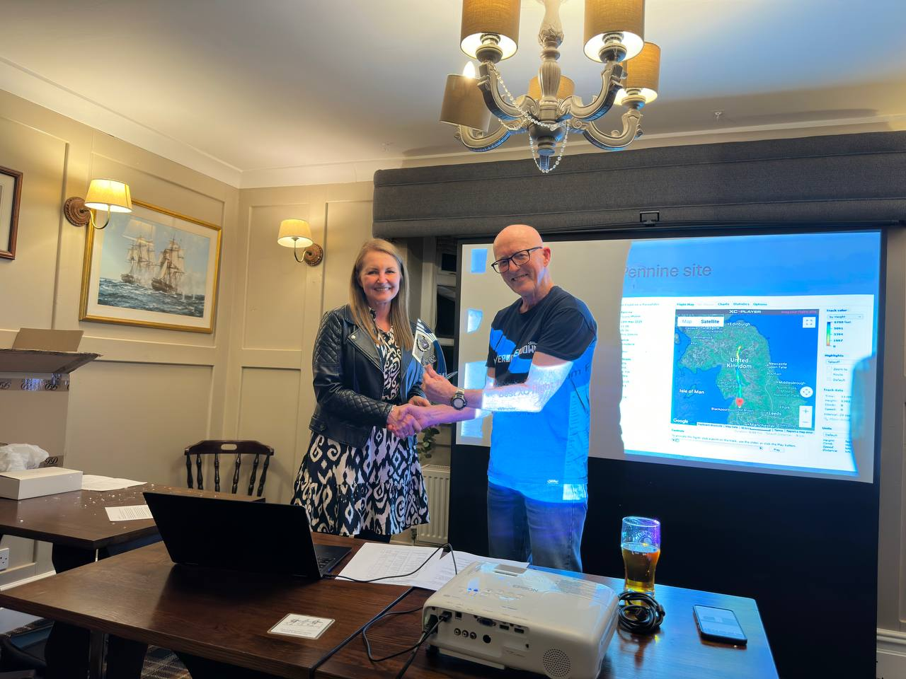

Barry Sayer (organising our repack events)

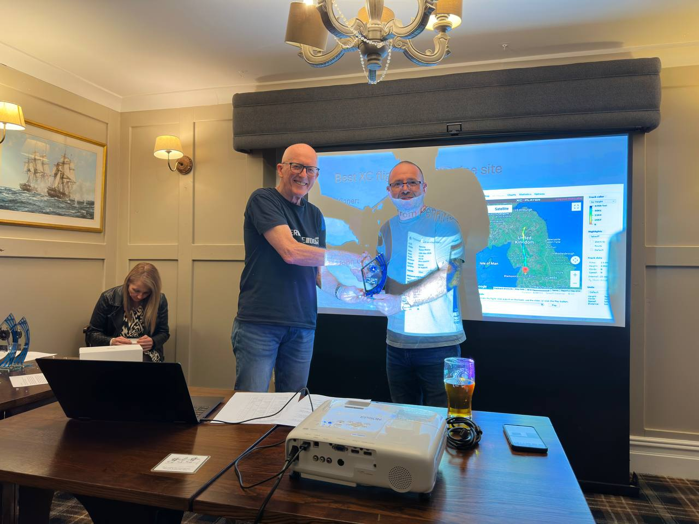

Simon Baillie (running our pilot qualification evenings. Nominated by attendees)

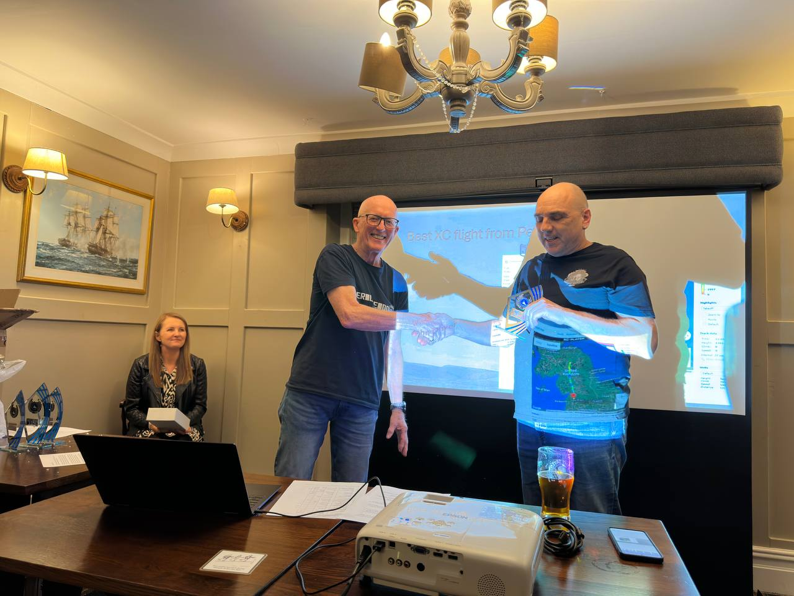

### Bent Upright

Simon Scott (taking off on the wrong runway)

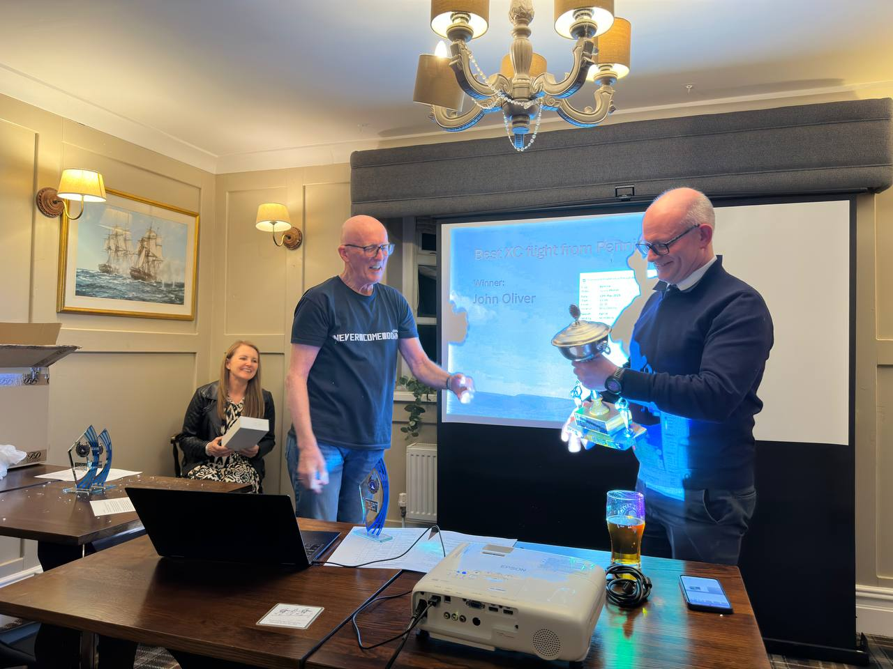

### William Marshall Trophy for Services to the Club

Brian Stewart

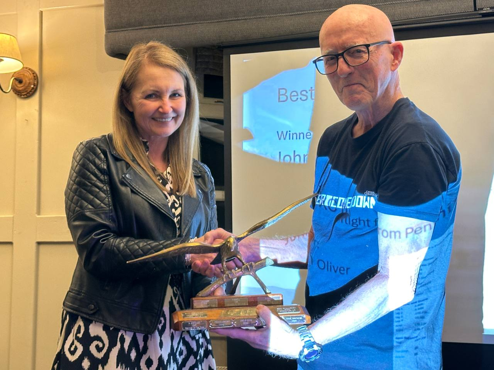

---

# Safety Notes

*Brian Stewart, Safety Officer*

Now I’ve handed on the chairman’s chalice to Neil (phew!) and dusted off my old safety officer’s hat, here’s some thoughts as the days lengthen and the sun climbs ever higher in the sky.

### Spring

“Here comes the Sun, and I say: ‘It’s alright do do do do do do…’”. Thank you George, but sometimes it’s not alright.

No, not yet another interminable piece banging on about why we get violent thermals and rough air at this time – we’re all Club Pilots at least and should know enough about the mechanics of spring thermals and their consequences. But a reminder: Two main things conspire in spring: powerful sun on the ground as it dries, heating air that is still cold, and pilots rusty from a long winter layoff. Some of the most dangerous days are those cold sunny ones with weak dynamic lift, making pilots scratch close to the hillside, vulnerable to the violent bullets triggered by the sun on the ground. These bubbles of air are small but violent and catch out the ring-rusty every year. Please don’t include yourself in the statistics – take the first flights carefully, pay careful attention to the forecasts, watch what’s happening in the sky, and get away from the hillside as soon as you can.

### EC Directive (not safety exactly, but an existential threat to our sport)
For lovers of alphabet salad, [this document](https://www.caa.co.uk/publication/download/27011) tells you all you need to know about the Electronic Conspicuity juggernaut barrelling down the road towards you. To quote Steve Uzochukwu, who keeps a close eye on these things, “Looks to me like a 2-3 year countdown to expensive crap to fly”.

CAA Proposal: Position 4 is stated as: “Within non-segregated airspace, aircraft operating at <140kts (Kts) Indicated Air Speed (IAS) must use 1090 MHz ADS-B devices emitting a SIL and SDA of at least 1, such as (for example) some CAP 1391 devices. Alternatively, a TSO-C112 and TSO-C166 compliant transponder with extended squitter connected to TSOC199 class B or TSO-C145 Global Navigation Satellite System (GNSS) source.

One paragraph that caught my eye was: 

5.3 Of the respondents who disagreed with this position, 87.9% were glider, paraglider, hang glider or paramotor pilots. Several of these respondents against the position raised concerns around the reliability of the EC equipment that falls within the category of this position. Respondents argued that contingency provisions would be required to mitigate the risk from potential equipment failures. Also, incorrect installation by less-experienced pilots could compromise the overall safety of operations if pilots falsely assume that all airspace users fly with EC enabled. Some respondents who were generally supportive of the position in principle stated that there needs to be further consideration of the method of setting speed limits with RCE equipment. Some respondents mentioned that Indicated Airspeed is not the correct metric. Quality indicators were also referenced, with some setting out research that commercial off-the-shelf GNSS sources are of sufficient quality and integrity. (i.e. Source Integrity Level and System Design Assurance). There were concerns about the practicality around the size, weight and power requirements of an ADS-B EC device, especially when considering hang glider and paraglider airframes.

There will be a public consultation  on this announced soon, so keep your eye on it, and if there is any one of you who can keep their eyes open when reading pages full of acronyms and initialisms, please step forward and offer to keep an eye on this important area on behalf of your club.

Tight lines

Brian

---

# Repack

*Barry Sayer, Social Media (and repacks)*

PSC Reserve repack day. Sunday March 1st 2026
 
It’s been cold, wet and windy. The joy of winter is slipping away, moving forward to spring is slightly exciting  in a peculiar way, giving hope for flyable days. What better way to spend a damp and dull Sunday than joining the Pennine Soaring Clubs annual reserve repack event at Chipping village hall.

The day is split into a morning and afternoon session instructed by Guy Richardson (Ginger Nomad Paragliding) and his experienced team. James, the owner of Aerofix, Christina and Bernard, who collectively hold a vast amount of knowledge and experience with emergency parachute systems. Guy’s team is solid gold!

The sessions start with a short talk going over the importance and safety aspects of a paragliding reserve parachute, followed by the opportunity to deploy your bag of washing, whilst sat in your own harness spinning round hanging under the simulator. Familiarity with locating the deployment handle and releasing the reserve is good to see practiced in this controlled environment. The instructors then give demonstrations on folding techniques, parachute line sorting, putting it all back into the deployment bag and much more.
 
Attendees then  pair up and start going through the process of packing their own reserve and installing into the harness or reserve container. The ratio of instructors to attendees provides ample on hand help should you need any help and advice packing your equipment. Learning about you reserve system is more than valuable, it is essential, it is your last chance.

The BHPA guideline is to repack your emergency parachute system at least twice a year. The lifespan guidance is approximately 10 years and then replace with new, there are many factors including deployments, water landing etc.
 
A reserve repack day is not a certified check and repack, you would have to arrange this separately. The certification requires a thorough process of airing the parachute for 24 hours, a full inspection, repacking & installing into the harness.
 
Your reserve is your last chance.
 
Do not hesitate with deployment in an emergency.
 
‘If in doubt, throw it out’

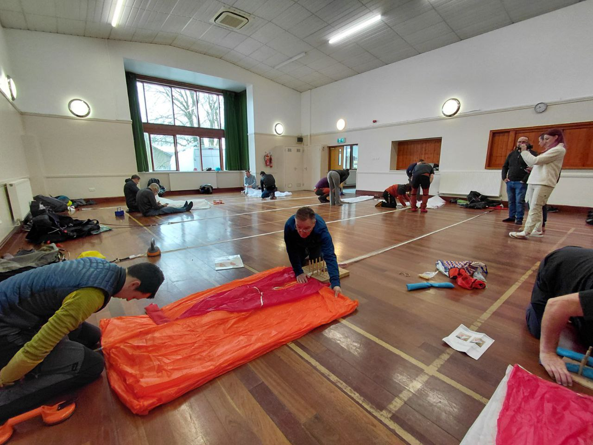

---

# Off-hill Paragliding Stuff (or useful things you might not know about!)

*Elliott Brown, Competitions Secretary*

I'm putting a quick document together to try and help people get started or fill in some gaps on the off-hill side of paragliding (not sure what else to describe it as). This isn’t a must do/must know, but new pilots might find it useful.

I got started with Tim Pentreath’s website many years ago, that started me down the rabbit hole of sites, apps and equipment.
https://flyaszent.com/weather-links/ 

### Telegram
The go-to app for paragliding and chat. Lots of clever people have built apps that interface with groups or send info out, so you can get weather prediction etc. Half the battle is knowing that they exist!

- Lots of groups (clubs, informal club)
- For sale - For Sale/Wanted PG Gear in Britain (2,638 member strong group)
- Gear chat - PG Gear Chat Group (UK) (838 members to ask about what they use etc)
- Automated alerts and weather forecasts - Flybot and Neil Charles https://alerts.hilltop-analytics.com/get-tracking 
- Location chat - Roldanillo, Colombia has a chat with a lot of members, some really valuable info and coordination if people need help.
- XC Retrieve! - Get this setup and tested, you might be close to another member who needs to be back to the hill - https://flyaszent.com/xc-retrieve/ 
- App/hardware specific channels - Need help with XC Track, or want to see how other people have configured theres, theres a channel. Interested in XCTracer or DIY FANET/FLARM devices, there’s a channel.

### Competition related
- https://www.xcontest.org/united-kingdom/ - UK/Worldwide flight competition, but also has a lot of good historical views of where people are flying and what can be done. Get logging your flights or just check out what others on the day.
- https://airtribune.com - See what competitions are going on around the world. This is not a complete list and not every comp. Will use airtribune, but seems to get a lot of events added. 
- https://www.xcmap.net/ - Northern Challenge Series comp. hosted here.
- https://xcleague.com/xc/ - Similar to xconest, but a little older and more manual. Very popular still and the UK league and club leagues are generally done off these flights. Has the ability to look at flights, but it’s not as easy as xcontest (IMO).

### Website
There is a huge list here:
https://docs.google.com/spreadsheets/d/1JVbFwMKylrgj8e3HUP-ummgBl9O2EVyBKyMx6-xT-Qw/edit?gid=0#gid=0 

### Ones I look at on the regular (links in the google drive doc above)
- https://rasp.stratus.org.uk/ - RASP - Weather forecast
- https://www.windy.com/ - Windy - Weather forecast with handy features to really dive into the detail of the forecast
- xcmap.net - NCS, and other challenges
- Flyxc.app - Flight planner and visualiser
- https://ogoy.app/en - Ogoy - Flight visualiser, you might have to register to view, but it’s a really neat setup and not laggy.
- bustimes.org - best bus tracking website ever, perfect to see if you have to run for the next bus to get back to the hill.

### Tracking
Want others to see where you are or where, there are plenty of ways to set tracking up for your devices. 
- Puretrack - Aggregation of multiple sources (some below), instead of showing up multiple times, it aggregates you tracking onto one point.
- OGN db - Have your name (or username) appear on tracking maps with your FLARM enabled device: https://ddb.glidernet.org/ 
- Flyxc.app (again) - In setting you can feed is different data sources, (a bit like Puretrack)

### Apps
There are a couple of apps that I’m aware of that are used by pilots. I’ve seen or used these, there are others, but I haven’t spent much time with them. This can be fed data from your vario/gps unit and display it how you want to see it. Create a flight to goal or display a competition task, these can do it by scanning a QR code, or downloading a file. Lots of customisation or features, if you want them 
- FlyskyHi - iPhone
- XCTrack - Android - Live tracking via xcontest
- Seeyou Navigator

### Finally
If you need to be invited to a group, send me a message and I will either get the link or get you added. This was quickly thrown together after a conversation with a newer pilot about some of the above and have been thinking about it for some time. It’s not comprehensive and purely my opinion and views, I would guess there is a lot out there I’m not aware of. If it helps 1 pilot, I’m happy.

---

# SIV

If you have completed your first SIV course you could get a £50 contribution from the club. Jack Pimblett, a PSC pilot now running SIV courses with Theo de Blic at [RISE](https://www.riseparagliding.com/) in Olu Deniz has been in touch to say that they will match the club's offer, so that's £100 off your first SIV course if you choose to go with RISE.

Make sure to email accounts@penninesoaringclub.org.uk with your details if you've booked onto your first course!

---

# Competitions

*Elliott Brown, Competitions Secretary*

### XContest

Emma has joined myself and Doug, throwing up a number of nice flights on Parlick.

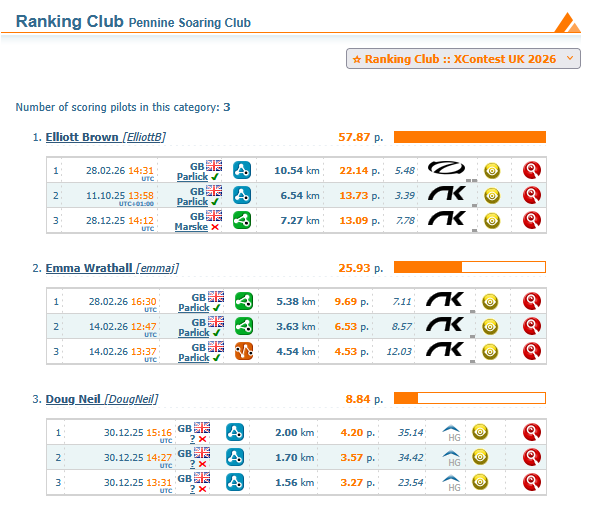

### XC League
No doubt there will be a couple more flights to be added from Saturday.

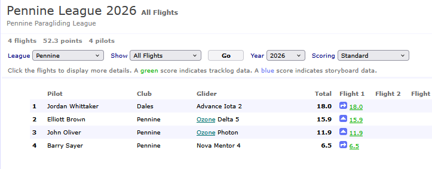

### NCS - Northern Challenge Series 2026

Saturday on Parlick was a surprisingly good day, to the point of loading a task up just in case it improved… It did! If I was a bit more focused earlier on in the day, there was a good opportunity to get the task completed, but I was too busy seeing how long the lift would hold out towards the M6.

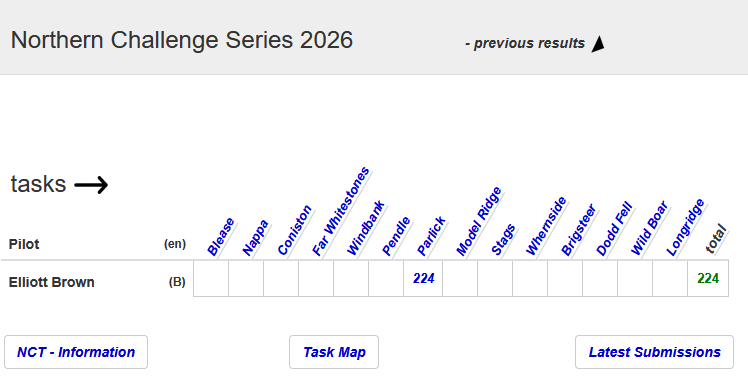

[Info here](https://www.xcmap.net/index.php?c=Northern%20Challenge%20Trophy). 

---

# The Gallery



---

# Dates For Your Diary

### **9th March - Club Night: BASE - 7.30pm, Sea View Inn, Chorley**

19th - 26th April - [PWC Governador Valadares](https://pwca.events) - Governador Valadares, Brazil

20th - 26th April - [British Accuracy Cup Round 2](https://civlcomps.org/event/BAC-2026-Round-2) - Woldingham, Surrey

2nd - 5th May - [X-Scotia](https://x-scotia.co.uk/) - Kintail, Scotland

5th - 16th May - [PWC Superfinal](https://pwca.events) - Pegalajar, Spain

16th - 17 May - [Dragon Hike & Fly](https://crickhowellparagliding.com) - Crickhowell, Powys

23rd - 30 May - [Sports Class Racing Series Skywalk Edition](https://sportsracingseries.org) - Bassano, Italy

28th - 31st May - [Red Bull X-Alps Challenger](https://www.redbullxalps.com/int-en/red-bull-x-alps-challenger-2026-mayrhofen-new-chapter-begins) - Mayrhofen, Austria

### **29th - 30th May - [Buttermere Bash](https://www.tickettailor.com/events/airventures/1970235?brid=EIHZAoEZ8dz1jlj8AP564Q) - Buttermere, Lake District**

31st May - 13th June - [FAI Hang Gliding European Champs/Class 5 Worlds](https://hgcomps.uk) - Gemona, Italy

4th - 7th June - [British Paragliding Cup UK Round](http://www.bpcup.co.uk) - Yorkshire Dales

6th - 7th June - [Dragon Hike & Fly (backup date)](https://crickhowellparagliding.com) - Crickhowell, Powys

6th - 13th June - [Sports Class Racing Series Naviter Edition](https://sportsracingseries.org) - Tolmin, Slovenia

16th - 21st June - [British Open Paramotor Cup](https://ppgcomps.co.uk) - Deenethorpe, Northants

### **18th - 21st June - Lakes Charity Classic - Grasmere, Cumbria**

18th - 21st June - [X-Lakes Hike & Fly Competition](https://x-lakes.uk) - Grasmere, Cumbria

27th - 3rd July - [Sports Class Racing Series French Edition](https://sportsracingseries.org) - Annecy, France

17th - 19th July - [British Accuracy Cup Round 3](https://civlcomps.org/event/BAC-2026-Round-3) - Woldingham, Surrey

August TBC - [British Paragliding Cup European Round](http://www.bpcup.co.uk)

22nd - 29th August - [Sports Class Racing Series Spanish Edition](https://sportsracingseries.org) - Piedrahita, Spain

5th - 12th September - [Paragliding World Cup Siatista](https://pwca.events) - Siatista, Greece

18th - 20th September - [BAC Round 4/Super Final](https://civlcomps.org/event/BAC-2026-Round-4) - Woldingham, Surrey

7th - 14th November - [Sports Class Racing Series Mexican Edition](https://sportsracingseries.org) - Tapalpa, Mexico

---

# Your Newsletter Needs You

Appear in the next newsletter! We need submissions for...

**A Grand Day Out**  
2-3 paragraphs describing a fun day. You're welcome to write more if you're feeling creative but a couple of paragraphs is plenty. Could be epic, could be daft, could be simply the first time you flew for six months. If you've had a good day and you took some pictures, send it in.

**Why Not Visit...**  
A quick guide to a site that you like, at home or abroad. Tell us where it is, what it's like to fly, any watch-outs and how to contact the locals. Attach a photo and email it over.

**The Gallery**  
Send in any recent(ish) shots with when and where they were taken. Spectacular, silly, from the ground or from the air, it doesn't matter. Let's see what you've been up to. Videos are very welcome too but pop them on YouTube or Vimeo and send a link for the newsletter.

**Shout Outs**  
First ever XC? Smashed a PB? Took part in a comp? Let us know and get a shout out in the newsletter. Nominate your mates if they won't do it themselves.

**Top Tips**  
Spotted a bargain? Got a great travel tip? Know how to make Bluetooth connections work on an iPhone? Share your best ideas.

Send submissions on these or anything else you'd like to see featured to [editor@penninesoaringclub.org.uk](mailto:editor@penninesoaringclub.org.uk). You can also drop them over using the [web form](https://docs.google.com/forms/d/e/1FAIpQLSd3NJQKlmLjjlh-nZGQKaeXzN6dSSL2PHzKRXFYAy_Bw7SC9w/viewform?usp=sf_link) or message [Neil](https://t.me/NeilCharles) on Telegram.

--- 

Fly safe  
[editor@penninesoaringclub.org.uk](mailto:editor@penninesoaringclub.org.uk).