# Sorry we're late, there was ~work~ flying to do

Spring is well and truly here. Pennine pilots have been on XCs home and away, whether their very first or a new personal best and we've got the tales and the photos.

Spring has brought the usual spicy air too, with some cautionary tales in this issue from Safety Officer Brian and from John Murphy.

Keep it safe everyone and enjoy the weather!

[editor@penninesoaringclub.org.uk](mailto:editor@penninesoaringclub.org.uk).

[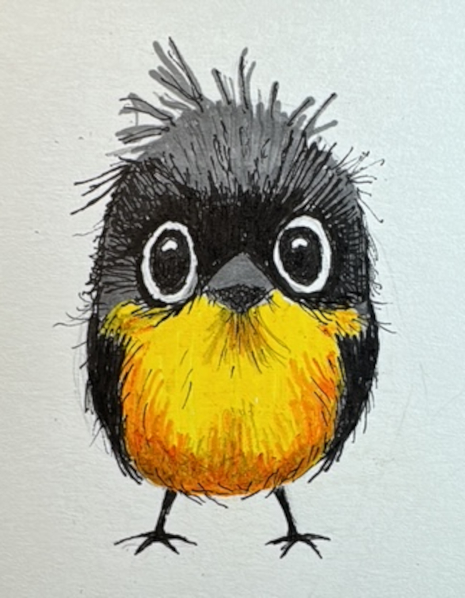](cover.jpg)
*Cover photo: Graham Jones somehow finds time to sketch us a mascot between Parlick flights*

---

# Social

After putting in a sterling shift organising our winter club nights, Jacqui Kavanagh is stepping down as social secretary due to moving away from the Pennines.

Thank you for all of your hard work Jacqui, we really appreciate it.

The club needs a new Social Secretary and it would be wonderful to have a volunteer. The role can be whatever you choose to make it but the main responsibility is helping to find a reason for us to get together once a month while it's cold and dark and not flyable all winter. Don't worry, everyone on the committee pitches in to help find us some club night speakers (or one of our own simply gets volunteered to be a presenter by the rest of the group) and it's a lovely way to help make our club the welcoming place we'd all like it to be.

Fancy joining us on the committee and helping out? Drop Neil a message: chairman@penninesoaringclub.org.uk

---

# Sites Updates

*Andy Archer, Sites Officer*

### Edenfield

Edenfield is closed for lambing **1st April to 25th May**.

### Winter Hill

Access restrictions are still in place while Arquiva change the mast cables - there are still 2 cables to be replaced.

Access may be available to us by the end of April but the road is in poor condition. For now, access is still by parking on Rivington Road and walking up the face of the hill.

---

# Coaching Corner

*Simon Baillie, Chief Coach*

The season seems to have got off to an amazing start, well done to everyone who has managed to fly cross country already. I’m hoping that this continues, and we get some good weather for running some coaching days soon. I will be watching for any promising looking weekends, and will post on the PSC Club Coaching Telegram group with a couple of days’ notice. Please contact me if you’re not on that group and would like to be.

Just a quick update on our Pilot revision and exam nights this winter. We ran 3 very successful sessions, with Brian Stewart covering Flight Theory, Richard Butterworth Air Law & Navigation, and Phil Wallbank Meteorology. Big thanks go to all of them for giving up their time and running excellent revision workshops.

[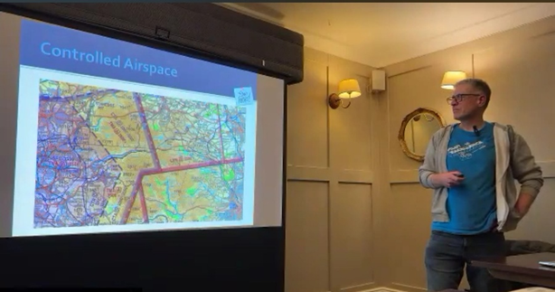](coaching1.png)

Congratulations to James Davidson, Jim Woodward, and Rick Leaver for passing their Pilot exams. Also a big shout out to Jim Woodward who has bagged his first XC recently, flying from Parlick to Stocks Reservoir! Well done Jim.

Although the main revision sessions happen through the winter, I am more than happy to help anyone with getting their Pilot rating throughout the year. If you are interested, and would like to know a bit more about it, please contact me through Telegram or by email at chiefcoach@penninesoaringclub.org.uk 

---

# Safety Notes

*Brian Stewart, Safety Officer*

### Site Guides

Recently a couple of new members joined us on Parlick, nice to see them and they were very keen to get to know us and learn what they could about the club and the site and made a good impression with their enthusiasm and willingness to engage and learn. All good, with one omission – they hadn’t read the site guide, which should be a basic first step for all when going somewhere for the first time. We can all do our bit when we see new pilots on the hill – make them welcome and encourage them to join in club activities, but ensure they are aware of the restrictions and special circumstances of each site by reading the site guide. Also, not a bad idea for experienced pilots to re-read the guides from time to time...

### Post-Landing Protocol

There was brief concern on Parlick earlier when a pilot observed a laid-out canopy on the hill, and no apparent movement from the pilot for some time. While considering options, including flying over to the pilot on the ground and asking if anyone on the ground could take a closer look, the pilot was seen moving and appeared OK. Well done to the pilot who observed this, reported it and started the process of investigation. All good in the end, but a reminder that a laid-out canopy and stationary pilot could be a distress signal, and it’s important to tidy it away as soon as possible after landing anywhere, but especially on the hillside or when landing out.

### Lesson Learning

Here’s a post reproduced with permission from the CSC Forum last month; such a good idea for pilots to write up their incidents and share them for us all to learn something.

**Friday 27 Mar 2026 3:55 pm**

Friday 20 March. After about an hour and a half of increasingly thermic flying at Whitestones setting up to land in usual place adjacent to carpark. Windsocks showed nil wind so prepared for a fast landing. I took a wrap on the brakes but failed to achieve this on the left side due to unfamiliarity with a new pair of gloves. Almost simultaneously with the failed wrap I saw the windsock flick violently and I immediately suffered from an asymmetric on the right. I was aware of being spun. Next thing I remember was a voice (visiting pilot, Lizzy) telling me not to move. I had been unconscious briefly but was able to establish all my bits were working before exiting my harness and wobbling around the landing area for a bit. Initially I had absolutely no idea of where I was, how I got there or who Lizzy was even though I had given her a site brief and chatted with her on the hill an hour earlier. Initially I had no recall of flying let alone the incident. As my memory returned I deduced the following. I had been ambushed by a short sharp thermal. The effect was probably exacerbated by having a wrap on the right brake.

The main lesson (re-lesson) is that Whitestones can be extremely thermic, particularly at this time of the year. I should have made more allowance for the conditions and probably not attempted to land in a fairly restricted area given the massive available area. Also, I'm not particularly current given the last couple of seasons have been limited by an ongoing back problem. Moreover, think I was probably distracted and faffing with my left hand glove.

Injuries! I feel quite lucky. Feeling battered with some colourful bruising but nothing broken. Sadly my back recovery programme is in jeopardy but I do have a frequent flyer pass with the Penrith Physio department.

**And another one from Derbyshire**

I was launching from Mam Tor East in wind of approx 12-15mph. I did my usual pre-launch checks and checked my lines, etc. I then put on my harness and actually took it off again because it occurred to me that I hadn't checked if my lines were twisted so I checked the lines again. Clearly I was a bit rusty having only had less than a handful of flights over the winter.

I did a bunched launch as it was quite windy. Launch went fine and everything seemed to be coming up well so I turned and launched immediately. Again, in hindsight, my rustiness meant I didn't take a pause to check the wing properly before going. (Also, if I'm honest, my new girlfriend was watching me launch for the first time so I was a bit distracted by that).

Immediately after launching I realised that my brake line was wrapped around a couple of lines and I had a small crevatte on my right.
I proceeded to fly out straight from the hill whilst attempting to unwrap the brake line. I loosened things a bit, but it looked too difficult to unwrap.
At that point a pilot on the hill that I know and trust came on the radio and told me that I had a crevatte (which I already knew) and that he thought it might need a collapse to clear it.

Unfortunately I went into unthinking mode a bit. I was quite far out and reasonably high, so I just pulled a collapse on my right side.. Didn't really properly prepare for it by leaning the opposite way, etc. so things then got quite bad as the glider spun quickly about 180 degrees towards the hill. Obviously I immediately released the collapse and quickly got the glider back under control and turned away from the hill. The crevatte had not cleared (I don't think it was the sort of thing that would have cleared with a collapse anyway - it was just due to a tangled brake line). Anyway, I then just steered the glider down and landed near the landslip without further incident.

Learning
1. Proper preflight checks - esp rusty
2. Don't launch before fully checking the wing is flying properly 
3. Don't blindly listen to advice from the radio. I was still the pilot in control and should have ignored the advice and gone with my initial instinct to just land
4. Perhaps other pilots also need to be aware of the potential effect of giving advice from the hill

Plenty of lessons there for all levels of pilot.

---

# Photo Diary

*John Oliver, Long Mynd 14th March*

[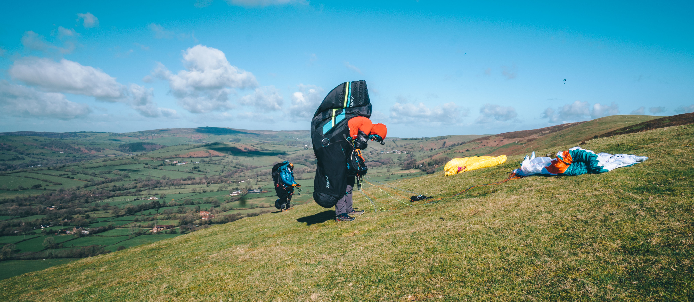](jo1.jpg)

[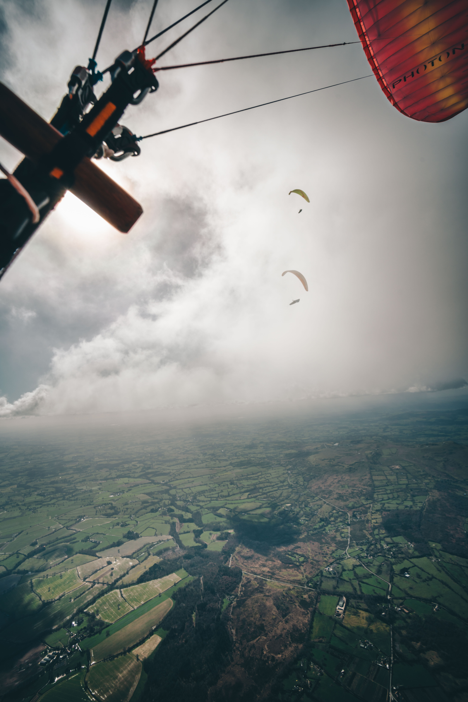](jo3.jpg)

[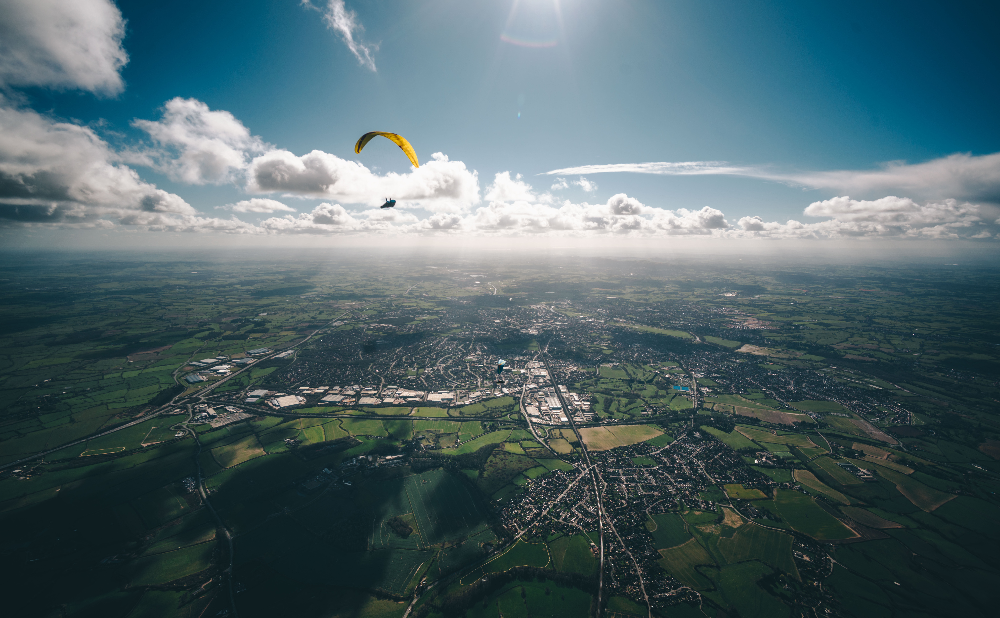](jo4.jpg)

[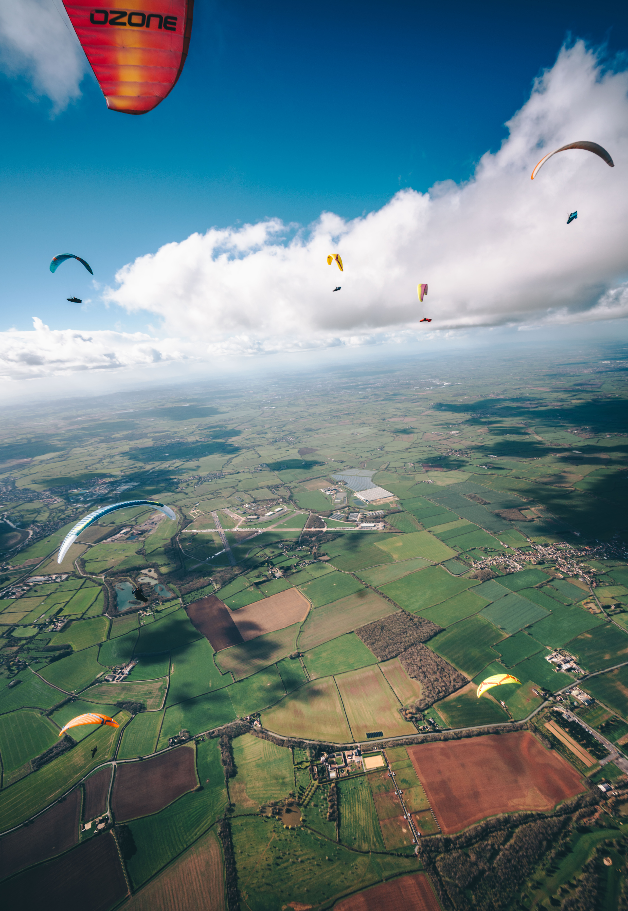](jo5.jpg)

[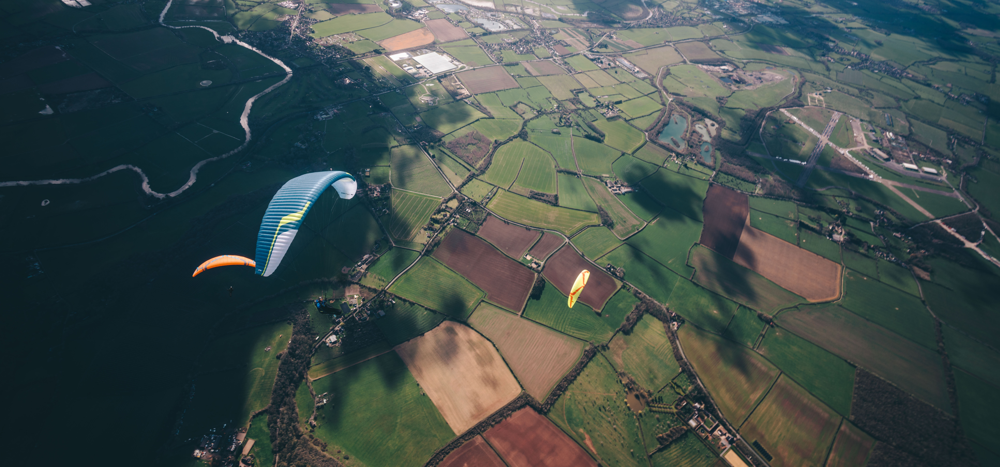](jo6.jpg)

### A commentary on the same day from Elliott Brown

The Forecast: RASP looked promising days out; confirmed by the hive mind on the development chats.

The Plan: WhatsApp group created for route planning and weather checks. Logistics sorted with car sharing to get everyone to the hill.

The Crowd: Pilots inbound from Derbyshire, Cumbria, and the Dales—shaping up to be a big day.

Navigation Setup: Aiming for an easy retrieval but keeping clear of the Brize Norton ILS. The route was pulled back to a village on the line into Oxford. I programmed it into XCTrack as a Competition Task.

Pivot on the Hill: Launch was busy. After a group huddle, we switched the goal to Banbury to better suit the potential wind. I re-loaded it into "Waypoints / XC Navigation" for the flight, as that’s better… right?

The Launch: Joined the first gaggle but realized I was missing the data fields from my competition screen. I swapped back to my usual competition layout mid-air.

The Glitch: In the transition, I never tagged the first waypoint. Since I was already downwind and busy thermalling, I just shrugged it off—the flight wouldn't be a "declared" one anyway.

The Split: Got separated from the main pack and spent a fair distance playing catch-up. I eventually joined a mini-gaggle, and made out way downwind before starting to head off to our separate goal

The Realization: On final glide, the town ahead didn't look like Banbury. I was in the middle of nowhere, looking at tiny villages where the rail line loops widely away from the landing zone. The rest of the mini gaggle had split off to land closer to a station

The Retrieval: Taxi to Chipping Norton, as there were no buses. Bus to Banbury, conferring with the Butterworth’s where we were going. Scored a 1st Class train to Stafford for just a £3 upgrade, food included.

The End: Met by Kacper for the final lift home at the station. A brilliant day out!

### XContest - First 100km

No free 100km T-shirt this year, as I found out trying to claim my t-shirt. 

Instead, you join the club as you add your flight and can order the shirt from Cross Country mag instead.

https://www.xcontest.org/world/en/ranking-pure-100km-club/

---

# A Cautionary Tale (part 2)

*John Murphy*

So, here we go again! I think it is important to learn from your mistakes but even better to learn from others so hopefully this little tale might help.

I had a minor incident last Thursday and was asked if I could do a piece on it for the magazine, fired up my word processor and what did I see but an article I did a few years ago about my last mishap titled ‘A cautionary tale’. Slightly different this time, but if I had paid attention to some of the ‘learning points’ below from the last time I might have avoided causing myself some pain and others concern.

- Being back from the edge of the hill doesn't mean you are out of danger, rotor effects can
extend a long way back
- A PLF can save major damage
- If there is doubt in your mind, wait and monitor the conditions
- Listen to the voice in your head, if it feels wrong it probably is

The story starts as most of my flying on Parlick, a reasonable but not fantastic forecast but good enough to attract some of the best pilots in the country to our little hill. I felt privileged that they shared their task with me but still managed my trick of launching too early and having to slope land and walk back up (*Beware frustration and the 'need' to fly*).

I was, however, able to relaunch and climb up to cloudbase with one other. Having seen so many times the power of the gaggle, too often from the ground as the gaggle flew over me, I decided to wait until the others got up. And so it was that I set of with 4 others on our way to Bridlington.

It was tricky, 3000 foot cloudbase, reasonable thermals but finding them without the help of everyone else would have been much more difficult. We all made quite slow progress, initially there was very little wind to help but once we got past Stocks reservoir and the Bowland forest area we were able to use a huge cloud and wide strong lift to cross the Settle Valley. Cloudbase had risen to over 3600 feet but ahead, on track, was blue. The others set off on glide, spread out to maximise the search so I decided to push on with them. One found lift, low but going up and was joined by another wing. I pushed bar and headed for them, higher up one of the others was coming back towards them and of to my side Scott was also heading towards them.

As I got under them I found a couple of scrappy bits but couldn’t stay in them, at this point I was probably about 50 feet above the ground and so decided to push into wind towards the edge of the escarpment (Being back from the edge of the hill doesn't mean you are out of danger, rotor effects can extend a long way back) that was sort of sitting into wind, hoping to get lift triggering of the edge. The escarpment was a bit messy and higher than the ground I was over. My ‘inner self’ wasn’t completely happy (If there is doubt in your mind, wait and monitor the conditions) so I actually had one foot half out of the pod getting ready for a quick landing.

What I got was quicker than I wanted, turbulence from the edge caused a large frontal collapse, all I knew was the risers disappeared behind me and I hit the ground, feet then back then head. I like to think that I intentionally got my feet down to initiate a plf but to be honest it happened so quickly that I can’t be certain about that.

Yet again I was lying there on my side in the quiet thinking "I'm alive, that's good, but what damage have I done?" I also heard Richard on the radio saying he had seen my collapse and was I OK, followed by calls asking if I needed help. It took a little time to get myself together but luckily all I had was a very sore neck and a headache and was able to respond on my radio to let the others know I was OK and didn’t need assistance.

When I was packing up some very strong gusts came thorough, confirming what I think probably caused my problem. Scott had also made contact by now, having landed nearby,
and walked up to make sure I was OK.

So what I have learned from this, nothing new. As has been quoted before we just keep having the same accidents and pilot error continuous to be the primary cause. I knowingly put myself in a less than perfect area, pushing the limits just to possibly fly a bit further, and got punished. What is the saying about ‘old and bold’ pilots? Well I think I qualify for the ‘old’ part but if I keep ignoring that inner voice??

---

# Competitions

*Elliott Brown, Competitions Secretary*

I started writing this on the 9th and everytime I do this, stuff changes, so it’s a bit out of date! (and sometimes it gets published even later, blame work - Ed).

It would seem that I have been missing out on some of the XC League options, so I'll inevitably pepper them in as the year goes on (sorry, not sorry). I like the division that splits people up by their minimum long distance flights, you don’t want to go too far, otherwise you’re bumped up to the next division, and need to keep flying the big distances! The Weekend Warrior category is also very good, it makes me feel a bit better while working the 9-5 Monday to Friday, when the weather is epic (even if I do sneak out every so often).

### XContest

You can tell that the weather has improved and people have got some good flights in, as we’re filling up the flights in the club flights. Long Mynd getting lots of flights in, with 2 first 100km, mine and David McLean’s. We were flying together for a good chunk of the flight, only splitting when going for a train station, instead of just flying into the middle of no-where. Which just so happens to be where Jeremy Clarkson's farm was located, some very odd looking fields!

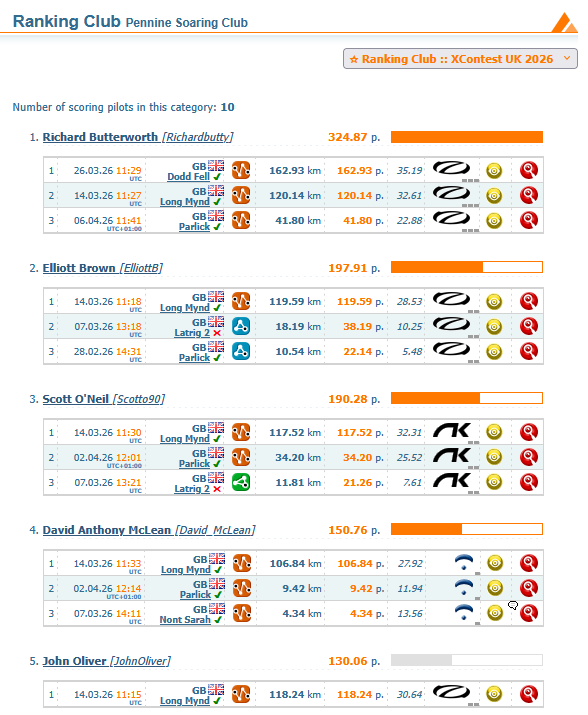

We’re doing well as a club on XContest (which happens to have a couple more clubs than XC League), it will be interesting to watch our position through the year, as we get more XC weather coming our way. Will it be another year of record breaking flights?

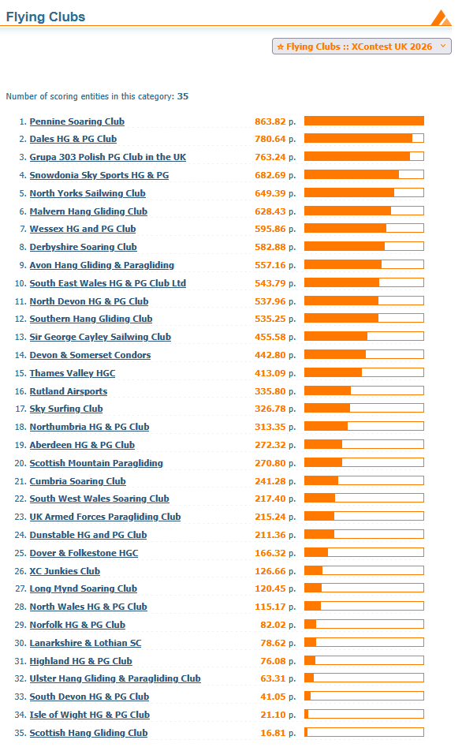

### XC League

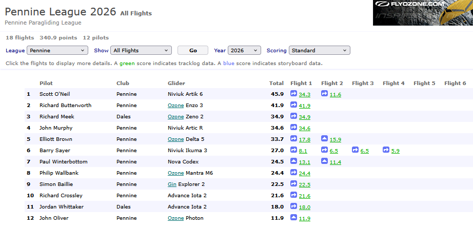

### NCS - Northern Challenge Series 2026

Windbank had a good day on Thursday, a perfect task for when you need to stay local and not be tempted down wind. Stags also got completed recently, looks like we’ve got a good start to the series for this year, I’m excited to see how more flights getting logged.

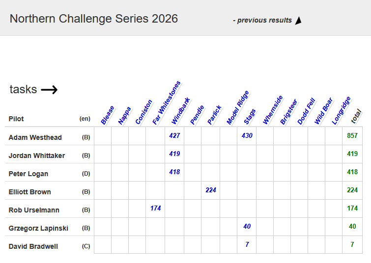

[Info here](https://www.xcmap.net/index.php?c=Northern%20Challenge%20Trophy). 

---

# The Gallery



---

# Shout Outs

Simon has already mentioned Jim Woodward's first XC in his coaching notes but first XC flights are special so let's do it again.

Well done Jim!

---

# You Might Have Missed

YouTuber Tom Scott has made a wonderful paragliding introductory video, flying tandem with Rutland Airsports. He's towing rather than hill launching but it's such a good explanation of the joy of paragliding that we won't hold it against him. Well worth a watch and one to save and share with people who ask what it's like to fly.



---

# Dates For Your Diary

19th - 26th April - [PWC Governador Valadares](https://pwca.events) - Governador Valadares, Brazil

20th - 26th April - [British Accuracy Cup Round 2](https://civlcomps.org/event/BAC-2026-Round-2) - Woldingham, Surrey

2nd - 5th May - [X-Scotia](https://x-scotia.co.uk/) - Kintail, Scotland

5th - 16th May - [PWC Superfinal](https://pwca.events) - Pegalajar, Spain

16th - 17 May - [Dragon Hike & Fly](https://crickhowellparagliding.com) - Crickhowell, Powys

23rd - 30 May - [Sports Class Racing Series Skywalk Edition](https://sportsracingseries.org) - Bassano, Italy

28th - 31st May - [Red Bull X-Alps Challenger](https://www.redbullxalps.com/int-en/red-bull-x-alps-challenger-2026-mayrhofen-new-chapter-begins) - Mayrhofen, Austria

### **29th - 30th May - [Buttermere Bash](https://www.tickettailor.com/events/airventures/1970235?brid=EIHZAoEZ8dz1jlj8AP564Q) - Buttermere, Lake District**

31st May - 13th June - [FAI Hang Gliding European Champs/Class 5 Worlds](https://hgcomps.uk) - Gemona, Italy

4th - 7th June - [British Paragliding Cup UK Round](http://www.bpcup.co.uk) - Yorkshire Dales

6th - 7th June - [Dragon Hike & Fly (backup date)](https://crickhowellparagliding.com) - Crickhowell, Powys

6th - 13th June - [Sports Class Racing Series Naviter Edition](https://sportsracingseries.org) - Tolmin, Slovenia

16th - 21st June - [British Open Paramotor Cup](https://ppgcomps.co.uk) - Deenethorpe, Northants

### **18th - 21st June - Lakes Charity Classic - Grasmere, Cumbria**

18th - 21st June - [X-Lakes Hike & Fly Competition](https://x-lakes.uk) - Grasmere, Cumbria

27th - 3rd July - [Sports Class Racing Series French Edition](https://sportsracingseries.org) - Annecy, France

17th - 19th July - [British Accuracy Cup Round 3](https://civlcomps.org/event/BAC-2026-Round-3) - Woldingham, Surrey

August TBC - [British Paragliding Cup European Round](http://www.bpcup.co.uk)

22nd - 29th August - [Sports Class Racing Series Spanish Edition](https://sportsracingseries.org) - Piedrahita, Spain

5th - 12th September - [Paragliding World Cup Siatista](https://pwca.events) - Siatista, Greece

18th - 20th September - [BAC Round 4/Super Final](https://civlcomps.org/event/BAC-2026-Round-4) - Woldingham, Surrey

7th - 14th November - [Sports Class Racing Series Mexican Edition](https://sportsracingseries.org) - Tapalpa, Mexico

---

# Your Newsletter Needs You

Appear in the next newsletter! We need submissions for...

**A Grand Day Out**  
2-3 paragraphs describing a fun day. You're welcome to write more if you're feeling creative but a couple of paragraphs is plenty. Could be epic, could be daft, could be simply the first time you flew for six months. If you've had a good day and you took some pictures, send it in.

**Why Not Visit...**  
A quick guide to a site that you like, at home or abroad. Tell us where it is, what it's like to fly, any watch-outs and how to contact the locals. Attach a photo and email it over.

**The Gallery**  
Send in any recent(ish) shots with when and where they were taken. Spectacular, silly, from the ground or from the air, it doesn't matter. Let's see what you've been up to. Videos are very welcome too but pop them on YouTube or Vimeo and send a link for the newsletter.

**Shout Outs**  
First ever XC? Smashed a PB? Took part in a comp? Let us know and get a shout out in the newsletter. Nominate your mates if they won't do it themselves.

**Top Tips**  
Spotted a bargain? Got a great travel tip? Know how to make Bluetooth connections work on an iPhone? Share your best ideas.

Send submissions on these or anything else you'd like to see featured to [editor@penninesoaringclub.org.uk](mailto:editor@penninesoaringclub.org.uk). You can also drop them over using the [web form](https://docs.google.com/forms/d/e/1FAIpQLSd3NJQKlmLjjlh-nZGQKaeXzN6dSSL2PHzKRXFYAy_Bw7SC9w/viewform?usp=sf_link) or message [Neil](https://t.me/NeilCharles) on Telegram.

--- 

Fly safe  
[editor@penninesoaringclub.org.uk](mailto:editor@penninesoaringclub.org.uk).